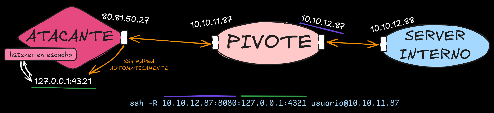

+++
title = 'Port Forwarding'
draft = false
description = "Explicación del concepto de Port Forwarding y sus métodos."
tags = ["Infrastructure"]
showToc = true
math = true
+++

# Port Forwarding Estático
> [!tip] Nota: Objetivo
> Mapear un puerto específico de una máquina a otra (relación 1 a 1). Útil para acceder a un servicio interno concreto o para recibir una reverse shell desde una subred aislada.

- El **PF Local** trae un puerto remoto a la máquina local (P.ej traer un puerto interno de MySQL a nuestro dispositivo)
- El **PF Remoto** envía un puerto local al servidor remoto. (P.ej para hacer público un puerto de nuestra máquina hacia una subred y redirigir todo lo que llegue hacia nosotros)

## Linux / Multi
### SSH: Local PF
Esto **no** requiere privilegios **administrativos** en la cuenta del servidor SSH, pero evidentemente sí requiere unas credenciales de usuario. Además, en la mayoría de implementaciones de OpenSSH, la capacidad de hacer PF local con `-L` está activada por defecto.

```bash
ssh -L ([IP_LOCAL]:)[PUERTO_LOCAL]:[IP_INTERNA_SERVER]:[PUERTO_DESTINO] <user>@[IP_PUBLICA_SERVER]

# "[IP_LOCAL]:" es opcional, si no se incluye se asume localhost
```

Podemos hacer port forwarding de varios servicios a la vez:

```bash
ssh -L 4321:localhost:3306 8000:localhost:80 usuario@10.10.11.87
```

### SSH: Reverse PF
Si queremos conseguir una reverse shell desde una máquina en una subred interna, no podremos ejecutar el payload sin más, dado que la máquina interna no tiene una ruta definida para llegar hasta nuestra IP. Por esto mismo necesitamos configurar un port forwarding remoto (o reverso).

```bash
ssh -R [IP_SERVIDOR]:[PUERTO_SERVIDOR]:[IP_LOCAL_ATACANTE]:[PUERTO_LOCAL_ATACANTE]
```

Este comando creará un túnel bidireccional:

* `[IP_SERVIDOR]:[PUERTO_SERVIDOR]` <-> `[IP_LOCAL_ATACANTE]:[PUERTO_LOCAL_ATACANTE]`

Todo lo que llegue a `[IP_SERVIDOR]:[PUERTO_SERVIDOR]` irá a parar a nuestra máquina, y viceversa.

P.ej, si tenemos una máquina pivote con ip pública `10.10.11.87` e ip en una subred `10.10.12.87` en `10.10.12.0/24`, y una máquina objetivo con ip `10.10.12.88`:
```bash
ssh -R 10.10.12.87:8080:127.0.0.1:4321 usuario@10.10.11.87
```



### Socat: Local PF
Socat es una herramienta que sirve para crear vías de comunicación bidireccionales. Necesitamos acceso a la víctima, pero **no sus credenciales**.

Para hacer PF Local
```bash
victima@10.10.11.87:~$ socat TCP4-LISTEN:[PUERTO_PIVOTE],fork TCP4:[IP_INTERNA_SERVER]:[PUERTO_SERVER_INTERNO]
```
- `TCP4-LISTEN:[PUERTO_PIVOTE]` pone en escucha `0.0.0.0:[PUERTO_PIVOTE]`
  - `fork` hace que con cada conexión se cree un proceso hijo que la gestione (lo que permite manejar varias a la vez)
- `TCP4:[IP_INTERNA_SERVER]:[PUERTO_SERVER_INTERNO]` es el socket al que se redirigen los datos

## Windows
### Netsh (Portproxy): Local PF
Netsh es una herramienta incluida por defecto en Windows que sirve para gestionar interfaces de red, conexiones, y, además, proxies. Para crear un proxy en una máquina pivote necesitaremos **privilegios de administrador**.

Para crear un redireccionamiento que reciba conexiones en un puerto de la IP pública del pivote y las redirija hacia un servidor interno:
```shell
C:\Windows\system32> netsh.exe interface portproxy add v4tov4 listenport=[PUERTO_PÚBLICO_PIVOTE] listenaddress=[IP_PÚBLICA_PIVOTE] connectport=[PUERTO_SERVER_INTERNO] connectaddress=[IP_SERVER_INTERNO]
```

---
# Acceso dinámico a subredes:
# PF Dinámico, SOCKS Proxying
> [!tip] Nota: Objetivo
> Convertir a la máquina víctima en un router/proxy. Permite interactuar con toda una subred interna sin tener que abrir múltiples túneles independientes manualmente.

#### Consideraciones sobre herramientas (Proxychains)
Aquí hay que tener cuidado si nos preocupa además ocultar nuestra IP, pues según que herramienta usemos, puede que se filtre. `ping` usa ICMP (capa 3), que ignora por completo los proxies (y o no funcionará o filtrará nuestra IP directamente); nmap con `-sT` funciona, pero los escaneos con ping o `-sS` no funcionan, y algunos de sus scripts tampoco lo harán.

Podemos usar proxychains para ejecutar herramientas a través de proxies, como pueden ser `tor` (127.0.0.1:9050) o incluso un servidor SSH que hayamos comprometido (con `-D`), pero en cualquier caso proxychains debe estar configurado con el proxy que queramos usar (`/etc/proxychains.conf`).

##### Nmap a través de proxychains
Para escanear una IP específica a través del proxy (debe ser escaneo -sT con ICMP echo desactivado):
```bash
proxychains nmap -Pn -sT -v 10.10.12.88
```
Para escanear una subred entera en busca de algunos dispositivos vivos podemos usar:
```bash
proxychains nmap -sT -Pn -n -v --top-ports=10 10.10.12.0/24
```
Esto mira los 10 puertos más comunes (se pueden aumentar) en todas las direcciones IP de la subred `10.10.11.0/24` usando el TCP Full scan. `-Pn` desactiva ICMP pings, `-n` desactiva resoluciones DNS.

## Linux / Multi
### SSH: Dynamic PF
> Esto **no** requiere privilegios **administrativos** en la cuenta del servidor SSH, pero evidentemente sí requiere unas credenciales de usuario. 

Para abrir un puerto local que actúe como proxy SOCKS:
```bash
ssh -D [PUERTO_LOCAL_PROXY] <user>@[IP_SERVIDOR]
```

Desde ahí, todo el tráfico enviado a `127.0.0.1:[PUERTO_LOCAL_PROXY]` será enrutado y ejecutado desde la máquina pivote (`[IP_SERVIDOR]`).

> En la mayoría de implementaciones de OpenSSH, la capacidad de tunelizar dinámicamente con `-D` está activada por defecto.

### Chisel: Proxying / Tunneling
Chisel es una herramienta escrita en Go que permite crear túneles entre dos dispositivos y transmitir datos cifrados usando SSH.

#### Instalación
Aunque podemos descargar binarios precompilados, para compilarlo haríamos lo siguiente:
```bash
# Máquina ATACANTE:
git clone https://github.com/jpillora/chisel.git
cd chisel

# Compilar (strippeando tabla de símbolos e info de debugging para reducir tamaño)
go build -ldflags="-s -w"
# Opcional: Comprimir el archivo con UPX 
# Determinados AV podrían detectarlo como malicioso aunque no lo sea, dado que ciertos
# malware también suelen comprimirse y encodearse con UPX y los AV detectan sus firmas.
upx --brute chisel
```
Una vez tengamos el binario, tendremos que pasarlo al servidor de algún modo.
> [!Warning]+ Nota: Versiones de Glibc
> En función de la versión de Glibc en el servidor, puede darse el caso de que al ejecutarlo aparezca un error como `version GLIBC_2.34 not found`. En tal caso una posible solución será descargar un binario precompilado de Chisel disponible en Github, p.ej, para x86_64, `chisel_[version]_linux_amd64.gz`.

#### Bind Proxy
En el servidor que usaremos como pivote, ejecutamos lo siguiente:
```bash
# Pivote
chisel server -v -p [PUERTO] --socks5
```
Y en nuestra máquina atacante:
```bash
# Atacante
chisel client -v [IP_PIVOTE]:[PUERTO] socks
```
Esto abrirá un puerto en localhost que podremos usar como proxy con, p.ej, `proxychains`.
#### Reverse Proxy
Aunque en el punto anterior hemos usado el servidor como servidor del proxy, la mayoría de veces habrá un firewall que bloquee nuestras conexiones. Para solucionar esto podemos usar chisel al revés, con nuestra máquina como servidor.

```bash
# Atacante
sudo chisel server --reverse -v -p [PUERTO] --socks5
```

```bash
# Pivote
chisel client -v [IP_ATACANTE]:[PUERTO] R:socks
```


## Windows
### Plink (PuTTY): Dynamic PF
Plink (PuTTY Link) es una herramienta de CLI de Windows que permite conectarse por SSH a otros dispositivos. Hasta 2018, Windows no tenía un cliente ssh nativo, así que los administradores se tenían que descargar uno, y, en su momento, el de preferencia era PuTTY. Si el sistema tiene SSH, posiblemente tenga PuTTY, y por lo tanto Plink.

Podemos crear un túnel dinámico (igual al de `ssh -D`) de la siguiente manera:
```bash
plink -ssh -D [PUERTO_LOCAL_PROXY] <user>@[IP_SERVIDOR]
```
Esto creará un túnel desde `127.0.0.1:[PUERTO_LOCAL_PROXY]` hasta `[IP_SERVIDOR]`, que actuará como nuestro proxy.

---
# Enrutamiento transparente (Auto-routing)
> [!tip] Nota: Objetivo
> Interactuar con la red interna directamente modificando las tablas de enrutamiento del sistema atacante, eliminando la necesidad de usar wrappers como proxychains.

## Linux (Atacante)
### Sshuttle
Sshuttle es una herramienta que automatiza la configuración de `iptables` y de rutas en la propia máquina atacante para poder acceder a una subred interna a través de un pivote de forma transparente.

P.ej, para poder acceder a la subred `[SUBRED_INTERNA]`, a la que solo es posible acceder desde `[PIVOTE]`, directamente, necesitaríamos usar SSH o similares, pero con `sshuttle` podemos hacer lo siguiente:
```bash
sudo sshuttle -r <user>@[PIVOTE] [SUBRED_INTERNA] -v 
```
E inmediatamente intentar acceder con cualquier otra herramienta a una IP de `[SUBRED_INTERNA]` de forma directa, sin necesidad de usar `proxychains`.
