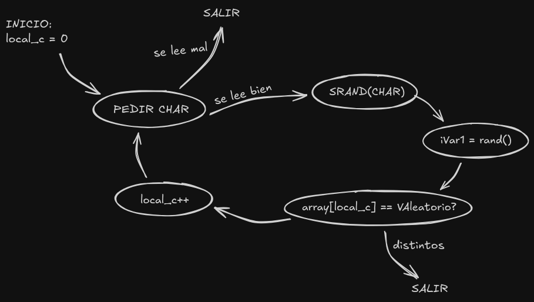
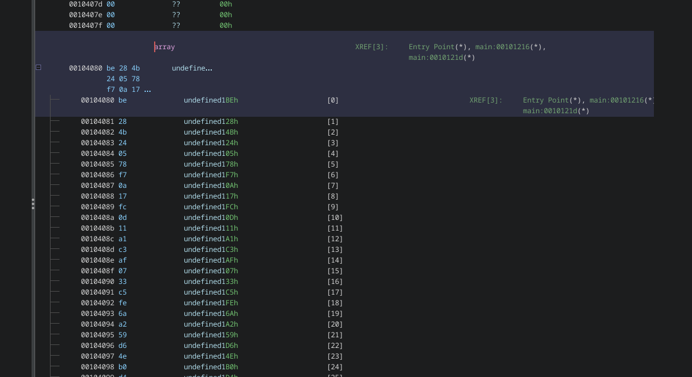

+++
title = "HackTheBox - FlagCasino"
draft = false
description = "Resolución del challenge FlagCasino"
tags = ["HTB", "ELF", "Ghidra", "Reversing", "Random", "Easy"]
summary = "Dificultad: Easy | Conceptos: Ghidra, Reversing, PRNG"
categories = ["Writeups"]
showToc = true
showRelated = true
date = "2025-12-19T00:00:00"
+++

**CHALLENGE DESCRIPTION**

> _The team stumbles into a long-abandoned casino. As you enter, the lights and music whir to life, and a staff of robots begin moving around and offering games, while skeletons of prewar patrons are slumped at slot machines. A robotic dealer waves you over and promises great wealth if you can win - can you beat the house and gather funds for the mission?_

Archivos iniciales:

* `casino`: ELF 64-bit.

## Análisis inicial

Tras ejecutar el programa una vez, vemos lo siguiente:

```bash
./casino
[ ** WELCOME TO ROBO CASINO **]
     ,     ,
    (\____/)
     (_oo_)
       (O)
     __||__    \)
  []/______\[] /
  / \______/ \/
 /    /__\
(\   /____\
---------------------
[*** PLEASE PLACE YOUR BETS ***]
> 3
[ * INCORRECT * ]
[ *** ACTIVATING SECURITY SYSTEM - PLEASE VACATE *** ]
```

Al parecer hay que introducir algo, pero no sabemos qué es. Miramos qué hace con `ltrace` y `strace`:

```bash
ltrace ./casino
puts("[ ** WELCOME TO ROBO CASINO **]"[ ** WELCOME TO ROBO CASINO **]
)          = 32
puts("     ,     ,\n    (\\____/)\n     ("...     ,     ,
    (\____/)
     (_oo_)
       (O)
     __||__    \)
  []/______\[] /
  / \______/ \/
 /    /__\
(\   /____\
---------------------
)   = 145
puts("[*** PLEASE PLACE YOUR BETS ***]"...[*** PLEASE PLACE YOUR BETS ***]
)      = 33
printf("> ")                                     = 2
__isoc99_scanf(0x562b23e850fc, 0x7fffab2db95b, 0, 0> ABCD
) = 1
srand(65)                                        = <void>
rand()                                           = 598268513
puts("[ * INCORRECT * ]"[ * INCORRECT * ]
)                        = 18
puts("[ *** ACTIVATING SECURITY SYSTEM"...[ *** ACTIVATING SECURITY SYSTEM - PLEASE VACATE *** ]
)      = 55
exit(-2 <no return ...>
+++ exited (status 254) +++
```

Aquí podemos ver que, al introducir algo (en este caso `ABCD`) se llama a `srand()` y se inicializa un seed, pero todavía no sabemos con qué, probamos con más inputs:

* Con "`5`":

```c
printf("> ")                                     = 2
__isoc99_scanf(0x560271e7e0fc, 0x7fff0b264fab, 0, 0> 5
) = 1
srand(53)
```

* Con "`ab`":

```c
printf("> ")                                     = 2
__isoc99_scanf(0x555d225590fc, 0x7ffe335b56eb, 0, 0> a
) = 1
srand(97)
```

Esto ya nos da una idea de lo que se hace. Vemos que se está tomando el primer carácter introducido y se está usando su número en ASCII para inicializar el seed:

* `A` en ASCII: 65
* `5` en ASCII: 53
* `a` en ASCII: 97

## Decompilando el binario

Todavía no sabemos qué hace el programa, más allá de lo visto, así que lo descompilamos con Ghidra, quedando algo así:

```c
undefined8 main(void){
  int iVar1;
  char local_d;
  uint local_c;
  
  puts("[ ** WELCOME TO ROBO CASINO **]");
  puts(
      "     ,     ,\n    (\\____/)\n     (_oo_)\n       (O)\n     __||__    \\)\n  []/______\\[] /\n   / \\______/ \\/\n /    /__\\\n(\\   /____\\\n---------------------"
      );
  puts("[*** PLEASE PLACE YOUR BETS ***]");
  local_c = 0;
  while( true ) {
    if (0x1d < local_c) {
      puts("[ ** HOUSE BALANCE $0 - PLEASE COME BACK LATER ** ]");
      return 0;
    }
    printf("> ");
    iVar1 = __isoc99_scanf(&DAT_001020fc,&local_d);
    if (iVar1 != 1) break;
    srand((int)local_d);
    iVar1 = rand();
    if (iVar1 != *(int *)(check + (long)(int)local_c * 4)) {
      puts("[ * INCORRECT * ]");
      puts("[ *** ACTIVATING SECURITY SYSTEM - PLEASE VACATE *** ]");
                    /* WARNING: Subroutine does not return */
      exit(-2);
    }
    puts("[ * CORRECT *]");
    local_c = local_c + 1;
  }
                    /* WARNING: Subroutine does not return */
  exit(-1);
}
```

De aquí vamos viendo que pasan varias cosas cuando inicia el programa:

1. `local_c` se inicializa a 0
2. Mientras `local_c` sea menor o igual que 0x1d (29 decimal), el programa sigue.

```c
if (0x1d < local_c) {
      puts("[ ** HOUSE BALANCE $0 - PLEASE COME BACK LATER ** ]");
      return 0;
    }
```

3. Se pide el char al usuario, si no se lee correctamente, se sale del programa. Si se lee correctamente, quedará guardado en `local_d`

```c
iVar1 = __isoc99_scanf(&DAT_001020fc,&local_d);
if (iVar1 != 1) break;
//Scanf devuelve el número de elementos procesados correctamente, aquí debería ser 1,
//por eso se compara el return de scanf (asignado a iVar1) con 1.
```

4. Se inicializa el seed con nuestro char (Guardado en `local_d`), luego se asigna `iVar1` a un número aleatorio (el primero que se genera con `local_d` como seed).

```c
if (iVar1 != 1) break;
srand((int)local_d);
iVar1 = rand();
```

5. Se compara el número aleatorio (`iVar1`) con un número entero guardado en `(check + (long)(int)local_c * 4)`. Aunque a simple vista parece extraño, esto no es más que un array:

* Dirección base = `check`
* Offset = `local_c` (se multiplica por 4 porque un int tiene 4 bytes) En definitiva, sería algo como:

```c
if (iVar1 != check[local_c]) {
      puts("[ * INCORRECT * ]");
      puts("[ *** ACTIVATING SECURITY SYSTEM - PLEASE VACATE *** ]");
                    /* WARNING: Subroutine does not return */
      exit(-2);
    }
```

Y finalmente, si `iVar1` coincide con `check[local_c]`, se suma 1 a `local_c`, se pide otro carácter, se inicializa de nuevo el seed y se compara con el siguiente valor del array `check[]`:

```c
// Si los números iVar1 y check[local_c] coinciden:
puts("[ * CORRECT *]");
local_c = local_c + 1;
// y aquí se vuelve al inicio del while()
```

De forma gráfica, quedaría algo así:&#x20;



### Código final decompilado

Cambiando el nombre de las variables, reorganizando todo e ignorando algunas cosas no relevantes para entender mejor el código, quedaría algo así:

```c
#include <stdio.h>
#include <stdlib.h>

int array[30] = {...} //valores desconocidos
//Fuera de main() porque no están en el stack.

int main (void){
  int valorAleatorio;
  char caracter;
  
  
  puts("[ ** WELCOME TO ROBO CASINO **]");
  puts("[*** PLEASE PLACE YOUR BETS ***]");
  
  for (int i = 0; i < 30; i++){
    printf("> ");
    
    //Leer char
    valorAleatorio = scanf(" %c",&caracter);
    if (valorAleatorio != 1) return (-1);
    
    //Inicializar seed y generar valor aleatorio.
    srand((int)caracter);
    valorAleatorio = rand();
    
    //Comparar valor aleatorio generado con el guardado en el array
    if (valorAleatorio == array[i]) {
      puts("[ * CORRECT *]");
    }
    else{
      puts("[ * INCORRECT * ]");
      return (-2);
    }
  }
  puts("[ ** HOUSE BALANCE $0 - PLEASE COME BACK LATER ** ]");
  return 0;
}
```

## Fuerza Bruta

Sabiendo lo que hace el código, vemos que necesitamos encontrar 30 caracteres seguidos (que estén en la codificación ASCII) tales que el primer valor aleatorio producido al inicializar el seed con cada uno de ellos corresponda con los números guardados en el array. Como el array contiene datos estáticos, podemos verlos en memoria:



El único inconveniente de estos datos es que están en [Little Endian](https://es.wikipedia.org/wiki/Endianness), estándar en Intel x86\_64, por lo que habrá que reordenar los bytes, que quedarán `0x244b28be`, `0xaf77805`, `0x110dfc17`, `0x7afc3a1`... Ahora buscamos un set de caracteres tal que el primero de ellos, usado como seed, genere un valor aleatorio `0x244b28be`, el segundo `0xaf77805`, y así hasta los 30 valores.

Hacemos un programa en C++ que haga esto:

```c++
#include <random>
#include <iostream>
#include <vector>
using namespace std;

int targets[] = { 0x244b28be, 0xaf77805, 0x110dfc17, ...SNIP..., 0x57d8ed64, 0x615ab299, 0x22e9bc2a };

int main(){
	vector<char> resultados = {};
	int i = 0;
	while (i <= 29){
		char carac = 0;
		srand(carac);
		while (rand() != targets[i]){ //Asume que al menos un caracter ASCII produce targets[i]
			carac++;
			srand(carac);
		}
		resultados.push_back(carac);
		i++;
	}

	for (int g = 0, size = resultados.size(); g < size; g++){
		cout << resultados[g];
	} cout << endl;

	return 0;
}
```

Al ejecutarlo:

```bash
g++ bruteforce.cpp -o bruteforce
./bruteforce 
HTB{r4nd_1s_...}
```
