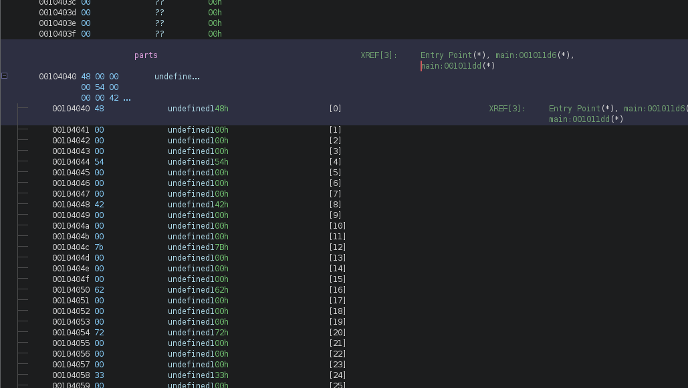
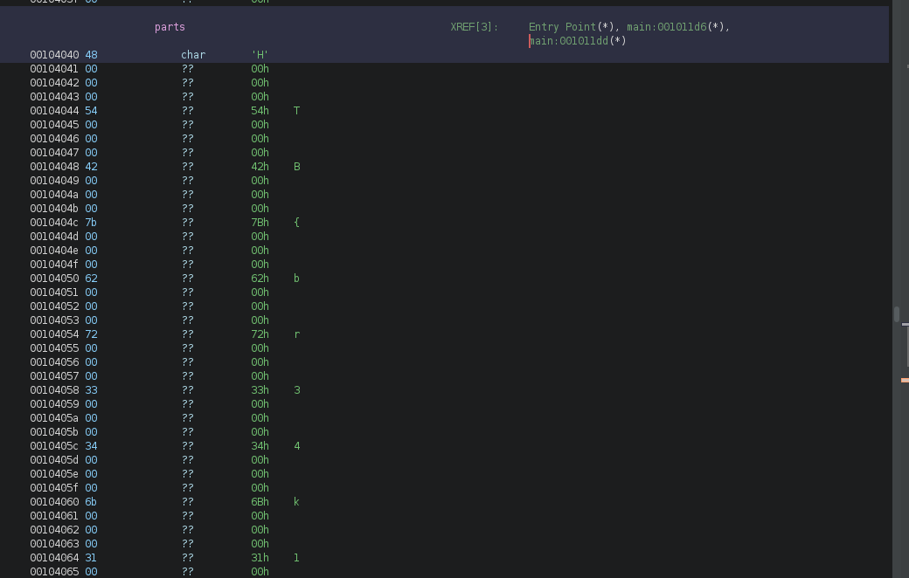
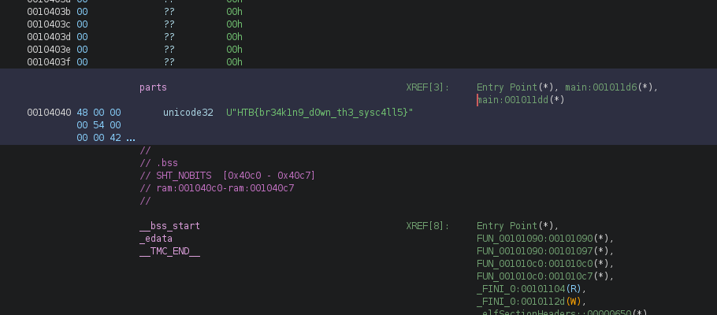

+++
title = "HackTheBox - Graverobber"
draft = false
description = "Resolución del challenge Graverobber"
tags = ["HTB", "Reversing", "Medium", "Ghidra"]
summary = "OS: Linux | Dificultad: Easy | Conceptos: Reversing, Ghidra."
categories = ["Writeups"]
showToc = true
showRelated = true
date = "2026-05-20T00:00:00"
+++

**CHALLENGE DESCRIPTION**
>*We're breaking into the catacombs to find a rumoured great treasure - I hope there's no vengeful spirits down there...*

Archivos iniciales:
- `robber`: ELF 64-bit LSB pie executable, x86-64.

## Análisis inicial
### Ejecución
Antes de descompilarlo, vemos qué hace el binario:
```bash
./robber 
We took a wrong turning!

echo "parametro" | ./robber
We took a wrong turning!

./robber 123
We took a wrong turning!

./robber test
We took a wrong turning!
```

En cualquier caso, el resultado es el mismo, un output "*We took a wrong turning!*".

### File
Si miramos específicamente el tipo de archivo y sus características:
```bash
file robber
robber: ELF 64-bit LSB pie executable, x86-64, version 1 (SYSV), dynamically linked, interpreter /lib64/ld-linux-x86-64.so.2, BuildID[sha1]=972b4d1424b8cd4916e26b94ebb6257f970e4cbb, for GNU/Linux 4.4.0, not stripped
```
Vemos que pone `not stripped`, lo que indica que se mantienen símbolos de debugging. Poco más podemos sacar de aquí.

### Strings
Ahora, si miramos las strings del binario:
```bash {hl_lines=[18,19]}
strings robber
/lib64/ld-linux-x86-64.so.2
puts
__stack_chk_fail
stat
__libc_start_main
__cxa_finalize
libc.so.6
GLIBC_2.33
GLIBC_2.4
GLIBC_2.2.5
GLIBC_2.34
_ITM_deregisterTMCloneTable
__gmon_start__
_ITM_registerTMCloneTable
PTE1
u3UH
We took a wrong turning!
We found the treasure! (I hope it's not cursed)
;*3$"
GCC: (GNU) 14.2.1 20240805
GCC: (GNU) 14.2.1 20240910
main.c
_DYNAMIC
__GNU_EH_FRAME_HDR
_GLOBAL_OFFSET_TABLE_
__libc_start_main@GLIBC_2.34
_ITM_deregisterTMCloneTable
puts@GLIBC_2.2.5
_edata
_fini
__stack_chk_fail@GLIBC_2.4
parts
__data_start
```

Aquí podemos ver un string interesante: "*We found the treasure! (I hope it's not cursed)*". Todavía no sabemos cómo llegar a él, así que tendremos que seguir mirando.

## Descompilando
Tras el análisis inicial, ahora toca descompilar el binario. Al importarlo a Ghidra, vemos que cuenta con una sola función, main():

```C
undefined8 main(void)

{
  int iVar1;
  undefined8 uVar2;
  long in_FS_OFFSET;
  uint local_ec;
  stat local_e8;
  char local_58 [72];
  long local_10;
  
  local_10 = *(long *)(in_FS_OFFSET + 0x28);
  local_58[0] = '\0';
      ...[SNIP]...
  local_58[0x43] = '\0';
  local_ec = 0;
  do {
    if (0x1f < local_ec) {
      puts("We found the treasure! (I hope it\'s not cursed)");
      uVar2 = 0;
LAB_00101256:
      if (local_10 != *(long *)(in_FS_OFFSET + 0x28)) {
                    /* WARNING: Subroutine does not return */
        __stack_chk_fail();
      }
      return uVar2;
    }
    local_58[(int)(local_ec * 2)] = (char)*(undefined4 *)(parts + (long)(int)local_ec * 4);
    local_58[(int)(local_ec * 2 + 1)] = '/';
    iVar1 = stat(local_58,&local_e8);
    if (iVar1 != 0) {
      puts("We took a wrong turning!");
      uVar2 = 1;
      goto LAB_00101256;
    }
    local_ec = local_ec + 1;
  } while( true );
}
```

Podemos empezar a renombrar variables:
- `local_10` es el Stack Canary, lo cambiamos a `STACK_CANARY`
- `uVar2` es el valor que devuelve el programa, lo cambiamos a `returnVal`
- `local_58` es un array de char cuyos elementos inician inicializados a cero. Como no sabemos si representa un string completo o es simplemente un array de caracteres, de momento lo cambiamos a `array`.

Además vemos que al inicio del programa se entra en un bucle infinito (do while), en el que se comprueba si `local_ec > 31`. Si es así, entonces se imprime por pantalla el string "*We found the treasure!...*":
```bash
local_ec = 0;
do {
  if (31 < local_ec) {
    puts("We found the treasure! (I hope it\'s not cursed)");
    returnVal = 0;
    ...
  }
} while (true)
```

`local_ec` se inicializa a cero, y al final de cada iteración se le suma uno. Esto significa que de algún modo, para conseguir el tesoro, tenemos que descubrir cómo aguantar 32 iteraciones sin tomar el camino malo.

### Análisis del bucle
Para simplificar todo, ignoramos la comprobación del stack canary. De momento el bucle queda algo como:
```C
do {
  if (31 < iteración) {
    puts("We found the treasure! (I hope it\'s not cursed)");
    returnVal = 0;
LAB_00101256:
    return returnVal;
  }
  array[(int)(iteración * 2)] = (char)*(undefined4 *)(parts + (long)(int)iteración * 4);
  array[(int)(iteración * 2 + 1)] = '/';
  iVar1 = stat(array,&local_e8);
  if (iVar1 != 0) {
    puts("We took a wrong turning!");
    returnVal = 1;
    goto LAB_00101256;
  }
  iteración = iteración + 1;
} while( true );
```

Esto puede simplificarse para quitarnos de encima el `LAB_00101256`, que simplemente es un salto al return. Además, ajustamos un poco el código:

```C
do {
  if (31 < iteración) {
    puts("We found the treasure! (I hope it\'s not cursed)");
    return 0;
  }
  
  array[(int)(iteración * 2)] = (char)*(undefined4 *)(parts + (long)(int)iteración * 4);
  array[(int)(iteración * 2 + 1)] = '/';
  iVar1 = stat(array,&local_e8);
  
  if (iVar1 != 0) {
    puts("We took a wrong turning!");
    return 1;
  }
  
  iteración++;
} while(true);
```

Aquí vemos que la condición para resistir una iteración más es que `iVar1` sea igual a cero, y el valor de iVar1 en cada iteración nos lo da la instrucción anterior: `stat()`.

Tras una búsqueda, esta instrucción hace lo siguiente:
> *In C, stat() is used to get information about a file, such as its size, permissions, owner, and timestamps. It takes a file path and a struct stat buffer, and on success it returns 0; on failure it returns -1 and sets errno.*

```C
// "path" is the file name or path
// "buf" is where the file metadata is stored.
int stat(const char *path, struct stat *buf);
```

Esto significa que en cada iteración estamos pasando el nombre de un archivo, o una ruta, que está almacenada en el array (como string) a la función stat(). Si el archivo existe y se procesa bien, entonces stat() devuelve 0 y la iteración sigue. Si el archivo no existe, devuelve -1 y se termina ("*We took a wrong turning!*"). En cualquier caso, los metadatos del archivo (`*buf`) se ignoran completamente, lo importante es el return de stat().

Esos nombres de archivos que se le pasan a stat son exactamente el string formado por el array, sin un prefijo añadido, por lo que necesitamos que estén en el mismo directorio.

### Archivos necesarios y array "parts"
Para ver los nombres de archivo necesarios nos fijamos en estas dos instrucciones:
```C
// recordemos que array[] es el nombre de archivo.
array[(int)(iteración * 2)] = (char)*(undefined4 *)(parts + (long)(int)iteración * 4);
array[(int)(iteración * 2 + 1)] = '/';
```

El problema es que **no sabemos qué es parts**. No se definía al inicio del programa y no aparece en ningún otro lado. Si vamos a los datos guardados:



Vemos que es un array de datos, cuyo tipo desconocemos. Para hacernos una idea de qué puede ser, cambiamos el tipo de datos a `char`, y ahí encontramos lo siguiente:



Y al parecer aquí ya tenemos el flag, así que ni siquiera vamos a necesitar analizar los archivos que necesitamos para llegar al final, podemos empezar a ver: `HTB{br34k1...`.

Aunque podríamos sacarlo a mano, sería más conveniente poder cambiar el tipo de dato. Si nos fijamos en la imagen anterior, vemos que entre una letra y otra tenemos 3 bytes completos de `0x00`. Esto significa que cada letra ocupa 4 bytes, así que en lugar de ASCII, tendríamos que formatear el array como UTF-32 (o Unicode32):



Y tenemos el flag.

Podríamos preguntarnos que cómo es que `strings` no nos ha mostrado el flag al inicio si es que `parts` era un array completamente estático que estaba ahí desde el inicio. El problema es la codificación. 

El flag estaba en UTF32 (Unicode32), y `strings`, por defecto, busca solamente cadenas codificadas en ASCII formadas por 4 o más caracteres. Esto significa que por un lado no estaba detectando el flag por estar en UTF32, y por otro lado no estaba mostrando las letras del flag individualmente porque todas tenían una longitud de 1 en ASCII (Todas eran la letra seguida de 3 `0x00`'s, por lo que cada letra era un string de longitud 1 + el null byte).

Si ahora, sabiendo esto, probamos a ejecutar `strings` con el parámetro `-e L`, se nos mostrarán todas las cadenas formadas por caracteres en Little Endian y de 32 bits, por lo que obtendremos el flag directamente sin descompilar ni tocar nada.

```bash
strings -e L robber
HTB{br34k1n9_d0wn_th3_sysc4ll5}
```
